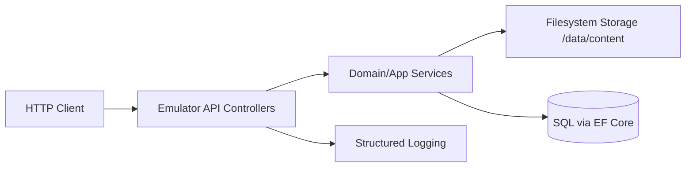

# Architecture

## Overall Technical Approach
- The emulator is a self-contained ASP.NET Core service (hosting an existing Blazor UI) that replicates the production **FSS API** public HTTP surface without linking to production code (no shared assemblies, no project references).
- Controllers and DTOs are re-implemented inside the emulator project with identical routes, verbs, and contracts.
- Storage is filesystem-backed using a deterministic layout rooted at `/data/content`.
- Persistence uses EF Core against the solution’s existing Aspire SQL configuration, but emulator code remains within the emulator project.
- Parity is maintained via automated route/contract checks (snapshot/spec-based) rather than code sharing.

### Key runtime flows

### Filesystem layout
- Base: `/data/content/{IDprefix}`
- Working batch directory (uncommitted): `/data/content/{IDprefix}/{BatchId}/...`
- Committed batch zip: `/data/content/{IDprefix}/{BatchId}.zip`
- `{IDprefix}` = most significant byte of the `Guid` batch id formatted as uppercase hex (`X2`).

## Frontend
- The existing Blazor UI endpoints and routing remain unchanged.
- No new UI is required for the emulator API parity work (API-first). If a minimal UI is later needed for demo/support, it should be added without altering existing routes.

## Backend
### Presentation layer (HTTP)
- ASP.NET Core controllers live under `Controllers/` in the emulator project.
- Controllers replicate production naming and route attributes:
  - `BatchController`
  - `FileController`
  - `FileBlockController`
  - `AclController`
  - Any attributes/query controllers as required by production.
- Non-controller endpoints:
  - `GET /health`: preserved exactly as currently implemented.
  - `GET /heartbeat`: preserved exactly as currently implemented.
- Swagger is not exposed.

### Application/Domain layer
- Thin application services encapsulate:
  - Batch lifecycle (create, commit, rollback)
  - File write/read operations
  - ACL operations
  - Block upload composition (if used by production)
- Services coordinate filesystem and database operations and enforce emulator-specific constraints (e.g., no auth; concurrency rule).

### Infrastructure layer
- `FileSystemBatchStorage` (or similar) implements:
  - Path resolution based on `{IDprefix}` and `BatchId`
  - Streaming writes with per-path locking
  - Commit: zip-to-temp ? atomic move ? best-effort directory deletion
- Persistence:
  - EF Core `DbContext` and entities live in the emulator project.
  - Connection configured via Aspire SQL client already present in the solution (consumed via configuration, without project references).

### Testing approach
- Unit tests:
  - `{IDprefix}` derivation
  - Path normalization + traversal prevention
  - Locking/conflict rules
- Integration tests (TestServer/WebApplicationFactory):
  - End-to-end HTTP flows for create batch ? add file ? commit ? download
  - Route presence (parity smoke)
- DB integration tests:
  - Verify DB side-effects for key flows match documented production behaviour.
