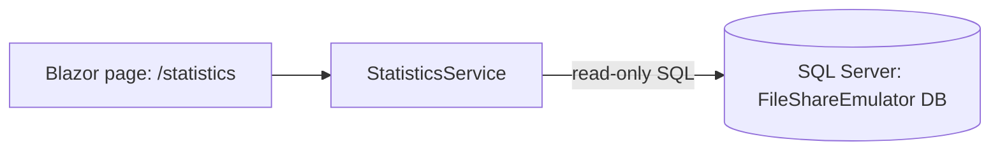

# Architecture

## Overall Technical Approach
- Implement a new Blazor Server page (`/statistics`) within the existing `tools/FileShareEmulator` project.
- Compute statistics via a single application service (`StatisticsService`) using **read-only** SQL queries against the emulator SQL Server database.
- Render results using existing Radzen components (consistent with current emulator UI).

Key constraint:
- There MUST be **no changes** to ingestion message creation (e.g., `IndexService.CreateRequestAsync` and emitted ingestion message shape/content).

## Frontend
- Technology: Blazor Server (interactive server components).
- Entry points:
  - `tools/FileShareEmulator/Components/Layout/NavMenu.razor` will add a `Statistics` navigation link.
  - `tools/FileShareEmulator/Components/Pages/Statistics.razor` will be the new page.

User flow:
1. User opens the FileShareEmulator UI.
2. User selects `Statistics` in the left navigation.
3. Page loads per-business-unit statistics and renders:
   - Batch attribute-name counts (count of batches using each attribute name)
   - MIME type counts (count of files using each MIME type)

## Backend
- Data access is performed directly from the emulator host process using `Microsoft.Data.SqlClient` (consistent with current emulator services).
- Service boundary:
  - `StatisticsService` exposes a new method (e.g., `GetBusinessUnitStatisticsAsync`) that returns per-business-unit aggregates.

Data sources (existing emulator tables inferred from current code):
- `BusinessUnit` (BU identity)
- `Batch` (BU association via `BusinessUnitId`)
- `BatchAttribute` (`AttributeKey` used for attribute-name counts)
- `File` (`MIMEType` used for MIME type counts)

Data aggregation strategy:
- Use set-based `GROUP BY` queries:
  - `COUNT(DISTINCT Batch.Id)` grouped by BU + `BatchAttribute.AttributeKey`
  - `COUNT(*)` grouped by BU + `File.MIMEType`
- Exclude null/whitespace attribute keys and MIME types.

Non-goals / invariants:
- No writes to the emulator DB.
- No changes to queue usage, ingestion request creation, or indexing behaviour.
