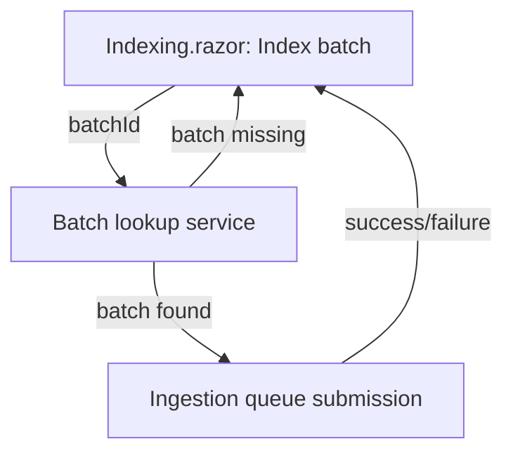

# Architecture

**Work package:** `021-specific-batch`  
**Spec:** `docs/021-specific-batch/spec.md`  
**Target path:** `docs/021-specific-batch/architecture.md`

## Overall Technical Approach
- Implement a small vertical slice inside the existing FileShare Emulator Blazor app.
- Reuse the existing “Index next batch” pathway for:
  - batch resolution/discovery
  - message/payload creation
  - ingestion queue submission
- Add a second action on the `Indexing.razor` page: “Index batch”, driven by a user-supplied batch ID.

High-level flow:
1. User enters `batchId` in UI.
2. UI validates `batchId` is not empty/whitespace.
3. UI calls emulator batch store/service to resolve batch by ID.
4. If found, UI calls the same enqueue/submit logic used by existing “Index next batch”.
5. UI displays success/error state.

## Frontend
- **Page**: `tools/FileShareEmulator/Components/Pages/Indexing.razor`
  - Existing section: “Index next batch” remains unchanged.
  - New section below it:
    - textbox bound to an internal field holding batch ID
    - “Index batch” button with disabled/enabled state computed from textbox content
    - local alert/status UI for this action (success + error)

User flow:
- Navigate to Indexing page.
- Under “Index next batch”, find “Index batch” section.
- Enter batch ID.
- Click “Index batch”.
- Observe success/error message.

## Backend
- Lives within emulator project only (constraint).
- Expected existing components (names may differ in actual repo):
  - Batch store/registry enabling lookup by ID.
  - Ingestion queue client/service that sends “ingest this batch” messages.

Backend responsibilities for this slice:
- Provide a method to retrieve batch metadata/content by ID.
- Provide a method to enqueue an explicit batch using the same payload creation as “Index next batch”.
- Ensure exceptions are handled and logged, with user-friendly messages surfaced back to UI.
