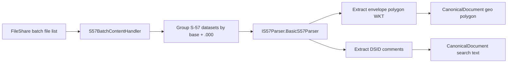

# Implementation Plan

> Target: `docs/026-s57-parser/plan.md`

## Overall Approach

Deliver S-57 parsing as a set of incremental vertical slices within the existing FileShare ingestion provider:

- Entry point: `S57BatchContentHandler.HandleFiles(...)`
- Domain output: enrich `CanonicalDocument` with:
  - deduplicated metadata text (lowercased) added to search text
  - a geo coverage polygon (WKT-derived) added to the document geo polygon field

Implementation will use GDAL/OGR via `MaxRev.Gdal.Universal` `3.12.2.472`.

Key constraints:

- Keep changes inside `UKHO.Search.Ingestion.Providers.FileShare` and its referenced projects per Onion Architecture.
- Use `ILogger` for all diagnostics.
- Ensure output fields that participate in indexing (`SearchText`, `Keywords`, facets) are normalized to lowercase.

## Feature Slice 1: S-57 dataset recognition in `S57BatchContentHandler` (no parsing yet)

- [ ] Work Item 1: Detect S-57 dataset groups from incoming file paths and log summary
  - **Purpose**: Create a runnable end-to-end handler path that identifies S-57 datasets with deterministic grouping, without yet taking a dependency on GDAL.
  - **Acceptance Criteria**:
    - Given a list of batch file paths containing `*.000` and related `*.nnn`, the handler groups files by base name.
    - The handler is deterministic (stable ordering) and logs grouped dataset membership.
    - No changes to other handlers are required.
  - **Definition of Done**:
    - Grouping logic implemented.
    - Unit tests for grouping behavior added.
    - Handler still returns successfully with no enrichment side effects.
    - Can execute end-to-end via: existing ingestion pipeline path that invokes `S57BatchContentHandler`.
  - [ ] Task 1: Implement dataset grouping helper
    - [ ] Step 1: Add a new internal helper (or dedicated class) to group by `baseName` where `.000` exists.
    - [ ] Step 2: Include sibling files matching numeric extensions `.001`..`.999` for the same base name.
    - [ ] Step 3: Sort members lexicographically (or numeric extension) for determinism.
    - [ ] Step 4: Decide and implement case-sensitivity behavior for base names (document choice).
  - [ ] Task 2: Wire grouping into `S57BatchContentHandler`
    - [ ] Step 1: In `HandleFiles`, group datasets and log counts (+ dataset base name).
    - [ ] Step 2: Ensure handler remains cancellation-aware (even if current implementation does not fully support cancellation).
  - [ ] Task 3: Add unit tests
    - [ ] Step 1: Cover: (a) `.000` only, (b) `.000` + `.001` siblings, (c) missing `.000` (ignored), (d) mixed-case base name collisions.
  - **Files**:
    - `src/UKHO.Search.Ingestion.Providers.FileShare/Enrichment/Handlers/S57BatchContentHandler.cs`: use grouping helper + log datasets.
    - `src/UKHO.Search.Ingestion.Providers.FileShare/...`: new helper class for grouping (one public type per file).
    - `tests/...`: new unit test file(s) for grouping.
  - **Work Item Dependencies**: none.
  - **Run / Verification Instructions**:
    - Run unit tests: `dotnet test`
    - Trigger an ingestion run that routes to `S57BatchContentHandler` (existing batch test harness / provider-specific dev flow).

## Feature Slice 2: Introduce `IS57Parser` contract + basic implementation (GDAL open + extract)

- [ ] Work Item 2: Add `IS57Parser` and `BasicS57Parser` with envelope + DSID comment extraction
  - **Purpose**: Provide a testable parsing component that can open an S-57 dataset and extract the required metadata and coverage.
  - **Acceptance Criteria**:
    - `IS57Parser` exists and can be DI-registered.
    - `BasicS57Parser` opens an S-57 dataset from a `.000` file path.
    - For the sample fixture, extraction yields:
      - coverage polygon WKT: `POLYGON((-79.2 33.375, -79.2 33.45, -79.125 33.45, -79.125 33.375, -79.2 33.375))`
      - textual metadata values include a single `produced by noaa` (deduplicated)
  - **Definition of Done**:
    - Package reference added to provider project (separate `ItemGroup` for `PackageReference`).
    - Parser implemented and unit/integration tested.
    - Logging added (dataset path, envelope, extracted metadata keys).
  - [ ] Task 1: Add GDAL package reference
    - [ ] Step 1: Add `<PackageReference Include="MaxRev.Gdal.Universal" Version="3.12.2.472" />` to `UKHO.Search.Ingestion.Providers.FileShare`.
    - [ ] Step 2: Ensure CSProj maintains separate `ItemGroup`s for `PackageReference` vs `ProjectReference`.
  - [ ] Task 2: Define `IS57Parser` and parse result contract
    - [ ] Step 1: Create `IS57Parser` in the provider project (or appropriate shared ingestion provider abstraction location if patterns exist).
    - [ ] Step 2: Create a result type (e.g., `S57ParseResult`) containing:
      - `CoveragePolygonWkt` (string)
      - `SearchText` (IReadOnlyCollection<string> or string)
  - [ ] Task 3: Implement `BasicS57Parser`
    - [ ] Step 1: Ensure GDAL/OGR configuration is called (idempotent) before parsing.
    - [ ] Step 2: Open datasource with `Ogr.Open(pathTo000, 0)`.
    - [ ] Step 3: Compute dataset envelope by unioning layer extents.
    - [ ] Step 4: Produce envelope polygon WKT using invariant culture and "R" formatting.
    - [ ] Step 5: Extract `DSID_COMT` and `DSPM_COMT` from the `Meta` / `DSID` layer and deduplicate, normalize to lowercase.
  - [ ] Task 4: Tests
    - [ ] Step 1: Unit test envelope->WKT conversion.
    - [ ] Step 2: Unit test metadata deduplication + lowercasing.
    - [ ] Step 3: Integration test using `sample.000` fixture to assert polygon and `produced by noaa`.
  - **Files**:
    - `src/UKHO.Search.Ingestion.Providers.FileShare/UKHO.Search.Ingestion.Providers.FileShare.csproj`: add package reference.
    - `src/UKHO.Search.Ingestion.Providers.FileShare/.../IS57Parser.cs`: new interface.
    - `src/UKHO.Search.Ingestion.Providers.FileShare/.../S57ParseResult.cs`: new result type.
    - `src/UKHO.Search.Ingestion.Providers.FileShare/.../BasicS57Parser.cs`: new implementation.
    - `tests/...`: unit + integration tests.
  - **Work Item Dependencies**:
    - Depends on Work Item 1 only for handler integration sequencing; parser itself can be developed independently.
  - **Run / Verification Instructions**:
    - `dotnet test`

## Feature Slice 3: End-to-end enrichment: `S57BatchContentHandler` uses parser and enriches `CanonicalDocument`

- [ ] Work Item 3: Enrich `CanonicalDocument` with S-57 extracted search text + geo polygon
  - **Purpose**: Deliver the first runnable end-to-end S-57 enrichment path in the ingestion pipeline.
  - **Acceptance Criteria**:
    - When `S57BatchContentHandler` receives an S-57 dataset, it:
      - selects the `.000` file as the parse entry point
      - calls `IS57Parser`
      - appends extracted text to `CanonicalDocument` search text (lowercased)
      - adds coverage polygon to `CanonicalDocument` geo polygon field
    - Errors in parsing are logged and do not crash the entire batch (best-effort behavior).
  - **Definition of Done**:
    - Handler updated to call parser and enrich document.
    - DI wiring added so `BasicS57Parser` is used.
    - Unit tests for handler behavior.
    - Integration test (pipeline-level if available) verifying enriched document contains expected outputs.
  - [ ] Task 1: Add DI registration
    - [ ] Step 1: Locate existing DI module/registration point for FileShare provider enrichment.
    - [ ] Step 2: Register `IS57Parser` -> `BasicS57Parser`.
  - [ ] Task 2: Update `S57BatchContentHandler`
    - [ ] Step 1: Add dependency on `IS57Parser`.
    - [ ] Step 2: From grouped dataset, choose `.000` and parse.
    - [ ] Step 3: Enrich `CanonicalDocument`:
      - Use the existing canonical document API for adding search text (confirm: `SetContent`, `SetSearchText`, etc.).
      - Ensure lowercase normalization.
      - Set geo polygon field using existing geo ingestion utilities (confirm existing patterns in `docs/023-geo-ingestion`).
    - [ ] Step 4: Log at Debug/Information:
      - dataset name
      - polygon WKT length / envelope values
      - metadata strings count
  - [ ] Task 3: Tests
    - [ ] Step 1: Unit test handler calls parser with correct `.000`.
    - [ ] Step 2: Unit test enrichment writes expected normalized values.
    - [ ] Step 3: Integration test (if harness exists) to confirm document output.
  - **Files**:
    - `src/UKHO.Search.Ingestion.Providers.FileShare/Enrichment/Handlers/S57BatchContentHandler.cs`: invoke parser + enrich.
    - `src/Hosts/...` or provider composition root: DI registration.
    - `tests/...`: handler tests.
  - **Work Item Dependencies**:
    - Depends on Work Item 1 and Work Item 2.
  - **Run / Verification Instructions**:
    - `dotnet test`
    - Run ingestion against a batch containing `sample.000` and confirm indexed/searchable text includes `produced by noaa` and geo polygon matches expected coordinates.

## Feature Slice 4 (Optional): Improve boundary polygon accuracy

- [ ] Work Item 4: Add optional non-envelope boundary generation (convex hull / union)
  - **Purpose**: Provide a more representative coverage geometry where feasible.
  - **Acceptance Criteria**:
    - Parser can optionally produce convex hull (or union-based) polygon when valid.
    - Falls back to envelope polygon if invalid/empty.
    - Performance remains acceptable.
  - **Definition of Done**:
    - Feature-flag or configuration option added.
    - Tests cover fallback behavior.
  - **Work Item Dependencies**:
    - Depends on Work Item 2 and Work Item 3.

---

# Architecture

> Target: `docs/026-s57-parser/plan.md` (this document contains both the implementation plan and architecture section)

## Overall Technical Approach

- Extend FileShare provider enrichment via `S57BatchContentHandler`.
- Introduce an explicit parsing abstraction (`IS57Parser`) with a GDAL-backed implementation.
- Keep all outward effects constrained to enriching `CanonicalDocument`.

## Frontend

- Not applicable (no UI changes).

## Backend

- `UKHO.Search.Ingestion.Providers.FileShare`:
  - `S57BatchContentHandler` will handle dataset grouping, invoke parser, and enrich `CanonicalDocument`.
  - `BasicS57Parser` uses GDAL/OGR to read S-57 and extract:
    - dataset envelope -> WKT polygon
    - DSID comment fields (deduped)

Key backend integration points:

- DI registration for `IS57Parser`.
- `CanonicalDocument` methods for adding:
  - search text (lowercase normalization)
  - geo polygon
