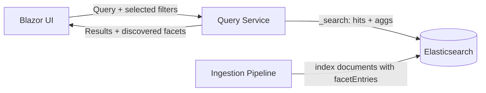

# Architecture

## Overall Technical Approach
- Add a nested facet representation in the Elasticsearch canonical index so facet categories (names) can be discovered at query time.
- Query Service executes a single `_search` request that returns paged hits plus facet aggregations, where facet aggregations are evaluated across the full matched result set (independent of paging).
- Blazor UI renders the facet panel from the aggregation payload rather than inferring available facets from the returned hits.

## Frontend
- The search page issues a query request and displays:
  - paged hits (documents)
  - facet panel (facet name buckets + value buckets with counts)
- Facet selection updates the query request filters and triggers a re-query; the facet panel is refreshed from the new aggregation results.

## Backend
- Ingestion/indexing:
  - Takes the existing canonical facet dictionary and emits `facetEntries` as a `nested` array of `{ name, value }` records on the indexed document.
- Elasticsearch:
  - Stores `facetEntries` as `nested` with `keyword` properties for `name` and `value`.
- Query Service:
  - Executes a nested aggregation:
    - `nested` on `facetEntries`
    - `terms` on `facetEntries.name`
    - sub-`terms` on `facetEntries.value`
  - Maps the aggregation response into a UI-friendly facet model returned alongside paged hits.
