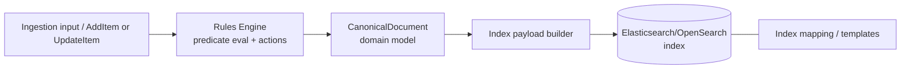

# Implementation Plan + Architecture — Work Package 029: New Canonical Fields

Target path: `docs/029-new-canonical-fields/implementation-plan-and-architecture.md`

This document consolidates the plan for `docs/029-new-canonical-fields/overview.md` and its referenced component specs:
- `docs/029-new-canonical-fields/canonical-document-taxonomy-fields.md`
- `docs/029-new-canonical-fields/index-mapping-update.md`
- `docs/029-new-canonical-fields/tests-and-regressions.md`

---

# Implementation Plan

## Project Structure / Touchpoints

Primary code areas expected to change:
- Domain model: `src/UKHO.Search.Ingestion/Pipeline/Documents/CanonicalDocument.cs`
- Index payload creation / mapping assets (wherever index schema/mapping JSON is stored)
- Rule engine: any actions that set canonical fields and any path resolution into `CanonicalDocument`
- Tests:
  - `test/UKHO.Search.Ingestion.Tests/Rules/*`
  - Any payload regression snapshot assets referenced by `RulesEngineIndexItemPayloadRegressionTests`

Key constraints from spec:
- New fields are multi-valued set-like collections.
- “Setting” adds to the set (does not replace).
- Deterministic ordering (sorted) for stable payloads/tests.
- Index mapping must add the new fields as `keyword`.

---

## Slice 1: CanonicalDocument supports new taxonomy fields (unit-test proven)

- [x] Work Item 1: Add new taxonomy fields to `CanonicalDocument` with set semantics - Completed
  - **Purpose**: Enable ingestion pipeline/rules engine to capture universal discovery taxonomy on canonical docs with deterministic, additive behavior.
  - **Acceptance Criteria**:
    - `CanonicalDocument` exposes: `Authority`, `Region`, `Fornat`, `MajorVersion`, `MinorVersion`, `Category`, `Series`, `Instance` as multi-valued collections.
    - Adding values is additive (no replacement) and de-duplicated.
    - Values are deterministically ordered.
    - Null/empty/whitespace strings are ignored.
  - **Definition of Done**:
    - Code changes compiled.
    - Unit tests added/updated and passing.
    - No behavior regressions in existing ingestion/rules tests.
  - [x] Task 1: Implement new fields following `Keywords` conventions - Completed
    - [x] Step 1: Inspect existing `Keywords` implementation in `CanonicalDocument` and mirror collection type + normalization/sorting rules.
    - [x] Step 2: Add backing collections and public read-only accessors for each new field.
    - [x] Step 3: Add mutation methods consistent with existing style (`SetXxx` / `AddXxx`) ensuring add-to-set behavior.
    - [x] Step 4: Ensure deterministic ordering at point of read (or write) consistent with `Keywords`.
    - [x] Step 5: Ensure string handling matches `Keywords` (trim/ignore empties; apply any existing lowercasing/normalization conventions if required).
  - [x] Task 2: Add/Update unit tests for canonical set semantics - Completed
    - [x] Step 1: Locate existing tests for `Keywords` or `CanonicalDocument` behaviors.
    - [x] Step 2: Add tests for each property:
      - additive behavior
      - de-dup
      - ordering
      - null/empty ignored
    - [x] Step 3: Run the unit test suite and update any assumptions.
  - **Files**:
    - `src/UKHO.Search.Ingestion/Pipeline/Documents/CanonicalDocument.cs`: add new multi-valued fields + methods.
    - `test/UKHO.Search.Ingestion.Tests/...`: add/update tests for set semantics.
  - **Work Item Dependencies**: none.
  - **Run / Verification Instructions**:
    - Run tests from VS Test Explorer filtered to `CanonicalDocument` tests (or run full test project).

  - **Completed Summary**:
    - Updated `CanonicalDocument` to include taxonomy fields: `Authority`, `Region`, `Fornat`, `MajorVersion`, `MinorVersion`, `Category`, `Series`, `Instance` as sorted, de-duplicating sets with additive `AddXxx`/`SetXxx` methods.
    - Added unit tests proving set semantics, normalization, and deterministic ordering.
    - Verified `UKHO.Search.Ingestion.Tests` passes.

---

## Slice 2: Rules engine & path resolution can set and access new fields end-to-end

- [x] Work Item 2: Enable rules/actions to populate the new taxonomy fields and ensure payload generation includes them - Completed
  - **Purpose**: Ensure end-to-end ingestion rule evaluation can add taxonomy values and they flow into the index payload.
  - **Acceptance Criteria**:
    - Existing rule actions that set canonical fields are updated to support the new fields.
    - Path resolution and template expansion can reference the new fields where applicable.
    - Index payload includes the new fields when present.
    - Existing rules engine tests pass after expectation updates.
  - **Definition of Done**:
    - Code changes compiled.
    - Rules engine integration tests passing.
    - Payload regression baselines updated and stable.
  - [x] Task 1: Update action handlers / DSL mappings - Completed
    - [x] Step 1: Identify where canonical fields are set from rules (e.g., action names, mapping tables).
    - [x] Step 2: Add support for each new field name.
    - [x] Step 3: Ensure “set” semantics map to add-to-set behavior.
  - [x] Task 2: Update payload builder/transform - Completed
    - [x] Step 1: Locate the component that converts `CanonicalDocument` to the index item payload.
    - [x] Step 2: Emit all new fields in the payload using the correct JSON types.
    - [x] Step 3: Decide representation for `MajorVersion`/`MinorVersion` in payload (numbers vs strings) based on current mapping conventions.
  - [x] Task 3: Update and extend rules tests - Completed
    - [x] Step 1: Update expected canonical/payload objects in:
      - `test/UKHO.Search.Ingestion.Tests/Rules/RulesEngineSlice4ActionsIntegrationTests.cs`
      - `test/UKHO.Search.Ingestion.Tests/Rules/RulesEngineEndToEndExampleTests.cs`
      - `test/UKHO.Search.Ingestion.Tests/Rules/RulesEngineIndexItemPayloadRegressionTests.cs`
    - [x] Step 2: Add a focused regression test case demonstrating setting two values into the same taxonomy field in one run and ensuring both appear.
  - **Files**:
    - Rule action mapping/handlers (TBD after code search)
    - Index payload builder (TBD)
    - `test/UKHO.Search.Ingestion.Tests/Rules/*.cs`: update expectations and add new scenario(s)
  - **Work Item Dependencies**: Work Item 1.
  - **Run / Verification Instructions**:
    - Run tests:
      - Filter: `RulesEngine*` in VS Test Explorer.
      - Ensure `RulesEngineIndexItemPayloadRegressionTests` baselines are updated and stable.

  - **Completed Summary**:
    - Extended rules DSL `then` model to support taxonomy actions (`authority`, `region`, `fornat`, `majorVersion`, `minorVersion`, `category`, `series`, `instance`).
    - Updated action application to add these values to `CanonicalDocument` with additive, de-duping, deterministic behavior; numeric versions are parsed from expanded templates and invalid values are ignored.
    - Added integration coverage in `test/UKHO.Search.Ingestion.Tests/Rules/RulesEngineTaxonomyActionsIntegrationTests.cs`.
    - Verified `UKHO.Search.Ingestion.Tests` passes.

---

## Slice 3: Index mapping updated and validated

- [x] Work Item 3: Update index mapping assets to include new taxonomy fields as `keyword` - Completed
  - **Purpose**: Ensure search index schema accepts and supports the taxonomy fields for filtering/aggregation.
  - **Acceptance Criteria**:
    - Mapping includes: `authority`, `region`, `fornat`, `majorVersion`, `minorVersion`, `category`, `series`, `instance` with type `keyword`.
    - Any mapping/template tests pass.
  - **Definition of Done**:
    - Mapping JSON/templates updated.
    - Mapping validation tests updated and passing.
    - Payload emitted by Slice 2 aligns with mapping.
  - [x] Task 1: Update mapping/template JSON - Completed
    - [x] Step 1: Locate mapping files (index template / mapping JSON) in the repository.
    - [x] Step 2: Add fields, preserving naming + casing conventions.
    - [x] Step 3: Pay special attention to `majorVersion`/`minorVersion` representation alignment.
  - [x] Task 2: Update mapping validation tests (if present) - Completed
    - [x] Step 1: Identify tests that assert mapping structure.
    - [x] Step 2: Extend assertions for the new fields and `keyword` type.
  - **Files**:
    - Mapping assets (TBD after file search)
    - Mapping schema tests (TBD)
  - **Work Item Dependencies**:
    - Work Item 2 (payload shape agreed)
  - **Run / Verification Instructions**:
    - Run mapping tests (if present) or the full test suite.

  - **Completed Summary**:
    - Updated `src/UKHO.Search.Infrastructure.Ingestion/Elastic/CanonicalIndexDefinition.cs` to add `authority`, `region`, `fornat`, `majorVersion`, `minorVersion`, `category`, `series`, `instance` as `keyword` mappings.
    - Extended `test/UKHO.Search.Ingestion.Tests/Elastic/CanonicalIndexDefinitionTests.cs` to assert the new fields exist and have `keyword` type.
    - Verified `UKHO.Search.Ingestion.Tests` passes.

---

## Slice 4: Full regression pass (all tests) + documentation tightening

- [x] Work Item 4: Stabilize regressions and ensure all tests pass - Completed
  - **Purpose**: Ensure the uplift does not introduce hidden regressions and the repo returns to green.
  - **Acceptance Criteria**:
    - All tests in the solution pass.
    - Payload snapshots/baselines updated and reviewed.
    - Work package docs reflect any final decisions (e.g., numeric version representation in payload).
  - **Definition of Done**:
    - `dotnet test` equivalent within VS passes.
    - Work package documents updated if any decisions changed.
  - [x] Task 1: Run full test suite and fix failures - Completed
    - [x] Step 1: Run all `UKHO.Search.Ingestion.Tests`.
    - [x] Step 2: Run rest of solution tests if required.
    - [x] Step 3: Address failures caused by new fields (serialization expectations, mapping expectations, etc.).
  - [x] Task 2: Update docs with final decisions - Completed
    - [x] Step 1: Update mapping spec section 2.2 with the chosen representation.
  - **Files**:
    - Any failing test files
    - `docs/029-new-canonical-fields/index-mapping-update.md` (decision capture)
  - **Work Item Dependencies**: Work Item 1–3.
  - **Run / Verification Instructions**:
    - Run full solution test suite in VS.

  - **Completed Summary**:
    - Ran full test suite via `dotnet test` and ensured the solution is green after the taxonomy/mapping uplift.
    - Documented the `majorVersion`/`minorVersion` representation decision (numeric values parsed from templates; mapping uses `keyword`).

---

# Architecture

## Overall Technical Approach

This change is a domain-model + indexing-schema evolution driven by ingestion rules.

High-level flow:
1. Source payload enters ingestion pipeline.
2. Rules engine evaluates predicates using path resolution and template expansion.
3. Actions mutate a `CanonicalDocument`.
4. Canonical document is transformed into an index item payload.
5. Payload is indexed into Elasticsearch/OpenSearch with a mapping that must include the new fields.

Key architectural considerations:
- Maintain onion architecture direction: rules engine and canonical domain remain in `UKHO.Search.Ingestion` (domain). Mapping assets likely live in infra/host; they must be updated without violating dependency direction.
- Deterministic ordering is critical for stable test baselines and consistent payloads.

## Frontend

No frontend/Blazor changes are expected for this work package unless the UI explicitly surfaces these fields. If it does, the UI should treat them as facets/filters backed by `keyword` fields.

## Backend

Backend changes are expected primarily in ingestion + indexing assets:
- `CanonicalDocument` evolves to include taxonomy fields.
- Rule actions must be able to add multiple values to sets.
- Index payload builder must emit arrays per field.
- Index mapping must include the new fields as `keyword`.

If the host project performs mapping installation at startup, ensure the mapping JSON is updated and the deployment path remains unchanged.

---

## Summary / Key Considerations

- Implement in vertical slices: model → rules/payload → mapping → full regressions.
- Preserve existing semantics of `Keywords` for consistency (normalization, ordering, set behavior).
- Decide and document `MajorVersion`/`MinorVersion` serialization (numbers vs strings) based on current mapping conventions.
- Update regression snapshots carefully to avoid unnecessary churn.
