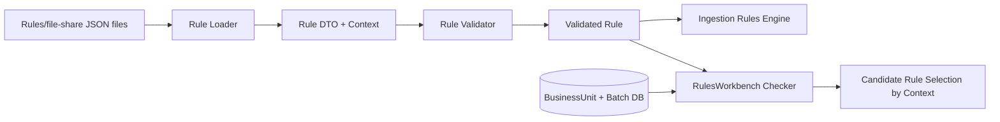

# Implementation Plan

**Target output path:** `./docs/046-rule-checker/plan-ruledef-uplfit.md`

**Based on:** `docs/046-rule-checker/spec-ruledef-uplfit.md`

## Baseline
- The ingestion rules model does not currently expose an explicit `Context` field as the authoritative business-unit discriminator for `file-share` rules.
- RulesWorkbench `Checker` currently derives candidate rules using business-unit logic that has depended on filename conventions.
- Existing `file-share` rule JSON files under `./Rules/file-share` do not yet consistently carry explicit business-unit metadata in-rule.
- Existing ingestion and RulesWorkbench tests cover rule loading, validation, evaluation, and checker candidate selection, but not the new `Context` field behavior.

## Delta
- Add `Context` to the ingestion rule definition model and validation flow.
- Uplift `file-share` rule JSON files to include `Context`.
- Change RulesWorkbench `Checker` candidate selection to use `Context` instead of filename parsing.
- Add regression coverage for ambiguous business unit names such as `adds` vs `adds-s100`.

## Carry-over / Deferred
- Changing the wider rule execution semantics beyond carrying the new field.
- Renaming the existing rule files as part of this package.
- Persisting checker edits back to Azure App Configuration.
- Broader RulesWorkbench uplift outside candidate-rule selection.

## Project Structure / Placement
- Rule DTOs, validation, and loading changes live under `src/UKHO.Search.Infrastructure.Ingestion/Rules/*`.
- File-share rule JSON updates remain under the existing `Rules/file-share` content root used by the solution.
- RulesWorkbench candidate selection changes live under `tools/RulesWorkbench/*`.
- Shared regression tests stay in `test/UKHO.Search.Ingestion.Tests/*` and `test/RulesWorkbench.Tests/*`.
- Documentation remains in `docs/046-rule-checker/*`.

## Feature Slice: Context-aware rule definition and ingestion loading

- [x] Work Item 1: Add `Context` to the rule model and validate it for `file-share` rules - Completed
  - **Purpose**: Establish the new rule-definition source of truth in the ingestion stack before changing rule files or checker behavior.
  - **Acceptance Criteria**:
    - The ingestion rule DTO/model supports a new `Context` field.
    - Validated rule representations can carry `Context` where required.
    - `file-share` rule validation fails clearly when `Context` is missing after the uplift is applied.
    - Existing predicate/action behavior remains unchanged.
  - **Definition of Done**:
    - Rule DTOs, validators, and validated models updated.
    - Unit tests cover deserialization and validation of `Context`.
    - Logging and error messages remain clear and fail-fast for invalid rule definitions.
    - Can execute end-to-end via: load the rules catalog and observe successful validation for updated rules.
  - [x] Task 1.1: Add `Context` to rule DTO and validated rule types - Completed
    - [x] Step 1: Updated `RuleDto` to include `Context`.
    - [x] Step 2: Updated `ValidatedRule` to carry `Context`.
    - [x] Step 3: Updated validation projection code to preserve normalized `Context` consistently.
  - [x] Task 1.2: Update validation rules for `file-share` - Completed
    - [x] Step 1: Added `file-share` validation support for `Context`, with enforcement when the provider ruleset is partially or fully uplifted.
    - [x] Step 2: Implemented an explicit short-lived transitional compatibility mode so the current all-missing legacy state remains runnable until Work Item 2 updates rule files.
    - [x] Step 3: Added specific validation errors for missing `context` on affected rules.
  - [x] Task 1.3: Add ingestion-side tests - Completed
    - [x] Step 1: Added rule-file loading coverage for rule JSON containing `Context`.
    - [x] Step 2: Added validation/projection coverage for `file-share` rules when `Context` is present.
    - [x] Step 3: Added transitional regression coverage for both the legacy all-missing state and the partially uplifted failure case.
  - **Files**:
    - `src/UKHO.Search.Infrastructure.Ingestion/Rules/Model/RuleDto.cs`: Add `Context` field.
    - `src/UKHO.Search.Infrastructure.Ingestion/Rules/Validation/ValidatedRule.cs`: Carry validated `Context`.
    - `src/UKHO.Search.Infrastructure.Ingestion/Rules/Validation/IngestionRulesValidator.cs`: Enforce `Context` rules.
    - `test/UKHO.Search.Ingestion.Tests/Rules/*`: Add/update deserialization and validation tests.
  - **Work Item Dependencies**: None.
  - **Run / Verification Instructions**:
    - `dotnet test test/UKHO.Search.Ingestion.Tests/UKHO.Search.Ingestion.Tests.csproj`
  - **User Instructions**: No manual action required.
  - **Summary (Work Item 1)**:
    - Added `Context` to `RuleDto` and `ValidatedRule` in `src/UKHO.Search.Infrastructure.Ingestion/Rules/Model/RuleDto.cs` and `src/UKHO.Search.Infrastructure.Ingestion/Rules/Validation/ValidatedRule.cs`.
    - Updated `src/UKHO.Search.Infrastructure.Ingestion/Rules/Validation/IngestionRulesValidator.cs` to normalize/project `Context` and enforce it for partially or fully uplifted `file-share` rules while keeping transitional compatibility for the current all-missing ruleset.
    - Added regression coverage in `test/UKHO.Search.Ingestion.Tests/Rules/RuleFileLoaderTests.cs` and `test/UKHO.Search.Ingestion.Tests/Rules/RulesetValidationTests.cs`.

## Feature Slice: Rule file uplift with explicit context

- [x] Work Item 2: Update existing `file-share` rule JSON files to include `Context` - Completed
  - **Purpose**: Make the rule content itself authoritative so downstream tooling no longer depends on ambiguous filenames.
  - **Acceptance Criteria**:
    - Existing `file-share` rule JSON files include `Context`.
    - `Context` values correctly represent the intended business unit.
    - The migration correctly derives names such as `adds-s100` by using the `-{integer}-` delimiter in the legacy filename.
    - Existing rule ids, predicates, and actions are unchanged apart from the new field.
  - **Definition of Done**:
    - All targeted rule files updated in place.
    - Migration logic/process documented or encoded in a repeatable way if needed.
    - Regression checks confirm no ambiguous filename parsing is used during runtime candidate selection.
    - Can execute end-to-end via: load the updated file-share rules and verify the rules catalog still validates successfully.
  - [x] Task 2.1: Define the filename-to-context migration rule - Completed
    - [x] Step 1: Added `RuleContextMigrationHelper` to identify the integer segment in legacy names matching `bu-{bu-name}-x-*`.
    - [x] Step 2: Implemented derivation that treats the segment between `bu-` and `-{integer}-` as the business unit name.
    - [x] Step 3: Normalized derived `Context` values to lowercase.
  - [x] Task 2.2: Apply the uplift to existing rule files - Completed
    - [x] Step 1: Updated each existing `file-share` rule JSON file in both `src/Hosts/IngestionServiceHost/Rules/file-share/` and `tools/RulesWorkbench/Rules/file-share/` to include `context`.
    - [x] Step 2: Preserved all existing rule ids, predicates, descriptions, and actions.
    - [x] Step 3: Spot-checked ambiguous migration behavior through the new helper/tests even though the currently checked-in files are not using the legacy `bu-{bu-name}-x-*` naming pattern.
  - [x] Task 2.3: Add migration-oriented regression tests - Completed
    - [x] Step 1: Added tests proving `bu-adds-s100-4-*` maps to `adds-s100`.
    - [x] Step 2: Added tests proving `bu-adds-4-*` maps to `adds`.
    - [x] Step 3: Added tests for multi-hyphen business unit names such as `test-penrose-s57`.
  - **Files**:
    - `Rules/file-share/*.json`: Add `Context` values.
    - `test/UKHO.Search.Ingestion.Tests/Rules/*`: Add/update filename-to-context regression tests if migration helpers exist.
    - `docs/046-rule-checker/spec-ruledef-uplfit.md`: Clarify migration behavior only if implementation reveals a necessary adjustment.
  - **Work Item Dependencies**: Depends on Work Item 1.
  - **Run / Verification Instructions**:
    - `dotnet test test/UKHO.Search.Ingestion.Tests/UKHO.Search.Ingestion.Tests.csproj`
    - Run the rules-loading path and confirm the updated file-share rules validate successfully.
  - **User Instructions**:
    - Review a sample of uplifted rule files with ambiguous business unit names before merge.
  - **Summary (Work Item 2)**:
    - Added `src/UKHO.Search.Infrastructure.Ingestion/Rules/RuleContextMigrationHelper.cs` to encode the legacy filename-to-context migration rule.
    - Updated all existing checked-in `file-share` rule JSON files in both IngestionServiceHost and RulesWorkbench to include explicit lowercase `context` values.
    - Added migration-oriented regression coverage in `test/UKHO.Search.Ingestion.Tests/Rules/RuleContextMigrationHelperTests.cs` and kept the rule-loading/validation suite green.

## Feature Slice: RulesWorkbench checker candidate matching by Context

- [x] Work Item 3: Switch RulesWorkbench `Checker` candidate selection from filename parsing to `Context` - Completed
  - **Purpose**: Deliver a runnable end-to-end checker improvement that removes ambiguous candidate matching for business units.
  - **Acceptance Criteria**:
    - RulesWorkbench `Checker` uses rule `Context` as the source of truth for candidate-rule matching.
    - Selected business unit id continues to drive batch selection from the database.
    - Selected business unit name lowercased is compared to rule `Context` lowercased.
    - Rules like `bu-adds-s100-4-*` no longer appear as candidates when `adds` is selected unless their `Context` is actually `adds`.
  - **Definition of Done**:
    - RulesWorkbench candidate selection logic updated.
    - Any supporting rule snapshot / metadata types updated as needed.
    - Regression tests cover `adds` vs `adds-s100` ambiguity.
    - Can execute end-to-end via: run RulesWorkbench, choose business unit `adds`, and verify `adds-s100` rules are not shown as candidates.
  - [x] Task 3.1: Update checker candidate selection logic - Completed
    - [x] Step 1: Inspected `RuleCheckerService` and supporting App Config-backed rule entry models.
    - [x] Step 2: Removed filename-prefix candidate matching from `RuleCheckerService`.
    - [x] Step 3: Switched candidate selection to compare selected business unit name against normalized rule `Context`.
  - [x] Task 3.2: Update any supporting rule snapshot metadata projections - Completed
    - [x] Step 1: Updated App Config-backed rule entry projection to expose normalized `Context` from rule JSON.
    - [x] Step 2: Added a focused extraction helper in `AppConfigRulesSnapshotStore` and avoided reintroducing filename heuristics.
    - [x] Step 3: Preserved existing checker reporting behavior for matched and candidate-but-unmatched rules.
  - [x] Task 3.3: Add RulesWorkbench regression tests - Completed
    - [x] Step 1: Added a test proving `Context = "adds-s100"` does not match selected business unit `adds`.
    - [x] Step 2: Added a test proving `Context = "adds-s100"` does match selected business unit `adds-s100`.
    - [x] Step 3: Added a test proving candidate selection is independent of filename shape once `Context` is present.
  - **Files**:
    - `tools/RulesWorkbench/Services/RuleCheckerService.cs`: Use `Context` for candidate-rule matching.
    - `tools/RulesWorkbench/Services/AppConfigRulesSnapshotStore.cs` or related rule-entry types: Expose `Context` if required.
    - `test/RulesWorkbench.Tests/*`: Add/update candidate-selection regression tests.
  - **Work Item Dependencies**: Depends on Work Items 1 and 2.
  - **Run / Verification Instructions**:
    - `dotnet test test/RulesWorkbench.Tests/RulesWorkbench.Tests.csproj`
    - `dotnet run --project tools/RulesWorkbench/RulesWorkbench.csproj`
    - Open `/checker`, select business units with ambiguous names, and verify candidate selection is correct.
  - **User Instructions**: No manual action required.
  - **Summary (Work Item 3)**:
    - Updated `tools/RulesWorkbench/Services/RuleCheckerService.cs` to use rule `Context` rather than rule id / filename prefixes for candidate-rule matching.
    - Updated `tools/RulesWorkbench/Services/AppConfigRulesSnapshotStore.cs` and `tools/RulesWorkbench/Services/RulesWorkbenchRuleEntry.cs` to project normalized `Context` metadata from App Configuration rule JSON.
    - Added regression coverage in `test/RulesWorkbench.Tests/AppConfigRulesSnapshotStoreTests.cs` and extended `test/RulesWorkbench.Tests/RuleCheckerServiceTests.cs` to cover the `adds` vs `adds-s100` ambiguity and filename-independent matching.

## Feature Slice: Hardening and rollout confidence

- [x] Work Item 4: Harden end-to-end confidence for the Context uplift - Completed
  - **Purpose**: Ensure the rule-definition uplift is safe, observable, and ready for broader adoption without hidden regressions.
  - **Acceptance Criteria**:
    - Ingestion-side and RulesWorkbench-side tests cover the new `Context` behavior.
    - Logging and validation failures clearly identify missing/invalid `Context` issues.
    - Candidate-rule behavior is demonstrably correct for ambiguous business unit names.
  - **Definition of Done**:
    - Shared tests pass across ingestion and RulesWorkbench projects.
    - Any required documentation adjustments are applied in this work package.
    - End-to-end verification is documented for both rule loading and checker matching.
    - Can execute end-to-end via: run the relevant tests and manually verify a representative checker scenario.
  - [x] Task 4.1: Add full regression coverage - Completed
    - [x] Step 1: Ran the full ingestion regression suite and confirmed the Context uplift passes across `UKHO.Search.Ingestion.Tests`.
    - [x] Step 2: Ran the full RulesWorkbench regression suite and confirmed the Context-based checker matching passes across `RulesWorkbench.Tests`.
    - [x] Step 3: Added focused RulesWorkbench regression cases for prefix business unit names and filename-independent candidate matching.
  - [x] Task 4.2: Improve diagnostics and rollout clarity - Completed
    - [x] Step 1: Confirmed validation errors clearly mention missing `Context` for affected rule definitions via the ingestion validation suite.
    - [x] Step 2: Improved checker diagnostics with explicit warnings/logs for "no candidate rules", "candidate rules exist but none matched", and "rules matched but required fields remain missing" outcomes.
    - [x] Step 3: No specification clarification update was required after implementation evidence review.
  - **Files**:
    - `test/UKHO.Search.Ingestion.Tests/*`: Full ingestion regression suite uplift.
    - `test/RulesWorkbench.Tests/*`: Full RulesWorkbench regression suite uplift.
    - `docs/046-rule-checker/spec-ruledef-uplfit.md`: Clarifications only if implementation evidence requires them.
  - **Work Item Dependencies**: Depends on Work Items 1–3.
  - **Run / Verification Instructions**:
    - `dotnet test test/UKHO.Search.Ingestion.Tests/UKHO.Search.Ingestion.Tests.csproj`
    - `dotnet test test/RulesWorkbench.Tests/RulesWorkbench.Tests.csproj`
  - **User Instructions**:
    - Review ambiguous business unit cases (`adds`, `adds-s100`, and any other known hyphenated names) during verification.
  - **Summary (Work Item 4)**:
    - Extended `test/RulesWorkbench.Tests/RuleCheckerServiceTests.cs` with explainability-focused regression coverage for candidate-rule outcomes after the Context switch.
    - Updated `tools/RulesWorkbench/Services/RuleCheckerService.cs` to log and surface clearer warnings for candidate/match/missing-field diagnostic categories without regressing successful `OK` outcomes.
    - Ran the full `UKHO.Search.Ingestion.Tests` and `RulesWorkbench.Tests` suites and confirmed the Context uplift passes end-to-end regression coverage.

---

# Architecture

## Overall Technical Approach
- Introduce `Context` into the ingestion rule definition as the authoritative business-unit discriminator for `file-share` rules.
- Uplift the ingestion rules pipeline first so the model, validation, and loaded rule representation understand the field.
- Migrate the existing `file-share` rule JSON files so `Context` is stored explicitly in-content.
- Update RulesWorkbench `Checker` to use `Context` for candidate selection rather than ambiguous filename parsing.

## Frontend
- No new frontend surface is required beyond the existing RulesWorkbench `Checker` screen behavior.
- The existing checker UI remains the entry point; only the candidate-rule selection source of truth changes.
- User flow impact:
  - user selects a business unit
  - checker loads batches using business unit id
  - checker matches candidate rules using rule `Context` instead of filename parsing

## Backend
- `src/UKHO.Search.Infrastructure.Ingestion/Rules/*`
  - carries the new `Context` field through deserialization, validation, and validated rule representation.
- `Rules/file-share/*.json`
  - become the authoritative source of business-unit context by including `Context` directly in each rule.
- `tools/RulesWorkbench/Services/RuleCheckerService.cs`
  - uses selected business unit name to match against rule `Context`.
- Supporting test projects
  - verify ambiguous business unit names no longer produce incorrect candidate matches.

## Overall approach summary
This plan delivers the uplift in vertical slices: first the ingestion rule model, then the rule-file content, then the RulesWorkbench checker behavior, and finally hardening. The key design decision is that `Context` becomes the authoritative source of rule business-unit classification, while filename parsing is reduced to a one-time migration aid only.