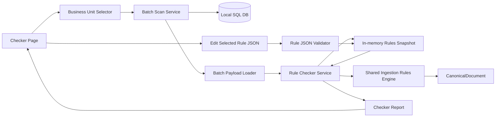

# Implementation Plan

**Target output path:** `./docs/046-rule-checker/plan.md`

**Based on:** `docs/046-rule-checker/spec.md`

## Baseline
- `RulesWorkbench` already has a runnable Blazor Server host with navigation, a `Rules` page, and an `Evaluate` page.
- `Evaluate` already loads batch-derived payloads from the local SQL database via `BatchPayloadLoader`.
- `Evaluate` already reuses the shared ingestion rules engine through `RuleEvaluationService`, but it runs a one-off evaluation flow rather than a guided checker workflow.
- The ingestion runtime creates a single `CanonicalDocument` per upsert and mutates it additively through enrichers/rules; current forensic review did not identify a runtime path that re-creates the document during rule enrichment.

## Delta
- Add a new `Checker` page to `RulesWorkbench`.
- Add business-unit-driven batch scanning that stops at the first failing batch.
- Add candidate-rule diagnostics based on the hardwired `bu-{businessunitname}-*` naming convention.
- Add in-memory rule editing, validation, rerun, and resume-from-next-batch behavior.
- Extend the shared evaluation/reporting path enough to surface matched rules, candidate rules, pass/fail reasons, and readable diagnostics.

## Carry-over / Deferred
- Full file-share enrichment-chain execution.
- Date-range filters.
- Scanning all business units in one run.
- Automatic persistence of edits back to Azure App Configuration.
- Background scan jobs / resumable jobs beyond in-session continuation.
- Rich predicate tracing and advanced “most likely offender” heuristics.
- Work Item 3 (`Edit, validate, rerun, and resume`) is deferred to a later wider RulesWorkbench uplift package.
- Work Item 4 (`Reporting, diagnostics, and parity hardening`) is deferred to a later wider RulesWorkbench uplift package.

## Project Structure / Placement
- Blazor UI, page state, and workbench-specific orchestration stay in `tools/RulesWorkbench/*`.
- Shared ingestion rule engine enhancements required for accurate reporting stay in `src/UKHO.Search.Infrastructure.Ingestion/*`.
- Database access for batch enumeration and business unit selection stays in `tools/RulesWorkbench/Services/*`.
- Tests for the workbench host and services stay in `test/RulesWorkbench.Tests/*`.
- Tests for shared ingestion rule engine behavior stay in existing ingestion test projects where appropriate.

## Feature Slice: Single-batch checker diagnostics

- [x] Work Item 1: Add a runnable `Checker` page for one batch using the existing rules engine - Completed
  - **Purpose**: Deliver the smallest end-to-end checker flow that loads one real batch, runs the same ingestion rules path as the host, and explains pass/fail using the v1 heuristic.
  - **Acceptance Criteria**:
    - A `Checker` page exists in `RulesWorkbench` and is reachable from navigation.
    - A user can enter a `batchId` and load batch data from the local database.
    - The page runs the shared ingestion rules engine path only.
    - The result clearly shows `OK`/`Fail`/`Warning` and whether `Category`, `Series`, and `Instance` were populated.
    - The page shows readable batch details, expandable payload JSON, final `CanonicalDocument` JSON, matched rules, candidate-but-unmatched rules, and raw JSON for a selected rule.
  - **Definition of Done**:
    - Page implemented and wired into navigation.
    - Rule-check execution reuses shared services rather than duplicating the rule engine.
    - Error handling and structured logging added.
    - Unit/integration tests cover single-batch success and failure rendering paths.
    - Can execute end-to-end via: run `RulesWorkbench`, open `/checker`, enter a batch id, and inspect the result.
  - [x] Task 1.1: Add page shell and navigation entry - Completed
    - [x] Step 1: Added `tools/RulesWorkbench/Components/Pages/Checker.razor` with `@rendermode InteractiveServer`.
    - [x] Step 2: Added a navigation link in `tools/RulesWorkbench/Components/Layout/NavMenu.razor`.
    - [x] Step 3: Reused existing `Evaluate` page conventions and added `Checker.razor.css` for scoped styling.
  - [x] Task 1.2: Create a checker-specific application service and result contract - Completed
    - [x] Step 1: Added `RuleCheckerService` to orchestrate batch load -> rule evaluation -> heuristic assessment -> report creation.
    - [x] Step 2: Added checker DTOs/contracts for batch summary, candidate rules, report status, and run results under `tools/RulesWorkbench/Contracts/`.
    - [x] Step 3: Kept checker-specific UI/reporting models in `tools/RulesWorkbench` and avoided leaking them into shared ingestion projects.
  - [x] Task 1.3: Reuse the rules engine and enrich the report - Completed
    - [x] Step 1: Extended the shared ingestion rules engine with `ApplyWithReport(...)` and surfaced matched rule ids/descriptions/summaries in execution order.
    - [x] Step 2: Ensured the checker reuses the same `file-share` provider rules path via `RuleEvaluationService`.
    - [x] Step 3: Kept the scope limited to ingestion-rule execution only; no ZIP-dependent enrichment is invoked by the checker path.
  - [x] Task 1.4: Implement v1 pass/fail heuristic - Completed
    - [x] Step 1: Added checker assessment logic that inspects `Category`, `Series`, and `Instance` from the resulting `CanonicalDocument` JSON.
    - [x] Step 2: Implemented `OK`, `Fail`, and `Warning` status handling with `Fail` taking precedence when required fields are missing.
    - [x] Step 3: Surfaced the missing required fields explicitly in the checker report/UI.
  - [x] Task 1.5: Build the single-batch diagnostics UI - Completed
    - [x] Step 1: Added batch summary rendering for `BatchId`, `BusinessUnit`, and `CreatedOn`.
    - [x] Step 2: Added readable payload summary tables with expandable raw payload JSON.
    - [x] Step 3: Added final `CanonicalDocument` JSON display.
    - [x] Step 4: Added matched rule ids, candidate-but-unmatched rule ids, and selected raw rule JSON display.
    - [x] Step 5: Kept the UI focused on the current batch only with no passed-batch history.
  - **Files**:
    - `tools/RulesWorkbench/Components/Pages/Checker.razor`: New checker page UI.
    - `tools/RulesWorkbench/Components/Layout/NavMenu.razor`: Add `Checker` navigation link.
    - `tools/RulesWorkbench/Services/RuleCheckerService.cs`: New orchestration service.
    - `tools/RulesWorkbench/Contracts/*Checker*.cs`: Checker report and UI contracts.
    - `tools/RulesWorkbench/Program.cs`: Register new checker services.
    - `src/UKHO.Search.Infrastructure.Ingestion/Rules/*`: Minimal engine/reporting uplift if required to expose matched rules.
  - **Work Item Dependencies**: None.
  - **Run / Verification Instructions**:
    - `dotnet run --project tools/RulesWorkbench/RulesWorkbench.csproj`
    - Open the workbench and navigate to `/checker`.
    - Enter a known batch id and verify the single-batch result renders.
  - **User Instructions**:
    - Ensure local SQL configuration is available in the same way `Evaluate` currently requires.
  - **Summary (Work Item 1)**:
    - Added `Checker` page, navigation entry, and scoped component styling in `tools/RulesWorkbench/Components/Pages/Checker.razor`, `Checker.razor.css`, and `tools/RulesWorkbench/Components/Layout/NavMenu.razor`.
    - Added checker orchestration/report contracts in `tools/RulesWorkbench/Services/RuleCheckerService.cs` and `tools/RulesWorkbench/Contracts/RuleChecker*.cs`.
    - Extended the shared ingestion rules engine/reporting path in `src/UKHO.Search.Infrastructure.Ingestion/Rules/*` and `tools/RulesWorkbench/Services/RuleEvaluationService.cs` so matched rules are returned instead of only logged.
    - Added regression coverage in `test/UKHO.Search.Ingestion.Tests/Rules/IngestionRulesApplyReportIntegrationTests.cs` and `test/RulesWorkbench.Tests/RuleCheckerServiceTests.cs`.

## Feature Slice: Business-unit scan stopping on first failure

- [x] Work Item 2: Add bounded business-unit scanning and fail-fast stop-on-first-error workflow - Completed
  - **Purpose**: Let a user work through one business unit at a time, stopping at the first failing batch so rules can be fixed incrementally.
  - **Acceptance Criteria**:
    - The page allows a user to choose one business unit at a time.
    - The selector lists all business units and displays both `Name` and `Id`.
    - Batch selection uses the chosen `BusinessUnit.Id` as the database filter.
    - Candidate rule subset matching uses the chosen business unit `Name` lowercased.
    - Scans process batches in deterministic order: `CreatedOn ASC`, `BatchId ASC`.
    - Scans stop at the first failing batch and do not continue automatically.
  - **Definition of Done**:
    - Business unit selector is loaded from the database.
    - Batch enumeration service can return ordered batches for a chosen business unit.
    - Scan state persists in-page well enough to resume from the next batch after a fix.
    - Tests cover business unit selection, deterministic ordering, and stop-on-first-failure behavior.
    - Can execute end-to-end via: choose a business unit, start scan, observe first failure loaded in the UI.
  - [x] Task 2.1: Add business unit lookup service - Completed
    - [x] Step 1: Added `BusinessUnitLookupService` to query all rows from `BusinessUnit`.
    - [x] Step 2: Returned both `Id` and `Name` for selector display via `BusinessUnitOptionDto`.
    - [x] Step 3: Did not restrict the selector to active business units only.
  - [x] Task 2.2: Add batch enumeration service for a selected business unit - Completed
    - [x] Step 1: Added `BatchScanService` to select batches by `BusinessUnitId`.
    - [x] Step 2: Applied deterministic ordering using `CreatedOn` then `BatchId`.
    - [x] Step 3: Added bounded execution with explicit max-row limits; optional explicit batch-id list input remains deferred.
  - [x] Task 2.3: Add scan-session state management - Completed
    - [x] Step 1: Tracked selected business unit, current batch pointer, and current sequence in `Checker.razor` state.
    - [x] Step 2: Stopped scanning immediately when the first non-OK batch result was encountered.
    - [x] Step 3: Preserved only the failing batch context for diagnosis without passed-batch history.
  - [x] Task 2.4: Surface candidate rules from business unit naming convention - Completed
    - [x] Step 1: Continued parsing rule ids using the hardwired lowercase pattern `bu-{businessunitname}-*`.
    - [x] Step 2: Used the selected business unit name for candidate matching while continuing to lowercase for comparison.
    - [x] Step 3: Returned candidate rules, matched rules, and candidate-but-unmatched rules in the checker report during scans.
    - [x] Step 4: Preserved heuristic labelling via runtime warnings when candidate inference is incomplete.
  - **Files**:
    - `tools/RulesWorkbench/Services/BusinessUnitLookupService.cs`: New selector data service.
    - `tools/RulesWorkbench/Services/BatchScanService.cs`: New ordered scan service.
    - `tools/RulesWorkbench/Services/BatchPayloadLoader.cs`: Reuse or extend batch-loading queries where useful.
    - `tools/RulesWorkbench/Contracts/*BusinessUnit*.cs`: Selector DTOs.
    - `tools/RulesWorkbench/Components/Pages/Checker.razor`: Selector, scan controls, and fail-fast flow.
    - `src/UKHO.Search.Infrastructure.Ingestion/Rules/*`: Optional helper/reporting support for candidate/matched rule data.
  - **Work Item Dependencies**: Depends on Work Item 1.
  - **Run / Verification Instructions**:
    - Run `RulesWorkbench`.
    - Navigate to `/checker`.
    - Select one business unit by id/name and start the scan.
    - Verify batches are checked in deterministic order and the UI stops at the first failure.
  - **User Instructions**:
    - Choose one business unit at a time; v1 does not support “all business units”.
  - **Summary (Work Item 2)**:
    - Added `BusinessUnitLookupService`, `BatchScanService`, and new business-unit / scan result contracts under `tools/RulesWorkbench/Services/` and `tools/RulesWorkbench/Contracts/`.
    - Updated `Checker.razor` to load all business units, display `Name` + `Id`, scan a selected business unit with a max-row bound, and stop at the first non-OK result while keeping only the failing batch visible.
    - Updated `RuleCheckerService` to accept the explicitly selected business unit name for candidate-rule matching during scans.
    - Updated `BatchPayloadLoader` to resolve business unit names for all business units rather than only active ones, matching checker scan rules.
    - Added regression coverage in `test/RulesWorkbench.Tests/BusinessUnitLookupServiceTests.cs`, `test/RulesWorkbench.Tests/BatchScanServiceTests.cs`, and `test/RulesWorkbench.Tests/RuleCheckerServiceTests.cs`.

## Feature Slice: Edit, validate, rerun, and resume

- [ ] Work Item 3: Allow in-memory rule editing, validation, rerun of the failing batch, and resume from the next batch - Deferred
  - **Purpose**: Complete the repair loop so the checker is not just diagnostic, but directly useful for iterative rule fixing inside one workbench session.
  - **Acceptance Criteria**:
    - A user can select a candidate rule and edit its raw JSON in memory.
    - The checker validates edited rule JSON before accepting it.
    - Invalid JSON blocks continuation and displays clear validation errors.
    - Valid edited JSON can be rerun against the current failing batch.
    - When the current batch passes, the edited rule is reloaded into the in-memory ruleset and scanning resumes from the next batch.
  - **Definition of Done**:
    - In-memory rule override behavior is implemented without persisting changes to App Configuration.
    - Validation and rerun actions are available in the failing-batch workflow.
    - Resume-from-next-batch behavior works with the updated in-memory ruleset.
    - Tests cover invalid edit rejection, successful rerun, and scan continuation.
    - Can execute end-to-end via: start scan, stop on failure, edit rule JSON, validate, rerun, continue.
  - [ ] Task 3.1: Reuse or extend the existing rules snapshot editing model
    - [ ] Step 1: Inspect `RulesSnapshotStore` and existing `Rules` page editing behavior.
    - [ ] Step 2: Reuse that in-memory store for checker edits rather than inventing a second rules session model.
    - [ ] Step 3: Ensure checker reruns use the current edited in-memory ruleset, not a freshly reloaded source snapshot.
  - [ ] Task 3.2: Add rule validation and rerun controls
    - [ ] Step 1: Add raw JSON editor/view for the selected candidate rule.
    - [ ] Step 2: Validate edited JSON with the existing JSON validator before accepting it.
    - [ ] Step 3: Show validation errors inline and block continuation when invalid.
    - [ ] Step 4: Rerun the current failing batch using the edited in-memory rules.
  - [ ] Task 3.3: Add resume-from-next-batch flow
    - [ ] Step 1: Replace the edited rule in the in-memory session when validation succeeds.
    - [ ] Step 2: Re-evaluate the current failing batch and confirm it passes before enabling continuation.
    - [ ] Step 3: Resume scanning from the next batch in the current filtered sequence.
    - [ ] Step 4: Do not restart the whole run by default.
  - [ ] Task 3.4: Add explainable optional offender hints (non-blocking)
    - [ ] Step 1: If feasible without opaque logic, highlight one “most likely offender” from the candidate list.
    - [ ] Step 2: Only show this as a best-effort hint and keep the full candidate list visible.
    - [ ] Step 3: Provide the reason for the hint when derivable.
  - **Files**:
    - `tools/RulesWorkbench/Components/Pages/Checker.razor`: Edit/validate/rerun/resume workflow.
    - `tools/RulesWorkbench/Services/RulesSnapshotStore.cs`: Reuse or extend in-memory rule replacement behavior.
    - `tools/RulesWorkbench/Services/AppConfigRulesSnapshotStore.cs`: Reuse existing snapshot abstractions if needed.
    - `tools/RulesWorkbench/Services/RuleCheckerService.cs`: Rerun and continuation orchestration.
    - `tools/RulesWorkbench/Builder/*` or validation services: Reuse existing JSON validation path.
  - **Work Item Dependencies**: Depends on Work Items 1 and 2.
  - **Run / Verification Instructions**:
    - Run `RulesWorkbench`.
    - Start a business-unit scan.
    - On first failure, edit the selected rule JSON, validate, rerun, and continue.
    - Verify the scan continues from the next batch.
  - **User Instructions**:
    - Edits are session-only in v1 and are not written back to Azure App Configuration.
  - **Deferred Note**:
    - This work item is intentionally deferred.
    - It will be addressed as part of a later, wider RulesWorkbench uplift package rather than in Work Package 046.

## Feature Slice: Reporting, diagnostics, and parity hardening

- [ ] Work Item 4: Harden diagnostics and parity so checker output is trustworthy before wider rollout - Deferred
  - **Purpose**: Reduce the risk of blaming rule authoring for failures that are actually caused by hidden reporting/parity gaps.
  - **Acceptance Criteria**:
    - The checker report exposes enough evidence to distinguish “no candidate rules”, “candidate rules but no matches”, and “matches but required fields still missing”.
    - Shared tests demonstrate parity between checker evaluation and the ingestion rules execution path it reuses.
    - Logging captures scan progress, selected business unit, failing batch id, rerun outcomes, and validation failures.
  - **Definition of Done**:
    - Tests added in both `RulesWorkbench.Tests` and ingestion tests where shared behavior changed.
    - Diagnostics are explainable and non-opaque.
    - Documentation updated in this work package if implementation decisions refine the original spec.
    - Can execute end-to-end via: run scan, inspect logs, and correlate UI state with emitted diagnostics.
  - [ ] Task 4.1: Add shared reporting tests
    - [ ] Step 1: Add ingestion-side tests for any new matched-rule/reporting behavior exposed by the engine.
    - [ ] Step 2: Add workbench tests that compare checker output against representative rule-engine outcomes.
    - [ ] Step 3: Include regression coverage for candidate-rule naming convention parsing.
  - [ ] Task 4.2: Add workbench diagnostics and logging
    - [ ] Step 1: Log selected business unit id/name and scan start.
    - [ ] Step 2: Log first failing batch, rerun attempts, validation failures, and resume progression.
    - [ ] Step 3: Keep logs structured and avoid dumping excessive raw JSON except where explicitly needed.
  - [ ] Task 4.3: Validate usability of the report model
    - [ ] Step 1: Ensure the UI can explain why the current batch failed without requiring a passed-batch history.
    - [ ] Step 2: Confirm the report clearly separates fact from heuristic suggestions.
    - [ ] Step 3: Confirm raw rule JSON and raw payload JSON remain optional expansions rather than the primary view.
  - **Files**:
    - `test/RulesWorkbench.Tests/*`: Checker service/page tests.
    - `test/UKHO.Search.Ingestion.Tests/*`: Shared rule-engine/reporting tests if engine changes are required.
    - `tools/RulesWorkbench/Services/RuleCheckerService.cs`: Logging/report shaping.
    - `docs/046-rule-checker/spec.md`: Minor clarification updates only if implementation reveals a necessary correction.
  - **Work Item Dependencies**: Depends on Work Items 1–3.
  - **Run / Verification Instructions**:
    - `dotnet test test/RulesWorkbench.Tests/RulesWorkbench.Tests.csproj`
    - `dotnet test test/UKHO.Search.Ingestion.Tests/UKHO.Search.Ingestion.Tests.csproj`
    - Run the workbench and verify scan/rerun logs align with visible UI state.
  - **Deferred Note**:
    - This work item is intentionally deferred.
    - It will be addressed as part of a later, wider RulesWorkbench uplift package rather than in Work Package 046.

---

# Architecture

## Overall Technical Approach
- Add a Blazor Server `Checker` page in `RulesWorkbench` that orchestrates a guided diagnostic flow on top of the existing local SQL-backed payload loading and shared ingestion rules engine.
- Keep execution parity scoped to the ingestion rules path only in v1; do not invoke ZIP-dependent file-share enrichment.
- Reuse the existing in-memory rules snapshot/editing model so that checker fixes can be validated and applied within the current session.
- Extend reporting in the shared ingestion rules execution path only where necessary to expose matched-rule evidence back to the workbench.

## Frontend
- `tools/RulesWorkbench/Components/Pages/Checker.razor`
  - Main entry point for the new checker workflow.
  - Hosts single-batch checking, business unit selection, scan controls, failing-batch diagnostics, rule editing, validation, rerun, and resume actions.
- `tools/RulesWorkbench/Components/Layout/NavMenu.razor`
  - Adds navigation to `Checker`.
- Page responsibilities:
  - collect inputs (`batchId` or business unit)
  - show readable batch details
  - show candidate/matched rule lists
  - display selected raw rule JSON
  - allow rerun and continuation only when the current failing batch passes

## Backend
- `tools/RulesWorkbench/Services/BusinessUnitLookupService.cs`
  - Loads all business units for selector display (`Name` + `Id`).
- `tools/RulesWorkbench/Services/BatchScanService.cs`
  - Enumerates batches for one selected business unit using `BusinessUnit.Id`.
  - Applies deterministic ordering for stable stop/resume behavior.
- `tools/RulesWorkbench/Services/BatchPayloadLoader.cs`
  - Reused to turn database rows into the evaluation payload shape.
  - Continues joining business unit data so lowercased `Name` can be used for rule-subset matching.
- `tools/RulesWorkbench/Services/RuleCheckerService.cs`
  - Coordinates payload loading, candidate-rule identification, shared rules execution, pass/fail assessment, and report creation.
  - Owns session-level continuation behavior for “resume from next batch”.
- `tools/RulesWorkbench/Services/RulesSnapshotStore.cs`
  - Reused as the in-memory source of truth for checker edits in the current session.
- `src/UKHO.Search.Infrastructure.Ingestion.Rules/*`
  - Remains the source of execution truth.
  - May need small enhancements to expose matched rule ids / execution reporting instead of only writing them to logs.

### Data flow
1. User selects one business unit or enters one batch id.
2. Workbench reads batch data from the local SQL database.
3. Workbench derives candidate rules using the lowercased business unit `Name` and `bu-{businessunitname}-*` rule ids.
4. Workbench runs the shared ingestion rules engine against the batch payload.
5. Resulting `CanonicalDocument` is assessed using the v1 heuristic (`Category`, `Series`, `Instance`).
6. On failure, the page loads only the failing batch details and lets the user edit a selected rule in memory.
7. On successful validation and rerun, the updated in-memory rules snapshot is used to resume the scan from the next batch.

## Key considerations
- Maintain clear separation between workbench-only orchestration and shared ingestion engine behavior.
- Keep all diagnostics explainable; any “most likely offender” hint must be optional and clearly labeled heuristic.
- Avoid full-dataset or all-business-unit scans in v1 to keep the tool interactive and operationally safe.
- Preserve strict session-only editing semantics unless a later work package explicitly adds persistence back to App Configuration.

## Overall approach summary
This plan delivers `Checker` as a sequence of vertical slices: first a usable single-batch diagnostic tool, then bounded business-unit scanning, then an in-memory repair loop, and finally reporting hardening. The main implementation principle is to reuse the real ingestion rules engine wherever possible while keeping the v1 scope narrow, explainable, and fast enough for local investigation against large data volumes.