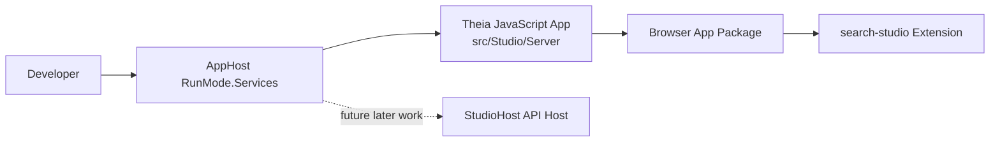

# Implementation Plan

**Target output path:** `docs/057-studio-shell/plan-studio-shell_v0.01.md`

**Version:** `v0.01` (Draft)

**Based on:**
- `docs/057-studio-shell/spec-domain-studio-shell_v0.01.md`

## Studio Shell Foundation

- [x] Work Item 1: Scaffold a buildable browser-hosted Theia workspace in `src/Studio/Server` - Completed
  - **Purpose**: Establish the smallest end-to-end studio shell baseline by creating the generated Theia workspace, keeping the runtime browser-oriented, and proving the custom extension path builds successfully.
  - **Acceptance Criteria**:
    - A generated Theia application workspace exists under `src/Studio/Server`.
    - The workspace contains a browser application and a native Theia extension named `search-studio`.
    - The dependency baseline remains at the generator's minimal default set.
    - The workspace builds successfully using the generated package-manager and browser build scripts.
    - No VS Code extensions are bundled.
  - **Definition of Done**:
    - Workspace structure created and committed
    - Browser application and `search-studio` extension build successfully
    - Electron artifacts are removed if straightforward, otherwise retained unused with no effect on the browser slice
    - Logging/error output from build commands is understandable
    - Documentation updated in this plan/spec pair
    - Can execute end-to-end via: generated package-manager install + browser build command from `src/Studio/Server`
  - [x] Task 1: Generate the Theia workspace using the official composition approach - Completed
    - [x] Step 1: Run the installed `generator-theia-extension` workflow from `src/Studio/Server` using the application-composition pattern recommended by current Theia guidance. - Completed
      - Summary: Ran `yo theia-extension:app search-studio --extensionType hello-world --browser --no-electron --no-vscode --skip-cache --force-install` from `src/Studio/Server` to scaffold the Theia application workspace.
    - [x] Step 2: Choose a browser-hosted application path and generate the custom extension package as `search-studio`. - Completed
      - Summary: Generated a browser application package and a native Theia extension package named `search-studio`; no VS Code configs were generated.
    - [x] Step 3: Keep the generator default package manager unless generation fails or documented guidance requires a deviation. - Completed
      - Summary: Kept the generator-default `yarn` workflow and installed `yarn` globally after the scaffold step failed due the package manager not being present on the machine.
    - [x] Step 4: Verify the generated root `package.json` and workspace layout are rooted correctly under `src/Studio/Server`. - Completed
      - Summary: Verified the generated workspace root, `browser-app`, and `search-studio` packages are rooted under `src/Studio/Server` and that the root `package.json` workspaces list only those packages.
    - [x] Task 1: Generate the Theia workspace using the official composition approach - Completed
      - Summary: Generated a browser-targeted Theia application workspace in `src/Studio/Server` with the native `search-studio` extension and kept the generator-default package-manager flow.
  - [x] Task 2: Normalize the generated workspace to the agreed baseline - Completed
    - [x] Step 1: Keep the browser app package as the active runtime target. - Completed
      - Summary: Confirmed `browser-app` is the only generated app package and retained the browser-targeted Theia application as the active runtime path.
    - [x] Step 2: Remove unused Electron scaffolding only if it is low-risk; otherwise keep it present but unused. - Completed
      - Summary: No `electron-app` package was generated because the scaffold was created with `--no-electron`; removed stale root electron script references from `src/Studio/Server/package.json`.
    - [x] Step 3: Ensure no bundled VS Code extensions are included. - Completed
      - Summary: Confirmed the workspace contains only `browser-app` and `search-studio` packages and no generated VS Code configuration or bundled VS Code extension artifacts.
    - [x] Step 4: Ensure the dependency set stays close to the generator's minimal default baseline. - Completed
      - Summary: Kept the generated Theia package set unchanged aside from browser-only script cleanup, and removed generated README files so the work package guidance remains in the spec only.
    - [x] Task 2: Normalize the generated workspace to the agreed baseline - Completed
      - Summary: Normalized the generated workspace to a browser-only baseline without adding extra Theia or VS Code dependencies.
  - [x] Task 3: Prove the workspace builds end-to-end - Completed
    - [x] Step 1: Restore JavaScript dependencies using the generated package-manager workflow. - Completed
      - Summary: Restored workspace dependencies with `yarn install --ignore-engines` under Node `18.20.4` after installing the generator-default package manager.
    - [x] Step 2: Run the generated prepare/rebuild steps if required by the workspace. - Completed
      - Summary: The workspace `postinstall` and `prepare` scripts completed successfully during dependency restore, including `theia check:theia-version` and `lerna run prepare` for `search-studio`.
    - [x] Step 3: Run the browser build and confirm the custom extension compiles as part of the workspace. - Completed
      - Summary: Ran `yarn build:browser` successfully from `src/Studio/Server`; the browser application bundle completed and the `search-studio` extension compiled into the workspace.
    - [x] Step 4: Capture any generator-specific caveats directly in the plan/spec if they affect later work items. - Completed
      - Summary: Captured the main generator/runtime caveat in the plan history: this Theia stack required Node `18.20.4`, `yarn`, `--ignore-engines`, and clearing inherited Visual Studio 2026 VC toolset environment variables so native modules could build with VS 2022 Build Tools.
    - [x] Task 3: Prove the workspace builds end-to-end - Completed
      - Summary: Restored dependencies, ran generated workspace prepare hooks, and completed the browser build successfully.
  - **Files**:
    - `src/Studio/Server/package.json`: root workspace scripts and workspaces.
    - `src/Studio/Server/browser-app/package.json`: browser application composition and build/start scripts.
    - `src/Studio/Server/search-studio/package.json`: native Theia extension package metadata.
    - `src/Studio/Server/search-studio/src/*`: generated extension contributions.
    - `docs/057-studio-shell/spec-domain-studio-shell_v0.01.md`: source specification already defining baseline decisions.
  - **Work Item Dependencies**: none
  - **Run / Verification Instructions**:
    - From `src/Studio/Server`, run the generated dependency restore/install command.
    - From `src/Studio/Server`, run the generated browser build command.
    - Confirm the build completes without extension compilation failures.
  - **User Instructions**:
    - No additional manual setup beyond Node/package-manager prerequisites already implied by Theia generation.
  - **Implementation Summary**:
    - Generated a browser-hosted Theia workspace in `src/Studio/Server` with `browser-app` and native `search-studio` packages.
    - Kept the generator-default `yarn` workflow and normalized the workspace to a browser-only baseline by removing stale electron script references.
    - Removed generated README artifacts so work-package guidance remains in the spec/plan only.
    - Installed dependencies and completed `yarn build:browser` successfully using Node `18.20.4` with cleared inherited Visual Studio 2026 VC toolset environment variables.

- [x] Work Item 2: Deliver a minimal `UKHO Search Studio` branded shell slice with visible custom contribution - Completed
  - **Purpose**: Turn the raw generated workspace into a recognizable studio shell by adding minimal branding, a welcome-oriented contribution, and a lightly renamed sample action that proves extension wiring while staying intentionally lightweight.
  - **Acceptance Criteria**:
    - User-facing shell naming uses `UKHO Search Studio` while internal package naming remains `search-studio`.
    - The standard Theia workbench layout remains intact.
    - A lightweight welcome-oriented view or panel is contributed by `search-studio`.
    - The welcome contribution includes a simple command action/button with renamed wording aligned to `UKHO Search Studio`.
    - The welcome contribution does not mention future `StudioHost` integration and does not implement migrated functionality.
    - The workspace still builds successfully after customization.
  - **Definition of Done**:
    - Minimal UX contribution implemented
    - Branding/title updates applied where appropriate
    - Placeholder API hook reserved in config/code shape only, without active integration
    - Build still succeeds for the whole workspace
    - Documentation updated in this plan/spec pair
    - Can execute end-to-end via: workspace build showing the extension contribution compiles into the browser app
  - [x] Task 1: Apply user-facing shell naming and minimal branding - Completed
    - [x] Step 1: Update generated app/extension labels so the UI presents `UKHO Search Studio`. - Completed
      - Summary: Added standard Theia frontend application configuration so the generated browser app now emits `applicationName: "UKHO Search Studio"` during rebuild.
    - [x] Step 2: Keep internal extension/package identifiers as `search-studio`. - Completed
      - Summary: Preserved the internal package and extension name `search-studio` while adding only a descriptive package metadata entry.
    - [x] Step 3: Ensure naming changes remain minimal and do not expand scope into wider product branding. - Completed
      - Summary: Limited branding changes to the generated application name, widget label, and greeting text without adding wider product theming or documentation artifacts.
  - [x] Task 2: Implement the minimal welcome slice in `search-studio` - Completed
    - [x] Step 1: Rework the generated sample contribution into a welcome-oriented view or panel within the standard workbench. - Completed
      - Summary: Replaced the generated hello-world-only contribution with a native Theia welcome widget and view contribution that opens in the standard workbench main area.
    - [x] Step 2: Add a lightweight command or button proving the extension is wired and active. - Completed
      - Summary: Added a greeting command, Help menu action, and widget button so the extension exposes a visible interactive action.
    - [x] Step 3: Lightly rename the action to fit `UKHO Search Studio` terminology. - Completed
      - Summary: Renamed the generated action wording to `Show UKHO Search Studio greeting` and updated the message shown on execution.
    - [x] Step 4: Keep the contribution informational/minimal and avoid any real tooling workflow migration. - Completed
      - Summary: Kept the welcome panel informational, limited it to shell-baseline messaging, and did not add any migrated tool workflow or API-backed behavior.
  - [x] Task 3: Reserve future integration affordances without activating them - Completed
    - [x] Step 1: Add only the minimum placeholder shape needed for a future `StudioHost` API hook. - Completed
      - Summary: Added a small placeholder future API configuration file defining a `studioHostBaseUrl` shape and configuration key for later use.
    - [x] Step 2: Do not surface future API details in the welcome contribution. - Completed
      - Summary: Kept the welcome widget content focused on the shell baseline and omitted future `StudioHost` API details from the UI.
    - [x] Step 3: Ensure the placeholder does not create runtime dependencies on `StudioHost`. - Completed
      - Summary: The placeholder hook is code-shape only and is not read or invoked at runtime.
  - [x] Task 4: Rebuild and verify the branded shell slice - Completed
    - [x] Step 1: Re-run the workspace build. - Completed
      - Summary: Re-ran `yarn build:browser` successfully after the branding and welcome-slice changes.
    - [x] Step 2: Confirm the welcome contribution sources are included in the browser app build path. - Completed
      - Summary: Verified the rebuilt workspace emits the updated browser app config and includes the new welcome widget/contribution source files in the extension package.
    - [x] Step 3: Confirm no extra Theia or VS Code extension dependencies were introduced beyond the agreed baseline. - Completed
      - Summary: Kept the dependency baseline unchanged apart from metadata/config updates and did not add any VS Code extension artifacts or extra Theia packages.
  - **Files**:
    - `src/Studio/Server/search-studio/src/browser/*`: welcome contribution, commands, labels, and UI wiring.
    - `src/Studio/Server/search-studio/package.json`: extension metadata and visible naming where required.
    - `src/Studio/Server/browser-app/package.json`: bundled dependency references to `search-studio`.
    - `src/Studio/Server/browser-app/src/*` or generated app config files: browser-app labeling/composition adjustments if needed.
  - **Work Item Dependencies**: Work Item 1
  - **Run / Verification Instructions**:
    - From `src/Studio/Server`, run the generated browser build command again.
    - Confirm the build succeeds after branding/welcome contribution updates.
    - Optional later debug path: start the browser app locally and confirm the welcome contribution appears in the standard layout.
  - **User Instructions**:
    - Runtime/manual inspection is optional for this work package because the mandatory gate is build success.
  - **Implementation Summary**:
    - Updated the browser app configuration so the generated shell uses the user-facing application name `UKHO Search Studio`.
    - Replaced the generated hello-world sample with a native frontend-only welcome widget, view contribution, Help menu action, and renamed greeting command.
    - Added a placeholder future API configuration shape for later `StudioHost` integration without surfacing it in the UI or creating runtime dependencies.
    - Rebuilt the browser shell successfully and retained the minimal generated dependency baseline.

- [x] Work Item 3: Add Aspire orchestration for the studio shell in `RunMode.Services` - Completed
  - **Purpose**: Make the studio shell a first-class locally orchestrated application by wiring the JavaScript shell into `AppHost`, using repository-standard configuration for the fixed port and preserving `StudioHost` unchanged for later API work.
  - **Acceptance Criteria**:
    - `src/Hosts/AppHost/AppHost.csproj` references `Aspire.Hosting.JavaScript`.
    - `src/Hosts/AppHost/appsettings.json` contains `Studio:Server:Port` with value `3000`.
    - `AppHost` reads the configured port using the same style as other Aspire configuration items.
    - `AppHost` registers the Theia JavaScript application in the `RunMode.Services` branch.
    - The resource points at `src/Studio/Server`, uses the generated browser run script, and exposes the configured HTTP endpoint.
    - `StudioHost` remains unchanged as a separate future API host.
    - The .NET solution and Theia workspace both build successfully after integration.
  - **Definition of Done**:
    - Aspire JavaScript integration package added
    - AppHost configuration key/value added and consumed
    - `RunMode.Services` orchestration includes the studio shell resource
    - No unintended change to `StudioHost`
    - Workspace build and `AppHost` build succeed
    - Documentation updated in this plan/spec pair
    - Can execute end-to-end via: `dotnet build` for `AppHost` plus the JavaScript workspace build
  - [x] Task 1: Add configuration and hosting package support to `AppHost` - Completed
    - [x] Step 1: Add the `Aspire.Hosting.JavaScript` package reference to `src/Hosts/AppHost/AppHost.csproj`. - Completed
      - Summary: Added `Aspire.Hosting.JavaScript` version `13.1.3` to the dedicated package-reference item group in `AppHost.csproj`.
    - [x] Step 2: Add `Studio:Server:Port` = `3000` to `src/Hosts/AppHost/appsettings.json`. - Completed
      - Summary: Added the agreed `Studio:Server:Port` configuration key with value `3000` under the `Studio` section in `AppHost` configuration.
    - [x] Step 3: Confirm the port is read using the repository's existing configuration access pattern. - Completed
      - Summary: Updated `AppHost.cs` to read the fixed port via `builder.Configuration.GetValue<int>("Studio:Server:Port")`, matching the existing configuration-manager usage style in the host.
  - [x] Task 2: Register the JavaScript application resource in `RunMode.Services` - Completed
    - [x] Step 1: Add a JavaScript app resource targeting `src/Studio/Server`. - Completed
      - Summary: Added a `builder.AddJavaScriptApp` resource pointing to `../../Studio/Server` and introduced the dedicated service name constant `ServiceNames.StudioShell`.
    - [x] Step 2: Use the official `Aspire.Hosting.JavaScript` pattern to select the generated browser run script. - Completed
      - Summary: Configured the resource to use the generated `start:browser` run script and `build:browser` build script from the Theia workspace root.
    - [x] Step 3: Configure the HTTP endpoint using the configured fixed port. - Completed
      - Summary: Configured the studio shell resource with the fixed port and `PORT` environment binding, and passed `--hostname 0.0.0.0 --port <value>` script arguments so the Theia backend listens on the configured endpoint.
    - [x] Step 4: Keep the shell resource separate from `StudioHost` and do not modify later API-host responsibilities. - Completed
      - Summary: Added the new JavaScript shell resource alongside the existing `StudioHost` project resource without changing `StudioHost` behavior or references.
  - [x] Task 3: Validate integrated build paths - Completed
    - [x] Step 1: Build the JavaScript workspace again to confirm no regressions. - Completed
      - Summary: Re-ran `yarn build:browser` successfully after AppHost integration to confirm the Theia workspace still builds.
    - [x] Step 2: Build `src/Hosts/AppHost/AppHost.csproj`. - Completed
      - Summary: Ran `dotnet build src\Hosts\AppHost\AppHost.csproj` successfully after adding the JavaScript hosting integration and resource registration.
    - [x] Step 3: If needed, run a non-mandatory local Aspire startup for diagnosis only, without making it part of the minimum completion gate. - Completed
      - Summary: No additional runtime diagnosis was required because the work item's agreed completion gate was satisfied by successful build validation.
  - **Files**:
    - `src/Hosts/AppHost/AppHost.csproj`: add `Aspire.Hosting.JavaScript`.
    - `src/Hosts/AppHost/appsettings.json`: add `Studio:Server:Port` configuration.
    - `src/Hosts/AppHost/AppHost.cs`: read config and register the JavaScript shell resource in `RunMode.Services`.
    - `src/Studio/Server/package.json`: referenced by AppHost as the JavaScript application root.
  - **Work Item Dependencies**: Work Item 2
  - **Run / Verification Instructions**:
    - `dotnet build src/Hosts/AppHost/AppHost.csproj`
    - From `src/Studio/Server`, run the generated browser build command.
    - Optional later debug path: run AppHost and inspect the studio shell resource binding to port `3000`.
  - **User Instructions**:
    - If runtime debugging is needed later, launch `AppHost` in `RunMode.Services` and browse to the configured local shell URL.
  - **Implementation Summary**:
    - Added `Aspire.Hosting.JavaScript` to `AppHost`, configured `Studio:Server:Port` in `appsettings.json`, and read the fixed port from configuration in `AppHost.cs`.
    - Registered the Theia shell as a JavaScript app resource in `RunMode.Services` using the generated `start:browser` and `build:browser` scripts.
    - Configured the shell resource to bind to the fixed port and pass explicit `--hostname` and `--port` arguments to the generated Theia browser start path.
    - Preserved `StudioHost` unchanged and validated both the Theia workspace build and AppHost build successfully.

## Summary / Key Considerations

- The plan is intentionally staged as three vertical slices: generated shell foundation, visible custom studio contribution, and Aspire orchestration.
- Each work item preserves a usable end-to-end capability, with the agreed minimum completion gate centered on successful build validation rather than mandatory runtime debugging.
- The shell remains browser-first, minimal, and isolated from existing tool migration work.
- `StudioHost` is explicitly preserved for later API work; this plan only reserves a future hook and does not activate integration.
- Repository alignment matters for the Aspire slice: use `AppHost` configuration, keep the port fixed at `3000`, and store it under `Studio:Server:Port`.
- Generator output should be adapted pragmatically: keep the default package-manager and minimal dependency set, and only remove Electron scaffolding if doing so is low-risk.

# Architecture

## Overall Technical Approach

The studio shell will be introduced as a browser-hosted Eclipse Theia application workspace under `src/Studio/Server`, generated using the official Theia application composition approach and adapted into a minimal UKHO-branded shell.

The implementation uses two cooperating runtimes:

1. a JavaScript/Node-based Theia workspace for the browser shell and native Theia extension
2. a `.NET` Aspire `AppHost` that orchestrates the shell alongside the existing service landscape

The first work package deliberately avoids business capability migration. Its goal is to prove that:

- a custom Theia application can live inside the repository
- a native Theia extension named `search-studio` can be bundled and built
- the application can be orchestrated from `AppHost`

## Frontend

The frontend is the Theia browser application composed in `src/Studio/Server`.

### Frontend responsibilities
- host the browser workbench
- bundle the custom `search-studio` extension
- present a minimal `UKHO Search Studio` branded experience
- show a lightweight welcome-oriented contribution within the standard Theia layout
- expose a simple command action proving extension wiring

### Frontend structure
- `src/Studio/Server/browser-app/`
  - contains the browser application package
  - defines Theia package dependencies and browser build/start scripts
  - bundles `search-studio`
- `src/Studio/Server/search-studio/`
  - contains the native Theia extension
  - holds command, contribution, and minimal UI code for the welcome slice
- `src/Studio/Server/package.json`
  - coordinates workspace-level scripts and package-manager behavior

### User flow
1. the browser application starts
2. the user lands in the standard Theia workbench
3. a lightweight `UKHO Search Studio` welcome-oriented contribution is visible
4. the user can trigger a simple renamed command/button to prove the custom extension is active

No migrated tool workflows, API-backed views, or broader IDE-style customization are introduced in this work package.

## Backend

For this work package, the backend consists of the Theia application runtime plus Aspire orchestration rather than a dedicated new studio business backend.

### Backend responsibilities
- restore/build/start the JavaScript application according to generated Theia scripts
- expose the browser-hosted shell on a fixed local port
- let `AppHost` orchestrate the shell in `RunMode.Services`
- preserve `StudioHost` unchanged for future API work

### Backend structure
- `src/Hosts/AppHost/AppHost.cs`
  - reads `Studio:Server:Port`
  - registers the JavaScript application resource
  - keeps the resource inside `RunMode.Services`
- `src/Hosts/AppHost/appsettings.json`
  - stores the fixed local port `3000` under `Studio:Server:Port`
- `src/Studio/StudioHost/`
  - remains untouched in this work package
  - reserved for future API hosting used by later studio work

### Data flow
1. `AppHost` starts in `RunMode.Services`
2. `AppHost` reads `Studio:Server:Port`
3. `AppHost` launches the JavaScript application rooted at `src/Studio/Server`
4. the Theia browser app serves the shell on port `3000`
5. future work packages may later connect the shell to `StudioHost`, but that link is not active here
