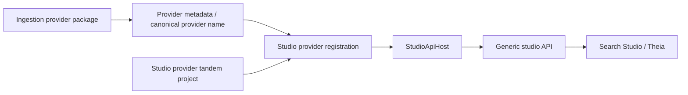

# Studio provider contracts and registration specification

**Target output path:** `docs/062-studio-provider/spec-architecture-studio-provider_v0.01.md`

- Work Package: `062-studio-provider`
- Version: `v0.01`
- Status: `Draft`
- Last updated: `2026-03-22`

## 1. Overview

### 1.1 Purpose

Introduce the shared Studio provider contract and registration model needed to let `StudioApiHost` compose provider-specific studio capabilities without taking a dependency on ingestion runtime services or embedding provider-specific knowledge in the host.

This work package establishes the project structure and registration model for Studio-side provider extensions so that future Search Studio APIs can remain generic while provider-specific behavior lives in tandem provider projects.

### 1.2 Scope

In scope:

- define the Studio-side provider abstraction and metadata coupling model
- define `UKHO.Search.ProviderModel` as the mandatory shared home for generic provider identity, metadata, catalog, and registration concerns for both ingestion and studio
- define the new project structure required for Studio provider contracts and provider-specific Studio implementations
- define the matching test project structure for the new Studio contracts and File Share Studio provider projects
- ensure all newly introduced projects are added to the solution `.slnx`
- define the refactor required to move any existing generic provider metadata/registration code to the new Provider Model project
- define how Studio providers are paired with existing ingestion providers through canonical provider identity
- define how `StudioApiHost` composes Studio provider registrations without provider-specific host logic
- define how the existing `StudioApiHost` `/providers` API must be amended to return full metadata for each provider
- define startup validation and registration rules needed to ensure Studio providers align with provider metadata
- define the required review and update scope for `wiki/`
- define the initial implementation boundary for this package as contracts and registration only

Out of scope:

- implementing concrete Studio operations such as `IndexAll`, `IndexOne`, or `IndexByContext`
- implementing provider-specific context enumeration or execution logic
- replacing `FileShareEmulator` or `RulesWorkbench` in this package
- adding provider-specific UI to Theia in this package
- deferring the move of generic provider metadata/registration concerns into `UKHO.Search.ProviderModel`

### 1.3 Stakeholders

- maintainers of `StudioApiHost`
- maintainers of Search Studio / Theia
- maintainers of ingestion provider packages
- maintainers of future Studio provider packages
- developers planning the retirement of `FileShareEmulator` and `RulesWorkbench`

### 1.4 Definitions

- **Studio provider**: a provider-specific Studio extension that supplies development-time capabilities to Search Studio through a generic host/API surface.
- **Ingestion provider**: the existing runtime ingestion provider abstraction used by ingestion hosts.
- **Tandem provider project**: a Studio provider project that pairs with a specific ingestion provider and shares the same canonical provider identity.
- **Canonical provider identity**: the provider name already defined through provider metadata, for example `file-share`.
- **Search Studio**: the focused generic development-time studio experience fronted by Theia and `StudioApiHost`.

## 2. System context

### 2.1 Current state

The solution now has:

- shared provider metadata and registration for ingestion providers
- metadata-only composition in `StudioApiHost`
- runtime composition and enablement validation in `IngestionServiceHost`
- a development-time `/providers` endpoint in `StudioApiHost`

However, there is not yet a Studio-side provider abstraction for exposing provider-specific Studio capabilities in a generic way.

Current gaps:

- provider-specific development-time logic would currently have no formal abstraction boundary
- the existing `/providers` endpoint returns only a minimal metadata shape rather than the full provider metadata needed by future Studio-side composition
- placing Studio behavior inside ingestion provider projects would mix production ingestion concerns with development-time tooling concerns
- placing provider-specific knowledge in `StudioApiHost` would pollute the host with concepts such as File Share database details, business units, or batch-specific terminology
- there is not yet a dedicated shared project for generic Studio provider contracts

### 2.2 Proposed state

A new Studio-side provider layer will be introduced with the following structure:

- `StudioApiHost` remains the Studio/API host
- a new shared Provider Model project defines provider identity and shared provider metadata contracts for both ingestion and Studio-side composition
- a new shared Studio project defines generic Studio provider contracts
- provider-specific Studio behavior lives in tandem provider projects
- Studio providers are coupled to ingestion providers through the canonical provider identity established by the shared Provider Model

For the initial package, the contracts and registration model are introduced and existing generic provider metadata/registration concerns are refactored into the new shared Provider Model. Provider-specific Studio functionality will be delivered in later work packages.

### 2.3 Assumptions

- `StudioApiHost` remains a development-time host and is not part of live production deployment
- Search Studio should eventually absorb capabilities currently found in `FileShareEmulator` and `RulesWorkbench`
- Studio host APIs must remain generic and must not encode provider-specific domain knowledge
- the new Provider Model is intended to become the shared source of truth for provider identity, metadata, catalogs, and registration across both ingestion and studio
- not every ingestion provider is required to expose Studio capabilities immediately, but any provider that does must use the Studio provider model defined here

### 2.4 Constraints

- `StudioApiHost` must not depend on ingestion runtime behavior
- provider-specific Studio logic must not be placed directly in `StudioApiHost`
- provider-specific Studio logic must not be forced into the ingestion provider project itself
- Studio provider registration and ingestion provider registration must align with the shared canonical provider metadata model in `UKHO.Search.ProviderModel`
- this package must stop at contracts and registration; functional Studio commands are deferred

## 3. Component / service design (high level)

### 3.1 Components

#### `UKHO.Search.ProviderModel`

A new shared project must be introduced at `src/UKHO.Search.ProviderModel` to hold provider-model contracts that are not ingestion-specific and can be shared by both ingestion-side and Studio-side components.

Target location:

- `src/UKHO.Search.ProviderModel`

Responsibilities:

- define the canonical provider identity contracts needed by both ingestion and Studio-side composition
- hold provider metadata, provider catalog, and generic provider registration abstractions that should no longer sit in ingestion-specific shared projects
- become the mandatory shared home for generic provider registration/metadata concerns across both ingestion and studio
- remain free of provider-specific logic

#### `UKHO.Search.Studio`

A new shared project must be introduced under `src/Studio` to hold generic Studio-side contracts and models.

Target location:

- `src/Studio/UKHO.Search.Studio`

Responsibilities:

- define `IStudioProvider`
- define generic request/response and descriptor models needed by Studio hosts
- define validation and registration abstractions for Studio providers
- remain free of provider-specific logic

#### `UKHO.Search.Studio.Providers.<Provider>`

A new tandem provider project pattern must be introduced for Studio-side provider implementations.

Initial reference project:

- `src/Providers/UKHO.Search.Studio.Providers.FileShare`

Responsibilities:

- implement the generic Studio provider contract for a specific provider
- register Studio provider metadata and services for that provider
- know provider-specific concepts internally without exposing them as host-level concepts

#### `StudioApiHost`

`StudioApiHost` must remain the composition root and API surface for Studio-side provider capabilities.

Responsibilities:

- compose Studio provider registrations
- validate Studio provider registrations against provider metadata
- expose only generic Studio API contracts
- amend the existing `/providers` endpoint so it returns the full provider metadata shape defined by the shared Provider Model

It must not contain provider-specific logic.

#### Matching test projects

Matching test projects must be introduced for the new Studio projects.

Required initial targets:

- `test/UKHO.Search.ProviderModel.Tests`
- `test/UKHO.Search.Studio.Tests`
- `test/UKHO.Search.Studio.Providers.FileShare.Tests`

The shared Provider Model and Studio projects must each have matching test projects, and the File Share Studio provider test project must align with the provider project under `src/Providers/` in the same way the ingestion provider test estate aligns with the existing ingestion provider project layout.

Where existing tests for generic provider metadata/registration behavior already exist in other test projects, they must be reviewed and moved into the matching Provider Model test project where appropriate.

All newly introduced production and test projects must be added to the repository solution `.slnx` as part of the work.

### 3.2 Data flows

### 3.3 Key decisions

1. **Studio contracts live in a dedicated Studio project.**
   They do not belong in `UKHO.Search.Ingestion`.

2. **Provider-specific Studio logic lives in tandem provider projects.**
   It does not belong in `StudioApiHost` and does not belong in ingestion provider projects.

3. **Coupling is by canonical provider identity, not by host-to-host dependency.**
   A Studio provider pairs with an ingestion provider by sharing the same provider name from provider metadata.

4. **This package is contracts-and-registration only.**
   Functional commands such as indexing operations are explicitly deferred.

## 4. Functional requirements

### FR1 - Introduce a dedicated shared Studio contracts project

A new project named `UKHO.Search.Studio` must be introduced under `src/Studio`.

It must contain the generic Studio provider contracts and supporting models needed by Studio hosts and provider-specific Studio implementations.

The package must also introduce the matching test project:

- `test/UKHO.Search.Studio.Tests`

The new project and its matching test project must both be added to the solution `.slnx`.

### FR1a - Introduce a dedicated shared Provider Model project

A new project named `UKHO.Search.ProviderModel` must be introduced at `src/UKHO.Search.ProviderModel`.

It must contain the shared provider-model contracts needed by both ingestion and Studio-side provider architecture, including the provider identity, metadata, catalog, and generic registration abstractions that should be neutral with respect to ingestion and Studio host concerns.

The package must also introduce the matching test project:

- `test/UKHO.Search.ProviderModel.Tests`

The new project and its matching test project must both be added to the solution `.slnx`.

### FR1b - Refactor existing generic provider metadata and registration code into `UKHO.Search.ProviderModel`

Any existing generic provider metadata, provider catalog, or generic provider registration code that currently lives in other shared projects must be refactored to use `UKHO.Search.ProviderModel` as the new shared home.

This refactor applies to both production code and tests.

The implementation must review existing tests for these generic concerns and move them to `test/UKHO.Search.ProviderModel.Tests` where appropriate so the matching test project becomes the canonical home for Provider Model coverage.

### FR2 - Introduce a generic Studio provider abstraction

The shared Studio contracts project must define a generic Studio provider abstraction, such as `IStudioProvider`.

This abstraction must be generic enough to support future provider-driven Studio capabilities without requiring `StudioApiHost` to know provider-specific terms.

### FR3 - Couple Studio providers to ingestion providers through canonical provider identity

Each Studio provider must expose the same canonical provider name as its paired ingestion provider.

This provider name must be matched through the shared provider model introduced by this package and must remain aligned with the canonical provider metadata direction established in work package `061`.

The shared Provider Model must become the source of truth for this generic identity alignment for both ingestion and studio.

### FR4 - Introduce tandem Studio provider project pattern

A provider-specific Studio project pattern must be introduced under `src/Providers/`.

Initial reference target:

- `src/Providers/UKHO.Search.Studio.Providers.FileShare`

The package must also introduce the matching provider test project:

- `test/UKHO.Search.Studio.Providers.FileShare.Tests`

This pattern must be the required way to implement provider-specific Studio capabilities.

The provider project and its matching test project must be added to the solution `.slnx`.

### FR5 - Keep `StudioApiHost` generic

`StudioApiHost` must only compose Studio providers and expose generic API contracts.

It must not directly contain:

- File Share database knowledge
- business unit concepts
- batch-specific domain terms
- other provider-specific operational knowledge

### FR5a - Amend the existing `StudioApiHost` `/providers` endpoint to return full provider metadata

The existing `StudioApiHost` `/providers` endpoint must be amended to return the full provider metadata for each provider rather than only a reduced subset.

The endpoint response must be driven from the shared Provider Model and must expose the complete metadata shape required by Search Studio for provider discovery and later Studio provider composition.

The endpoint must remain generic and must not embed provider-specific logic in the host.

### FR6 - Add Studio provider registration model

A registration model must be defined so that `StudioApiHost` can register Studio providers in a provider-agnostic way.

This model must support:

- metadata/descriptor registration for Studio providers
- implementation registration for Studio providers
- validation of duplicate names or mismatched provider identity

### FR7 - Add startup validation for Studio provider alignment

`StudioApiHost` must be able to validate that each registered Studio provider matches a known canonical provider identity from provider metadata.

Startup must fail when:

- a Studio provider has no matching provider metadata
- duplicate Studio provider identities are registered
- a Studio provider claims a provider name that does not match the known metadata model

### FR8 - Defer Studio functionality to later packages

This package must not implement provider functionality such as:

- `IndexOne`
- `IndexAll`
- `IndexByContext`
- provider-specific context discovery
- provider-specific execution behavior

This package only prepares the contract and registration layer required for those later capabilities.

### FR9 - Define Search Studio replacement direction

The documentation must explicitly state that the long-term direction is to consolidate development-time capabilities from `FileShareEmulator` and `RulesWorkbench` into Search Studio, while keeping the API generic and provider-driven.

### FR10 - Review and update the repository wiki

The implementation must include a review of the relevant `wiki/` pages and must update them where needed to reflect:

- the new `UKHO.Search.ProviderModel` project at `src/UKHO.Search.ProviderModel`
- the new `UKHO.Search.Studio` project
- the new tandem Studio provider project pattern under `src/Providers/`
- the matching `UKHO.Search.ProviderModel.Tests` project
- the matching Studio test projects
- the amended `StudioApiHost` `/providers` API contract returning full provider metadata
- the fact that generic provider metadata/registration concerns are now shared across both ingestion and studio through `UKHO.Search.ProviderModel`
- the relationship between Studio providers, ingestion providers, and canonical provider metadata
- the fact that this package introduces contracts and registration only, with functional Studio commands deferred

### FR11 - Thorough test coverage for the Provider Model

The new `UKHO.Search.ProviderModel` project must be thoroughly covered by automated tests in `test/UKHO.Search.ProviderModel.Tests`.

Coverage must include all new provider-model contracts, registration/validation behavior, identity-alignment behavior, duplicate detection, and any normalization or comparison semantics introduced by the Provider Model.

Coverage must also include refactored existing generic provider metadata/registration behavior that is moved into the Provider Model as part of this package.

The Provider Model is not complete unless its full implemented behavior is exercised by automated tests.

### FR12 - Add all new projects to the solution

Every new production or test project introduced by this package must be added to the repository solution `.slnx`.

This includes, at minimum:

- `UKHO.Search.ProviderModel`
- `UKHO.Search.ProviderModel.Tests`
- `UKHO.Search.Studio`
- `UKHO.Search.Studio.Tests`
- `UKHO.Search.Studio.Providers.FileShare`
- `UKHO.Search.Studio.Providers.FileShare.Tests`

## 5. Non-functional requirements

### NFR1 - Preserve onion architecture

The new Studio contracts and provider projects must follow the repository's onion architecture rules.

### NFR2 - No provider-specific host pollution

Provider-specific knowledge must remain isolated to provider-specific Studio projects.

### NFR3 - No runtime coupling to ingestion hosts

`StudioApiHost` must not depend on `IngestionServiceHost` at runtime.

### NFR4 - Extensibility

The Studio provider model must support additional providers without requiring `StudioApiHost` to add provider-specific code.

### NFR5 - Documentation clarity

The work package documentation must make it clear that the package delivers only the contract and registration layer, not the eventual provider operations.

### NFR6 - Test project parity

The new Studio contract and provider projects must have matching test projects created as part of the work, following the repository's project-aligned test layout.

### NFR7 - Provider Model test completeness

`UKHO.Search.ProviderModel` must have thorough automated test coverage in its dedicated matching test project.

Tests must cover happy-path behavior, edge cases, duplicate or invalid provider identity scenarios, and registration/validation behavior introduced by the Provider Model.

If existing generic provider metadata/registration tests currently live elsewhere, they must be reviewed and moved where appropriate so the Provider Model test project is the canonical home for those concerns.

### NFR8 - Solution integrity

The solution `.slnx` must be kept current with the project structure introduced by this package so that the new production and test projects are part of normal build and test workflows.

## 6. Data model

### 6.1 Studio provider contract

The shared Studio contract model must support at minimum:

| Concept | Purpose |
|---|---|
| `ProviderName` | Canonical provider identity matching ingestion/provider metadata. |
| Studio provider descriptor | Generic metadata for Studio-side provider exposure. |
| Registration model | Host composition and startup validation of Studio providers. |

### 6.1a Provider metadata shape for `/providers`

The shared Provider Model must define the full provider metadata shape returned by the existing `StudioApiHost` `/providers` endpoint.

The endpoint must return full provider metadata for each provider rather than a minimal subset.

At minimum, this metadata must include the canonical provider identity and any additional generic metadata defined by the shared Provider Model for provider discovery.

### 6.2 Identity alignment

The Studio provider identity must align with the provider metadata identity already defined for ingestion providers.

No separate Studio-only provider naming scheme may be introduced.

### 6.3 Provider Model ownership

The provider identity and shared provider metadata abstractions required by this package must live in `UKHO.Search.ProviderModel` at `src/UKHO.Search.ProviderModel`, not in the ingestion-specific shared project.

This includes generic provider descriptors, provider catalogs, and generic provider registration concerns used by both ingestion and studio.

## 7. Interfaces & integration

### 7.1 Project structure

The target structure for this package is:

- `src/UKHO.Search.ProviderModel`
- `src/Studio/UKHO.Search.Studio`
- `src/Providers/UKHO.Search.Studio.Providers.FileShare`
- existing `src/Studio/StudioApiHost`
- `test/UKHO.Search.ProviderModel.Tests`
- `test/UKHO.Search.Studio.Tests`
- `test/UKHO.Search.Studio.Providers.FileShare.Tests`

### 7.2 Host composition

`StudioApiHost` must depend on the shared Studio contracts project and provider-specific Studio tandem projects.

It must not require ingestion runtime services.

It must also use the shared Provider Model to shape the existing `/providers` response so that the API returns full provider metadata for each provider.

### 7.3 Provider metadata integration

Studio provider registration must integrate with the existing provider metadata and registration model from work package `061`.

That model remains the source of truth for canonical provider identity in this package.

## 8. Observability (logging/metrics/tracing)

- startup validation failures for Studio providers must be logged clearly
- duplicate or mismatched Studio provider registrations must be diagnosable from logs
- no special Studio provider metrics are required in this package

## 9. Security & compliance

- the Studio provider registration layer must not expose provider-specific operational details unless later functional packages explicitly require it
- this package must not introduce any new secret-handling or credential-flow behavior

## 10. Testing strategy

Testing for this package must cover:

1. Provider Model contracts, registration behavior, normalization, and duplicate detection
2. shared Studio contract registration
3. Studio provider registration and duplicate detection
4. alignment between Studio provider identity and provider metadata identity
5. the amended `StudioApiHost` `/providers` API returning full provider metadata for each provider
6. `StudioApiHost` composition using Studio providers without ingestion runtime dependencies
7. regression checks confirming the package stops at contracts/registration only

Existing generic provider metadata/registration tests must be reviewed and moved into `test/UKHO.Search.ProviderModel.Tests` where appropriate, with any missing coverage added so the refactored Provider Model behavior remains fully covered.

The package must create and use the matching Provider Model and Studio test projects rather than placing all new tests into unrelated existing test projects.

## 11. Rollout / migration

1. introduce `src/UKHO.Search.ProviderModel`
2. introduce `test/UKHO.Search.ProviderModel.Tests`
3. refactor existing generic provider metadata and registration code to use `UKHO.Search.ProviderModel`
4. review and move existing generic provider metadata/registration tests into `test/UKHO.Search.ProviderModel.Tests` where appropriate, adding missing coverage
5. introduce `src/Studio/UKHO.Search.Studio`
6. introduce `test/UKHO.Search.Studio.Tests`
7. introduce tandem Studio provider project structure for File Share under `src/Providers/`
8. introduce `test/UKHO.Search.Studio.Providers.FileShare.Tests`
9. wire `StudioApiHost` to compose Studio providers generically
10. validate Studio provider alignment against canonical provider metadata
11. review and update the relevant `wiki/` pages
12. add all newly introduced production and test projects to the solution `.slnx`
13. use later work packages to add actual provider-driven Studio operations
14. use later work packages to migrate `FileShareEmulator` and `RulesWorkbench` capabilities into Search Studio

## 12. Open questions

1. Should the Studio provider descriptor remain entirely separate from provider metadata, or should it wrap/reference provider metadata directly while adding Studio-specific fields?
2. When provider functionality is added later, should the generic Studio contract use command-style request objects, capability discovery, or both?
3. Should `RulesWorkbench` and `FileShareEmulator` retirement be handled provider-by-provider, or through a single broader migration work package?
