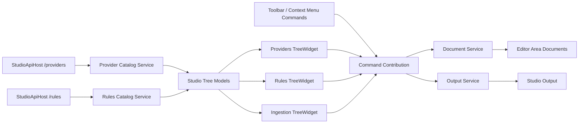

# Implementation Plan

**Target output path:** `docs/065-studio-tree-widget/plan-studio-tree-widget_v0.01.md`

**Based on:** `docs/065-studio-tree-widget/spec-studio-tree-widget_v0.01.md`

**Version:** `v0.01` (`Draft`)

---

## Slice 1 — Native Theia `Providers` tree as the first end-to-end vertical slice

- [ ] Work Item 1: Replace the custom `Providers` side-bar body with a native Theia tree while preserving provider overview and child-document opening
  - **Purpose**: Deliver the smallest meaningful end-to-end tree-widget slice by converting the existing `Providers` work area from boxed buttons to a native Theia tree, proving the technical approach before applying it to `Rules` and `Ingestion`.
  - **Acceptance Criteria**:
    - The `Providers` work area renders as a native Theia tree rather than a custom `ReactWidget` card/button layout.
    - Provider roots remain actionable and open provider overview editors.
    - `Queue` and `Dead letters` remain child nodes that open their existing placeholder documents.
    - The duplicate in-body `Providers` title is removed.
    - The visible `Refresh Providers` body button is removed.
    - Provider descriptions are no longer shown as persistent text in the side bar.
    - No custom CSS is added unless implementation reveals a clear functional issue.
  - **Definition of Done**:
    - Native `TreeWidget`-based `Providers` view implemented end to end.
    - Existing provider-loading and document-opening services reused successfully.
    - Selection, expansion, and open behaviour align with normal Theia tree conventions.
    - Unit coverage added for the provider tree-node model / mapping where required.
    - Manual verification path documented and runnable.
    - Documentation updated in the work package plan/spec if implementation details need alignment.
    - Can execute end to end via: Studio shell `Providers` navigation.
  - [ ] Task 1.1: Introduce the shared Theia tree foundation for Studio side-bar views
    - [ ] Step 1: Create the native Theia tree widget/container pattern for Studio using `TreeWidget`, `TreeModel`, and Studio-specific node contracts.
    - [ ] Step 2: Decide the minimal shared abstractions needed so `Providers`, `Rules`, and `Ingestion` can later reuse the same tree foundation without premature over-abstraction.
    - [ ] Step 3: Bind the new tree widget through the existing Theia frontend module and widget factory pattern.
    - [ ] Step 4: Keep the implementation frontend-only and avoid backend/API changes.
  - [ ] Task 1.2: Adapt provider metadata into native Theia tree nodes
    - [ ] Step 1: Map the existing provider catalog snapshot into provider root and child tree nodes suitable for `TreeWidget`.
    - [ ] Step 2: Preserve provider-root action routing to provider overview documents.
    - [ ] Step 3: Preserve child-node routing for `Queue` and `Dead letters`.
    - [ ] Step 4: Ensure tree node ids remain stable and unique.
  - [ ] Task 1.3: Remove obsolete body-level UI chrome from `Providers`
    - [ ] Step 1: Remove the duplicate in-body `Providers` heading and explanatory text that competes with the tree.
    - [ ] Step 2: Remove the visible `Refresh Providers` body affordance.
    - [ ] Step 3: Remove persistent provider description text from the side bar and confirm descriptions remain available in overview/editor surfaces.
    - [ ] Step 4: Preserve clear loading, empty, and error states without reverting to the old button-panel layout.
  - [ ] Task 1.4: Add targeted verification for the first tree slice
    - [ ] Step 1: Update or add unit tests for provider tree-node mapping and open-routing assumptions.
    - [ ] Step 2: Add manual smoke verification notes for provider root opening and child-node navigation.
    - [ ] Step 3: Confirm no custom CSS was introduced unless a concrete functional issue required it.
  - **Files**:
    - `src/Studio/Server/search-studio/src/browser/providers/*`: native provider tree widget, model, node types, and provider-view wiring.
    - `src/Studio/Server/search-studio/src/browser/common/*`: shared Studio tree abstractions if needed.
    - `src/Studio/Server/search-studio/src/browser/search-studio-frontend-module.ts`: widget and service bindings.
    - `src/Studio/Server/search-studio/src/browser/search-studio-constants.ts`: command ids / labels if tree-specific additions are needed.
    - `src/Studio/Server/search-studio/src/browser/api/search-studio-provider-catalog-service.ts`: reused provider-loading service, only if minor adaptation is required.
    - `src/Studio/Server/search-studio/test/*`: provider tree-node mapping / widget behaviour coverage.
  - **Work Item Dependencies**: Existing `064-studio-skeleton` implementation only.
  - **Run / Verification Instructions**:
    - `yarn --cwd .\src\Studio\Server build:browser`
    - `dotnet run --project .\src\Hosts\AppHost\AppHost.csproj`
    - Open `http://localhost:3000`
    - Open `Providers`
    - Verify the side bar is a native tree, provider roots open overview editors, and `Queue` / `Dead letters` still open correctly.
  - **User Instructions**: Use the normal local Studio prerequisites and run in `runmode=services`.

---

## Slice 2 — Native `Rules` tree with toolbar-style `New Rule` and consistent refresh action

- [ ] Work Item 2: Convert `Rules` to a native Theia tree and move work-area actions into the Theia toolbar pattern
  - **Purpose**: Deliver the second runnable slice by converting `Rules` to the same native tree model and proving the requested Explorer-style action pattern for `New Rule`, with any retained refresh using the same toolbar treatment.
  - **Acceptance Criteria**:
    - The `Rules` work area renders as a native Theia tree.
    - Provider roots, `Rule checker`, `Rules` grouping, and individual rule nodes remain available and open the correct existing placeholder editors.
    - `New Rule` is visible through a native Theia toolbar-style action with tooltip support, not as a body button.
    - Any visible refresh action in `Rules` uses the same toolbar pattern and tooltip behaviour.
    - Duplicate titles and persistent provider descriptions are removed from the side bar.
    - No body-level CTA buttons remain in the steady-state `Rules` view.
  - **Definition of Done**:
    - Native `Rules` tree implemented end to end.
    - Toolbar-style `New Rule` action implemented and wired to the existing command.
    - Optional toolbar refresh action, if retained, implemented consistently.
    - Existing `/rules` discovery and editor-opening flow preserved.
    - Unit/manual verification added for toolbar action routing and tree grouping.
    - Can execute end to end via: Studio shell `Rules` navigation with toolbar actions.
  - [ ] Task 2.1: Adapt rules data into native Theia tree nodes
    - [ ] Step 1: Reuse the shared Studio tree foundation from Slice 1.
    - [ ] Step 2: Map provider roots, `Rule checker`, the `Rules` grouping node, and rule nodes into Theia tree node contracts.
    - [ ] Step 3: Preserve existing rules overview, checker, existing-rule, and new-rule document opening behaviour.
    - [ ] Step 4: Preserve useful node badges/labels only if they fit the native tree without custom styling.
  - [ ] Task 2.2: Implement the toolbar-style action surface for `Rules`
    - [ ] Step 1: Research and wire the closest native Theia side-bar toolbar mechanism used by Explorer-like views.
    - [ ] Step 2: Expose `New Rule` through that toolbar mechanism with tooltip text.
    - [ ] Step 3: If `Refresh Rules` remains visible, expose it in the same toolbar pattern with matching emphasis and tooltip behaviour.
    - [ ] Step 4: Remove any remaining body-level buttons for `Rules`.
  - [ ] Task 2.3: Preserve context menu and command continuity
    - [ ] Step 1: Keep `New Rule` available through existing context menu and command palette paths.
    - [ ] Step 2: Ensure toolbar actions resolve the correct current provider context.
    - [ ] Step 3: Confirm the `Rules` tree still supports right-click behaviour on the relevant nodes.
  - [ ] Task 2.4: Add targeted verification for `Rules`
    - [ ] Step 1: Add or update tests for rules grouping and provider-target resolution.
    - [ ] Step 2: Add verification for toolbar action presence, tooltip expectation, and action routing.
    - [ ] Step 3: Confirm no provider descriptions or duplicate titles remain in the steady-state `Rules` side bar.
  - **Files**:
    - `src/Studio/Server/search-studio/src/browser/rules/*`: native rules tree widget, model, node types, and toolbar wiring.
    - `src/Studio/Server/search-studio/src/browser/search-studio-command-contribution.ts`: reuse existing `New Rule` / refresh commands.
    - `src/Studio/Server/search-studio/src/browser/search-studio-menu-contribution.ts`: menu/toolbar integration updates.
    - `src/Studio/Server/search-studio/src/browser/common/*`: shared tree and action abstractions.
    - `src/Studio/Server/search-studio/test/*`: rules tree / provider targeting / toolbar verification coverage.
  - **Work Item Dependencies**: Work Item 1.
  - **Run / Verification Instructions**:
    - `yarn --cwd .\src\Studio\Server build:browser`
    - `dotnet run --project .\src\Hosts\AppHost\AppHost.csproj`
    - Open `http://localhost:3000`
    - Open `Rules`
    - Verify the native tree shape, open a provider root, `Rule checker`, and a rule node, then invoke `New Rule` from the toolbar.
  - **User Instructions**: Keep representative rules configured so `/rules` returns useful live data.

---

## Slice 3 — Native `Ingestion` tree with consistent toolbar-style refresh

- [ ] Work Item 3: Convert `Ingestion` to a native Theia tree and align visible actions with the shared toolbar pattern
  - **Purpose**: Deliver the third runnable slice by converting `Ingestion` to the same native tree approach, preserving provider overview and ingestion-mode navigation while proving action-pattern consistency across all three work areas.
  - **Acceptance Criteria**:
    - The `Ingestion` work area renders as a native Theia tree.
    - Provider roots remain actionable and open ingestion overview documents.
    - `By id`, `All unindexed`, and `By context` remain child nodes and open the correct placeholder editors.
    - Any visible refresh action in `Ingestion` uses the same toolbar-style pattern and tooltip treatment as `Rules`.
    - Duplicate titles and persistent provider descriptions are removed from the side bar.
    - The work area no longer reads as boxed buttons or nested panels.
  - **Definition of Done**:
    - Native `Ingestion` tree implemented end to end.
    - Toolbar-style refresh action added if retained.
    - Existing ingestion overview and mode-document flows preserved.
    - Shared provider context and output logging continue to work.
    - Verification added for navigation and toolbar consistency.
    - Can execute end to end via: Studio shell `Ingestion` navigation.
  - [ ] Task 3.1: Adapt ingestion navigation into native Theia tree nodes
    - [ ] Step 1: Reuse the shared Studio tree foundation from Slice 1.
    - [ ] Step 2: Map provider roots and the three ingestion modes into Theia tree nodes.
    - [ ] Step 3: Preserve existing provider overview and ingestion-mode document opening behaviour.
    - [ ] Step 4: Ensure the tree remains compact, with no persistent provider descriptions.
  - [ ] Task 3.2: Align visible actions with the Studio toolbar pattern
    - [ ] Step 1: If refresh remains visible, expose it via the same side-bar toolbar mechanism used in `Rules`.
    - [ ] Step 2: Remove any body-level refresh button or other side-bar CTA chrome.
    - [ ] Step 3: Ensure tooltip support and visual emphasis match the shared Studio action pattern.
  - [ ] Task 3.3: Preserve diagnostics and placeholder behaviour
    - [ ] Step 1: Confirm navigation and placeholder actions still log sensibly to `Studio Output`.
    - [ ] Step 2: Keep ingestion placeholder semantics explicit and unchanged.
    - [ ] Step 3: Ensure loading, empty, and error states still read clearly in the new tree presentation.
  - [ ] Task 3.4: Add targeted verification for `Ingestion`
    - [ ] Step 1: Update ingestion mapping tests if the node contracts change.
    - [ ] Step 2: Add manual verification for provider overview and each ingestion mode.
    - [ ] Step 3: Verify toolbar consistency against the `Rules` implementation.
  - **Files**:
    - `src/Studio/Server/search-studio/src/browser/ingestion/*`: native ingestion tree widget, model, node types, and toolbar integration.
    - `src/Studio/Server/search-studio/src/browser/common/*`: shared Studio tree/action abstractions.
    - `src/Studio/Server/search-studio/src/browser/panel/*`: only if minor logging adjustments are required.
    - `src/Studio/Server/search-studio/test/*`: ingestion tree / mode mapping / verification coverage.
  - **Work Item Dependencies**: Work Item 1.
  - **Run / Verification Instructions**:
    - `yarn --cwd .\src\Studio\Server build:browser`
    - `dotnet run --project .\src\Hosts\AppHost\AppHost.csproj`
    - Open `http://localhost:3000`
    - Open `Ingestion`
    - Verify provider roots and all three ingestion modes render as a native tree and open the existing placeholder editors.
  - **User Instructions**: None beyond the normal Studio shell startup prerequisites.

---

## Slice 4 — Cross-work-area consistency, restraint on styling, and review-ready finish

- [ ] Work Item 4: Harmonize the three converted work areas and confirm native-first delivery without premature CSS polish
  - **Purpose**: Turn the three converted trees into one coherent review-ready Studio navigation experience, ensuring placement, behaviour, and chrome are consistent and that custom styling remains deferred unless genuinely needed.
  - **Acceptance Criteria**:
    - `Providers`, `Rules`, and `Ingestion` all use the same native-tree interaction model.
    - Toolbar actions across work areas use one consistent placement, emphasis, and tooltip pattern.
    - Duplicate in-body titles, persistent provider descriptions, and body-level CTA buttons are absent across all three work areas.
    - Custom CSS is either absent or explicitly justified by a clear functional/usability issue.
    - The shell is suitable for stakeholder review of look and feel.
  - **Definition of Done**:
    - Cross-work-area consistency review completed in code and docs.
    - Any remaining native-tree gaps documented clearly for later follow-up.
    - Manual smoke path updated for the new tree-widget baseline.
    - Wiki note added or updated after implementation if the accepted baseline changes materially.
    - Can execute end to end via: full Studio shell walkthrough across all three work areas.
  - [ ] Task 4.1: Standardize shared behaviour and terminology
    - [ ] Step 1: Confirm open, select, expand, and context-menu behaviour are consistent across the three work areas.
    - [ ] Step 2: Confirm labels, captions, and action tooltips use consistent Studio terminology.
    - [ ] Step 3: Confirm provider-root actionability remains intact everywhere.
  - [ ] Task 4.2: Review styling restraint and document any exceptions
    - [ ] Step 1: Confirm the implementation still follows native-first rendering.
    - [ ] Step 2: If any custom CSS was required, document the exact functional reason and keep the scope minimal.
    - [ ] Step 3: Defer minor polish-only tweaks for future review rather than folding them into this work item without evidence.
  - [ ] Task 4.3: Complete verification and documentation
    - [ ] Step 1: Update the manual smoke path in the work package and wiki as needed.
    - [ ] Step 2: Run the full cross-work-area verification path.
    - [ ] Step 3: Record any residual tidy-up candidates as follow-up notes rather than expanding scope.
  - **Files**:
    - `docs/065-studio-tree-widget/spec-studio-tree-widget_v0.01.md`: only if implementation evidence requires clarifying the accepted baseline.
    - `wiki/Tools-UKHO-Search-Studio.md`: update the Studio shell guidance after implementation if the accepted baseline changes.
    - `src/Studio/Server/search-studio/src/browser/common/*`: any final shared behaviour adjustments.
    - `src/Studio/Server/search-studio/test/*`: smoke-oriented coverage or verification notes.
  - **Work Item Dependencies**: Work Items 1, 2, and 3.
  - **Run / Verification Instructions**:
    - `yarn --cwd .\src\Studio\Server build:browser`
    - `dotnet run --project .\src\Hosts\AppHost\AppHost.csproj`
    - Open `http://localhost:3000`
    - Walk through `Providers`, `Rules`, and `Ingestion` and confirm the full native-tree experience is coherent and review-ready.
  - **User Instructions**: Review the finished UI before requesting any tidy-up-only styling changes.

---

## Overall approach and key considerations

- This plan uses four vertical slices so each step leaves the Studio shell runnable and demoable.
- The first slice proves the native `TreeWidget` approach in `Providers` before applying it to more complex work areas.
- `Rules` is the first slice to prove the requested Theia Explorer-style toolbar action pattern via `New Rule`.
- `Ingestion` then validates that the same tree and toolbar pattern can be applied consistently outside `Rules`.
- The final slice is intentionally restrained: it harmonizes behaviour and documentation, but it avoids speculative CSS polish unless a concrete usability issue is found.
- Existing backend APIs remain unchanged; this is a frontend-led shell-composition change.
- Existing document-opening flows, output logging, and provider-selection patterns should be reused rather than rebuilt.
- Testing should stay targeted: node mapping, provider/rule/ingestion routing, toolbar action targeting, and manual smoke verification for the full look-and-feel review.

---

# Architecture

## Overall Technical Approach

- The work remains a native Theia extension change within `src/Studio/Server/search-studio`.
- The implementation is frontend-led and should reuse existing browser-side services for provider loading, rules loading, selection state, document opening, command routing, and output logging.
- The main architectural shift is from custom `ReactWidget` body composition to native Theia tree infrastructure for the three side-bar work areas.
- The preferred pattern is:
  - native `TreeWidget` for hierarchical navigation
  - native Theia side-bar toolbar mechanism for lightweight work-area actions
  - existing command contributions for action execution
  - existing document services for editor opening
- No backend contract change is planned. Existing `GET /providers` and `GET /rules` remain the live data sources.

## Frontend

- Frontend scope is the Theia browser-side Studio extension under `src/Studio/Server/search-studio/src/browser`.
- Key responsibilities:
  - define Studio-specific tree node contracts and tree models
  - render `Providers`, `Rules`, and `Ingestion` as native trees
  - contribute toolbar-style actions for `Rules` and optionally `Ingestion`
  - route node-open and command events into the existing document service
  - preserve output logging and selection context
- Main frontend areas:
  - `src/Studio/Server/search-studio/src/browser/providers/*`
    - native `Providers` tree widget, model, and node mapping
  - `src/Studio/Server/search-studio/src/browser/rules/*`
    - native `Rules` tree widget, grouped rule nodes, toolbar action integration
  - `src/Studio/Server/search-studio/src/browser/ingestion/*`
    - native `Ingestion` tree widget and mode-node navigation
  - `src/Studio/Server/search-studio/src/browser/common/*`
    - shared tree abstractions, provider-selection reuse, document routing helpers
  - `src/Studio/Server/search-studio/src/browser/search-studio-frontend-module.ts`
    - dependency injection and widget binding
  - `src/Studio/Server/search-studio/src/browser/search-studio-command-contribution.ts`
    - action execution reused by toolbar, menus, and context menus
  - `src/Studio/Server/search-studio/src/browser/search-studio-menu-contribution.ts`
    - menu / toolbar contributions where required
- User flow:
  - user opens a work area in the activity bar
  - side bar shows a native tree
  - user opens a node or invokes a toolbar action
  - command/document services open or create the existing editor-area document
  - output service records meaningful navigation or placeholder events

## Backend

- No new backend components are planned for this work package.
- Existing backend/data flow remains unchanged:
  - `StudioApiHost /providers` supplies provider metadata
  - `StudioApiHost /rules` supplies rule discovery metadata
- Backend responsibilities remain:
  - serve stable provider and rule metadata
  - remain the source of truth for navigation data
- The work package should not introduce new APIs, persistence, or server-side logic.
- If implementation reveals a genuine backend dependency, it should be treated as out of scope unless separately approved, because this work package is about side-bar look and feel rather than feature expansion.
