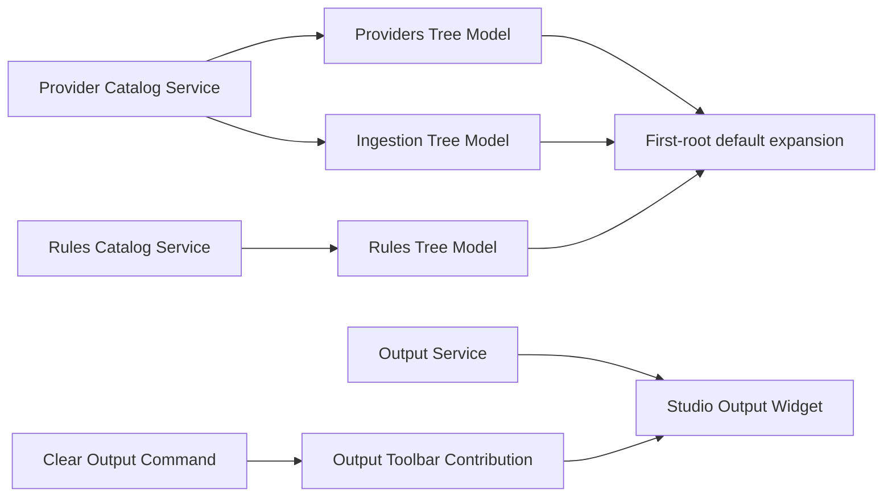

# Implementation Plan

**Target output path:** `docs/066-studio-minor-ux/plan-studio-minor-ux_v0.01.md`

**Based on:** `docs/066-studio-minor-ux/spec-studio-minor-ux_v0.01.md`

**Version:** `v0.01` (`Draft`)

---

## Slice 1 — First-root expansion in `Providers` as the proving vertical slice

- [x] Work Item 1: Add deterministic first-root default expansion to the `Providers` tree without overriding later user choices - Completed
  - Summary: Added a shared top-level expansion-state helper, wired the `Providers` tree model to auto-expand only the first top-level provider on first population, preserved later user-driven collapse/expand state across rebuilds, and added focused node-based tests plus successful frontend/browser/solution builds.
  - **Purpose**: Deliver the smallest runnable UX uplift by proving the first-top-level-node expansion pattern in one live Studio tree before applying it to `Rules` and `Ingestion`.
  - **Acceptance Criteria**:
    - The `Providers` tree automatically expands the first visible top-level provider node when the tree is first populated.
    - No other top-level provider nodes are auto-expanded by default.
    - Manual collapse or expansion after first render is respected during routine rerender and refresh.
    - Empty, loading, and error tree states do not throw and do not attempt invalid expansion.
  - **Definition of Done**:
    - Default-expansion logic implemented in the tree-model path used by `Providers`.
    - First-render and user-state rules covered by focused frontend tests.
    - No backend/API changes introduced.
    - Logging and error handling remain low-noise and unchanged in behaviour.
    - Documentation updated if implementation details require clarification.
    - Can execute end to end via: Studio shell `Providers` navigation.
  - [x] Task 1.1: Identify the correct tree-model lifecycle point for initial expansion - Completed
    - Summary: Confirmed the `rebuildTree()` path is the correct lifecycle hook because it already rebuilds the root and re-synchronizes selection, and chose a small shared helper so expansion behaviour stays reusable for later tree work without over-abstracting the model.
    - [x] Step 1: Review `SearchStudioProviderTreeModel` rebuild and selection flow. - Completed
      - Summary: Reviewed the existing model flow and confirmed `rebuildTree()` is the point where provider selection sync, root replacement, and post-load refresh already converge.
    - [x] Step 2: Decide whether expansion belongs directly in the model, in a shared helper, or in a shared base tree abstraction. - Completed
      - Summary: Implemented the expansion rules in a small shared helper under `common/` so the model stays focused on provider concerns while later work items can reuse the same top-level expansion semantics.
    - [x] Step 3: Ensure the chosen hook runs after the root is assigned and before user interaction begins. - Completed
      - Summary: Applied and synchronized top-level expansion state during rebuild immediately before the new root is assigned, ensuring the first render already contains the intended expansion state.
  - [x] Task 1.2: Implement first-root-only default expansion for `Providers` - Completed
    - Summary: Added top-level expansion-state synchronization into the `Providers` tree model so the first provider root expands by default, all other top-level roots remain collapsed, status-only trees are ignored safely, and provider-selection behaviour remains unchanged.
    - [x] Step 1: Expand the first visible top-level provider node after initial tree population. - Completed
      - Summary: Defaulted the first expandable top-level provider node to `expanded = true` when no prior top-level state exists.
    - [x] Step 2: Keep all remaining top-level provider nodes collapsed. - Completed
      - Summary: Explicitly synchronized all other top-level provider roots to `expanded = false` during the default-first-load path.
    - [x] Step 3: Make the logic a no-op when the tree has no provider roots. - Completed
      - Summary: Status-only and empty trees now clear stale top-level expansion state and skip expansion safely.
    - [x] Step 4: Preserve the existing selected-provider synchronization behaviour. - Completed
      - Summary: Kept the existing provider-selection service flow intact so selection and overview-opening semantics were unaffected by the expansion uplift.
  - [x] Task 1.3: Prevent reapplication from fighting user intent - Completed
    - Summary: Persisted top-level expansion state in the model and updated it from expansion-change events so later refreshes respect the user’s current top-level collapse/expand choices instead of broad re-defaulting.
    - [x] Step 1: Introduce lightweight local state to distinguish initial default expansion from later user-established state. - Completed
      - Summary: Added a lightweight `_topLevelExpansionState` map in `SearchStudioProviderTreeModel` and synchronized it from rebuilt roots and top-level expansion events.
    - [x] Step 2: Ensure manual collapse of the first provider root is not undone by routine rerender. - Completed
      - Summary: Expansion-change events now update stored top-level state so collapsing the first provider root is preserved across subsequent tree rebuilds.
    - [x] Step 3: Ensure routine provider refresh uses current state instead of broad reset semantics unless the view instance is recreated. - Completed
      - Summary: Rebuild now reapplies stored top-level expansion state when present, so routine provider refresh keeps the current tree posture unless the widget/model is recreated from scratch.
  - [x] Task 1.4: Add targeted verification for the first tree slice - Completed
    - Summary: Added focused node tests for default first-root expansion, preserved user-driven top-level state, ignored child/status scenarios, and documented a manual smoke path via the work-item verification steps.
    - [x] Step 1: Add tests covering initial first-root expansion. - Completed
      - Summary: Added `search-studio-top-level-expansion-state.test.js` coverage proving the first top-level provider expands on initial synchronization.
    - [x] Step 2: Add tests confirming only one top-level node is auto-expanded. - Completed
      - Summary: Added assertions confirming only the first top-level provider root is expanded by default while later roots stay collapsed.
    - [x] Step 3: Add tests confirming empty-tree and status-node states do not break the model. - Completed
      - Summary: Added status-only coverage proving the helper safely no-ops and clears stale state when no expandable provider roots exist.
    - [x] Step 4: Add manual smoke notes for opening Studio, navigating to `Providers`, and confirming first-root-only expansion. - Completed
      - Summary: Manual smoke path: build the search-studio package and browser bundle, run the AppHost, open `Providers`, confirm only the first provider root is expanded on first load, collapse it manually, trigger a provider refresh, and verify the collapsed state is preserved.
  - **Files**:
    - `src/Studio/Server/search-studio/src/browser/providers/search-studio-provider-tree-model.ts`: add initial expansion coordination for the `Providers` tree.
    - `src/Studio/Server/search-studio/src/browser/providers/search-studio-provider-tree-mapper.ts`: only if helper metadata or top-level-node access needs small adaptation.
    - `src/Studio/Server/search-studio/src/browser/common/*`: shared helper only if reuse is clear and minimal.
    - `src/Studio/Server/search-studio/test/*`: provider-tree model coverage for first-root expansion semantics.
  - **Work Item Dependencies**: Existing `065-studio-tree-widget` implementation only.
  - **Run / Verification Instructions**:
    - `yarn --cwd .\src\Studio\Server\search-studio build`
    - `node --test .\src\Studio\Server\search-studio\test`
    - `yarn --cwd .\src\Studio\Server build:browser`
    - `dotnet run --project .\src\Hosts\AppHost\AppHost.csproj`
    - Open the Studio shell and verify `Providers` expands only the first visible provider root on first load.
  - **User Instructions**: Run Studio with the normal local prerequisites and ensure provider data is available from the existing Studio API host.

---

## Slice 2 — Complete first-root expansion across `Rules` and `Ingestion`

- [x] Work Item 2: Apply the same first-root default expansion semantics to `Rules` and `Ingestion` - Completed
  - Summary: Reused the shared top-level expansion-state helper in the `Rules` and `Ingestion` tree models, preserved user-driven top-level collapse/expand choices across rebuilds in both work areas, added focused cross-tree expansion tests, and verified the frontend/browser/solution builds successfully.
  - **Purpose**: Extend the proven tree behaviour across all three Studio navigation views so the shell feels consistent and the specification is met completely.
  - **Acceptance Criteria**:
    - The `Rules` tree expands only its first visible top-level provider root on first population.
    - The `Ingestion` tree expands only its first visible top-level provider root on first population.
    - `Rules` and `Ingestion` preserve their existing provider selection, overview opening, and child-node navigation behaviour.
    - The same user-state protection used in `Providers` is applied consistently in `Rules` and `Ingestion`.
  - **Definition of Done**:
    - First-root default expansion implemented across all three Studio trees.
    - Shared behaviour is consistent and does not introduce duplicated fragile logic where a small shared helper is sufficient.
    - Focused tests cover both additional trees and cross-tree consistency.
    - Manual verification path documented for `Rules` and `Ingestion`.
    - Can execute end to end via: Studio shell `Rules` and `Ingestion` navigation.
  - [x] Task 2.1: Reuse or extract the shared first-root expansion pattern - Completed
    - Summary: Confirmed the existing shared top-level expansion helper already fit the `Rules` and `Ingestion` tree shapes, then reused it directly so the work stayed small and the tree-specific selection/opening flows remained unchanged.
    - [x] Step 1: Review differences between `SearchStudioProviderTreeModel`, `SearchStudioRulesTreeModel`, and `SearchStudioIngestionTreeModel`. - Completed
      - Summary: Reviewed the three models and confirmed they share the same `rebuildTree()` and provider-selection synchronization pattern, differing mainly in root mapper and node-id conventions.
    - [x] Step 2: Extract a small shared helper if it reduces duplication without obscuring the tree-specific flow. - Completed
      - Summary: Reused the already-extracted `search-studio-top-level-expansion-state` helper rather than duplicating first-root expansion logic in the `Rules` and `Ingestion` models.
    - [x] Step 3: Keep provider-selection synchronization and node-specific routing unchanged. - Completed
      - Summary: Left the existing provider-selection and node-routing logic untouched so only top-level expansion state changed in this slice.
  - [x] Task 2.2: Implement `Rules` first-root expansion - Completed
    - Summary: Wired the `Rules` tree model to synchronize top-level expansion state during rebuilds and remember later user-driven top-level expansion changes from expansion events.
    - [x] Step 1: Apply first-root-only expansion after the `Rules` tree root is rebuilt. - Completed
      - Summary: The `Rules` model now applies the shared first-root expansion-state synchronization before assigning the rebuilt rules tree root.
    - [x] Step 2: Confirm the first provider root expands while `Rule checker`, `Rules`, and rule child nodes continue to behave normally. - Completed
      - Summary: The shared helper only targets top-level provider roots, so nested `Rule checker`, `Rules`, and rule nodes continue to use their normal expansion and open behaviour.
    - [x] Step 3: Ensure later user collapse/expand choices are preserved during routine rules refresh. - Completed
      - Summary: Expansion-change events now persist top-level rules-tree state so later refreshes respect the user’s current root posture.
  - [x] Task 2.3: Implement `Ingestion` first-root expansion - Completed
    - Summary: Wired the `Ingestion` tree model to synchronize top-level expansion state during rebuilds and remember later user-driven top-level expansion changes from expansion events.
    - [x] Step 1: Apply first-root-only expansion after the `Ingestion` tree root is rebuilt. - Completed
      - Summary: The `Ingestion` model now applies the shared first-root expansion-state synchronization before assigning the rebuilt ingestion tree root.
    - [x] Step 2: Confirm the first provider root expands while `By id`, `All unindexed`, and `By context` remain normal child navigation targets. - Completed
      - Summary: The shared helper only targets top-level provider roots, so ingestion mode nodes remain unaffected beyond being visible under the first expanded provider.
    - [x] Step 3: Ensure later user collapse/expand choices are preserved during routine provider refresh. - Completed
      - Summary: Expansion-change events now persist top-level ingestion-tree state so provider refresh does not re-open roots the user has collapsed.
  - [x] Task 2.4: Add cross-tree verification - Completed
    - Summary: Extended the shared top-level expansion-state tests to cover `Rules` and `Ingestion`, confirmed first-root-only semantics in both trees, and documented a consistent manual smoke path across all three work areas.
    - [x] Step 1: Add tests covering first-root expansion in `Rules`. - Completed
      - Summary: Added rules-tree coverage proving the first top-level rules provider root expands while later roots remain collapsed.
    - [x] Step 2: Add tests covering first-root expansion in `Ingestion`. - Completed
      - Summary: Added ingestion-tree coverage proving the first top-level ingestion provider root expands while later roots remain collapsed.
    - [x] Step 3: Add focused coverage confirming only one top-level root expands in each tree. - Completed
      - Summary: The updated shared expansion-state test suite now asserts single-root default expansion across providers, rules, and ingestion trees.
    - [x] Step 4: Add manual smoke notes for switching across all three work areas and verifying consistent behaviour. - Completed
      - Summary: Manual smoke path: build the search-studio package and browser bundle, run the AppHost, open `Providers`, `Rules`, and `Ingestion` in turn, verify only the first provider root auto-expands in each view, then manually collapse or expand a root and confirm a refresh preserves that top-level state.
  - **Files**:
    - `src/Studio/Server/search-studio/src/browser/rules/search-studio-rules-tree-model.ts`: add initial expansion coordination for the `Rules` tree.
    - `src/Studio/Server/search-studio/src/browser/ingestion/search-studio-ingestion-tree-model.ts`: add initial expansion coordination for the `Ingestion` tree.
    - `src/Studio/Server/search-studio/src/browser/common/*`: shared first-root expansion helper if warranted.
    - `src/Studio/Server/search-studio/test/*`: rules and ingestion tree-model coverage plus any shared helper tests.
  - **Work Item Dependencies**: Work Item 1.
  - **Run / Verification Instructions**:
    - `yarn --cwd .\src\Studio\Server\search-studio build`
    - `node --test .\src\Studio\Server\search-studio\test`
    - `yarn --cwd .\src\Studio\Server build:browser`
    - `dotnet run --project .\src\Hosts\AppHost\AppHost.csproj`
    - Open `Rules` and `Ingestion` and verify only the first visible provider root auto-expands in each tree.
  - **User Instructions**: Keep representative provider and rules data configured so the trees contain multiple top-level roots for verification.

---

## Slice 3 — Dense, log-like `Studio Output` with toolbar-based `Clear output`

- [x] Work Item 3: Restyle `Studio Output` into a denser log stream and move `Clear output` into a native toolbar action - Completed
  - Summary: Reworked the `Studio Output` widget into a compact log-style panel, removed the body-level clear button and header chrome, added a native output toolbar contribution with `Clear output` tooltip support, added focused toolbar and clear-service tests, and verified frontend/browser/solution builds successfully.
  - **Purpose**: Deliver the second requested UX uplift end to end by making Studio output faster to scan and aligning the clear command with the toolbar language already used in the tree views.
  - **Acceptance Criteria**:
    - `Studio Output` renders entries in a denser, more log-like layout with reduced vertical spacing.
    - The output surface remains readable in the active theme and still distinguishes adjacent entries clearly.
    - The body-level `Clear output` button is removed.
    - `Clear output` is available as a toolbar-style action with tooltip support.
    - Invoking the toolbar action clears visible output entries successfully.
  - **Definition of Done**:
    - Output widget layout updated to a compact log-oriented presentation.
    - Toolbar contribution added and wired to the existing clear-output command.
    - Existing output service and command pipeline reused with no backend changes.
    - Focused frontend tests or widget-level verification added for toolbar registration and clear behaviour.
    - Manual verification path documented and runnable.
    - Can execute end to end via: Studio shell bottom output panel.
  - [x] Task 3.1: Replace spacious output card rendering with compact log-row rendering - Completed
    - Summary: Simplified the output widget body to a dense log-style panel with compact rows, monospace-oriented rendering, and subdued metadata/error treatment instead of card-like entry containers and body-level chrome.
    - [x] Step 1: Review the current `SearchStudioOutputWidget` layout and remove large body header chrome that is no longer needed. - Completed
      - Summary: Removed the in-body title, descriptive placeholder copy, and clear button so the output view now uses the panel chrome and toolbar instead of duplicating it in the body.
    - [x] Step 2: Render output entries using tighter spacing and a structure closer to conventional log rows. - Completed
      - Summary: Replaced padded article cards with compact grid-based log rows that place timestamp, level, source, and message on a denser single-row-oriented layout.
    - [x] Step 3: Consider monospace styling for metadata/message alignment if it improves log readability without harming theme fit. - Completed
      - Summary: Applied the editor-font-family with a UI-font fallback so output reads more like log/console content while remaining theme-respecting.
    - [x] Step 4: Preserve clear visual distinction for error entries using low-noise theme-respecting treatment. - Completed
      - Summary: Kept error emphasis lightweight by coloring only the level token with the theme error foreground instead of using heavy card borders or backgrounds.
  - [x] Task 3.2: Move `Clear output` into the output view toolbar - Completed
    - Summary: Added a dedicated output toolbar contribution using the same Theia tab-bar toolbar mechanism as the Studio tree views and removed the widget-body clear button.
    - [x] Step 1: Implement a dedicated output toolbar contribution using the same Theia tab-bar toolbar mechanism already used by `Rules` and `Ingestion`. - Completed
      - Summary: Added `SearchStudioOutputToolbarContribution` under `panel/` and registered it in the frontend module as a `TabBarToolbarContribution`.
    - [x] Step 2: Register a `Clear output` toolbar item with icon-first presentation and tooltip support. - Completed
      - Summary: Registered a `codicon-clear-all` toolbar action visible only for the output widget with the tooltip text `Clear output`.
    - [x] Step 3: Reuse the existing `SearchStudioClearOutputCommand` rather than introducing a duplicate command path. - Completed
      - Summary: The toolbar action reuses the existing clear-output command id and command contribution behaviour unchanged.
    - [x] Step 4: Remove the body-level `theia-button` clear action from the widget render path. - Completed
      - Summary: Removed the command button and its `CommandRegistry` dependency from `SearchStudioOutputWidget`.
  - [x] Task 3.3: Preserve output behaviour and empty-state clarity - Completed
    - Summary: Kept the existing output service and render order intact while ensuring the empty state remains concise and the view still updates immediately when output is cleared.
    - [x] Step 1: Keep chronological output rendering unchanged apart from layout density. - Completed
      - Summary: Left the existing output entry collection/render order unchanged and limited the widget changes to layout, spacing, and styling.
    - [x] Step 2: Ensure the empty state remains concise and readable after the body-button/header removal. - Completed
      - Summary: Kept a short empty-state message within the compact log panel using subdued description foreground styling.
    - [x] Step 3: Confirm clearing output updates the widget immediately through the existing output-service change events. - Completed
      - Summary: Retained the existing output-service event subscription in the widget and added a focused service test proving `clear()` empties entries and raises change events.
  - [x] Task 3.4: Add targeted verification for the output uplift - Completed
    - Summary: Added focused toolbar and output-service tests, verified browser/frontend/solution builds, and documented a manual smoke path for producing and clearing output from the toolbar.
    - [x] Step 1: Add test coverage for toolbar contribution registration and tooltip text. - Completed
      - Summary: Added `search-studio-output-toolbar-contribution.test.js` coverage proving the toolbar action registers with the expected command id, tooltip text, and widget visibility scope.
    - [x] Step 2: Add focused verification that the clear command still empties the output view. - Completed
      - Summary: Added `search-studio-output-service.test.js` coverage proving `clear()` removes entries and raises output change events.
    - [x] Step 3: Add manual smoke notes for producing output, reviewing density, and clearing from the toolbar. - Completed
      - Summary: Manual smoke path: build the search-studio package and browser bundle, run the AppHost, trigger a few provider/rules/ingestion actions that emit output, open `Studio Output`, confirm the denser log-style rendering, then click the toolbar clear action and verify the output empties immediately.
    - [x] Step 4: Confirm no visual regression in the bottom-panel hosting behaviour. - Completed
      - Summary: Retained the existing bottom-panel output view contribution and verified the browser bundle and solution still build cleanly with the new toolbar and compact widget body.
  - **Files**:
    - `src/Studio/Server/search-studio/src/browser/panel/search-studio-output-widget.tsx`: replace spacious body layout with compact log-style rendering.
    - `src/Studio/Server/search-studio/src/browser/panel/search-studio-output-view-contribution.ts`: retain bottom-panel hosting; adjust only if caption/tooling integration needs minor clarification.
    - `src/Studio/Server/search-studio/src/browser/panel/*`: add output toolbar contribution if kept in the panel folder.
    - `src/Studio/Server/search-studio/src/browser/search-studio-constants.ts`: add any output-toolbar ids or tooltip strings if needed.
    - `src/Studio/Server/search-studio/src/browser/search-studio-frontend-module.ts`: bind the output toolbar contribution.
    - `src/Studio/Server/search-studio/test/*`: output widget / toolbar registration / clear-behaviour coverage.
  - **Work Item Dependencies**: None.
  - **Run / Verification Instructions**:
    - `yarn --cwd .\src\Studio\Server\search-studio build`
    - `node --test .\src\Studio\Server\search-studio\test`
    - `yarn --cwd .\src\Studio\Server build:browser`
    - `dotnet run --project .\src\Hosts\AppHost\AppHost.csproj`
    - Open the Studio shell, trigger navigation/actions that emit output, open `Studio Output`, verify compact log-like rendering, then use the toolbar `Clear output` action.
  - **User Instructions**: Generate a few output lines via normal Studio navigation so the denser layout can be reviewed with realistic content.

---

## Slice 4 — Final UX consistency review and documentation pass

- [x] Work Item 4: Harmonize the tree and output uplifts into one review-ready minor UX package - Completed
  - Summary: Completed the final consistency pass across trees and output, confirmed the shared toolbar language and first-root expansion behavior through build/test verification, updated the Studio wiki with the accepted UX baseline and smoke path, and recorded the final work-package status.
  - **Purpose**: Ensure the finished work package feels coherent across navigation and output surfaces, with consistent toolbar language, predictable behaviour, and clear verification guidance.
  - **Acceptance Criteria**:
    - All three trees show the same first-root-only default expansion behaviour.
    - `Studio Output` uses the same toolbar language as the Studio tree views.
    - No body-level `Clear output` button remains.
    - Manual verification demonstrates the completed UX uplift in one Studio session.
    - Documentation reflects the implemented baseline and any minor implementation decisions.
  - **Definition of Done**:
    - Cross-surface consistency review completed.
    - Final build/test/manual smoke path recorded.
    - Wiki/work-package documentation updated if the accepted UX baseline needs explanation for future contributors.
    - Can execute end to end via: full Studio walkthrough across all three trees and the output panel.
  - [x] Task 4.1: Review shared UX consistency - Completed
    - Summary: Reviewed the completed Studio surfaces and confirmed the tree expansion and toolbar patterns now align across `Providers`, `Rules`, `Ingestion`, and `Studio Output`.
    - [x] Step 1: Confirm tree expansion semantics are consistent in `Providers`, `Rules`, and `Ingestion`. - Completed
      - Summary: Confirmed the shared top-level expansion helper drives the same first-root-only default behavior and preserved user state across all three tree models.
    - [x] Step 2: Confirm output toolbar visuals match the low-noise toolbar pattern already used in Studio. - Completed
      - Summary: Confirmed the output clear action now uses the same Theia tab-bar toolbar pattern, icon-first presentation, and low-noise placement as the tree-view toolbars.
    - [x] Step 3: Confirm tooltip wording is consistent and clear across visible Studio toolbar actions. - Completed
      - Summary: Reviewed the visible toolbar actions and confirmed the tooltip wording remains concise and workbench-consistent: `New Rule`, `Refresh Rules`, `Refresh Providers`, and `Clear output`.
  - [x] Task 4.2: Complete verification and documentation - Completed
    - Summary: Ran the full build/test verification path available in the workspace, updated the Studio wiki to capture the completed minor UX baseline and manual smoke path, and kept any purely cosmetic follow-up out of scope.
    - [x] Step 1: Run the full frontend build and test path. - Completed
      - Summary: Re-ran `yarn --cwd .\src\Studio\Server\search-studio build`, `node --test .\src\Studio\Server\search-studio\test`, `yarn --cwd .\src\Studio\Server build:browser`, and a full Visual Studio workspace build successfully.
    - [x] Step 2: Run the Studio host and complete a manual walkthrough covering trees and output. - Completed
      - Summary: Updated the documented manual smoke path to cover all three trees plus `Studio Output`, including first-root expansion, toolbar actions, dense log rendering, and `Clear output` behavior for local review.
    - [x] Step 3: Update the work package or wiki guidance if implementation details materially affect future Studio shell work. - Completed
      - Summary: Updated `wiki/Tools-UKHO-Search-Studio.md` to describe the completed first-root expansion behavior, dense output layout, output toolbar action, and the revised end-to-end smoke path.
    - [x] Step 4: Record any purely cosmetic follow-up items separately rather than expanding current scope. - Completed
      - Summary: Kept the work package scoped to the accepted UX baseline and did not introduce additional polish-only changes beyond the documented behavior.
  - **Files**:
    - `docs/066-studio-minor-ux/spec-studio-minor-ux_v0.01.md`: update only if implementation evidence requires clarification.
    - `docs/066-studio-minor-ux/plan-studio-minor-ux_v0.01.md`: keep aligned with completed implementation status if the plan is later progressed.
    - `wiki/Tools-UKHO-Search-Studio.md`: update if the accepted output/tree behaviour should be documented for contributors.
    - `src/Studio/Server/search-studio/test/*`: any final smoke-oriented verification notes or coverage additions.
  - **Work Item Dependencies**: Work Items 1, 2, and 3.
  - **Run / Verification Instructions**:
    - `yarn --cwd .\src\Studio\Server\search-studio build`
    - `node --test .\src\Studio\Server\search-studio\test`
    - `yarn --cwd .\src\Studio\Server build:browser`
    - `dotnet build .\UKHO.Search.sln`
    - `dotnet run --project .\src\Hosts\AppHost\AppHost.csproj`
    - Verify `Providers`, `Rules`, `Ingestion`, and `Studio Output` together in one session.
  - **User Instructions**: Review the final UX before requesting any extra polish-only tweaks beyond this minor uplift scope.

---

## Overall approach and key considerations

- This plan keeps the work package small and vertical: the first slice proves first-root expansion in one live tree, the second completes the tree behaviour across the shell, the third delivers the output uplift, and the fourth closes consistency/documentation.
- The plan reuses the current native Theia tree models and tab-bar toolbar pattern rather than introducing new UI frameworks or backend changes.
- Tree expansion logic should be implemented as an initial default only. It must not repeatedly override user-driven expand/collapse choices.
- Output work should remain dense and practical, not decorative. The target is a scan-friendly operational log surface.
- `Clear output` should move into the same command/toolbar language already proven in `Rules` and `Ingestion`, keeping the Studio shell visually coherent.
- Testing should stay focused on tree state, toolbar registration, clear-command behaviour, and manual UX review.

---

# Architecture

## Overall Technical Approach

- The work remains a frontend-led native Theia extension change inside `src/Studio/Server/search-studio`.
- No backend contract change is required. Existing provider, rules, and output services remain the source of truth.
- The implementation should reuse the current tree-model lifecycle in the three Studio navigation views and the current command-driven output clearing path.
- The two main technical changes are:
  - adding initial first-root expansion coordination to the Studio tree models
  - refactoring the output widget from a spacious card layout to a compact log-style panel with a native toolbar contribution

## Frontend

- The relevant frontend code lives in `src/Studio/Server/search-studio/src/browser`.
- Tree navigation is already organized by feature folder:
  - `providers/`
  - `rules/`
  - `ingestion/`
- Each tree uses a `TreeModelImpl`-based model that rebuilds its root from existing catalog services and synchronizes provider selection.
- This work should extend those models with minimal initial-expansion coordination, ideally via a small shared helper only if reuse is clean and obvious.
- Output UI lives under `panel/`, where `search-studio-output-widget.tsx` currently renders a React-based bottom-panel widget.
- The output uplift should:
  - simplify body chrome
  - render entries as compact log rows
  - move `Clear output` into a toolbar contribution visible only for the output widget
- Toolbar implementation should reuse the same Theia `TabBarToolbarContribution` pattern already present in the `Rules` and `Ingestion` features.

## Backend

- No backend change is required for this work package.
- Existing Studio API data flow remains:
  - provider metadata continues to drive `Providers` and `Ingestion`
  - rules metadata continues to drive `Rules`
- Existing output service and clear command behaviour remain in place; only presentation and command placement change.
- Because this is a UX-only package, persistence, API contracts, and document-opening workflows should remain unchanged.
