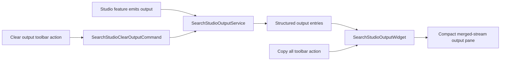

# Implementation Plan

**Target output path:** `docs/067-studio-output-enhancements/plan-studio-output-enhancements_v0.02.md`

**Based on:** `docs/067-studio-output-enhancements/spec-studio-output-enhancements_v0.02.md`

**Version:** `v0.02` (`Draft`)

**Supersedes:** `docs/067-studio-output-enhancements/plan-studio-output-enhancements_v0.01.md`

> **Superseded planning note**
>
> This draft plan has been overtaken by the read-only `xterm.js` direction.
>
> Use the current plan instead:
> - `docs/067-studio-output-enhancements/plan-studio-output-enhancements_v0.03.md`
>
> Use the current spec alongside it:
> - `docs/067-studio-output-enhancements/spec-studio-output-enhancements_v0.02.md`

## Change Log

- `v0.02` — Brought `Copy all` into baseline scope, added toolbar-action planning and verification coverage, and aligned the final consistency pass with the updated requirement.
- `v0.01` — Initial draft.

## Baseline

- `Studio Output` already exists as a Studio-owned custom lower-panel widget.
- Existing work has already established the service-driven output model and a toolbar-based `Clear output` action.
- Current output data already carries `timestamp`, `level`, `source`, and `message` metadata suitable for a merged output-pane presentation.

## Delta

- Refine the widget into a denser IDE-style output pane.
- Add reveal-latest behavior so the newest line remains visible during active workflows.
- Preserve natural selection/copy behavior while adding a toolbar-based `Copy all` action for the merged stream.
- Keep future filtering readiness without introducing explicit channel switching.

## Carry-over

- Explicit channel switching remains out of scope for this work package.
- Terminal emulation and `xterm.js` remain out of scope.
- Per-line copy commands and richer export behaviors remain deferred.

---

## Slice 1 — Output-pane baseline with compact merged-stream rendering and pastel severity styling

- [x] Work Item 1: Evolve `Studio Output` from a lightweight custom log panel into a clearer output-pane baseline while preserving the existing service and command model - Completed
  - **Purpose**: Deliver the smallest meaningful end-to-end enhancement by making `Studio Output` feel like a serious IDE output pane without changing its ownership model or introducing terminal semantics.
  - **Acceptance Criteria**:
    - `Studio Output` remains a Studio-owned custom widget in the lower panel.
    - Output entries render as a single merged stream using compact monospace-oriented lines.
    - Each line presents time, severity, source, and message clearly.
    - Severity token styling uses the agreed pastel palette for at least `INFO` and `ERROR`.
    - The panel remains clearly non-terminal and does not imply prompt or command-entry behavior.
  - **Definition of Done**:
    - Widget rendering updated end to end for compact output-pane presentation.
    - Existing `SearchStudioOutputService` and `SearchStudioClearOutputCommand` reused unchanged where possible.
    - Severity-formatting helpers added where needed and covered by focused tests.
    - No backend/API changes introduced.
    - Documentation updated if implementation evidence changes the accepted baseline.
    - Can execute end to end via: Studio shell `Studio Output` panel showing real Studio events.
  - [x] Task 1.1: Refine the output line presentation - Completed
    - [x] Step 1: Review the current `SearchStudioOutputWidget` rendering to identify remaining custom-log chrome that conflicts with an IDE output-pane feel. - Completed
    - [x] Step 2: Render the output as a single merged stream of compact monospace-oriented lines rather than card-like or panel-like rows. - Completed
    - [x] Step 3: Keep the visible line format stable as `time`, `severity`, `source`, and `message`. - Completed
    - [x] Step 4: Ensure the rendering remains non-terminal in appearance and behavior. - Completed
    - Summary: Replaced the grid-row log styling with compact inline output-pane lines that keep `time`, `severity`, `source`, and `message` visible without introducing prompt-like or terminal-like chrome.
  - [x] Task 1.2: Introduce severity formatting and pastel palette support - Completed
    - [x] Step 1: Add or refine output-format helpers for timestamp and severity presentation. - Completed
    - [x] Step 2: Apply pastel blue `#A9C7FF` to `INFO` and pastel red `#FFB3BA` to `ERROR`. - Completed
    - [x] Step 3: Apply the color to the severity token only, not the full line. - Completed
    - [x] Step 4: Implement the palette in a theme-respecting way so future CSS-variable substitution remains possible. - Completed
    - Summary: Added shared formatter helpers for timestamps, severity labels, and stable merged-stream line text, and applied theme-ready CSS-variable fallbacks for the agreed `INFO` and `ERROR` pastel tokens.
  - [x] Task 1.3: Preserve merged-stream semantics and structured metadata - Completed
    - [x] Step 1: Keep the existing output-entry model and merged-stream behavior as the first implementation. - Completed
    - [x] Step 2: Preserve source metadata in the rendered output and in the underlying entries for later filtering readiness. - Completed
    - [x] Step 3: Avoid introducing explicit channel switching or separate panes in this slice. - Completed
    - Summary: Kept the existing `SearchStudioOutputService` entry model and ordering behavior intact while surfacing `source` in each rendered line and stable formatted output text.
  - [x] Task 1.4: Add targeted verification for the output baseline - Completed
    - [x] Step 1: Add tests for timestamp and severity formatting helpers. - Completed
    - [x] Step 2: Add verification for the agreed `INFO` and `ERROR` pastel token colors. - Completed
    - [x] Step 3: Add verification that the merged stream retains `source` metadata and stable line format. - Completed
    - [x] Step 4: Document a manual smoke path for opening the panel and reviewing real emitted Studio events. - Completed
    - Summary: Expanded formatter and output-service tests to cover timestamp formatting, uppercase severity tokens, agreed pastel colors, source preservation, and stable merged-stream text while keeping the existing manual smoke path intact.
  - **Files**:
    - `src/Studio/Server/search-studio/src/browser/panel/search-studio-output-widget.tsx`: compact output-pane rendering and severity token styling.
    - `src/Studio/Server/search-studio/src/browser/panel/search-studio-output-format.ts`: formatting helpers for timestamps and severity presentation.
    - `src/Studio/Server/search-studio/src/browser/common/search-studio-output-service.ts`: only if small output-entry helper refinements are needed.
    - `src/Studio/Server/search-studio/test/*`: output-format and widget-behavior coverage.
  - **Work Item Dependencies**: Existing `066-studio-minor-ux` implementation only.
  - **Run / Verification Instructions**:
    - `yarn --cwd .\src\Studio\Server\search-studio build`
    - `node --test .\src\Studio\Server\search-studio\test`
    - `yarn --cwd .\src\Studio\Server build:browser`
    - `dotnet run --project .\src\Hosts\AppHost\AppHost.csproj`
    - Open `Studio Output` and verify the merged stream, compact line layout, and pastel severity token colors.
  - **User Instructions**: Trigger a few Studio actions so the panel can be reviewed with realistic output entries.
  - Summary: Updated `SearchStudioOutputWidget` and `search-studio-output-format.ts` for the compact output-pane baseline, left the existing output service/clear command flow intact, and added focused formatter/service verification in `src/Studio/Server/search-studio/test`.

---

## Slice 2 — Reveal-latest behavior and auto-scroll for a real output-pane feel

- [x] Work Item 2: Ensure `Studio Output` behaves like a reveal-latest output pane and keeps the newest line visible by default - Completed
  - **Purpose**: Deliver the next runnable slice by making the panel behave like a practical output pane during active workflows, so users always see the latest emitted line without manual scrolling in normal operation.
  - **Acceptance Criteria**:
    - New output keeps the latest visible line in view by default.
    - The output panel behaves as a reveal-latest surface during normal operation.
    - Clear behavior still resets the panel cleanly.
    - The implementation does not introduce terminal semantics or shell affordances.
  - **Definition of Done**:
    - Auto-scroll/reveal-latest behavior implemented end to end in the current widget.
    - Existing output service event flow reused.
    - Focused tests or stable widget-level verification added.
    - Manual verification path updated.
    - Can execute end to end via: Studio shell `Studio Output` during active navigation/actions.
  - [x] Task 2.1: Add reveal-latest behavior to the widget - Completed
    - [x] Step 1: Choose the simplest widget-level mechanism for keeping the latest rendered output visible. - Completed
    - [x] Step 2: Implement default auto-scroll when new entries arrive. - Completed
    - [x] Step 3: Confirm the implementation works with the current output ordering strategy. - Completed
    - Summary: Added widget-level reveal-latest behavior by making the output pane itself scrollable, scheduling auto-scroll after output updates, and switching visible reading order to chronological flow so the newest line appears at the end of the stream.
  - [x] Task 2.2: Preserve clear and refresh behavior - Completed
    - [x] Step 1: Confirm `Clear output` leaves the panel in a clean empty-state posture. - Completed
    - [x] Step 2: Ensure new output after a clear still reveals the latest line correctly. - Completed
    - [x] Step 3: Ensure no regressions are introduced in the lower-panel hosting behavior. - Completed
    - Summary: Kept the existing clear command flow intact while ensuring clear resets the scroll position and later appended output remains the only visible content after a clear.
  - [x] Task 2.3: Add targeted verification for reveal-latest behavior - Completed
    - [x] Step 1: Add tests or focused verification for auto-scroll when entries are appended. - Completed
    - [x] Step 2: Add verification for output behavior immediately after clear. - Completed
    - [x] Step 3: Add manual smoke notes for continuous output review. - Completed
    - Summary: Added focused formatter/service verification for reveal-latest scroll positioning, chronological append order, and clear-followed-by-append behavior, while preserving the manual smoke path for continuous output review.
  - **Files**:
    - `src/Studio/Server/search-studio/src/browser/panel/search-studio-output-widget.tsx`: reveal-latest and auto-scroll behavior.
    - `src/Studio/Server/search-studio/src/browser/common/search-studio-output-service.ts`: unchanged unless event sequencing needs a small refinement.
    - `src/Studio/Server/search-studio/test/*`: auto-scroll and clear-followed-by-append coverage.
  - **Work Item Dependencies**: Work Item 1.
  - **Run / Verification Instructions**:
    - `yarn --cwd .\src\Studio\Server\search-studio build`
    - `node --test .\src\Studio\Server\search-studio\test`
    - `yarn --cwd .\src\Studio\Server build:browser`
    - `dotnet run --project .\src\Hosts\AppHost\AppHost.csproj`
    - Produce multiple output lines and confirm the latest line stays visible in `Studio Output`.
  - **User Instructions**: Leave the output panel open while triggering multiple actions across `Providers`, `Rules`, and `Ingestion`.
  - Summary: Updated `SearchStudioOutputWidget`, `SearchStudioOutputService`, and focused output tests so `Studio Output` now reads oldest-to-newest with reveal-latest auto-scroll, while clear still resets the pane cleanly.

---

## Slice 3 — Output-pane interaction polish with `Copy all` support and future filtering readiness

- [!] Work Item 3: Strengthen the output-pane interaction model by adding `Copy all` while keeping explicit channel switching out of scope - Not needed
  - **Purpose**: Deliver a third runnable slice that improves day-to-day usability and future extensibility without expanding scope into channel panes, terminal emulation, or advanced commands.
  - **Acceptance Criteria**:
    - Output remains naturally selectable and copy-friendly.
    - `Copy all` is available as a toolbar action and copies the full merged stream to clipboard.
    - The merged stream preserves `source` metadata for future filtering.
    - No explicit source/channel switching is introduced in the first implementation.
    - `Clear output` and `Copy all` are available as toolbar actions.
  - **Definition of Done**:
    - Selection/copy-friendliness reviewed and improved where needed.
    - `Copy all` implemented end to end for the visible merged stream.
    - Source metadata remains available and stable for future filtering.
    - No premature channel-switch UI is introduced.
    - Tests and manual verification cover the accepted first-release scope.
    - Can execute end to end via: normal Studio usage with output inspection and copy/select behavior.
  - [!] Task 3.1: Confirm selection and copy-friendly rendering - Not needed
    - [!] Step 1: Review the widget markup/styling for anything that impedes natural selection. - Not needed
    - [!] Step 2: Ensure compact output rows remain selectable and readable. - Not needed
    - [!] Step 3: Avoid introducing terminal-style affordances such as prompts or fake command lines. - Not needed
    - Summary: Deferred because the custom compact-row widget is no longer the preferred baseline under the revised `xterm.js` direction.
  - [!] Task 3.2: Add `Copy all` toolbar action - Not needed
    - [!] Step 1: Introduce a dedicated toolbar command/contribution for `Copy all` alongside `Clear output`. - Not needed
    - [!] Step 2: Serialize the visible merged output stream as stable text using `time`, `severity`, `source`, and `message` ordering. - Not needed
    - [!] Step 3: Copy the full merged stream to clipboard without introducing per-line command chrome. - Not needed
    - [!] Step 4: Keep the interaction non-terminal and consistent with the current output ownership model. - Not needed
    - Summary: Deferred pending a fresh `xterm.js`-based design decision for clipboard behavior and toolbar integration.
  - [!] Task 3.3: Preserve future filtering readiness without adding channel switching - Not needed
    - [!] Step 1: Keep `source` metadata explicit in the rendered and underlying model. - Not needed
    - [!] Step 2: Confirm no UI is introduced for explicit channel switching in this work package. - Not needed
    - [!] Step 3: If helpful, add a small internal helper or model note that keeps filtering an easy later extension. - Not needed
    - Summary: Deferred until the output-surface technology choice is reopened and source rendering expectations are redefined.
  - [!] Task 3.4: Add targeted verification for first-release interaction scope - Not needed
    - [!] Step 1: Add verification that `source` metadata remains intact and visible. - Not needed
    - [!] Step 2: Add verification that the first implementation remains a merged stream. - Not needed
    - [!] Step 3: Add verification that `Copy all` copies the expected full-stream text. - Not needed
    - [!] Step 4: Add manual smoke notes for selecting visible text and using `Copy all` from the toolbar. - Not needed
    - Summary: Deferred because the remaining interaction coverage should be redesigned around the proposed read-only terminal surface.
  - **Files**:
    - `src/Studio/Server/search-studio/src/browser/panel/search-studio-output-widget.tsx`: copy/select-friendly markup refinements.
    - `src/Studio/Server/search-studio/src/browser/panel/search-studio-output-toolbar-contribution.ts`: `Copy all` toolbar wiring.
    - `src/Studio/Server/search-studio/src/browser/panel/search-studio-output-format.ts`: stable merged-stream text serialization helpers if needed.
    - `src/Studio/Server/search-studio/src/browser/search-studio-frontend-module.ts`: command binding updates if required.
    - `src/Studio/Server/search-studio/src/browser/common/search-studio-output-service.ts`: preserve stable entry semantics for future filtering.
    - `src/Studio/Server/search-studio/test/*`: toolbar, copy-all, merged-stream, and source-metadata verification coverage.
  - **Work Item Dependencies**: Work Items 1 and 2.
  - **Run / Verification Instructions**:
    - `yarn --cwd .\src\Studio\Server\search-studio build`
    - `node --test .\src\Studio\Server\search-studio\test`
    - `yarn --cwd .\src\Studio\Server build:browser`
    - `dotnet run --project .\src\Hosts\AppHost\AppHost.csproj`
    - Open `Studio Output`, use `Copy all`, and confirm the copied text matches the visible merged stream with visible sources.
  - **User Instructions**: None beyond the normal Studio startup prerequisites.
  - Summary: Closed as not needed because the remaining interaction work should be reconsidered after the output-surface pivot to read-only `xterm.js`.

---

## Slice 4 — Final consistency pass, documentation, and review-ready baseline

- [!] Work Item 4: Harmonize the completed `Studio Output` enhancements into one review-ready baseline and document the accepted direction - Not needed
  - **Purpose**: Close the work package with a consistency review, final verification pass, and documentation updates so future Studio shell work starts from a clear, accepted output-pane baseline.
  - **Acceptance Criteria**:
    - `Studio Output` clearly reads as an IDE-style output pane rather than a custom card list or terminal.
    - Toolbar, rendering, reveal-latest behavior, and `Copy all` feel coherent with the wider Studio shell.
    - Documentation captures the accepted direction and smoke path.
    - No scope creep into terminal emulation or explicit channel switching occurs.
  - **Definition of Done**:
    - Full verification path completed.
    - Work package plan/spec remain aligned with implementation evidence.
    - Wiki guidance updated if the accepted baseline changed materially.
    - Can execute end to end via: complete Studio walkthrough with output-focused review.
  - [!] Task 4.1: Review cross-surface consistency - Not needed
    - [!] Step 1: Confirm `Studio Output` still aligns visually with the Studio shell toolbars and panel model. - Not needed
    - [!] Step 2: Confirm the panel remains non-terminal in semantics despite its shell-like density. - Not needed
    - [!] Step 3: Confirm severity palette, merged stream, reveal-latest behavior, and `Copy all` feel coherent together. - Not needed
    - Summary: Deferred because the accepted baseline is being reopened around a read-only `xterm.js` implementation rather than finalized under the current custom widget approach.
  - [!] Task 4.2: Complete verification and documentation - Not needed
    - [!] Step 1: Run the full frontend build and test path. - Not needed
    - [!] Step 2: Complete a final manual smoke walkthrough focused on output behavior. - Not needed
    - [!] Step 3: Update `wiki/Tools-UKHO-Search-Studio.md` if the accepted output-pane baseline needs to be documented for contributors. - Not needed
    - [!] Step 4: Record any deferred polish or follow-up ideas separately rather than expanding the scope of this work package. - Not needed
    - Summary: Deferred pending a revised spec and implementation plan that decide whether `Studio Output` should move to a read-only terminal control.
  - **Files**:
    - `docs/067-studio-output-enhancements/spec-studio-output-enhancements_v0.02.md`: update only if implementation evidence requires clarification.
    - `docs/067-studio-output-enhancements/plan-studio-output-enhancements_v0.02.md`: keep aligned with completed work status if the plan is later progressed.
    - `wiki/Tools-UKHO-Search-Studio.md`: update Studio shell guidance if implementation materially changes contributor expectations.
    - `src/Studio/Server/search-studio/test/*`: any final smoke-oriented verification notes or additions.
  - **Work Item Dependencies**: Work Items 1, 2, and 3.
  - **Run / Verification Instructions**:
    - `yarn --cwd .\src\Studio\Server\search-studio build`
    - `node --test .\src\Studio\Server\search-studio\test`
    - `yarn --cwd .\src\Studio\Server build:browser`
    - `dotnet run --project .\src\Hosts\AppHost\AppHost.csproj`
    - Review `Studio Output` during a complete Studio walkthrough, including `Copy all`.
  - **User Instructions**: Review the finished output-pane baseline before requesting additional enhancements such as filtering.
  - Summary: Closed as not needed because a final consistency pass would be premature before the architecture pivot is resolved.

---

## Overall approach and key considerations

- This plan keeps the work package vertical and lightweight: first establish the output-pane visual/semantic baseline, then add reveal-latest behavior, then strengthen interaction and `Copy all`, and finally close with documentation and consistency review.
- The plan intentionally preserves the current custom widget and service model rather than introducing terminal infrastructure or `xterm.js`.
- The merged-stream model remains the first release baseline; future filtering is easier to add later if source metadata is kept explicit and stable now.
- Severity coloring should remain subdued and token-led so the panel stays readable during prolonged dark-theme use.
- Auto-scroll is treated as a first-class part of the output-pane experience rather than as a later enhancement.
- `Copy all` is intentionally limited to a full merged-stream toolbar action to avoid scope expansion into per-line commands or channel-specific copy behavior.
- Explicit channel switching remains intentionally deferred until the baseline is accepted.

---

# Architecture

## Overall Technical Approach

- The work remains a frontend-led native Theia extension enhancement within `src/Studio/Server/search-studio`.
- The existing `SearchStudioOutputWidget`, `SearchStudioOutputService`, toolbar contribution pattern, and clear command remain the foundation.
- The implementation should evolve the current panel toward an IDE-style output-pane model by refining rendering, severity formatting, reveal-latest behavior, and full-stream copy while preserving the current data and command flow.
- No backend change is required.

## Frontend

- The relevant frontend code lives in `src/Studio/Server/search-studio/src/browser/panel` and `src/Studio/Server/search-studio/src/browser/common`.
- `SearchStudioOutputWidget` remains the UI entry point for the lower-panel output surface.
- `SearchStudioOutputService` remains the append/clear source of truth for output entries.
- `search-studio-output-format.ts` should hold lightweight formatting helpers such as timestamp and severity presentation, and stable merged-stream text serialization if needed.
- The toolbar integration should continue to use Theia `TabBarToolbarContribution` rather than custom body buttons.
- The widget should remain intentionally non-terminal while adopting output-pane affordances such as compact line rendering, severity token coloring, reveal-latest behavior, and a toolbar-based `Copy all` action.

## Backend

- No backend work is required for this package.
- Existing Studio features continue to emit output through the current frontend service path.
- No new API endpoints, persistence, or server-side output-channel infrastructure are required.
