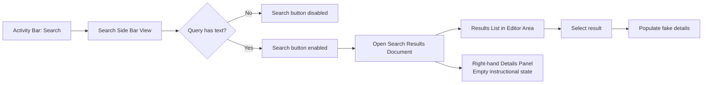

# Implementation Plan

**Target output path:** `docs/069-search-ui/plan-search-ui_v0.01.md`

**Based on:** `docs/069-search-ui/spec-search-ui_v0.01.md`

**Version:** `v0.01` (`Draft`)

---

## Baseline

- Studio already has Theia-based work areas for `Providers`, `Rules`, `Ingestion`, `Home`, and `Output` in `src/Studio/Server/search-studio/src/browser`.
- The frontend already uses view contributions, view-container factories, widget services, and Node-based frontend tests in `src/Studio/Server/search-studio/test`.
- There is no dedicated `Search` activity-bar entry, search side-bar view, central search-results document, or right-hand search-details panel yet.
- The work package is intentionally frontend-only and mock-data-only; no backend or API work is required.

## Delta

- Add a new `Search` activity-bar contribution ordered last.
- Add a left-side `Search` view containing query input, `Search` action, and static facets.
- Add local search state so the action is enabled only when text is present.
- Open a central mock results document on button click or `Enter`.
- Show a right-hand details surface that starts empty and updates when a mock result is selected.
- Prefer the Theia right-hand `Outline` area for details, with a pragmatic fallback to the nearest equivalent right-hand panel if direct hosting would add disproportionate support work.
- Add focused frontend tests and a manual smoke path for the mock flow.

## Carry-over / Deferred

- Real search APIs, result retrieval, and index integration.
- Real facet filtering, counts, and query-to-results behavior.
- Persistence of query text, selected facets, and selected result across sessions.
- Accessibility and UX refinements beyond the first screenshot-aligned mock implementation.
- Broader end-to-end browser automation if the current Studio shell test harness is not yet ready for it.

---

## Slice 1 — Add a runnable `Search` work area in the left shell

- [x] Work Item 1: Introduce the `Search` activity-bar item and a runnable search side-bar view with query input, static facets, and local enablement state - Completed
  - **Purpose**: Establish the smallest end-to-end search shell slice so stakeholders can open a dedicated `Search` area, type into the query box, and see realistic left-side UI without requiring any results workflow yet.
  - **Acceptance Criteria**:
    - A new `Search` item appears at the end of the Studio `Activity Bar`.
    - Selecting `Search` opens a search-specific side-bar view.
    - The side-bar view contains a query input, a `Search` button, and mock facet groups under the search controls.
    - The `Search` button is disabled when the query is empty and enabled when text is present.
    - Pressing `Enter` in the populated query input triggers the same command path as clicking the enabled `Search` button, even if the later results-opening work is still placeholder-wired.
  - **Definition of Done**:
    - `Search` view contribution implemented and registered in the Studio frontend
    - activity-bar ordering places `Search` last
    - local UI state implemented for query text and `canSearch`
    - static facet definitions and rendering added
    - focused frontend tests added for view contribution, ordering, and enablement behavior
    - documentation updated if file locations or contribution patterns differ from this draft
    - Can execute end to end via: launching Studio, opening `Search`, typing text, and observing the enabled `Search` action
  - [x] Task 1.1: Add the `Search` activity-bar contribution and view-container wiring - Completed
    - [x] Step 1: Review the existing view contribution pattern used by `Ingestion`, `Rules`, and `Output` to mirror the current Theia shell conventions. - Completed
    - [x] Step 2: Add a dedicated `Search` view contribution and register it in the frontend module. - Completed
    - [x] Step 3: Ensure the contribution is ordered after the existing activity-bar items so `Search` appears last. - Completed
    - [x] Step 4: Confirm the side-bar opens the `Search` view container predictably from the new activity-bar item. - Completed
    - **Completed Summary**:
      - Added a dedicated `Search` view contribution, view-container factory, constants, and frontend-module bindings under `src/Studio/Server/search-studio/src/browser/search/`.
      - Updated the Studio shell layout contribution so `Search` is revealed after `Ingestion`, keeping it last in the left activity-bar sequence.
  - [x] Task 1.2: Implement the left-side search view and local query state - Completed
    - [x] Step 1: Add a search widget or view component under a new `search` browser folder using the existing Studio widget style. - Completed
    - [x] Step 2: Add a query input with screenshot-aligned placeholder text. - Completed
    - [x] Step 3: Add a `Search` button that binds to computed local `canSearch` state. - Completed
    - [x] Step 4: Wire keyboard handling so `Enter` in the query input invokes the same command path as the button when text is present. - Completed
    - **Completed Summary**:
      - Added `SearchStudioSearchWidget` as a left-side React widget with a query input, a disabled-until-populated `Search` button, and screenshot-aligned placeholder text.
      - Added `SearchStudioSearchService` to hold query state, compute `canSearch`, and expose a shared search-request path used by both button click and `Enter` handling.
  - [x] Task 1.3: Add static facet groups below the search controls - Completed
    - [x] Step 1: Define lightweight mock facet metadata for `Region` and `Type` with placeholder labels and counts. - Completed
    - [x] Step 2: Render facet group headers and checkbox rows beneath the query controls. - Completed
    - [x] Step 3: Keep the first version presentational-only or minimally toggleable without introducing real filtering logic. - Completed
    - [x] Step 4: Match the dark-theme styling and spacing conventions already used in Studio widgets. - Completed
    - **Completed Summary**:
      - Added static mock facet metadata for `Region` and `Type` using counts aligned to the reference screenshot.
      - Rendered the facet groups beneath the search controls with dark-theme-friendly inline styling and presentational checkbox rows only.
  - [x] Task 1.4: Add focused validation coverage for the left-shell slice - Completed
    - [x] Step 1: Add tests for contribution registration and activity-bar ordering where practical. - Completed
    - [x] Step 2: Add tests for query-state transitions and button enablement. - Completed
    - [x] Step 3: Add tests for `Enter` key handling delegating to the same search action path. - Completed
    - [x] Step 4: Document a manual smoke path for opening the view and verifying the left-side behavior. - Completed
    - **Completed Summary**:
      - Added Node-based tests for the new search service and search widget, and extended the shell-layout test to verify `Search` is revealed after `Ingestion`.
      - Revalidated the left-shell slice with `yarn --cwd .\src\Studio\Server\search-studio test`, `yarn --cwd .\src\Studio\Server build:browser`, and a successful workspace build.
  - **Files**:
    - `src/Studio/Server/search-studio/src/browser/search-studio-frontend-module.ts`: register the new search contribution and any related services.
    - `src/Studio/Server/search-studio/src/browser/search/*`: new search-side-bar widget, types, local state helpers, contribution, and styles.
    - `src/Studio/Server/search-studio/src/browser/search-studio-view-contribution.ts`: extend only if common view registration patterns are centralized here.
    - `src/Studio/Server/search-studio/src/browser/search-studio-constants.ts`: add identifiers if the shell keeps view ids and labels centrally.
    - `src/Studio/Server/search-studio/test/*`: add tests for contribution registration, query-state behavior, and keyboard handling.
  - **Work Item Dependencies**: None.
  - **Run / Verification Instructions**:
    - `yarn --cwd .\src\Studio\Server\search-studio test`
    - `yarn --cwd .\src\Studio\Server build:browser`
    - `dotnet run --project .\src\Hosts\AppHost\AppHost.csproj`
    - Open Studio, select `Search`, verify the activity-bar placement, and confirm the `Search` button enablement toggles as text is entered and cleared.
  - **User Instructions**: Use the normal local Studio prerequisites already required for the Theia shell.
  - **Completed Summary**:
    - Added a new `Search` activity-bar work area with a dedicated left-side view container and widget, wired into the existing Theia Studio shell patterns.
    - Implemented local query-state handling, disabled-until-populated search action behavior, `Enter`-key search triggering, and static `Region`/`Type` facet rendering.
    - Added focused frontend tests and updated the shell layout so `Search` appears after the existing left-side work areas.

---

## Slice 2 — Open a central mock results document from the search controls

- [x] Work Item 2: Add a mock search execution path that opens a central results document from the side-bar query controls - Completed
  - **Purpose**: Deliver the first full runnable search interaction by letting users trigger search from the side bar and see a realistic results surface in the editor area.
  - **Acceptance Criteria**:
    - Clicking the enabled `Search` button opens a central mock `Search results` document.
    - Pressing `Enter` in the populated query input opens the same results document.
    - The results document displays static mock result cards aligned to the supplied screenshot.
    - The results document opens as a normal Studio document/tab using the current shell patterns.
    - Triggering search also makes the right-hand details surface visible in its empty/instructional state.
  - **Definition of Done**:
    - a search execution service or command path opens the results document through normal Studio shell mechanics
    - a reusable mock-results dataset is defined locally in the frontend
    - results document widget/component implemented with screenshot-aligned card layout
    - right-hand details surface is shown in empty state after search
    - focused frontend tests added for command path, document opening, and initial details state visibility
    - Can execute end to end via: entering text in `Search`, triggering search, and seeing the mock results document with the right-hand empty details panel
  - [x] Task 2.1: Define the mock search execution and results-opening path - Completed
    - [x] Step 1: Choose the simplest shell-aligned pattern for opening a dedicated search-results document, reusing existing widget/service patterns where possible. - Completed
    - [x] Step 2: Add a local search service or document-opening helper that receives query text and opens the results document. - Completed
    - [x] Step 3: Ensure both button click and `Enter` invoke the same shared execution path. - Completed
    - [x] Step 4: Preserve lightweight mock-only behavior with no backend dependencies. - Completed
    - **Completed Summary**:
      - Added `SearchStudioSearchExecutionService` as a frontend contribution that listens to the existing shared search-request event and opens the mock results flow.
      - Kept the execution path frontend-only and reused the same shared request path already triggered by both button click and `Enter` from Work Item 1.
  - [x] Task 2.2: Implement the central mock results document - Completed
    - [x] Step 1: Create a results widget/component under the new `search` browser area. - Completed
    - [x] Step 2: Add a static mock results list using believable placeholder titles and metadata aligned to the screenshot. - Completed
    - [x] Step 3: Render results as card-like rows suitable for the dark Studio theme. - Completed
    - [x] Step 4: Keep the document independent from real query filtering so it remains easy to replace later. - Completed
    - **Completed Summary**:
      - Added `SearchStudioSearchResultsWidget` as a normal closable main-area document.
      - Added screenshot-aligned static result cards and a local mock-results dataset under the `search` frontend area without introducing backend dependencies.
  - [x] Task 2.3: Show the right-hand details surface in empty state after search - Completed
    - [x] Step 1: Decide whether direct hosting in the Theia right-hand `Outline` area is straightforward enough for this slice. - Completed
    - [x] Step 2: If direct `Outline` hosting is straightforward, wire the search-details surface there; otherwise, use the nearest equivalent right-hand panel allowed by the spec. - Completed
    - [x] Step 3: Show an empty or `Select a result to view details` state immediately after search. - Completed
    - [x] Step 4: Ensure the search flow reveals or focuses the right-hand panel so the shell matches the intended screenshot structure. - Completed
    - **Completed Summary**:
      - Implemented the approved fallback path by adding a dedicated right-hand `Search Details` widget/view contribution rather than wiring directly into Theia `Outline`.
      - The search flow now reveals that right-hand panel in an empty instructional state after each mock search.
  - [x] Task 2.4: Add focused coverage for results opening - Completed
    - [x] Step 1: Add tests for the shared search execution path. - Completed
    - [x] Step 2: Add tests confirming the results document opens from both button and keyboard activation. - Completed
    - [x] Step 3: Add tests or a manual smoke note confirming the right-hand details panel starts in the empty state after search. - Completed
    - [x] Step 4: Update the work package plan if implementation details materially differ from this draft. - Completed
    - **Completed Summary**:
      - Added Node-based tests for the search execution path and for the results widget title/query behavior.
      - Revalidated the runnable slice with `yarn --cwd .\src\Studio\Server\search-studio test`, `yarn --cwd .\src\Studio\Server build:browser`, and a successful workspace build.
  - **Files**:
    - `src/Studio/Server/search-studio/src/browser/search/*`: mock search command/service, results widget, result types, mock data, and empty-details-state wiring.
    - `src/Studio/Server/search-studio/src/browser/search-studio-command-contribution.ts`: extend only if the search action becomes a shared command contribution.
    - `src/Studio/Server/search-studio/src/browser/common/*`: shared document descriptors or open-widget helpers if a common abstraction is needed.
    - `src/Studio/Server/search-studio/test/*`: tests covering shared execution path, results opening, and initial right-hand-panel state.
  - **Work Item Dependencies**: Work Item 1.
  - **Run / Verification Instructions**:
    - `yarn --cwd .\src\Studio\Server\search-studio test`
    - `yarn --cwd .\src\Studio\Server build:browser`
    - `dotnet run --project .\src\Hosts\AppHost\AppHost.csproj`
    - Open Studio, select `Search`, enter text, click `Search` or press `Enter`, then confirm the results document opens and the right-hand panel shows an empty details state.
  - **User Instructions**: No setup beyond normal Studio prerequisites.
  - **Completed Summary**:
    - Added a shared mock search execution path that opens a central `Search results` document and reveals a right-hand `Search Details` panel in empty state.
    - Chose the spec-approved right-hand fallback panel instead of direct `Outline` hosting for this slice so delivery stays low-risk and self-contained.
    - Added supporting mock result data, widget registration, and focused tests covering the new execution flow.

---

## Slice 3 — Update right-hand details from selected mock results

- [x] Work Item 3: Add selected-result handling so the right-hand details panel updates with fake values - Completed
  - **Purpose**: Complete the requested screenshot-driven mock flow by letting a user select a result card and see corresponding fake detail values on the right.
  - **Acceptance Criteria**:
    - Clicking a mock result card marks it as selected.
    - The right-hand details panel updates from empty state to fake values for the selected result.
    - Selected-result state is maintained in lightweight local frontend state only.
    - The results document and details panel remain mock-only and contain no backend integration.
    - The shell still uses the right-hand `Outline` area if practical, or the approved equivalent fallback if not.
  - **Definition of Done**:
    - selected-result state wired between the results document and details panel
    - details panel renders representative fields such as title, type, region, source, and summary
    - visual selected-state treatment added to the chosen result card
    - focused tests added for selection and details update behavior
    - documentation updated if the final panel-hosting choice differs from the preferred path
    - Can execute end to end via: opening `Search`, triggering search, selecting a result, and seeing the right-hand details values update
  - [x] Task 3.1: Add local selected-result state and selection handling - Completed
    - [x] Step 1: Define a lightweight selected-result model in the new `search` frontend area. - Completed
    - [x] Step 2: Wire result-card click handling to update selected-result state. - Completed
    - [x] Step 3: Add visual treatment for the selected card consistent with the dark Studio theme. - Completed
    - [x] Step 4: Keep the state scoped to the mock search work area without introducing persistence. - Completed
    - **Completed Summary**:
      - Extended `SearchStudioSearchService` to track the currently selected mock result while keeping the state local to the frontend-only search work area.
      - Wired the results document so clicking or keyboard-activating a result updates shared selection state and applies a visible selected-card treatment.
  - [x] Task 3.2: Render fake selected-result details in the right-hand panel - Completed
    - [x] Step 1: Add a details component that reads the selected-result state. - Completed
    - [x] Step 2: Render placeholder fields for title, type, region, source, and summary. - Completed
    - [x] Step 3: Keep the pre-selection instructional state and transition cleanly to populated values after selection. - Completed
    - [x] Step 4: Confirm the panel-hosting choice remains maintainable and easy to swap later if true `Outline` hosting is adopted in a follow-up. - Completed
    - **Completed Summary**:
      - Updated the right-hand `Search Details` widget to subscribe to shared selection state and render fake values for the selected result.
      - Preserved the empty instructional state until a result is selected, keeping the current right-hand fallback panel easy to replace later if direct `Outline` hosting is adopted.
  - [x] Task 3.3: Add coverage and smoke verification for result selection - Completed
    - [x] Step 1: Add tests for result-card selection and details rendering. - Completed
    - [x] Step 2: Add tests for preserving empty state until the first selection. - Completed
    - [x] Step 3: Add or update manual smoke steps covering full query → results → selection → details flow. - Completed
    - [x] Step 4: Note any future follow-up if direct `Outline` hosting was deferred to the fallback panel. - Completed
    - **Completed Summary**:
      - Added Node-based tests for selected-result state, result-card selection, and empty-versus-populated details rendering.
      - Revalidated the full mock flow with `yarn --cwd .\src\Studio\Server\search-studio test`, `yarn --cwd .\src\Studio\Server build:browser`, and a successful workspace build.
  - **Files**:
    - `src/Studio/Server/search-studio/src/browser/search/*`: selected-result state, result-card interactions, and details-panel rendering.
    - `src/Studio/Server/search-studio/test/*`: tests covering selection behavior and details updates.
    - `docs/069-search-ui/plan-search-ui_v0.01.md`: update with implementation notes if a panel-hosting fallback is chosen.
  - **Work Item Dependencies**: Work Item 2.
  - **Run / Verification Instructions**:
    - `yarn --cwd .\src\Studio\Server\search-studio test`
    - `yarn --cwd .\src\Studio\Server build:browser`
    - `dotnet run --project .\src\Hosts\AppHost\AppHost.csproj`
    - Open Studio, select `Search`, enter text, trigger search, click a result card, and verify the right-hand details panel updates with fake values.
  - **User Instructions**: No additional setup required.
  - **Completed Summary**:
    - Added end-to-end mock selection behavior so the central results document now drives the right-hand details panel with fake selected-result values.
    - Kept the implementation frontend-only, local-state-only, and aligned to the spec-approved fallback right-hand panel approach.

---

# Architecture

## Overall Technical Approach

The `069-search-ui` work package should be implemented as a frontend-only extension to the existing Theia-based Studio shell.

The recommended approach is to keep all new behavior inside `src/Studio/Server/search-studio/src/browser` using the same patterns already established for Studio work areas:

- view contributions for activity-bar and side-bar integration
- widget/service pairs for central documents
- lightweight local state for mock UI behavior
- Node-based frontend tests under `src/Studio/Server/search-studio/test`

No backend contracts, ASP.NET endpoints, or shared domain/infrastructure changes are required. The mock search UI should be isolated so it can later be replaced by a real search flow without reworking the shell structure.

Key technical choices:

- add a dedicated `search` browser area rather than scattering search files across existing provider/rules/ingestion folders
- keep query, results, selected-result, facets, and details state local to the new search UI
- reuse normal Theia document/panel opening flows rather than inventing a bespoke shell surface
- prefer the right-hand `Outline` area for details when practical, but allow an equivalent fallback panel to avoid blocking delivery
- keep mock data colocated with the search frontend implementation for easy later replacement

## Frontend

The frontend work lives in the Theia Studio client package:

- `src/Studio/Server/search-studio/src/browser/search/*`
- `src/Studio/Server/search-studio/src/browser/search-studio-frontend-module.ts`
- supporting shared helpers only where the existing shell already centralizes common document-opening patterns

### Frontend responsibilities

1. `Search` activity-bar integration
   - contribute the new `Search` item
   - ensure it appears last
   - open the search-specific side-bar view

2. Search side-bar view
   - render the query input and `Search` action
   - compute enabled/disabled state from query text
   - handle click and `Enter`
   - render mock facets below the search controls

3. Search results document
   - open a central tabbed document on search trigger
   - render static result cards matching the screenshot intent
   - provide click handling for selected-result state

4. Right-hand details panel
   - render an empty instructional state immediately after search
   - update to fake selected-result values after a card is clicked
   - prefer `Outline` hosting if simple; otherwise use a right-hand fallback panel

5. Frontend tests
   - verify contribution wiring
   - verify query-state behavior
   - verify results opening
   - verify result selection and details updates

### Suggested frontend structure

- `search/search-studio-search-types.ts`
  - local types for query state, results, facets, and details
- `search/search-studio-search-view-contribution.ts`
  - activity-bar / side-bar registration
- `search/search-studio-search-widget.tsx`
  - left-side search view UI
- `search/search-studio-search-service.ts`
  - local orchestration for opening results and managing shared mock state
- `search/search-studio-search-results-widget.tsx`
  - central results document
- `search/search-studio-search-details-widget.tsx`
  - right-hand details panel UI
- `search/search-studio-search-mock-data.ts`
  - placeholder facets, results, and details values
- `search/search-studio-search-state.ts`
  - lightweight local state or helper logic if splitting state from UI improves testability

### User flow

1. User selects `Search` from the activity bar.
2. Studio opens the search view in the left side bar.
3. User types a query; `Search` becomes enabled.
4. User clicks `Search` or presses `Enter`.
5. Studio opens the central results document and reveals the right-hand details panel in empty state.
6. User clicks a result.
7. Studio shows fake details for the selected result.

## Backend

No backend changes are required for `069-search-ui`.

### Backend impact

- no new API endpoints
- no service-layer changes
- no domain-model changes
- no persistence changes
- no Azure or configuration changes

The only backend-adjacent verification is ensuring the normal Studio host still serves the updated Theia frontend bundle correctly after running:

- `yarn --cwd .\src\Studio\Server\search-studio test`
- `yarn --cwd .\src\Studio\Server build:browser`
- `dotnet run --project .\src\Hosts\AppHost\AppHost.csproj`

---

## Overall approach summary

This plan keeps the work package vertical and low risk:

1. add the `Search` work area and left-side controls first
2. add mock results opening as the first full search interaction
3. add selected-result details to complete the screenshot-driven flow

Key implementation considerations:

- keep the work frontend-only and mock-only
- preserve normal Theia shell patterns for side-bar, document, and right-hand panel behavior
- prefer the `Outline` area for details, but do not block delivery if a right-hand fallback is simpler
- colocate mock data and local state so real search integration can replace them later with minimal shell churn
- keep validation focused on runnable Studio behavior through existing frontend tests plus manual smoke verification
