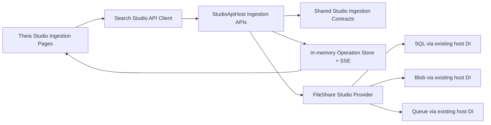

# Implementation Plan

**Target output path:** `docs/070-studio-ingestion/plan-studio-ingestion_v0.01.md`

**Based on:** `docs/070-studio-ingestion/spec.md`

**Version:** `v0.01` (`Draft`)

---

## Baseline

- `StudioApiHost` already exposes provider-neutral discovery routes such as `/providers` and `/rules`.
- `StudioApiHost` is already the composition root and already has the required SQL, blob, and queue DI wiring in place. This work must reuse that existing host wiring rather than add parallel registration paths.
- `UKHO.Search.Studio` currently provides provider registration/catalog concerns, but does not yet expose provider-neutral ingestion contracts.
- `UKHO.Search.Studio.Providers.FileShare` currently identifies the `file-share` provider, but does not yet translate the ingestion workflows required by Studio.
- The Theia Studio shell already has an `Ingestion` work area and placeholder document flows for:
  - `By id`
  - `All unindexed`
  - `By context`
- The Studio frontend already has API client and catalog patterns for `/providers` and `/rules`, but no ingestion-specific API client, operation-tracking client, or SSE handling yet.

## Delta

- Add provider-neutral ingestion contracts, DTOs, and operation abstractions in the Studio shared layer.
- Add new ingestion and operations minimal API endpoint groups under an `Api` namespace in `StudioApiHost`.
- Add an in-memory host-side operation store with a single global active-operation lock and SSE progress streaming.
- Implement the file-share Studio provider translation layer so Studio concepts remain neutral while file-share specifics stay internal.
- Replace the three placeholder ingestion documents in the Theia Studio shell with working end-to-end flows.
- Add API, provider, and frontend tests for validation, conflict handling, progress updates, and recovery after reload.

## Carry-over / Deferred

- Durable operation persistence across `StudioApiHost` restarts.
- Historical operation listing.
- Fine-grained provider diagnostics over SSE.
- Queue message schema changes.
- Production-hardening concerns beyond the development-focused scope in the spec.

---

## Slice 1 — Fetch payload by id and submit it for ingestion

- [x] Work Item 1: Deliver a runnable provider-neutral `By id` ingestion flow from Studio UI through `StudioApiHost` to the file-share provider
  - **Purpose**: Bring the first placeholder page to life with the smallest meaningful end-to-end capability: select a provider, fetch a payload by id, inspect it, and enqueue that same payload without client-side transformation.
  - **Acceptance Criteria**:
    - `GET /ingestion/{provider}/{id}` returns a wrapped provider-neutral response with `id` and `payload`.
    - `POST /ingestion/{provider}/payload` attempts the queue write before returning success.
    - Unknown provider returns `400 Bad Request`.
    - Unknown id for a known provider returns `404 Not Found`.
    - The Studio `By id` page requires provider selection before controls are enabled.
    - The fetched payload is shown in a read-only Monaco editor and is reused unchanged for `Index`.
  - **Definition of Done**:
    - Shared ingestion contracts and DTOs added
    - `StudioApiHost` fetch and submit endpoints implemented with validation and logging
    - File-share provider can fetch by id and submit payload via existing host-registered clients
    - Theia `By id` document is no longer placeholder content
    - API, provider, and frontend tests pass for the slice
    - Documentation updated in this work package
    - Can execute end-to-end via: launching Studio, opening `Ingestion -> By id`, selecting `file-share`, fetching a valid id, and indexing the fetched payload
  - [x] Task 1.1: Add shared provider-neutral ingestion contracts in the Studio shared layer
    - [x] Step 1: Introduce provider-neutral request/response DTOs for fetch and payload submit in `src/Studio/UKHO.Search.Studio`.
    - [x] Step 2: Add provider-neutral ingestion provider abstractions that extend the existing Studio provider model without leaking file-share terms.
    - [x] Step 3: Keep payload bodies opaque JSON while making non-payload fields Studio-neutral.
    - [x] Step 4: Add contract-level validation helpers or result types needed for `400` vs `404` handling.
  - [x] Task 1.2: Implement the `StudioApiHost` by-id ingestion endpoints
    - [x] Step 1: Add ingestion endpoint classes under `src/Studio/StudioApiHost/Api` using the existing class-per-endpoint-group pattern.
    - [x] Step 2: Map `GET /ingestion/{provider}/{id}` and `POST /ingestion/{provider}/payload`.
    - [x] Step 3: Validate route/body inputs and return the spec-defined status codes and wrapped DTOs.
    - [x] Step 4: Add coarse logging for successful fetch, submit, not-found, and infrastructure-failure paths.
  - [x] Task 1.3: Implement file-share provider translation for fetch and payload submit
    - [x] Step 1: Extend `FileShareStudioProvider` or supporting types so the provider can fetch the current ingestion payload for a file-share id.
    - [x] Step 2: Reuse the existing host DI registrations for SQL, blob, and queue clients rather than creating bespoke provider registration.
    - [x] Step 3: Keep queue names, SQL details, blob/container rules, and business-unit terminology internal to the provider project.
    - [x] Step 4: Ensure queue write failures surface as immediate `5xx` errors from `POST /ingestion/{provider}/payload`.
  - [x] Task 1.4: Replace the placeholder Theia `By id` document with a working flow
    - [x] Step 1: Extend the Studio API client/types with fetch-by-id and submit-payload calls.
    - [x] Step 2: Replace placeholder document content with a provider dropdown, id input, `Fetch` button, `Index` button, and read-only Monaco payload preview.
    - [x] Step 3: Disable actions until a provider is selected; disable `Index` until a payload has been fetched.
    - [x] Step 4: Surface validation, not-found, and submit-failure messages through the existing Studio output/notification patterns.
  - [x] Task 1.5: Add slice-focused tests
    - [x] Step 1: Add `StudioApiHost` endpoint tests for success, unknown provider, and unknown id.
    - [x] Step 2: Add file-share provider tests for payload fetch translation and queue-submit behavior.
    - [x] Step 3: Add frontend tests for button enablement, payload reuse, and error display.
    - [x] Step 4: Add a manual verification note for inspecting payload JSON and submitting it unchanged.
  - **Files**:
    - `src/Studio/UKHO.Search.Studio/*`: new provider-neutral ingestion contracts and provider abstractions.
    - `src/Studio/StudioApiHost/Api/*`: new ingestion endpoint classes and API DTO wiring.
    - `src/Studio/StudioApiHost/StudioApiHostApplication.cs`: endpoint registration only.
    - `src/Providers/UKHO.Search.Studio.Providers.FileShare/*`: file-share ingestion translation implementation.
    - `src/Studio/Server/search-studio/src/browser/api/*`: ingestion client methods and DTO types.
    - `src/Studio/Server/search-studio/src/browser/ingestion/*`: working `By id` document/widget flow.
    - `test/StudioApiHost.Tests/*`: endpoint coverage.
    - `test/UKHO.Search.Studio.Providers.FileShare.Tests/*`: provider translation coverage.
    - `src/Studio/Server/search-studio/test/*`: frontend interaction coverage.
  - **Work Item Dependencies**: Existing Studio provider registration/catalog baseline only.
  - **Run / Verification Instructions**:
    - `dotnet test .\test\StudioApiHost.Tests\StudioApiHost.Tests.csproj`
    - `dotnet test .\test\UKHO.Search.Studio.Providers.FileShare.Tests\UKHO.Search.Studio.Providers.FileShare.Tests.csproj`
    - `node --test .\src\Studio\Server\search-studio\test`
    - `yarn --cwd .\src\Studio\Server build:browser`
    - `dotnet run --project .\src\Hosts\AppHost\AppHost.csproj`
    - In Studio, open `Ingestion -> By id`, fetch a known id, confirm the payload appears in the editor, and index it.
  - **User Instructions**: Use a known provider id from local development data for the first smoke test.

---

## Slice 2 — Start provider-wide ingestion and track it live

- [x] Work Item 2: Deliver a runnable `All unindexed` flow with in-memory operation tracking, SSE progress, and provider-wide reset support - Completed
  - **Summary**: Added shared operation DTOs, an in-memory host operation store with SSE streaming and a global active-operation lock, file-share provider-wide index/reset execution, and a live Theia `All unindexed` document with recovery and conflict handling. Updated API, provider, and frontend tests, and rebuilt the browser assets.
  - **Purpose**: Bring the second placeholder page to life while introducing the shared long-running operation model that later slices will reuse.
  - **Acceptance Criteria**:
    - `PUT /ingestion/{provider}/all` returns `202 Accepted` with the spec-defined operation envelope.
    - `POST /ingestion/{provider}/operations/reset-indexing-status` returns `202 Accepted` for provider-wide reset.
    - `GET /operations/active`, `GET /operations/{operationId}`, and `GET /operations/{operationId}/events` behave as specified.
    - Only one long-running operation can be `queued` or `running` at a time across all providers.
    - Mutating ingestion endpoints blocked by an active operation return `409 Conflict` with active-operation details.
    - The Studio `All unindexed` page can start ingestion, show coarse progress, run reset-all, and recover the active operation after reload.
  - **Definition of Done**:
    - Host-side operation store and SSE broadcaster implemented in memory
    - Global active-operation lock enforced across mutating ingestion endpoints
    - File-share provider supports provider-wide index-all and provider-wide reset translation
    - Theia `All unindexed` document uses the shared operation model and is no longer placeholder content
    - API, provider, and frontend tests pass for operation lifecycle and conflict handling
    - Can execute end-to-end via: launching Studio, opening `Ingestion -> All unindexed`, starting an operation, watching progress, and verifying recovery via reload
  - [x] Task 2.1: Add the shared operation model in `StudioApiHost` - Completed
    - **Summary**: Added provider-neutral operation envelopes, progress/failure DTOs, an in-memory retained operation store, a single active-operation lock, and live-only SSE fan-out with terminal stream closure.
    - [x] Step 1: Introduce provider-neutral operation state DTOs, status values, progress events, and conflict response DTOs.
    - [x] Step 2: Add an in-memory operation store that retains completed operations until host restart.
    - [x] Step 3: Add a single global lock for `queued` and `running` operations.
    - [x] Step 4: Add SSE event fan-out that emits only live events and closes after the terminal event.
  - [x] Task 2.2: Implement provider-wide long-running ingestion and reset endpoints - Completed
    - **Summary**: Added provider-wide start/reset routes plus `/operations/active`, `/operations/{operationId}`, and `/operations/{operationId}/events`, returning the required `202`, `404`, and `409` responses while running work in a host-managed background coordinator.
    - [x] Step 1: Add endpoint classes under `src/Studio/StudioApiHost/Api` for `PUT /ingestion/{provider}/all`, `POST /ingestion/{provider}/operations/reset-indexing-status`, and operation read endpoints.
    - [x] Step 2: Return `202`, `404`, `409`, and `5xx` outcomes exactly as required by the spec.
    - [x] Step 3: Start long-running work in a host-managed background flow that updates the in-memory operation state.
    - [x] Step 4: Keep endpoint contracts provider-neutral and do not expose provider internals in messages or DTOs.
  - [x] Task 2.3: Implement file-share translation for provider-wide index-all and reset-all - Completed
    - **Summary**: Extended the file-share provider/store to load pending batches, queue provider-wide ingestion, reset all indexing state, report coarse progress, and map failures to stable queue/database/provider codes.
    - [x] Step 1: Translate provider-neutral `all` ingestion into the existing file-share pending/unindexed behavior.
    - [x] Step 2: Translate provider-neutral reset-all into the existing file-share-wide reset behavior.
    - [x] Step 3: Report coarse `completed` and `total` progress back to the host operation model.
    - [x] Step 4: Map provider and infrastructure failures to stable failure codes such as `database-error`, `provider-error`, or `unexpected-error`.
  - [x] Task 2.4: Replace the placeholder `All unindexed` document with a working operation UI - Completed
    - **Summary**: Added operation-aware frontend DTOs/client calls, a shared operation service, a live `All unindexed` document with start/reset/progress messaging, and active-operation rediscovery on open.
    - [x] Step 1: Extend the frontend API client for accepted-operation responses, active-operation lookup, status lookup, reset-all, and SSE subscription.
    - [x] Step 2: Add a shared frontend operation service that owns active-operation state and stream lifecycle.
    - [x] Step 3: Replace placeholder content with provider selection, start action, reset-all action, progress display, and final state messaging.
    - [x] Step 4: Rediscover active operations on document open/reload before subscribing for new events.
  - [x] Task 2.5: Add slice-focused tests - Completed
    - **Summary**: Added API tests for accept/conflict/active/SSE behavior, provider tests for index-all/reset/failure mapping, frontend state tests for recovery/progress/conflicts, and preserved the manual smoke path in the run instructions.
    - [x] Step 1: Add API tests for accepted responses, conflict responses, active-operation lookup, and SSE terminal closure.
    - [x] Step 2: Add provider tests for provider-wide index-all and reset-all translation.
    - [x] Step 3: Add frontend tests for operation recovery, progress updates, and conflict-state UX.
    - [x] Step 4: Add a manual smoke path covering reload during a running operation.
  - **Files**:
    - `src/Studio/UKHO.Search.Studio/*`: operation model abstractions and DTOs.
    - `src/Studio/StudioApiHost/Api/*`: provider-wide ingestion, reset-all, and operation endpoint classes.
    - `src/Studio/StudioApiHost/*`: in-memory operation store, SSE support, and shared API models.
    - `src/Providers/UKHO.Search.Studio.Providers.FileShare/*`: provider-wide ingestion/reset orchestration.
    - `src/Studio/Server/search-studio/src/browser/api/*`: operation and reset API client methods.
    - `src/Studio/Server/search-studio/src/browser/ingestion/*`: working `All unindexed` UI and shared operation state handling.
    - `test/StudioApiHost.Tests/*`: operation lifecycle and conflict coverage.
    - `test/UKHO.Search.Studio.Providers.FileShare.Tests/*`: provider-wide ingestion/reset coverage.
    - `src/Studio/Server/search-studio/test/*`: operation-service and UI coverage.
  - **Work Item Dependencies**: Work Item 1 for shared ingestion contracts and frontend ingestion client foundations.
  - **Run / Verification Instructions**:
    - `dotnet test .\test\StudioApiHost.Tests\StudioApiHost.Tests.csproj`
    - `dotnet test .\test\UKHO.Search.Studio.Providers.FileShare.Tests\UKHO.Search.Studio.Providers.FileShare.Tests.csproj`
    - `node --test .\src\Studio\Server\search-studio\test`
    - `yarn --cwd .\src\Studio\Server build:browser`
    - `dotnet run --project .\src\Hosts\AppHost\AppHost.csproj`
    - In Studio, open `Ingestion -> All unindexed`, start the operation, verify progress updates, reload Studio, and confirm the active operation is rediscovered.
  - **User Instructions**: Use only one long-running ingestion action at a time during verification to align with the global lock.

---

## Slice 3 — Discover contexts and run context-scoped ingestion

- [x] Work Item 3: Deliver a runnable `By context` flow with context discovery, context-scoped ingestion, and context-scoped reset support - Completed
  - **Summary**: Added provider-neutral context DTOs and provider contracts, context discovery plus context-scoped API routes with shared operation/recovery behavior, file-share business-unit translation kept internal to the provider, and a live Theia `By context` workflow with context loading, selection, and shared progress tracking. Expanded API, provider, frontend, and OpenAPI coverage and rebuilt the Studio browser assets.
  - **Purpose**: Bring the third placeholder page to life using the shared operation model while proving the provider-neutral `context` abstraction end to end.
  - **Acceptance Criteria**:
    - `GET /ingestion/{provider}/contexts` returns contexts sorted by `displayName` ascending.
    - `PUT /ingestion/{provider}/context/{context}` returns `202 Accepted` with the correct provider-neutral response.
    - `POST /ingestion/{provider}/context/{context}/operations/reset-indexing-status` returns `202 Accepted`.
    - Unknown context returns `400 Bad Request`.
    - The UI shows `displayName` values but submits the opaque `value`.
    - The Studio `By context` page can select a provider, load contexts, start context ingestion, run reset-by-context, and show shared progress state.
  - **Definition of Done**:
    - Context discovery endpoint and DTOs implemented
    - Context-based long-running ingestion and reset endpoints implemented
    - File-share provider maps context to business unit internally only
    - Theia `By context` document uses live context discovery and shared operation tracking
    - API, provider, and frontend tests pass for sorting, validation, and context-scoped actions
    - Can execute end-to-end via: launching Studio, opening `Ingestion -> By context`, selecting a context, running context ingestion, and watching coarse progress
  - [x] Task 3.1: Add provider-neutral context discovery contracts - Completed
    - **Summary**: Added shared context discovery DTOs plus provider-neutral context operations in the Studio shared layer, keeping context values opaque while leaving explicit sorting/validation at the host boundary.
    - [x] Step 1: Add shared context DTOs with `value`, `displayName`, and `isDefault` as string-based Studio-neutral fields.
    - [x] Step 2: Ensure the API contract keeps context values opaque to the Studio client.
    - [x] Step 3: Add host-side validation for unknown provider and unknown context.
    - [x] Step 4: Keep sorting responsibility explicit so results are returned by ascending `displayName`.
  - [x] Task 3.2: Implement context discovery and context-scoped operation endpoints - Completed
    - **Summary**: Added context discovery plus context-scoped start/reset endpoints under `StudioIngestionApi`, reusing the shared operation coordinator/store, returning `400` for unknown contexts, and adding coarse logging for context load/start/reset paths.
    - [x] Step 1: Add endpoint classes for `GET /ingestion/{provider}/contexts`, `PUT /ingestion/{provider}/context/{context}`, and `POST /ingestion/{provider}/context/{context}/operations/reset-indexing-status`.
    - [x] Step 2: Reuse the shared operation store and global lock from Work Item 2.
    - [x] Step 3: Return `400` for unknown context rather than `404`.
    - [x] Step 4: Add coarse logging for context loading, context-index start, reset start, and provider failures.
  - [x] Task 3.3: Implement file-share context translation - Completed
    - **Summary**: Added file-share business-unit discovery, mapped opaque context values back to internal business-unit ids, translated context indexing/reset flows to existing business-unit behavior, and kept provider-specific terminology inside the provider project.
    - [x] Step 1: Load file-share business units and expose them as Studio-neutral contexts.
    - [x] Step 2: Translate context values back to the provider’s internal typed business-unit identifiers.
    - [x] Step 3: Translate context indexing to the existing file-share business-unit indexing behavior.
    - [x] Step 4: Translate reset-by-context to the existing business-unit reset behavior without leaking that terminology outward.
  - [x] Task 3.4: Replace the placeholder `By context` document with a working flow - Completed
    - **Summary**: Added context discovery API client calls and UI state helpers, replaced the placeholder document with load/select/run/reset actions, reused shared operation rendering and recovery, and surfaced context-load/operation messages through Studio output patterns.
    - [x] Step 1: Extend the frontend API client/types for context discovery and context-scoped mutation calls.
    - [x] Step 2: Replace placeholder content with provider selection, context loading, context dropdown, run action, reset action, and shared progress display.
    - [x] Step 3: Disable context actions until a provider is selected and contexts have loaded successfully.
    - [x] Step 4: Surface context-load, validation, and operation errors through the existing Studio output/notification patterns.
  - [x] Task 3.5: Add slice-focused tests - Completed
    - **Summary**: Added API tests for sorting/unknown-context/accepted context routes, provider tests for business-unit mapping plus context index/reset translation, frontend state tests for context loading and enablement, and kept the manual smoke path in the verification notes.
    - [x] Step 1: Add API tests for context sorting, unknown context, and accepted context operations.
    - [x] Step 2: Add provider tests for business-unit-to-context mapping and context reset/index translation.
    - [x] Step 3: Add frontend tests for dropdown population, action enablement, and shared progress behavior.
    - [x] Step 4: Add a manual smoke path covering both context ingestion and reset-by-context.
  - **Files**:
    - `src/Studio/UKHO.Search.Studio/*`: context DTOs and provider-neutral context contracts.
    - `src/Studio/StudioApiHost/Api/*`: context discovery and context-scoped operation endpoint classes.
    - `src/Providers/UKHO.Search.Studio.Providers.FileShare/*`: context discovery and translation support.
    - `src/Studio/Server/search-studio/src/browser/api/*`: context API client methods and types.
    - `src/Studio/Server/search-studio/src/browser/ingestion/*`: working `By context` UI.
    - `test/StudioApiHost.Tests/*`: context endpoint coverage.
    - `test/UKHO.Search.Studio.Providers.FileShare.Tests/*`: context translation coverage.
    - `src/Studio/Server/search-studio/test/*`: dropdown/action/progress coverage.
  - **Work Item Dependencies**: Work Item 2 for the shared long-running operation model.
  - **Run / Verification Instructions**:
    - `dotnet test .\test\StudioApiHost.Tests\StudioApiHost.Tests.csproj`
    - `dotnet test .\test\UKHO.Search.Studio.Providers.FileShare.Tests\UKHO.Search.Studio.Providers.FileShare.Tests.csproj`
    - `node --test .\src\Studio\Server\search-studio\test`
    - `yarn --cwd .\src\Studio\Server build:browser`
    - `dotnet run --project .\src\Hosts\AppHost\AppHost.csproj`
    - In Studio, open `Ingestion -> By context`, load contexts, select one by display name, run ingestion, and verify the progress model matches the active operation.
  - **User Instructions**: Validate with at least one known context and one invalid context path via API tests.

---

## Slice 4 — Recovery, consistency, and final ingestion UX alignment

- [x] Work Item 4: Unify the three ingestion screens around a shared operation/recovery experience and close the work package with full verification - Completed
  - **Summary**: Unified shared ingestion messaging/layout behavior in the Theia document widget, made the `By id` screen aware of the global active-operation lock while preserving read-only fetch, added final operation readback after SSE completion, aligned host-side failure-code/OpenAPI consistency, updated the Studio wiki, and re-ran API/provider/frontend verification including browser bundle rebuilds.
  - **Purpose**: Ensure the three newly live ingestion screens feel consistent, recover correctly after reload/reconnect, and expose the required error and final-state behavior without leaking provider-specific terminology.
  - **Acceptance Criteria**:
    - All three ingestion screens consistently enforce provider selection before enabling controls.
    - Shared conflict responses and final operation states are surfaced consistently across the UI.
    - `GET /operations/{operationId}` is used for final readback after SSE completion where needed.
    - Final success and failure messages remain coarse and provider-neutral.
    - Documentation, API coverage, provider coverage, and frontend coverage reflect the final agreed behavior.
  - **Definition of Done**:
    - Shared frontend ingestion services/components consolidated where appropriate
    - Final error mapping and final-state readback behavior implemented
    - OpenAPI-visible endpoint surface is coherent
    - Targeted tests cover cross-screen recovery and conflict consistency
    - This plan remains aligned with the delivered implementation details
    - Can execute end-to-end via: starting an operation, reloading Studio mid-flight, observing recovery, and reviewing final state from any ingestion screen
  - [x] Task 4.1: Consolidate shared frontend ingestion behaviors - Completed
    - **Summary**: Factored shared document header/metrics/provider metadata and status-banner rendering, reused the shared operation service for final-state readback, surfaced shared operation status on `By id`, and kept all ingestion screen copy provider-neutral.
    - [x] Step 1: Factor shared provider-selection, operation-state, and error-display logic used by all three ingestion screens.
    - [x] Step 2: Reuse shared components/services for status banners, progress text, and final-state readback.
    - [x] Step 3: Ensure the `By id` screen respects global lock behavior for `POST /payload` while still allowing read-only fetch during an active operation.
    - [x] Step 4: Keep labels and descriptions provider-neutral across all screens.
  - [x] Task 4.2: Finalize host-side consistency and diagnostics - Completed
    - **Summary**: Centralized shared failure-code constants, added cross-route tests for read-only fetch vs mutating lock behavior and retained completed operations, and documented the ingestion/operations endpoint surface with OpenAPI summaries and descriptions.
    - [x] Step 1: Review failure-code usage for consistency across by-id, all-unindexed, and by-context flows.
    - [x] Step 2: Ensure mutating and read-only route behavior aligns with the lock rules in the spec.
    - [x] Step 3: Confirm completed operations remain queryable until host restart.
    - [x] Step 4: Review OpenAPI descriptions and endpoint grouping so the new surface is discoverable and coherent.
  - [x] Task 4.3: Complete final verification and documentation - Completed
    - **Summary**: Re-ran the API, provider, frontend unit, frontend build, and browser bundle workflows, refreshed the Studio wiki to document the now-live ingestion APIs/screens, and confirmed the draft plan naming still matches the delivered implementation.
    - [x] Step 1: Run the relevant API, provider, and frontend test suites together.
    - [x] Step 2: Rebuild the Studio browser bundle to avoid stale frontend artifacts.
    - [x] Step 3: Perform a manual end-to-end smoke walkthrough covering all three ingestion pages.
    - [x] Step 4: Update this plan if final file placements or component names differ materially from the draft.
  - **Files**:
    - `src/Studio/Server/search-studio/src/browser/ingestion/*`: shared UX/service cleanup and consistency work.
    - `src/Studio/Server/search-studio/src/browser/api/*`: final operation/readback client refinements.
    - `src/Studio/StudioApiHost/Api/*`: endpoint consistency and OpenAPI refinements.
    - `test/StudioApiHost.Tests/*`: cross-route validation and conflict coverage.
    - `test/UKHO.Search.Studio.Providers.FileShare.Tests/*`: final provider failure-path coverage.
    - `src/Studio/Server/search-studio/test/*`: cross-screen frontend coverage.
    - `docs/070-studio-ingestion/plan-studio-ingestion_v0.01.md`: update only if implementation detail names materially differ.
  - **Work Item Dependencies**: Work Items 1, 2, and 3.
  - **Run / Verification Instructions**:
    - `dotnet test .\test\StudioApiHost.Tests\StudioApiHost.Tests.csproj`
    - `dotnet test .\test\UKHO.Search.Studio.Providers.FileShare.Tests\UKHO.Search.Studio.Providers.FileShare.Tests.csproj`
    - `node --test .\src\Studio\Server\search-studio\test`
    - `yarn --cwd .\src\Studio\Server build:browser`
    - `dotnet run --project .\src\Hosts\AppHost\AppHost.csproj`
    - Walk through `By id`, `All unindexed`, and `By context`, including one reload during an active operation and one conflict scenario.
  - **User Instructions**: After implementation, always rebuild the Studio browser assets before manual review so ingestion UI changes are current.

---

## Overall approach and key considerations

- Start with the smallest useful vertical slice: `By id` fetch and submit.
- Introduce the long-running operation model once for `All unindexed`, then reuse it for `By context`.
- Keep `StudioApiHost` as the composition root and reuse the existing SQL, blob, and queue registrations already in place.
- Put provider-neutral ingestion contracts in the shared Studio layer and keep file-share-specific mapping strictly inside `UKHO.Search.Studio.Providers.FileShare`.
- Treat `context` as an opaque Studio concept everywhere outside the provider implementation.
- Prefer coarse status, failure codes, and progress updates over detailed provider diagnostics.
- Keep each work item runnable end to end so the API and UI can be demonstrated incrementally.

# Architecture

## Overall Technical Approach

This work should be implemented as a provider-neutral ingestion extension to the existing Studio stack, with `StudioApiHost` exposing neutral contracts and the Theia Studio shell consuming them directly.

The architecture should follow these rules:

- `StudioApiHost` remains the composition root.
- Shared ingestion abstractions live in `src/Studio/UKHO.Search.Studio`.
- Host-specific endpoint wiring, operation orchestration, and SSE live in `src/Studio/StudioApiHost`.
- File-share-specific translation lives in `src/Providers/UKHO.Search.Studio.Providers.FileShare`.
- The Theia Studio frontend lives in `src/Studio/Server/search-studio/src/browser` and consumes only provider-neutral API contracts.

The delivery sequence should be:

1. Add shared provider-neutral ingestion contracts.
2. Deliver `By id` end to end.
3. Add the operation model and deliver `All unindexed`.
4. Reuse the operation model for `By context`.
5. Finish with recovery, conflict, and consistency polish.

## Frontend

The frontend implementation should stay inside `src/Studio/Server/search-studio/src/browser` and evolve the existing ingestion work area rather than create a new shell surface.

Recommended frontend structure:

- `api/`
  - extend `search-studio-api-client.ts`
  - extend `search-studio-api-types.ts`
  - add any ingestion-specific client/service helpers
- `ingestion/`
  - replace the placeholder ingestion document content with working `By id`, `All unindexed`, and `By context` experiences
  - add shared operation-state handling for progress, final state, and reload recovery
  - keep provider dropdown gating consistent across all ingestion screens
- `common/`
  - reuse existing document/opening services where practical
  - add shared notification/output integration rather than screen-specific message handling

Expected user flows:

- `By id`
  - select provider
  - enter id
  - fetch payload
  - inspect payload in read-only Monaco editor
  - submit the same payload for indexing
- `All unindexed`
  - select provider
  - start provider-wide ingestion
  - view coarse progress and final state
  - optionally run reset-all
- `By context`
  - select provider
  - load contexts
  - choose context by `displayName`
  - start context ingestion or reset-by-context
  - view shared progress and final state

The frontend should not know:

- business unit terminology
- queue names
- SQL schema/table details
- blob naming rules

## Backend

The backend implementation spans the shared Studio contracts, the Studio API host, and the file-share provider adapter.

Recommended backend responsibilities:

- `src/Studio/UKHO.Search.Studio`
  - provider-neutral ingestion contracts and provider abstractions
  - context, payload, operation, and failure-code models
- `src/Studio/StudioApiHost`
  - minimal API endpoint groups under an `Api` namespace
  - request validation and HTTP status mapping
  - in-memory operation store
  - SSE progress streaming
  - global active-operation lock enforcement
- `src/Providers/UKHO.Search.Studio.Providers.FileShare`
  - fetch payload by provider id
  - queue payload submission
  - translate provider-wide `all` ingestion
  - translate neutral `context` to file-share business unit internally
  - translate reset-all and reset-by-context
  - emit coarse progress back to the host operation model

Backend data flow:

1. The frontend calls a neutral ingestion route on `StudioApiHost`.
2. `StudioApiHost` resolves the selected Studio provider from the shared catalog.
3. The provider implementation performs file-share-specific translation internally.
4. Existing host-registered SQL/blob/queue clients are used to execute the provider operation.
5. `StudioApiHost` returns neutral DTOs for synchronous operations or tracks long-running operations in memory and streams coarse progress via SSE.

This keeps the dependency direction aligned with the current architecture while ensuring Studio contracts remain clean and provider-neutral.
