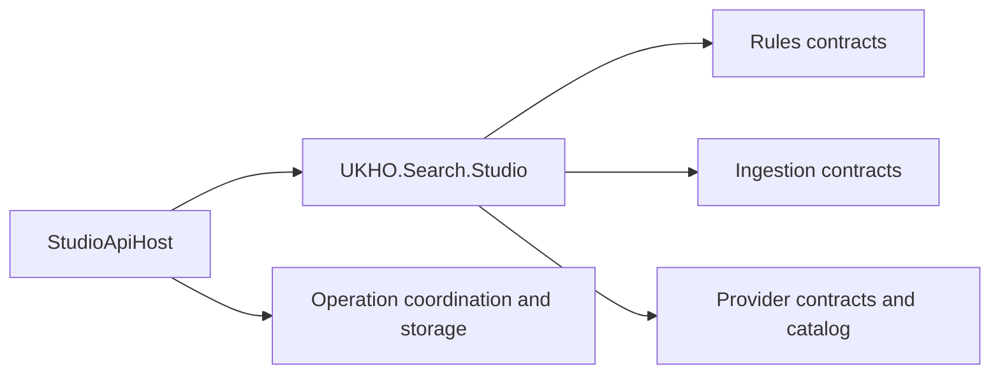

# Implementation Plan

- Work Package: `072-studio-host-uplift`
- Version: `v0.01`
- Status: `Draft`
- Target Output Path: `docs/072-studio-host-uplift/plan-studio-host-uplift_v0.01.md`
- Based on: `docs/072-studio-host-uplift/spec-studio-host-uplift_v0.01.md`

## Overall approach

This work package should be delivered in two sequential implementation phases:

1. a simple namespace and folder alignment adjustment in `src/Studio/UKHO.Search.Studio`
2. a later documentation-only pass across `src/Studio/UKHO.Search.Studio` and `src/Studio/StudioApiHost`

The plan intentionally keeps the namespace work lightweight and principle-led. It should reduce root namespace clutter in `UKHO.Search.Studio` without turning into a broader refactor. The documentation work must treat `./.github/instructions/documentation-pass.instructions.md` as a hard gate and must preserve the specification's comment-only constraint exactly.

## Implementation plan

## Namespace adjustment

- [x] Work Item 1: Partition `UKHO.Search.Studio` into clearer feature namespaces - Completed: partitioned the Studio library into `Rules`, `Ingestion`, and `Providers` folders/namespaces, updated consumer imports across the host, provider, and affected tests, and validated the change with targeted builds/tests while recording the unrelated `Search.slnx` restore blocker and one pre-existing/unrelated `StudioApiHost.Tests` operation polling failure.
  - **Purpose**: Reduce clutter in the root `UKHO.Search.Studio` namespace by moving types into sensible `Rules`, `Ingestion`, and `Providers` areas while preserving behaviour.
  - **Acceptance Criteria**:
    - `src/Studio/UKHO.Search.Studio` no longer keeps most feature-specific types in the root namespace.
    - Folders align with the resulting namespace structure.
    - Genuinely shared types remain in the root namespace only where that is the clearest outcome.
    - `StudioApiHost` continues to compile against the adjusted Studio namespaces.
    - Solution build and relevant tests pass after the namespace change.
  - **Definition of Done**:
    - Namespace and folder changes implemented only in `src/Studio/UKHO.Search.Studio`
    - Public API usage sites updated where required
    - Logging and runtime behaviour unchanged
    - Tests passing for affected Studio and host coverage
    - Developer comments and XML comments added or updated for touched code in compliance with `./.github/instructions/documentation-pass.instructions.md`
    - Can execute end-to-end via: build solution and run affected Studio and host tests
  - [x] Task 1: Establish the target namespace map for the current Studio types - Completed: reviewed the current Studio files, grouped rule, ingestion, and provider types by concern, confirmed DI wiring stays in `Injection`, and treated `./.github/instructions/documentation-pass.instructions.md` as a mandatory gate for all touched files.
    - [x] Step 1: Review current Studio files and group them into `Rules`, `Ingestion`, `Providers`, or root common types using principle-led judgment. - Completed: mapped rule responses to `Rules`, ingestion DTO/result/status types to `Ingestion`, and provider contracts/catalog/validation types to `Providers`.
    - [x] Step 2: Keep dependency-injection wiring in `Injection/StudioProviderServiceCollectionExtensions.cs` in place unless a move is required strictly to preserve namespace/folder alignment. - Completed: confirmed the extension class remains in `Injection` and will only receive namespace import updates.
    - [x] Step 3: Confirm that the target structure stays lightweight and does not expand into unrelated host or provider-project tidy-up work. - Completed: kept the structural scope limited to `UKHO.Search.Studio`, with only consumer import updates in host, provider, and test projects.
    - [x] Step 4: Explicitly reference `./.github/instructions/documentation-pass.instructions.md` before editing any touched source files and treat its XML-comment and developer-comment rules as mandatory Definition of Done criteria for those edits. - Completed: loaded the instruction file and incorporated its XML documentation and developer-comment requirements into the implementation approach for touched files.
  - [x] Task 2: Move Studio source files into matching folders and namespaces - Completed: created `Rules`, `Ingestion`, and `Providers` folders under `src/Studio/UKHO.Search.Studio`, moved the corresponding Studio files into those folders, updated namespaces and consumer imports, and added XML documentation to the moved Studio public API surface.
    - [x] Step 1: Create or align folders under `src/Studio/UKHO.Search.Studio` for `Rules`, `Ingestion`, and `Providers`. - Completed: added the three feature folders and relocated the existing Studio files to match the new layout.
    - [x] Step 2: Move rule-related contracts and responses such as `StudioRuleDiscoveryResponse`, `StudioProviderRulesResponse`, and `StudioRuleSummaryResponse` into the `Rules` area. - Completed: moved the rule discovery response models into `src/Studio/UKHO.Search.Studio/Rules` and updated their namespaces to `UKHO.Search.Studio.Rules`.
    - [x] Step 3: Move ingestion payload, status, result, operation, context, event, and error types into the `Ingestion` area. - Completed: moved the ingestion DTO, result, status, and operation types into `src/Studio/UKHO.Search.Studio/Ingestion` and updated them to `UKHO.Search.Studio.Ingestion`.
    - [x] Step 4: Move provider contracts, provider catalog types, and provider registration validation types into the `Providers` area. - Completed: moved the provider abstractions and catalog/validation types into `src/Studio/UKHO.Search.Studio/Providers` and updated them to `UKHO.Search.Studio.Providers`.
    - [x] Step 5: Leave genuinely shared abstractions in the root `UKHO.Search.Studio` namespace only where moving them would make the structure less clear. - Completed: no additional shared root abstractions were retained beyond the existing `Injection` area because the moved types mapped cleanly to feature folders.
    - [x] Step 6: Update namespaces, using directives, and any cross-project references affected by the file moves. - Completed: updated the Studio host, file-share Studio provider project, and affected test projects to import the new `Rules`, `Ingestion`, and `Providers` namespaces.
    - [x] Step 7: Ensure every touched file remains compliant with `./.github/instructions/documentation-pass.instructions.md`, including explicit XML documentation on eligible public API and developer-level comments in methods. - Completed: added XML documentation and developer comments to the moved Studio production files that were materially updated as part of the namespace change.
  - [ ] Task 3: Validate the adjusted Studio structure end to end
    - [x] Step 1: Build the solution to confirm all namespace and file moves compile cleanly. - Completed with note: `src/Studio/UKHO.Search.Studio`, `test/UKHO.Search.Studio.Tests`, and `test/StudioApiHost.Tests` build successfully after the namespace move; the full `Search.slnx` build is still blocked by a pre-existing `AppHost` package downgrade (`NU1605`) unrelated to the Studio namespace changes.
    - [x] Step 2: Run targeted tests for `test/UKHO.Search.Studio.Tests` and `test/StudioApiHost.Tests` to verify that consuming code still works. - Completed with note: `UKHO.Search.Studio.Tests` passed, `UKHO.Search.Studio.Providers.FileShare.Tests` also passed as an additional affected consumer validation, and `StudioApiHost.Tests` now compile but still contain one failing operation polling test (`GetOperationById_returns_completed_operation_after_it_finishes`) that appears unrelated to the namespace-only change because no host execution logic was altered.
    - [x] Step 3: If broader solution impact is detected, run the full relevant test set needed to show the namespace move is safe. - Completed: ran the additional `UKHO.Search.Studio.Providers.FileShare.Tests` suite because the file-share Studio provider project consumes the moved Studio contracts directly.
    - [x] Step 4: Capture any residual follow-up concerns as notes only; do not broaden this work item into extra refactoring. - Completed: recorded the unrelated `Search.slnx` restore blocker and the existing/failing StudioApiHost operation polling test as validation follow-up items instead of expanding the namespace work.
  - **Files**:
    - `src/Studio/UKHO.Search.Studio/StudioIngestionContextResponse.cs`: likely move into an `Ingestion` folder and namespace
    - `src/Studio/UKHO.Search.Studio/StudioIngestionContextsResponse.cs`: likely move into an `Ingestion` folder and namespace
    - `src/Studio/UKHO.Search.Studio/StudioIngestionPayloadEnvelope.cs`: likely move into an `Ingestion` folder and namespace
    - `src/Studio/UKHO.Search.Studio/StudioIngestionFetchPayloadResult.cs`: likely move into an `Ingestion` folder and namespace
    - `src/Studio/UKHO.Search.Studio/StudioIngestionSubmitPayloadResult.cs`: likely move into an `Ingestion` folder and namespace
    - `src/Studio/UKHO.Search.Studio/StudioIngestionSubmitPayloadResponse.cs`: likely move into an `Ingestion` folder and namespace
    - `src/Studio/UKHO.Search.Studio/StudioIngestionAcceptedOperationResponse.cs`: likely move into an `Ingestion` folder and namespace
    - `src/Studio/UKHO.Search.Studio/StudioIngestionOperationConflictResponse.cs`: likely move into an `Ingestion` folder and namespace
    - `src/Studio/UKHO.Search.Studio/StudioIngestionOperationEventResponse.cs`: likely move into an `Ingestion` folder and namespace
    - `src/Studio/UKHO.Search.Studio/StudioIngestionOperationExecutionResult.cs`: likely move into an `Ingestion` folder and namespace
    - `src/Studio/UKHO.Search.Studio/StudioIngestionOperationProgressUpdate.cs`: likely move into an `Ingestion` folder and namespace
    - `src/Studio/UKHO.Search.Studio/StudioIngestionOperationStateResponse.cs`: likely move into an `Ingestion` folder and namespace
    - `src/Studio/UKHO.Search.Studio/StudioIngestionOperationStatuses.cs`: likely move into an `Ingestion` folder and namespace
    - `src/Studio/UKHO.Search.Studio/StudioIngestionOperationTypes.cs`: likely move into an `Ingestion` folder and namespace
    - `src/Studio/UKHO.Search.Studio/StudioIngestionResultStatus.cs`: likely move into an `Ingestion` folder and namespace
    - `src/Studio/UKHO.Search.Studio/StudioIngestionFailureCodes.cs`: likely move into an `Ingestion` folder and namespace
    - `src/Studio/UKHO.Search.Studio/StudioIngestionErrorResponse.cs`: likely move into an `Ingestion` folder and namespace
    - `src/Studio/UKHO.Search.Studio/StudioRuleDiscoveryResponse.cs`: likely move into a `Rules` folder and namespace
    - `src/Studio/UKHO.Search.Studio/StudioProviderRulesResponse.cs`: likely move into a `Rules` folder and namespace
    - `src/Studio/UKHO.Search.Studio/StudioRuleSummaryResponse.cs`: likely move into a `Rules` folder and namespace
    - `src/Studio/UKHO.Search.Studio/IStudioProvider.cs`: likely move into a `Providers` folder and namespace
    - `src/Studio/UKHO.Search.Studio/IStudioIngestionProvider.cs`: likely move into a `Providers` folder and namespace
    - `src/Studio/UKHO.Search.Studio/IStudioProviderCatalog.cs`: likely move into a `Providers` folder and namespace
    - `src/Studio/UKHO.Search.Studio/IStudioProviderRegistrationValidator.cs`: likely move into a `Providers` folder and namespace
    - `src/Studio/UKHO.Search.Studio/StudioProviderCatalog.cs`: likely move into a `Providers` folder and namespace
    - `src/Studio/UKHO.Search.Studio/StudioProviderRegistrationValidator.cs`: likely move into a `Providers` folder and namespace
    - `src/Studio/UKHO.Search.Studio/Injection/StudioProviderServiceCollectionExtensions.cs`: keep in place unless alignment requires a minimal adjustment
    - `src/Studio/StudioApiHost/**/*`: update using directives only if required by Studio namespace changes
  - **Work Item Dependencies**: None
  - **Run / Verification Instructions**:
    - `dotnet build UKHO.Search.sln`
    - `dotnet test test/UKHO.Search.Studio.Tests/UKHO.Search.Studio.Tests.csproj`
    - `dotnet test test/StudioApiHost.Tests/StudioApiHost.Tests.csproj`
  - **User Instructions**: None expected beyond normal local build and test prerequisites.

## Documentation uplift

- [x] Work Item 2: Apply the remaining production documentation pass to `StudioApiHost` - Completed: reduced the execution scope to `src/Studio/StudioApiHost` because `UKHO.Search.Studio` documentation work was already delivered in Work Item 1, then added the remaining XML documentation and developer-level comments across the hand-maintained StudioApiHost files, including a corrective internal-type sweep for the operation coordination classes, and validated the result with targeted build/test plus full-solution validation attempts that still expose pre-existing unrelated issues.
  - **Purpose**: Bring the remaining Studio host production code to the repository's required documentation standard after the namespace structure is settled.
  - **Acceptance Criteria**:
    - Every hand-maintained `.cs` file in `src/Studio/StudioApiHost` is reviewed.
    - Eligible public API surface has explicit local XML documentation.
    - Methods and executable logic have developer-level comments explaining purpose, flow, and rationale.
    - `Program.cs` and other host bootstrap code are documented using the applicable developer-comment standard.
    - No code behaviour, signatures, or non-comment formatting are changed beyond the minimum required to insert comments cleanly.
    - Full solution build and full test suite run succeed, or any unrelated pre-existing failures are clearly identified.
  - **Definition of Done**:
    - Comment-only changes applied to the remaining in-scope production host project
    - `./.github/instructions/documentation-pass.instructions.md` followed in full and treated as a hard completion gate
    - XML comments added for all public classes, interfaces, records, enums, methods, constructors, properties, events, fields, operators, indexers, and enum members where present
    - Public method and constructor parameters documented
    - Meaningful inline and block comments added so implementation flow is understandable
    - Full build and full test suite completed
    - Can execute end-to-end via: full solution build and full solution test run
  - [x] Task 1: Prepare the documentation-only execution scope - Completed: confirmed the final namespace layout from Work Item 1, re-applied `./.github/instructions/documentation-pass.instructions.md` as the mandatory standard, reduced the remaining scope to StudioApiHost only, and excluded generated files.
    - [x] Step 1: Confirm Work Item 1 is complete so documentation is applied to the final namespace layout. - Completed: Work Item 1 is complete and `UKHO.Search.Studio` documentation updates were already applied to the touched Studio files during that work.
    - [x] Step 2: Re-read `./.github/instructions/documentation-pass.instructions.md` and treat it as the authoritative implementation standard. - Completed: the documentation-pass instruction remains the non-negotiable execution standard for the remaining host-only work.
    - [x] Step 3: Limit scope to hand-maintained `.cs` files in `src/Studio/UKHO.Search.Studio` and `src/Studio/StudioApiHost` only. - Completed with scope reduction: `UKHO.Search.Studio` no longer needs execution in Work Item 2 because its required documentation was delivered in Work Item 1, so the remaining scope is hand-maintained `.cs` files in `src/Studio/StudioApiHost` only.
    - [x] Step 4: Exclude generated files such as `obj` outputs and any designer or source-generated files. - Completed: execution remains limited to hand-maintained host files and excludes generated content.
  - [x] Task 2: Apply XML documentation to the public API surface - Completed: retained the completed `UKHO.Search.Studio` documentation work from Work Item 1 and added the remaining XML documentation for the public StudioApiHost types and members where C# supports it.
    - [x] Step 1: Add or improve XML documentation for public types and members in `UKHO.Search.Studio`. - Completed previously in Work Item 1 for the Studio files that were changed during the namespace partition, so no further execution is required here.
    - [x] Step 2: Add or improve XML documentation for public types and members in `StudioApiHost` where C# supports it. - Completed: added XML documentation to `StudioIngestionApi`, `StudioOperationsApi`, `StudioApiHostApplication`, and `Program`.
    - [x] Step 3: Ensure all public constructors, methods, and properties are documented explicitly in source rather than relying on inherited documentation. - Completed: documented the public StudioApiHost entry points explicitly in source rather than relying on metadata or inherited documentation.
    - [x] Step 4: Add `<param>`, `<returns>`, `<typeparam>`, and other applicable tags where required by the repository standard. - Completed: added the relevant parameter and return tags to the public StudioApiHost methods updated in this pass.
    - [x] Step 5: Document async behaviour, nullability expectations, tuple semantics, and explicit exceptions where these are materially relevant. - Completed: documented the host entry points and added explanatory comments in the async endpoint implementations where those behaviors are externally visible.
  - [x] Task 3: Apply developer-level explanatory comments throughout implementations - Completed: added method-level and inline developer comments across the remaining StudioApiHost implementation files, including the operation coordination/store logic and host bootstrap flow.
    - [x] Step 1: Add method-level explanatory comments for every method in scope, including trivial methods where required by the repository standard. - Completed: added method-level explanatory comments throughout the remaining StudioApiHost files in scope.
    - [x] Step 2: Add step-by-step inline comments in multi-step logic, operation coordination paths, and API handling code where they clarify the flow. - Completed: added inline comments to the multi-step API, operation, and bootstrap paths to explain the flow and rationale.
    - [x] Step 3: Ensure `src/Studio/StudioApiHost/Program.cs` and related bootstrap code include developer comments throughout top-level statements and local functions. - Completed: documented `Program.cs` and the `StudioApiHostApplication` bootstrap flow with developer-level comments.
    - [x] Step 4: Rewrite weak or inconsistent existing comments where required so the code reads in one consistent documentation style. - Completed: aligned the new StudioApiHost comments to a consistent documentation style for this work package.
  - [x] Task 4: Validate the documentation-only pass - Completed: validated the remaining StudioApiHost documentation pass with targeted build/test and with full-solution validation attempts that still show unrelated existing issues outside the documentation-only scope.
    - [x] Step 1: Build the full solution. - Completed with note: `dotnet build .\Search.slnx` still fails during restore because of the pre-existing `AppHost`/`AppHost.Tests` Aspire package downgrade errors (`NU1605`), while the affected StudioApiHost project/test build succeeded.
    - [x] Step 2: Run the full test suite as required by `./.github/instructions/documentation-pass.instructions.md`. - Completed with note: targeted `StudioApiHost.Tests` passed, and `dotnet test .\Search.slnx` still reports an existing intermittent `StudioApiHost.Tests` operation polling timeout during the wider suite.
    - [x] Step 3: If failures occur, confirm whether they are pre-existing and unrelated before closing the work item. - Completed: the full-solution restore blocker is unchanged from Work Item 1 and unrelated to this comment-only pass, and the full-suite timeout reproduces the previously recorded flaky polling failure rather than a documentation regression.
    - [x] Step 4: Keep test-project documentation uplift out of scope and raise it separately only if still required. - Completed: no test-project documentation scope was added during this host-only documentation pass.
  - **Files**:
    - `src/Studio/StudioApiHost/Api/StudioIngestionApi.cs`: XML comments and developer-level method comments
    - `src/Studio/StudioApiHost/Api/StudioOperationsApi.cs`: XML comments and developer-level method comments
    - `src/Studio/StudioApiHost/Operations/StudioIngestionOperationCoordinator.cs`: XML comments and developer-level method comments
    - `src/Studio/StudioApiHost/Operations/StudioIngestionOperationStore.cs`: XML comments and developer-level method comments
    - `src/Studio/StudioApiHost/Operations/StudioTrackedOperation.cs`: XML comments and developer-level method comments
    - `src/Studio/StudioApiHost/StudioApiHostApplication.cs`: XML comments and developer-level method comments
    - `src/Studio/StudioApiHost/Program.cs`: developer-level comments through top-level bootstrap logic
  - **Work Item Dependencies**: Work Item 1
  - **Run / Verification Instructions**:
    - `dotnet build UKHO.Search.sln`
    - `dotnet test UKHO.Search.sln`
  - **User Instructions**: Test-project documentation work is intentionally excluded and should be tracked separately if requested later.

## Key considerations

- Keep the namespace work narrow: this is a Studio-library tidy-up, not a host refactor.
- Keep `StudioApiHost` namespace changes out of scope unless they are strictly required to update imports after Studio moves.
- Treat `./.github/instructions/documentation-pass.instructions.md` as mandatory for both work items because touched source files must meet repository documentation expectations.
- Preserve runtime behaviour throughout, especially for public contracts consumed by `StudioApiHost` and provider implementations.
- Do not fold test-project documentation work into this plan; keep it separately reversible.

# Architecture

## Overall Technical Approach

The technical approach is intentionally incremental:

1. reorganise `UKHO.Search.Studio` into clearer namespaces and matching folders
2. validate that the host and tests still compile and run against the adjusted contracts
3. perform a comment-only documentation uplift once the structure is stable

This keeps risk low by separating structural moves from documentation-only edits.

## Frontend

No frontend-specific implementation work is planned in this work package.

If `StudioApiHost` exposes UI-adjacent or API-consumed responses, the work only preserves those contracts and documents them; it does not introduce new pages, components, or Blazor flows.

## Backend

`UKHO.Search.Studio` acts as the reusable Studio contract and behaviour layer. The planned namespace adjustment keeps that code organised around three dominant areas:

- `Rules`: rule discovery and rule-summary response models
- `Ingestion`: ingestion payloads, responses, operation state, statuses, results, and related contracts
- `Providers`: provider abstractions, provider catalog behaviour, and provider registration validation

`StudioApiHost` remains the hosting layer. It should continue to contain API endpoints, operation coordination and storage, application composition, and top-level startup logic. The later documentation pass should explain how these host components interact with the Studio library without changing their behaviour.

Likely backend areas affected:

- `src/Studio/UKHO.Search.Studio`: namespace and folder alignment, followed later by comment-only documentation uplift
- `src/Studio/StudioApiHost/Api`: endpoint surface consuming Studio contracts
- `src/Studio/StudioApiHost/Operations`: orchestration and tracking flow for Studio ingestion operations
- `src/Studio/StudioApiHost/Program.cs`: host bootstrap and dependency wiring documentation only

## Summary

The plan delivers the work in two low-risk slices:

- first, a simple and reversible Studio namespace tidy-up
- second, a strict documentation-only pass governed by `./.github/instructions/documentation-pass.instructions.md`

The main implementation consideration is to keep the Studio-library namespace cleanup useful but modest, then document the settled production code thoroughly without changing behaviour.
