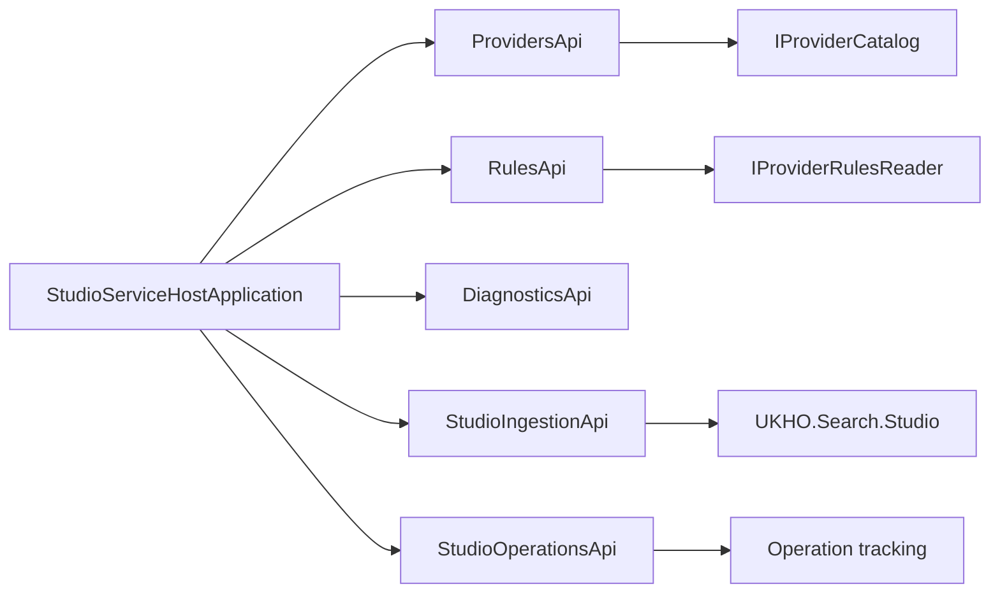

# Implementation Plan

- Work Package: `072-studio-host-uplift`
- Version: `v0.01`
- Status: `Draft`
- Target Output Path: `docs/072-studio-host-uplift/plan-studio-service-host-rename_v0.01.md`
- Based on: `docs/072-studio-host-uplift/spec-studio-service-host-rename_v0.01.md`

## Overall approach

This work should be delivered as a clean rename of the existing Studio host and its related test project from `StudioApiHost` to `StudioServiceHost`, while preserving runtime behavior and existing URL paths.

The implementation must keep the bootstrap reshape minimal:

1. rename folders, project files, namespaces, root namespaces, type names, test names, and user-facing host naming consistently
2. move only the inlined minimal API endpoint definitions currently inside `StudioApiHostApplication.cs` into dedicated `Api` classes
3. keep the extracted endpoint logic, route paths, and behavior materially unchanged
4. treat `./.github/instructions/documentation-pass.instructions.md` as a hard gate for every code-writing step, including internal and non-public types, constructors, and methods

## Implementation plan

## Host rename and endpoint relocation

- [x] Work Item 1: Rename the production host to `StudioServiceHost` and relocate the inlined bootstrap endpoints - Completed
  - Summary: Renamed `src/Studio/StudioApiHost` to `src/Studio/StudioServiceHost`, renamed the host project/bootstrap type to `StudioServiceHost`, extracted `/providers`, `/rules`, and `/echo` into `Api/ProvidersApi.cs`, `Api/RulesApi.cs`, and `Api/DiagnosticsApi.cs`, aligned dependent project references (`AppHost`, `Search.slnx`, and host-consuming test projects), and completed the documentation pass for touched production host files.
  - **Purpose**: Deliver a runnable renamed host project with consistent `StudioServiceHost` naming while keeping endpoint behavior and paths unchanged.
  - **Acceptance Criteria**:
    - The production host project folder, project file, namespace, root namespace, and primary bootstrap type use `StudioServiceHost` naming.
    - `StudioApiHostApplication.cs` is renamed to `StudioServiceHostApplication.cs` and its type is renamed accordingly.
    - The inlined `/providers`, `/rules`, and `/echo` minimal API definitions are moved out of the bootstrap into `ProvidersApi`, `RulesApi`, and `DiagnosticsApi` under the `Api` namespace.
    - Existing URL paths remain unchanged.
    - Endpoint logic is materially unchanged aside from the move and required naming updates.
    - The renamed production host builds and can start successfully.
  - **Definition of Done**:
    - Production host rename implemented
    - Inlined bootstrap endpoints relocated to new `Api` classes by concern
    - Existing `StudioIngestionApi` and `StudioOperationsApi` remain in place unless a rename is directly required
    - Naming is internally consistent across production host files, namespaces, and user-facing host strings
    - Code changes comply fully with `./.github/instructions/documentation-pass.instructions.md`, including explicit documentation on touched classes, methods, constructors, parameters, and non-public/internal types
    - Build and targeted host validation succeed
    - Can execute end-to-end via: build the renamed host and run the host test project against the unchanged routes
  - [x] Task 1: Rename the production host project structure and identities - Completed
    - Summary: Renamed the production host folder, project file, bootstrap file/type, namespaces, assembly/root namespace, and direct dependent references that had to follow the host rename.
    - [x] Step 1: Rename `src/Studio/StudioApiHost` to `src/Studio/StudioServiceHost`.
    - [x] Step 2: Rename `StudioApiHost.csproj` to `StudioServiceHost.csproj` and update project identity, assembly naming, and root namespace to `StudioServiceHost`.
    - [x] Step 3: Rename `StudioApiHostApplication.cs` and `StudioApiHostApplication` to `StudioServiceHostApplication`.
    - [x] Step 4: Update `Program.cs`, namespace declarations, using directives, and internal type references to the renamed host namespace.
    - [x] Step 5: Rename any production host class names and user-facing host strings that still embed `StudioApiHost` terminology.
    - [x] Step 6: Explicitly follow `./.github/instructions/documentation-pass.instructions.md` for every touched source file, including internal classes and constructors.
  - [x] Task 2: Relocate the inlined minimal API endpoint definitions into dedicated `Api` classes - Completed
    - Summary: Moved the bootstrap-owned `/providers`, `/rules`, and `/echo` endpoints into dedicated API mapping classes and trimmed the bootstrap down to service registration, middleware, OpenAPI/Scalar, and endpoint mapping.
    - [x] Step 1: Extract the existing `/providers` endpoint from the bootstrap into `Api/ProvidersApi.cs` without changing its route path or logic shape.
    - [x] Step 2: Extract the existing `/rules` endpoint from the bootstrap into `Api/RulesApi.cs` without changing its route path or logic shape.
    - [x] Step 3: Extract the existing `/echo` endpoint from the bootstrap into `Api/DiagnosticsApi.cs` without changing its route path or behavior, except for the intentional host-name string update.
    - [x] Step 4: Add mapping extension methods in the new `Api` classes so the bootstrap only maps them.
    - [x] Step 5: Keep `StudioIngestionApi` and `StudioOperationsApi` behavior intact and update naming only where directly required by the host rename.
    - [x] Step 6: Ensure the extracted endpoint classes and the trimmed bootstrap file are fully documented in line with `./.github/instructions/documentation-pass.instructions.md`.
  - [x] Task 3: Validate the renamed production host end to end - Completed
    - Summary: `dotnet build .\src\Studio\StudioServiceHost\StudioServiceHost.csproj`, `dotnet build .\test\StudioApiHost.Tests\StudioApiHost.Tests.csproj`, and `dotnet build .\test\UKHO.Search.Tests\UKHO.Search.Tests.csproj` succeeded; `dotnet test .\test\UKHO.Search.Tests\UKHO.Search.Tests.csproj --no-build --filter "FullyQualifiedName=UKHO.Search.Tests.Studio.StudioApiHostEchoEndpointTests.GetEcho_WhenRequested_ShouldReturnStudioApiHostMessage"` succeeded; `dotnet test .\test\StudioApiHost.Tests\StudioApiHost.Tests.csproj --no-build --logger "console;verbosity=minimal"` ran the unchanged-route host suite and reported 21 passing tests with 1 unrelated timeout in `StudioApiHostIngestionEndpointTests.GetOperationById_returns_completed_operation_after_it_finishes` while polling `/operations/{id}`.
    - [x] Step 1: Build the renamed production host project.
    - [x] Step 2: Verify route paths for `/providers`, `/rules`, `/echo`, ingestion, and operations remain unchanged.
    - [x] Step 3: Run targeted tests that exercise the renamed host behavior.
    - [x] Step 4: Record any unrelated pre-existing validation blockers without broadening the scope into unrelated fixes.
  - **Files**:
    - `src/Studio/StudioApiHost/StudioApiHost.csproj`: rename to `src/Studio/StudioServiceHost/StudioServiceHost.csproj` and update project identity
    - `src/Studio/StudioApiHost/StudioApiHostApplication.cs`: rename to `src/Studio/StudioServiceHost/StudioServiceHostApplication.cs` and remove the inlined minimal API definitions
    - `src/Studio/StudioApiHost/Program.cs`: update type and namespace references to `StudioServiceHost`
    - `src/Studio/StudioApiHost/Api/StudioIngestionApi.cs`: update namespace/project references if required by the host rename
    - `src/Studio/StudioApiHost/Api/StudioOperationsApi.cs`: update namespace/project references if required by the host rename
    - `src/Studio/StudioApiHost/Api/ProvidersApi.cs`: create and relocate the existing `/providers` endpoint here
    - `src/Studio/StudioApiHost/Api/RulesApi.cs`: create and relocate the existing `/rules` endpoint here
    - `src/Studio/StudioApiHost/Api/DiagnosticsApi.cs`: create and relocate the existing `/echo` endpoint here
    - `src/Studio/StudioApiHost/Operations/*.cs`: update namespaces and type references to the renamed host
  - **Work Item Dependencies**: None
  - **Run / Verification Instructions**:
    - `dotnet build .\src\Studio\StudioServiceHost\StudioServiceHost.csproj`
    - `dotnet build .\test\StudioServiceHost.Tests\StudioServiceHost.Tests.csproj`
    - Run the renamed host test suite against the unchanged routes
  - **User Instructions**: No manual action required.

## Test project rename and solution-wide reference alignment

- [x] Work Item 2: Rename the host test project and align solution references to `StudioServiceHost` - Completed
  - Summary: Renamed `test/StudioApiHost.Tests` to `test/StudioServiceHost.Tests`, renamed the test project, namespaces, and host test classes to `StudioServiceHost`, aligned `Search.slnx` and dependent references, updated the shared echo test name to `StudioServiceHost`, and completed the documentation pass for all touched test files.
  - **Purpose**: Deliver a consistently renamed test project and dependent references so the renamed host is fully validated under the new naming.
  - **Acceptance Criteria**:
    - The host test project folder, project file, namespace, and class names use `StudioServiceHost` terminology.
    - Solution and project references point to the renamed host and renamed test project.
    - Tests covering `/providers`, `/rules`, `/echo`, ingestion, operations, and host composition continue to pass.
    - No compatibility aliases or transitional references for `StudioApiHost` remain.
  - **Definition of Done**:
    - Test project rename implemented
    - Test class names updated consistently
    - References and solution entries updated to the renamed projects
    - Code changes comply fully with `./.github/instructions/documentation-pass.instructions.md`, including touched internal/non-public types and constructor/method comments where applicable
    - Targeted build and test validation completed
    - Can execute end-to-end via: build renamed host and renamed test project, then run renamed test suite successfully
  - [x] Task 1: Rename the host test project and test code identities - Completed
    - Summary: Renamed the host test folder, project file, root namespace, test namespaces, and the composition, provider, rules, ingestion, OpenAPI, and shared echo test class names to `StudioServiceHost` terminology while preserving test intent.
    - [x] Step 1: Rename `test/StudioApiHost.Tests` to `test/StudioServiceHost.Tests`.
    - [x] Step 2: Rename `StudioApiHost.Tests.csproj` to `StudioServiceHost.Tests.csproj` and update project identity and root namespace.
    - [x] Step 3: Rename test classes such as composition, provider, rules, ingestion, and OpenAPI tests from `StudioApiHost*` to `StudioServiceHost*`.
    - [x] Step 4: Update namespaces, using directives, and references to `StudioServiceHostApplication` and the renamed production host namespace.
    - [x] Step 5: Keep the test behavior intact aside from the rename and required naming updates.
  - [x] Task 2: Align solution and dependent references - Completed
    - Summary: Updated `Search.slnx` and code references to the renamed host test project and removed remaining non-generated `StudioApiHost` code references from the touched solution/test files.
    - [x] Step 1: Update solution entries to reference the renamed production and test projects.
    - [x] Step 2: Update any project references, file paths, and type references that still point at `StudioApiHost`.
    - [x] Step 3: Confirm that no compatibility aliases or shim references for the old naming remain.
    - [x] Step 4: Ensure touched files continue to satisfy `./.github/instructions/documentation-pass.instructions.md`.
  - [x] Task 3: Validate the renamed host and test estate - Completed
    - Summary: `dotnet build .\src\Studio\StudioServiceHost\StudioServiceHost.csproj`, `dotnet build .\test\StudioServiceHost.Tests\StudioServiceHost.Tests.csproj`, and `dotnet build .\test\UKHO.Search.Tests\UKHO.Search.Tests.csproj` succeeded; `dotnet test .\test\UKHO.Search.Tests\UKHO.Search.Tests.csproj --no-build --filter "FullyQualifiedName=UKHO.Search.Tests.Studio.StudioServiceHostEchoEndpointTests.GetEcho_WhenRequested_ShouldReturnStudioServiceHostMessage" --logger "console;verbosity=minimal"` succeeded; `dotnet test .\test\StudioServiceHost.Tests\StudioServiceHost.Tests.csproj --no-build --logger "console;verbosity=minimal"` ran the renamed host suite and reported 21 passing tests with 1 pre-existing/unrelated timeout in `StudioServiceHostIngestionEndpointTests.GetOperationById_returns_completed_operation_after_it_finishes` while polling `/operations/{id}`.
    - [x] Step 1: Build the renamed production host project.
    - [x] Step 2: Build the renamed host test project.
    - [x] Step 3: Run the renamed host test suite.
    - [x] Step 4: If full-solution validation is attempted and unrelated failures remain, record them as pre-existing/unrelated rather than broadening scope.
  - **Files**:
    - `test/StudioApiHost.Tests/StudioApiHost.Tests.csproj`: rename to `test/StudioServiceHost.Tests/StudioServiceHost.Tests.csproj`
    - `test/StudioApiHost.Tests/StudioApiHostCompositionTests.cs`: rename and update to `StudioServiceHostCompositionTests.cs`
    - `test/StudioApiHost.Tests/StudioApiHostProviderEndpointTests.cs`: rename and update to `StudioServiceHostProviderEndpointTests.cs`
    - `test/StudioApiHost.Tests/StudioApiHostRulesEndpointTests.cs`: rename and update to `StudioServiceHostRulesEndpointTests.cs`
    - `test/StudioApiHost.Tests/StudioApiHostIngestionEndpointTests.cs`: rename and update to `StudioServiceHostIngestionEndpointTests.cs`
    - `test/StudioApiHost.Tests/StudioApiHostOpenApiEndpointTests.cs`: rename and update to `StudioServiceHostOpenApiEndpointTests.cs`
    - `Search.slnx`: update project references to the renamed host and test projects
  - **Work Item Dependencies**: Work Item 1
  - **Run / Verification Instructions**:
    - `dotnet build .\src\Studio\StudioServiceHost\StudioServiceHost.csproj`
    - `dotnet build .\test\StudioServiceHost.Tests\StudioServiceHost.Tests.csproj`
    - `dotnet test .\test\StudioServiceHost.Tests\StudioServiceHost.Tests.csproj`
  - **User Instructions**: No manual action required.

## Key considerations

- Keep the endpoint extraction strictly as relocation of the existing `/providers`, `/rules`, and `/echo` definitions.
- Keep existing URL paths unchanged.
- Allow endpoint names and host-visible strings to move to `StudioServiceHost` terminology where needed for naming consistency.
- Do not rename existing `StudioIngestionApi` and `StudioOperationsApi` unless a direct rename dependency requires it.
- Treat `./.github/instructions/documentation-pass.instructions.md` as mandatory for every touched source file, including internal classes, constructors, and methods.
- Do not introduce compatibility shims or aliases for the old host naming.

# Architecture

## Overall Technical Approach

The technical approach is a clean coordinated rename of the Studio host and its test project, combined with a minimal bootstrap cleanup that relocates only the currently inlined minimal API definitions.

## Frontend

No frontend-specific implementation work is planned.

Any frontend or shell consumers should continue using the existing URL paths. The goal is host renaming and bootstrap endpoint relocation, not UI or Blazor flow changes.

## Backend

The backend work is limited to the Studio host and its related test project.

Planned backend structure after implementation:

- `src/Studio/StudioServiceHost`: renamed production host project
- `src/Studio/StudioServiceHost/StudioServiceHostApplication.cs`: renamed bootstrap/application composition type
- `src/Studio/StudioServiceHost/Api/StudioIngestionApi.cs`: existing ingestion endpoints retained
- `src/Studio/StudioServiceHost/Api/StudioOperationsApi.cs`: existing operation endpoints retained
- `src/Studio/StudioServiceHost/Api/ProvidersApi.cs`: relocated `/providers` endpoint
- `src/Studio/StudioServiceHost/Api/RulesApi.cs`: relocated `/rules` endpoint
- `src/Studio/StudioServiceHost/Api/DiagnosticsApi.cs`: relocated `/echo` endpoint
- `src/Studio/StudioServiceHost/Operations/*`: renamed host namespace and related operation types
- `test/StudioServiceHost.Tests`: renamed host test project with updated namespaces and test class names

The relocation of `/providers`, `/rules`, and `/echo` should preserve route behavior and logic shape while making the bootstrap responsible only for service registration, middleware, OpenAPI/Scalar, and endpoint mapping.

## Summary

The plan delivers the rename in two sequential slices:

- first, rename the production host and relocate the remaining inlined bootstrap endpoints into dedicated API classes
- second, rename the host test project and align references/validation across the solution

The main implementation constraint is to keep behavior unchanged while making naming fully consistent and moving only the existing inlined minimal API definitions out of startup.
