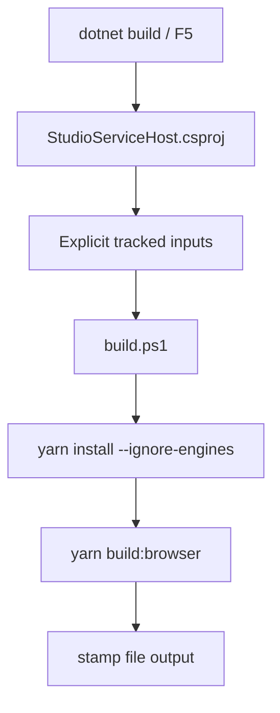

# Implementation Plan + Architecture

**Target output path:** `docs/073-new-theia-shell/plan-new-theia-shell_v0.01.md`

**Based on:** `docs/073-new-theia-shell/spec-new-theia-shell_v0.01.md`

**Version:** `v0.01` (`Draft`)

---

# Implementation Plan

## Planning constraints and delivery posture

- This plan is based on `docs/073-new-theia-shell/spec-new-theia-shell_v0.01.md`.
- All implementation work that creates or updates source code must comply fully with `./.github/instructions/documentation-pass.instructions.md`.
- `./.github/instructions/documentation-pass.instructions.md` is a **hard gate** for completion of every code-writing Work Item in this plan.
- For every code-writing Work Item, implementation must:
  - add developer-level comments to every class, including internal and other non-public types
  - add developer-level comments to every method and constructor, including internal and other non-public members
  - add parameter comments for every public method and constructor parameter
  - add comments to every property whose meaning is not obvious from its name
  - add sufficient inline or block comments so a developer can follow purpose, flow, and any non-obvious logic
- The plan is organized as vertical slices. Each Work Item ends in a runnable, demonstrable capability.
- Unless explicitly changed by the specification, remaining low-level behavior should follow what the old project already did.

---

## Slice 1 — Fresh scaffold migration with unchanged build/F5/Aspire behavior

- [ ] Work Item 1: Move the old shell aside and stand up a fresh Theia scaffold that runs through the **same** build, `F5`, and Aspire integration model
  - **Purpose**: Deliver the smallest meaningful end-to-end capability by replacing the active shell workspace with a newly generated Theia project while preserving the exact repository integration model that already worked: `build.ps1`, `StudioServiceHost.csproj` tracked inputs, `AppHost` JavaScript resource wiring, fixed port configuration, runtime environment bridge, and local developer `F5` flow.
  - **Acceptance Criteria**:
    - The current `src/Studio/Server` workspace is moved to `src/Studio/OldServer`.
    - `src/Studio/OldServer` is excluded from active JavaScript workspace declarations and active tooling scope.
    - A fresh generated Theia workspace exists at `src/Studio/Server`.
    - The new workspace preserves the repo-facing structure and names where practical, including `browser-app`, `search-studio`, `build:browser`, `start:browser`, and `build.ps1`.
    - `src/Studio/StudioServiceHost/StudioServiceHost.csproj` still uses the same explicit tracked-input and stamp-file incremental build pattern in substance.
    - `src/Hosts/AppHost/AppHost.cs` still hosts the shell as the same kind of JavaScript app resource in substance.
    - The shell still receives `STUDIO_API_HOST_API_BASE_URL` with the exact same environment variable name.
    - The shell runs over HTTPS using the configured fixed port pattern from `AppHost` configuration.
    - The runtime bridge preserves the same same-origin backend configuration-endpoint pattern used by the old shell.
  - **Definition of Done**:
    - New scaffold created and runnable through the existing Studio host integration path
    - `src/Studio/OldServer` no longer participates in active workspace/build/run behavior
    - Existing Theia build model preserved in substance: `build.ps1`, tracked inputs, stamp-file outputs, `AppHost` JavaScript resource, fixed port configuration, exact environment variable name
    - Logging and error handling added where needed to keep shell startup and build failures diagnosable
    - Code comments and documentation added in full compliance with `./.github/instructions/documentation-pass.instructions.md`
    - Unit/integration tests added or updated where practical for host/build integration assumptions
    - Can execute end to end via: Visual Studio `F5` on `AppHost`, then opening the new Studio shell on the configured local HTTPS endpoint
  - [ ] Task 1.1: Move the legacy shell into `OldServer` and make it non-active
    - [ ] Step 1: Move `src/Studio/Server` to `src/Studio/OldServer` without changing its contents beyond what is necessary to stop it being part of the active workspace.
    - [ ] Step 2: Remove `src/Studio/OldServer` from active JavaScript workspace declarations, package-manager workspace scope, and any other active monorepo/tooling participation.
    - [ ] Step 3: Verify active build/start scripts, workspace manifests, and editor tooling all target the new `src/Studio/Server` only.
    - [ ] Step 4: Keep `src/Studio/OldServer` available purely as reference files until deletion.
    - [ ] Step 5: Apply `./.github/instructions/documentation-pass.instructions.md` in full to any source files touched during this migration step.
  - [ ] Task 1.2: Generate the fresh Theia scaffold and preserve the old repo-facing shape where practical
    - [ ] Step 1: Generate a fresh Theia project at `src/Studio/Server` using the Yeoman-based approach described in the specification.
    - [ ] Step 2: Keep the generated scaffold close to generator output, only making the minimum customizations needed for repository integration.
    - [ ] Step 3: Preserve existing internal workspace/package names where practical, especially `browser-app` and `search-studio`.
    - [ ] Step 4: Preserve existing root script names where practical, especially `build:browser` and `start:browser`.
    - [ ] Step 5: Preserve Studio product/application naming by copying the relevant branding configuration from the old project into new files as needed.
    - [ ] Step 6: Apply `./.github/instructions/documentation-pass.instructions.md` in full to any source files created or updated.
  - [ ] Task 1.3: Recreate the exact existing Theia build and Visual Studio integration model
    - [ ] Step 1: Recreate `src/Studio/Server/build.ps1` as the explicit shell build entrypoint.
    - [ ] Step 2: Carry forward the known Node/Yarn/nvm/toolchain handling from the repository wiki, including Node `18.20.4`, Yarn classic, `yarn install --ignore-engines`, and Visual Studio toolchain cleanup.
    - [ ] Step 3: Update `src/Studio/StudioServiceHost/StudioServiceHost.csproj` so it still uses explicit tracked inputs and a stamp-file output in the same style as the old project.
    - [ ] Step 4: Ensure the `StudioServiceHost.csproj` target still runs before normal build and still behaves incrementally for `F5`.
    - [ ] Step 5: Apply `./.github/instructions/documentation-pass.instructions.md` in full to every code file touched, including all internal and non-public members.
  - [ ] Task 1.4: Recreate the exact existing Aspire shell-hosting pattern, with HTTPS as the intended protocol exception
    - [ ] Step 1: Keep the shell registered from `src/Hosts/AppHost/AppHost.cs` as the same kind of JavaScript app resource in substance.
    - [ ] Step 2: Keep the fixed local port configuration pattern exactly the same, still read from `src/Hosts/AppHost/appsettings.json` in the same way.
    - [ ] Step 3: Keep the exact environment variable name `STUDIO_API_HOST_API_BASE_URL`.
    - [ ] Step 4: Update the shell hosting path so the local shell endpoint is HTTPS, acknowledging this as the intentional exception to otherwise unchanged hosting behavior.
    - [ ] Step 5: Apply `./.github/instructions/documentation-pass.instructions.md` in full to any touched host/source files.
  - [ ] Task 1.5: Recreate the same-origin runtime configuration bridge pattern
    - [ ] Step 1: Preserve the same same-origin backend configuration-endpoint pattern used by the old shell for surfacing runtime configuration to browser code.
    - [ ] Step 2: Preserve the same endpoint path where practical by defaulting to what the old project did.
    - [ ] Step 3: Ensure browser-side services continue to resolve the Studio API base address through that backend bridge instead of hard-coded browser configuration.
    - [ ] Step 4: Apply `./.github/instructions/documentation-pass.instructions.md` in full to every touched source file.
  - [ ] Task 1.6: Add integration protection and verification for the bootstrap slice
    - [ ] Step 1: Add or update tests for `StudioServiceHost` / `AppHost` assumptions where practical, especially around preserved endpoint/configuration behavior.
    - [ ] Step 2: Add frontend-side tests or smoke checks confirming the runtime configuration bridge is usable from the fresh shell.
    - [ ] Step 3: Document a manual smoke path covering build, `F5`, HTTPS startup, and shell launch from the new workspace.
    - [ ] Step 4: Apply `./.github/instructions/documentation-pass.instructions.md` in full to all code touched by the test-support work.
  - **Files**:
    - `src/Studio/Server/package.json`: root workspace scripts and workspace declarations for the active shell
    - `src/Studio/Server/build.ps1`: explicit incremental Theia build entrypoint
    - `src/Studio/Server/browser-app/package.json`: browser app package scripts/config
    - `src/Studio/Server/search-studio/package.json`: native Theia extension package metadata
    - `src/Studio/StudioServiceHost/StudioServiceHost.csproj`: preserved tracked-input/stamp-file build integration
    - `src/Hosts/AppHost/AppHost.cs`: preserved JavaScript app resource wiring
    - `src/Hosts/AppHost/appsettings.json`: preserved fixed port configuration source
    - `src/Studio/StudioServiceHost/StudioServiceHostApplication.cs`: preserved CORS/runtime shell-origin behavior and API host wiring
    - `src/Studio/OldServer/*`: moved legacy workspace, excluded from active workspaces/tooling
    - `test/StudioServiceHost.Tests/*`: integration/contract protection where practical
  - **Work Item Dependencies**: None.
  - **Run / Verification Instructions**:
    - `yarn --cwd .\src\Studio\Server build:browser`
    - `dotnet build .\src\Studio\StudioServiceHost\StudioServiceHost.csproj`
    - Start `AppHost` with Visual Studio `F5`
    - Open the shell on the configured HTTPS endpoint from `src/Hosts/AppHost/appsettings.json`
    - Verify the new scaffold launches and the old workspace is not part of active build/run behavior
  - **User Instructions**:
    - Use the documented Node/Yarn baseline from the repository wiki before running the new shell build.

---

## Slice 2 — Studio-branded `Home` document restored as the default landing surface

- [ ] Work Item 2: Add the Studio-branded `Home` page, startup/open-again behavior, and copied logo asset
  - **Purpose**: Deliver the first Studio-specific user-facing capability on top of the fresh shell by restoring a branded `Home` document that opens by default, is closable, can be shown again from `View`, and reuses the old project’s acceptable layout and branding decisions without pulling in the old UI structure.
  - **Acceptance Criteria**:
    - A Studio `Home` page opens automatically on startup.
    - `Home` opens as a normal closable document tab.
    - `Home` is available again from the Theia `View` menu.
    - Old `View` menu command naming for showing `Home` is preserved where practical.
    - The page displays the copied `docs/ukho-logo-transparent.png` asset and short orientation text.
    - The page reuses the acceptable layout pattern from the old project, but only as a close-enough placeholder.
    - The Studio title/product branding is preserved from the old project’s branding configuration.
    - Generated welcome/getting-started surfaces may remain for now alongside `Home`.
  - **Definition of Done**:
    - `Home` document/widget contribution implemented and wired into normal Theia document behavior
    - Studio branding/title preserved via copied branding configuration where required
    - UKHO logo copied into runtime-served assets and used from there rather than from `docs/`
    - `Home` default-open and `View` menu reopen behavior implemented
    - Logging and error handling added where useful for document/opening failures
    - Code comments and documentation added in full compliance with `./.github/instructions/documentation-pass.instructions.md`
    - Frontend tests and/or host smoke checks added where practical
    - Can execute end to end via: launching the shell, seeing `Home`, closing it, and reopening it from `View`
  - [ ] Task 2.1: Add the Studio `Home` document contribution
    - [ ] Step 1: Add the `Home` widget/document contribution in the new `search-studio` frontend package.
    - [ ] Step 2: Keep `Home` as a normal closable document tab, not a pinned special surface.
    - [ ] Step 3: Keep low-level behavior aligned to what the old project did where practical.
    - [ ] Step 4: Apply `./.github/instructions/documentation-pass.instructions.md` in full to every source file created or updated.
  - [ ] Task 2.2: Restore startup-open and `View` menu reopen behavior
    - [ ] Step 1: Open `Home` by default during shell startup.
    - [ ] Step 2: Add a `View` menu action/command that shows `Home` again after it is closed.
    - [ ] Step 3: Preserve the old `View` menu command naming where practical.
    - [ ] Step 4: Allow default generated surfaces to coexist for now if they still open.
    - [ ] Step 5: Apply `./.github/instructions/documentation-pass.instructions.md` in full to all touched code.
  - [ ] Task 2.3: Copy the UKHO logo asset and restore Studio branding configuration
    - [ ] Step 1: Copy `docs/ukho-logo-transparent.png` into the active runtime asset location for the new shell.
    - [ ] Step 2: Use the copied runtime asset on `Home`; do not serve from `docs/`.
    - [ ] Step 3: Copy the relevant old-project branding configuration needed to keep the Studio name/title.
    - [ ] Step 4: Do not broaden scope into favicon/app-icon/browser-branding migration beyond what the specification requires.
    - [ ] Step 5: Apply `./.github/instructions/documentation-pass.instructions.md` in full to every touched source file.
  - [ ] Task 2.4: Build the lightweight `Home` presentation
    - [ ] Step 1: Reuse the acceptable old layout pattern by copying the relevant markup/styling concepts into new files only.
    - [ ] Step 2: Keep the page intentionally light: logo plus orientation text.
    - [ ] Step 3: Avoid links, jump points, or future-workbench structure beyond what is already specified.
    - [ ] Step 4: Accept rough placeholder presentation because visual polish is deferred to later work.
    - [ ] Step 5: Apply `./.github/instructions/documentation-pass.instructions.md` in full to every touched source file.
  - [ ] Task 2.5: Add verification coverage for the `Home` slice
    - [ ] Step 1: Add frontend tests for `Home` open/reopen behavior where practical.
    - [ ] Step 2: Add smoke verification for closable-tab behavior and `View` menu reopening.
    - [ ] Step 3: Update any Studio wiki/build guidance needed for the restored `Home` experience.
    - [ ] Step 4: Apply `./.github/instructions/documentation-pass.instructions.md` in full to all code touched during test/documentation support work.
  - **Files**:
    - `src/Studio/Server/search-studio/src/browser/home/*`: `Home` widget/component and helpers
    - `src/Studio/Server/search-studio/src/browser/search-studio-frontend-module.ts`: bindings for `Home` services/widgets
    - `src/Studio/Server/search-studio/src/browser/search-studio-command-contribution.ts`: `Home` command registration
    - `src/Studio/Server/search-studio/src/browser/search-studio-menu-contribution.ts`: `View` menu integration
    - `src/Studio/Server/search-studio/src/browser/assets/*`: copied UKHO logo runtime asset
    - `src/Studio/Server/search-studio/package.json`: asset-copy or package support if needed
    - `src/Studio/Server/browser-app/package.json`: branding/title support if needed
    - `src/Studio/Server/search-studio/test/*`: `Home` open/reopen behavior coverage
  - **Work Item Dependencies**: Work Item 1.
  - **Run / Verification Instructions**:
    - `yarn --cwd .\src\Studio\Server build:browser`
    - Start `AppHost` with Visual Studio `F5`
    - Open the shell on the configured HTTPS endpoint
    - Verify `Home` opens, close it, reopen it from `View`, and confirm Studio branding/title and logo are correct
  - **User Instructions**:
    - None beyond the normal Studio shell prerequisites from Slice 1.

---

## Slice 3 — `Home` page manual smoke-test button using `StudioServiceHost` `/echo`

- [ ] Work Item 3: Add a manual `test` button to `Home` that calls `/echo` and shows the returned text
  - **Purpose**: Deliver a minimal but complete end-to-end smoke-test slice proving that the new browser shell can call `StudioServiceHost` through the preserved runtime configuration bridge and surface returned data on the `Home` page.
  - **Acceptance Criteria**:
    - The `Home` page includes a simple button labelled `test`.
    - Clicking the button calls `StudioServiceHost` `/echo` using the runtime-discovered API base address.
    - The returned text is displayed next to the button.
    - The smoke-test UI is intentionally plain; formatting polish is not required.
    - Existing `/echo` behavior is preserved if already present.
  - **Definition of Done**:
    - Smoke-test button and response display implemented end to end
    - `StudioServiceHost` `/echo` availability retained or minimally protected by tests
    - Runtime bridge reused rather than bypassed
    - Logging and error handling added so failures are visible during manual smoke testing
    - Code comments and documentation added in full compliance with `./.github/instructions/documentation-pass.instructions.md`
    - Tests added where practical, plus a documented manual smoke path
    - Can execute end to end via: open `Home`, click `test`, observe returned `/echo` text next to the button
  - [ ] Task 3.1: Confirm and preserve the existing `/echo` host endpoint
    - [ ] Step 1: Verify the existing `StudioServiceHost` diagnostics endpoint shape and keep it aligned with current behavior.
    - [ ] Step 2: If minimal test coverage is missing, add focused coverage protecting the `/echo` endpoint contract.
    - [ ] Step 3: Avoid unnecessary redesign because this work item only needs the existing smoke-test endpoint.
    - [ ] Step 4: Apply `./.github/instructions/documentation-pass.instructions.md` in full to all touched code.
  - [ ] Task 3.2: Add a browser-side smoke-test action on `Home`
    - [ ] Step 1: Add a simple `test` button to the `Home` page.
    - [ ] Step 2: Wire the click action through the existing runtime-discovered Studio API base address.
    - [ ] Step 3: Call `/echo` using the preserved same-origin bridge and backend API base resolution path.
    - [ ] Step 4: Display the returned text next to the button.
    - [ ] Step 5: Keep presentation intentionally minimal with no formatting polish work.
    - [ ] Step 6: Apply `./.github/instructions/documentation-pass.instructions.md` in full to every touched source file.
  - [ ] Task 3.3: Add error handling, logging, and smoke-test verification
    - [ ] Step 1: Show a simple failure state next to the button if the `/echo` call fails.
    - [ ] Step 2: Log smoke-test action/failure details consistently with the shell’s output/logging approach.
    - [ ] Step 3: Add frontend tests for the smoke-test action where practical.
    - [ ] Step 4: Add a documented manual smoke path covering successful `/echo` display.
    - [ ] Step 5: Apply `./.github/instructions/documentation-pass.instructions.md` in full to all code touched during this work.
  - **Files**:
    - `src/Studio/Server/search-studio/src/browser/home/*`: smoke-test button and result display
    - `src/Studio/Server/search-studio/src/browser/api/*`: browser-side API client/service call path if a dedicated helper is needed
    - `src/Studio/StudioServiceHost/Api/DiagnosticsApi.cs`: existing `/echo` endpoint protection if test/support changes are needed
    - `test/StudioServiceHost.Tests/*`: `/echo` endpoint coverage if missing
    - `src/Studio/Server/search-studio/test/*`: smoke-test button/action coverage
  - **Work Item Dependencies**: Work Item 1 and Work Item 2.
  - **Run / Verification Instructions**:
    - `yarn --cwd .\src\Studio\Server build:browser`
    - Start `AppHost` with Visual Studio `F5`
    - Open the shell on the configured HTTPS endpoint
    - On `Home`, click `test` and verify the returned `/echo` text appears next to the button
  - **User Instructions**:
    - None beyond normal shell startup.

---

## Overall approach summary

This plan keeps delivery vertical and reviewable:

1. first replace the active Theia workspace without changing the working build/host integration model the team already trusts
2. then restore the Studio-branded `Home` document as the first user-facing slice
3. finally add a tiny but complete manual smoke test proving the browser shell can call `StudioServiceHost` and render the result

Key implementation considerations:

- preserve the working old-project integration model exactly in substance unless the specification explicitly changes it
- treat `src/Studio/OldServer` strictly as reference-only and remove it from active workspace/tooling participation
- keep the new scaffold close to generator output, but preserve repo-facing names and scripts where practical
- keep the same same-origin configuration-endpoint bridge pattern and exact `STUDIO_API_HOST_API_BASE_URL` variable name
- use HTTPS for the shell endpoint as the one intentional protocol-level exception
- keep all code-writing work gated by `./.github/instructions/documentation-pass.instructions.md`

---

# Architecture

## Overall Technical Approach

The implementation keeps the current repository hosting and build model intact while swapping the active Theia workspace for a fresh scaffold.

High-level approach:
- `AppHost` continues to orchestrate `StudioServiceHost` and the Studio shell
- the Studio shell remains a browser-hosted JavaScript application rooted at `src/Studio/Server`
- `StudioServiceHost.csproj` continues to build the Theia shell before normal .NET build using `build.ps1` and explicit tracked inputs
- the shell continues to obtain its runtime API base address from `STUDIO_API_HOST_API_BASE_URL`
- browser code continues to obtain configuration through the same same-origin backend configuration-endpoint pattern used by the old shell
- `Home` becomes the first Studio-specific document surface, with the `/echo` smoke test proving the end-to-end browser-to-host path

```mermaid
flowchart LR
    VS[Visual Studio F5] --> AppHost[AppHost]
    AppHost --> StudioHost[StudioServiceHost]
    AppHost --> ShellProc[Theia Shell Process]
    ShellProc --> BrowserApp[browser-app]
    BrowserApp --> SearchStudio[search-studio frontend]
    SearchStudio --> ConfigEndpoint[same-origin configuration endpoint]
    ConfigEndpoint --> StudioHost
    SearchStudio --> EchoCall[/echo via STUDIO_API_HOST_API_BASE_URL]
    EchoCall --> StudioHost
```



## Frontend

Frontend scope is centered in the new Theia workspace under `src/Studio/Server`.

Primary frontend areas:
- `src/Studio/Server/browser-app`
  - hosts the browser-side Theia application package
  - continues to provide the shell startup/build entrypoints expected by `AppHost`
- `src/Studio/Server/search-studio`
  - contains the Studio-specific Theia frontend extension
  - owns the `Home` document contribution, branding-related frontend behavior, and the manual smoke-test button
- `src/Studio/Server/search-studio/src/browser/home/*`
  - owns the restored `Home` page widget/document
  - displays the copied UKHO logo and orientation text
  - hosts the `test` button and returned `/echo` text display
- `src/Studio/Server/search-studio/src/browser/api/*`
  - uses the runtime-discovered Studio API base address to call backend endpoints
  - supports the `/echo` smoke-test interaction
- `src/Studio/Server/search-studio/src/browser/assets/*`
  - contains the copied runtime-served `UKHO` logo asset

User flow:
1. user launches the shell through the normal Studio `F5` / `AppHost` path
2. `Home` opens automatically in the main workbench area
3. user can reopen `Home` from `View`
4. user clicks `test`
5. frontend calls `/echo` through the preserved runtime bridge
6. returned text is displayed beside the button

## Backend

Backend scope remains concentrated in existing host/orchestration projects rather than introducing a new backend model.

Primary backend areas:
- `src/Hosts/AppHost/AppHost.cs`
  - continues to register the shell as the same kind of JavaScript application resource
  - continues to provide shell-port configuration and `STUDIO_API_HOST_API_BASE_URL`
  - is the orchestration entrypoint used for Visual Studio `F5`
- `src/Hosts/AppHost/appsettings.json`
  - remains the source of the fixed shell port configuration in the same style as today
- `src/Studio/StudioServiceHost/StudioServiceHost.csproj`
  - preserves the exact tracked-input + stamp-file build integration pattern
  - ensures Theia assets are ready during normal build/`F5`
- `src/Studio/StudioServiceHost/StudioServiceHostApplication.cs`
  - keeps the backend endpoint composition and runtime middleware wiring
  - continues to support the shell’s same-origin configuration-bridge expectations
- `src/Studio/StudioServiceHost/Api/DiagnosticsApi.cs`
  - already exposes `/echo`
  - is reused as the manual smoke-test backend endpoint

Backend data flow:
1. `AppHost` resolves and injects the Studio API base address
2. the shell accesses runtime configuration through the preserved same-origin backend pattern
3. the `Home` smoke-test action calls `/echo` on `StudioServiceHost`
4. `StudioServiceHost` returns text
5. the browser renders the returned text next to the `test` button

---

## Summary / Key considerations

- Preserve the existing working operational model first; do not “improve” the build/host wiring away from what already worked.
- Keep the new scaffold close to generator output, but preserve the repo-facing names and scripts that make the current build and `F5` story reliable.
- Treat `Home` as a minimal vertical slice, not as the start of reintroducing the old workbench structure.
- Use the `/echo` smoke test as the first proof that runtime configuration, frontend calls, and backend availability are correctly re-established.
- Treat `./.github/instructions/documentation-pass.instructions.md` as a mandatory Definition of Done gate for every future code-writing task in this work package.
