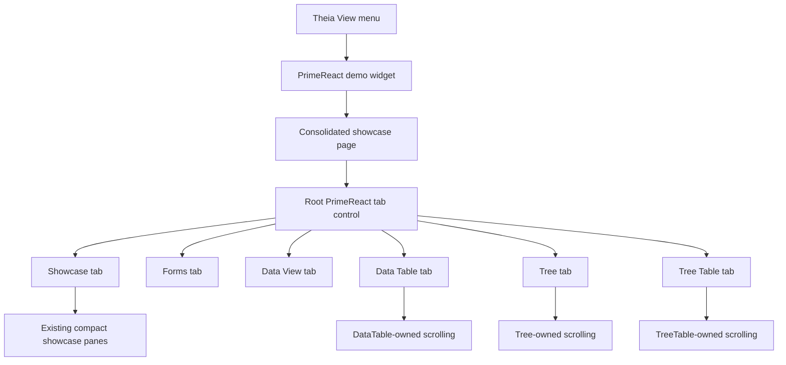

# Implementation Plan + Architecture

**Target output path:** `docs/074-primereact-research/plan-frontend-primereact-showcase-tabbed-consolidation_v0.01.md`

**Based on:** `docs/074-primereact-research/spec-frontend-primereact-showcase-tabbed-consolidation_v0.01.md`

**Version:** `v0.01` (`Draft`)

---

# Implementation Plan

## Planning constraints and delivery posture

- This plan is based on `docs/074-primereact-research/spec-frontend-primereact-showcase-tabbed-consolidation_v0.01.md`.
- All implementation work that creates or updates source code must comply fully with `./.github/instructions/documentation-pass.instructions.md`.
- `./.github/instructions/documentation-pass.instructions.md` is a **hard gate** for completion of every code-writing Work Item in this plan.
- For every code-writing Work Item, implementation must:
  - add developer-level comments to every class, including internal and other non-public types
  - add developer-level comments to every method and constructor, including internal and other non-public members
  - add parameter comments for every public method and constructor parameter where those constructs exist
  - add comments to every property whose meaning is not obvious from its name
  - add sufficient inline or block comments so a developer can follow purpose, flow, and any non-obvious logic
- This work item is frontend-only and scoped to the temporary PrimeReact research area inside the Theia Studio shell.
- The primary goal is assessment of look and feel, layout density, and scroll ownership rather than detailed behavioural design.
- The current repository direction for PrimeReact research demos is full styled PrimeReact only; this plan must not reintroduce unstyled mode or styled/unstyled toggles.
- The existing compact showcase styling is a non-negotiable baseline and must remain intact while becoming the shared visual contract for the retained tabs.
- The final result must expose only one PrimeReact entry point from `View`, implemented as the consolidated showcase page.
- The root tab control must contain the whole experience, without a toolbar above it and without new outer padding that loosens the current compact density.
- The plan is organized as small vertical slices. Each Work Item ends in a runnable, reviewable improvement inside the existing Theia shell.
- After completing code changes for Theia Studio shell work, execution should run `yarn --cwd .\src\Studio\Server build:browser` so the user does not run stale frontend code.

## Baseline

- The temporary PrimeReact research area currently exposes multiple standalone pages from the Theia `View` menu.
- The current showcase page already has the preferred compact desktop-style density, flatter chrome, and pane-owned scrolling behaviour.
- The forms, `Data View`, `Data Table`, `Tree`, and `Tree Table` pages currently exist as separate pages with their own page-local composition.
- Additional PrimeReact pages such as layout/container demos are no longer required.
- Existing automated coverage already verifies demo activation and menu wiring and will likely need updating as the entry model changes from many pages to one page.

## Delta

- Introduce a root PrimeReact tab control into the showcase page.
- Keep the existing showcase content as the `Showcase` tab.
- Move the content of `Forms`, `Data View`, `Data Table`, `Tree`, and `Tree Table` into sibling tabs in the fixed required order.
- Preserve the current showcase styling and make it the inherited baseline for the migrated tab content.
- Keep the experience compact, flat, desktop-like, and scroll-owner-driven rather than article-like.
- Remove all other standalone PrimeReact pages, page registrations, and menu entries, including source code for retired pages.
- Keep only a single stable showcase title and a single `View` entry point for the whole research surface.

## Carry-over / Out of scope

- No backend, domain, or persistence work.
- No new PrimeReact demo categories beyond the retained tabs.
- No redesign of the wider Theia shell.
- No return to spacious web-page composition or header/toolbar chrome above the root tabs.
- No attempt to over-specify minor interaction details that are not material to look and feel, layout, or scrolling.

---

## Slice 1 — Root tab shell and first migrated tabs

- [x] Work Item 1: Introduce the consolidated tabbed showcase shell while preserving the current showcase styling baseline - Completed
  - **Summary**: Added a root PrimeReact tab shell to the surviving showcase page with the fixed retained-tab order, preserved the compact `Showcase` pane-owned layout, migrated `Forms` and `Data View` into lazy keep-mounted sibling tabs with compact embedded styling, refined the root tabs after review feedback so the header chrome stays closer to the default PrimeReact `TabView` appearance while also fitting the tighter Theia workbench height, narrowing the tab header, lightening the tab-header weight, removing the active blue outline in favour of an underline-only treatment, and aligning the active underline more closely to the surrounding divider line, added focused node tests for tab order/default rendering/lazy keep-mounted state, and updated `wiki/Tools-UKHO-Search-Studio.md` reviewer guidance.
  - **Purpose**: Deliver the new single-page structural model so reviewers can assess the tabbed desktop-style shell immediately, with the current showcase content preserved and the first migrated tabs inheriting the same compact visual language.
  - **Acceptance Criteria**:
    - The consolidated showcase page opens successfully from the existing Theia pathway.
    - A root PrimeReact tab control is present at the top of the page and contains the whole page experience.
    - No toolbar or header band is rendered above the tabs.
    - The page defaults to the `Showcase` tab on open.
    - The `Showcase` tab preserves the current compact showcase layout, density, styling, and scroll ownership behaviour.
    - The `Forms` and `Data View` content is available inside sibling tabs rather than only as standalone pages.
    - The root tab shell does not introduce extra outer padding that weakens the current showcase density.
    - The tab strip supports constrained width without abbreviating the approved tab labels.
  - **Definition of Done**:
    - Root tabbed shell implemented end to end on the surviving showcase page
    - `Showcase`, `Forms`, and `Data View` tabs demonstrable inside the shell
    - Stable showcase title preserved
    - Logging and error handling preserved where useful for page activation and tab initialization
    - Code comments added in full compliance with `./.github/instructions/documentation-pass.instructions.md`
    - Relevant frontend tests updated or added
    - Can execute end to end via: open the showcase from `View`, confirm root tabs, review compact shell, switch between `Showcase`, `Forms`, and `Data View`
  - [x] Task 1.1: Refactor the surviving showcase page into a root tab host - Completed
    - [x] Step 1: Review the existing showcase page, page props, widget render path, and tab-supporting PrimeReact APIs.
    - [x] Step 2: Introduce a root tab host inside the current showcase page so the tab control becomes the outermost page container.
    - [x] Step 3: Keep the stable page title and avoid any new page-level toolbar or decorative header band above the tabs.
    - [x] Step 4: Keep the fixed tab order as `Showcase`, `Forms`, `Data View`, `Data Table`, `Tree`, `Tree Table`, even if some tabs are populated in later slices.
    - [x] Step 5: Configure the shell so it opens on `Showcase`, supports horizontal tab-strip scrolling if needed, and keeps icon usage decorative only.
    - [x] Step 6: Apply `./.github/instructions/documentation-pass.instructions.md` in full to all touched source files.
  - [x] Task 1.2: Preserve the current showcase content as the `Showcase` tab without regressing layout or scrolling - Completed
    - [x] Step 1: Move the existing showcase content into the `Showcase` tab with minimal structural disturbance.
    - [x] Step 2: Ensure the current compact showcase styling remains intact after being hosted inside the tab shell.
    - [x] Step 3: Keep the current pane-oriented scroll ownership model so the page still behaves like a desktop workbench surface.
    - [x] Step 4: Avoid new wrapper layers that add padding, card chrome, or competing overflow paths.
    - [x] Step 5: Apply `./.github/instructions/documentation-pass.instructions.md` in full to all touched source files.
  - [x] Task 1.3: Migrate the `Forms` and `Data View` pages into compact tabs - Completed
    - [x] Step 1: Extract or adapt the current `Forms` page content into the consolidated shell using a minimal tab-local heading pattern.
    - [x] Step 2: Extract or adapt the current `Data View` page content into the consolidated shell using the same compact spacing and styling baseline.
    - [x] Step 3: Lightly simplify migrated content only where necessary to fit the unified shell more cleanly.
    - [x] Step 4: Ensure both tabs lazy-render on first activation and then remain mounted so their local state is preserved.
    - [x] Step 5: Keep migrated tabs visually flat and avoid inset pane framing unless an existing PrimeReact control inherently supplies minimal structure.
    - [x] Step 6: Apply `./.github/instructions/documentation-pass.instructions.md` in full to all touched source files.
  - [x] Task 1.4: Add focused verification for the new tab shell and initial migrations - Completed
    - [x] Step 1: Update or add tests covering consolidated page activation, default selected tab behaviour, and the new tab labels/order.
    - [x] Step 2: Add lightweight verification for lazy first render and keep-mounted tab behaviour where practical.
    - [x] Step 3: Update reviewer guidance in `wiki/Tools-UKHO-Search-Studio.md` so reviewers know to assess shell density, no-toolbar presentation, and initial tab switching.
    - [x] Step 4: Apply `./.github/instructions/documentation-pass.instructions.md` in full to all touched source files.
  - **Files**:
    - `src/Studio/Server/search-studio/src/browser/primereact-demo/pages/search-studio-primereact-showcase-demo-page.tsx`: root tab host, `Showcase` tab preservation, and initial migrated tabs
    - `src/Studio/Server/search-studio/src/browser/primereact-demo/search-studio-primereact-demo-widget.css`: shared tab-shell density, spacing, icon, and overflow styling
    - `src/Studio/Server/search-studio/src/browser/primereact-demo/search-studio-primereact-demo-widget.tsx`: consolidated page render path updates if required
    - `src/Studio/Server/search-studio/src/browser/primereact-demo/pages/*`: extraction/adaptation of `Forms` and `Data View` content
    - `src/Studio/Server/search-studio/test/*`: consolidated page and tab-shell verification
    - `wiki/Tools-UKHO-Search-Studio.md`: reviewer guidance for the new shell
  - **Work Item Dependencies**: Existing showcase page implementation and existing `Forms`/`Data View` demo pages.
  - **Run / Verification Instructions**:
    - `yarn --cwd .\src\Studio\Server\search-studio test`
    - `yarn --cwd .\src\Studio\Server build:browser`
    - Start `AppHost` with Visual Studio `F5`
    - Open the Studio shell
    - Navigate to `View` and open the PrimeReact showcase page
    - Confirm the root tab shell contains the page, `Showcase` opens by default, and `Forms` / `Data View` inherit the compact baseline
  - **User Instructions**:
    - Review the consolidated page specifically for whether the tabs feel like part of the page rather than an added wrapper.

---

## Slice 2 — Complete tab migration and single-entry showcase navigation

- [x] Work Item 2: Migrate the remaining data-heavy pages into tabs and make the consolidated showcase the only retained runtime entry - Completed
  - **Summary**: Migrated `Data Table`, `Tree`, and `Tree Table` into the consolidated showcase tab shell using tab-hosted compact styling and contained inner scrolling, added stable tab-content focus transfer helpers so keyboard focus moves into newly displayed tab content, simplified the PrimeReact command/menu/runtime defaults so `View` now exposes only `PrimeReact Showcase Demo`, updated focused node-based command/menu/tab/focus verification, and refreshed `wiki/Tools-UKHO-Search-Studio.md` for the single-entry retained-tab review flow.
  - **Purpose**: Deliver the full retained review surface in one place so the user can assess all required PrimeReact content through a single compact desktop-style page.
  - **Acceptance Criteria**:
    - `Data Table`, `Tree`, and `Tree Table` content is available through sibling tabs in the consolidated page.
    - The full retained tab set is present in the fixed order: `Showcase`, `Forms`, `Data View`, `Data Table`, `Tree`, `Tree Table`.
    - The root tabs include icons and labels.
    - Switching tabs keeps the stable showcase title.
    - Keyboard focus moves into newly displayed tab content after a tab switch.
    - The `View` menu exposes only the consolidated showcase page.
    - The full tabbed experience maintains compact desktop-style look and feel and does not devolve into a long scrolling tab panel.
  - **Definition of Done**:
    - All retained demo content migrated into the consolidated page
    - Theia `View` entry model simplified to one surviving showcase page
    - Logging and error handling preserved where useful for activation and migrated tab initialization
    - Code comments added in full compliance with `./.github/instructions/documentation-pass.instructions.md`
    - Relevant frontend tests updated or added
    - Can execute end to end via: open one showcase page from `View`, switch across all retained tabs, and review layout plus scrolling
  - [x] Task 2.1: Migrate `Data Table`, `Tree`, and `Tree Table` into the consolidated shell - Completed
    - [x] Step 1: Extract or adapt the current `Data Table` page content into the `Data Table` tab while preserving its current control-level scroll behaviour.
    - [x] Step 2: Extract or adapt the current `Tree` page content into the `Tree` tab while preserving expand/collapse and tree-owned overflow behaviour.
    - [x] Step 3: Extract or adapt the current `Tree Table` page content into the `Tree Table` tab while preserving dense hierarchical review behaviour.
    - [x] Step 4: Use the same compact spacing, flat treatment, and tab-local heading pattern already established in Slice 1.
    - [x] Step 5: Apply `./.github/instructions/documentation-pass.instructions.md` in full to all touched source files.
  - [x] Task 2.2: Make the consolidated showcase the only retained runtime entry point - Completed
    - [x] Step 1: Update command, menu, constants, and widget routing so `View` opens only the consolidated showcase page.
    - [x] Step 2: Remove or disable standalone menu exposure for retained tabs now that tabs are the navigation model.
    - [x] Step 3: Keep the surviving showcase title stable regardless of active tab.
    - [x] Step 4: Ensure tab switching keeps sensible defaults for unspecified secondary interactions without adding new research complexity.
    - [x] Step 5: Apply `./.github/instructions/documentation-pass.instructions.md` in full to all touched source files.
  - [x] Task 2.3: Preserve desktop-style scroll ownership across all retained tabs - Completed
    - [x] Step 1: Review each migrated tab for accidental page-shell scrolling introduced by the tab host.
    - [x] Step 2: Ensure each tab behaves as though the current showcase page model has been placed inside a tab, with overflow owned by the correct inner region or control.
    - [x] Step 3: Prevent the overall tab content area from becoming a long generic scroll surface under normal desktop widths.
    - [x] Step 4: Keep the shared compact spacing baseline identical across all retained tabs.
    - [x] Step 5: Apply `./.github/instructions/documentation-pass.instructions.md` in full to all touched source files.
  - [x] Task 2.4: Add verification for full retained-tab navigation and focus behaviour - Completed
    - [x] Step 1: Update or add tests for the final tab set, fixed order, single surviving menu entry, and default `Showcase` activation.
    - [x] Step 2: Add focused checks for focus transfer into tab content after switching, where practical in the current frontend test approach.
    - [x] Step 3: Update reviewer guidance in `wiki/Tools-UKHO-Search-Studio.md` for full retained-tab review and scroll ownership checks.
    - [x] Step 4: Apply `./.github/instructions/documentation-pass.instructions.md` in full to all touched source files.
  - **Files**:
    - `src/Studio/Server/search-studio/src/browser/primereact-demo/pages/*`: migration of `Data Table`, `Tree`, and `Tree Table` content into the showcase shell
    - `src/Studio/Server/search-studio/src/browser/primereact-demo/search-studio-primereact-demo-constants.ts`: retained-page identifiers and tab metadata
    - `src/Studio/Server/search-studio/src/browser/search-studio-command-contribution.ts`: single surviving showcase command exposure
    - `src/Studio/Server/search-studio/src/browser/search-studio-menu-contribution.ts`: single surviving `View` entry
    - `src/Studio/Server/search-studio/test/*`: command/menu/tab/focus verification
    - `wiki/Tools-UKHO-Search-Studio.md`: review instructions for the consolidated retained tabs
  - **Work Item Dependencies**: Work Item 1.
  - **Run / Verification Instructions**:
    - `yarn --cwd .\src\Studio\Server\search-studio test`
    - `yarn --cwd .\src\Studio\Server build:browser`
    - Start `AppHost` with Visual Studio `F5`
    - Open the Studio shell
    - Open the single PrimeReact showcase entry from `View`
    - Switch across all retained tabs and confirm compact layout, correct focus transfer, and pane-owned scrolling
  - **User Instructions**:
    - Review the consolidated page at normal desktop widths first, then reduce width moderately to check tab-strip overflow and scroll ownership.

---

## Slice 3 — Remove retired pages and finish consolidation cleanup

- [x] Work Item 3: Remove retired PrimeReact pages and finish consolidation cleanup without regressing the review surface - Completed
  - **Summary**: Removed the retired standalone PrimeReact page source files for the old bootstrap, layout, and now-tabbed retained demos, moved the retained tab content into showcase-local tab-content modules, collapsed the shared widget/constants runtime to the single retained `showcase` page, removed dead widget render branches and stale command metadata, added regression coverage asserting the retired standalone page files are gone and that stale persisted page ids fall back to the retained showcase, and refreshed `wiki/Tools-UKHO-Search-Studio.md` to reflect the final single-page review model.
  - **Purpose**: Complete the simplification by deleting no-longer-needed page code and registrations so the repository reflects the new single-page research direction cleanly.
  - **Acceptance Criteria**:
    - Standalone source files for retired PrimeReact pages are removed once their required content has been consolidated.
    - Retired layout/container demo content is no longer exposed as a standalone page.
    - Dead page registrations, routing branches, and menu/command constants for retired pages are removed.
    - The surviving consolidated showcase page still opens and functions through the expected Theia pathway.
    - Tests and reviewer documentation no longer refer to removed standalone pages.
  - **Definition of Done**:
    - Retired source files and registrations removed cleanly
    - No broken references remain to deleted pages
    - Logging and error handling preserved where useful for the remaining showcase path
    - Code comments added in full compliance with `./.github/instructions/documentation-pass.instructions.md` for all touched surviving source files
    - Relevant frontend tests updated or added
    - Can execute end to end via: open the single retained showcase page and verify no obsolete page entry points remain
  - [x] Task 3.1: Remove retired standalone page source files and dead wiring - Completed
    - [x] Step 1: Identify the standalone page files that are fully superseded by the consolidated tabs.
    - [x] Step 2: Remove retired page source files only after the equivalent retained content is verified inside the consolidated page.
    - [x] Step 3: Remove dead imports, constants, route branches, menu commands, and widget branches associated with deleted pages.
    - [x] Step 4: Keep the surviving code readable and localized to the remaining single-page model.
    - [x] Step 5: Apply `./.github/instructions/documentation-pass.instructions.md` in full to all touched source files.
  - [x] Task 3.2: Clean up shared styling and metadata for the new single-page model - Completed
    - [x] Step 1: Remove CSS and metadata branches that existed only for retired standalone pages.
    - [x] Step 2: Keep the compact showcase styling baseline authoritative for all retained tabs.
    - [x] Step 3: Confirm the tab shell still avoids added chrome, outer padding, and unnecessary framing after cleanup.
    - [x] Step 4: Apply `./.github/instructions/documentation-pass.instructions.md` in full to all touched source files.
  - [x] Task 3.3: Finish regression coverage and reviewer documentation for the final consolidated model - Completed
    - [x] Step 1: Update or add tests so they assert the absence of retired menu entries and the continued presence of the single showcase entry.
    - [x] Step 2: Update or add tests for any cleanup-sensitive remaining helper logic.
    - [x] Step 3: Update `wiki/Tools-UKHO-Search-Studio.md` so the wiki reflects the final single-page review model and no longer references deleted pages.
    - [x] Step 4: Apply `./.github/instructions/documentation-pass.instructions.md` in full to all touched source files.
  - **Files**:
    - `src/Studio/Server/search-studio/src/browser/primereact-demo/pages/*`: removal of retired standalone page files once migrated
    - `src/Studio/Server/search-studio/src/browser/primereact-demo/*`: cleanup of remaining widget/service/constants branches
    - `src/Studio/Server/search-studio/src/browser/search-studio-command-contribution.ts`: removal of dead page commands
    - `src/Studio/Server/search-studio/src/browser/search-studio-menu-contribution.ts`: removal of dead menu entries
    - `src/Studio/Server/search-studio/test/*`: regression updates for deleted pages and surviving showcase path
    - `wiki/Tools-UKHO-Search-Studio.md`: final reviewer guidance for the consolidated page
  - **Work Item Dependencies**: Work Item 2.
  - **Run / Verification Instructions**:
    - `yarn --cwd .\src\Studio\Server\search-studio test`
    - `yarn --cwd .\src\Studio\Server build:browser`
    - Start `AppHost` with Visual Studio `F5`
    - Open the Studio shell
    - Verify only one PrimeReact showcase entry remains in `View`
    - Open the showcase and confirm all retained content is available through tabs and no deleted pages are referenced
  - **User Instructions**:
    - Compare the final `View` menu to the current one and confirm the PrimeReact area feels intentionally simplified rather than partially removed.

---

## Overall approach summary

This plan keeps the work tightly scoped to the existing PrimeReact research area and delivers value in three runnable slices:

1. first introduce the root tab shell and preserve the current compact showcase experience while migrating the first retained tabs
2. then complete the retained tab set and switch the runtime navigation model to one consolidated showcase entry
3. finally remove retired standalone pages and clean up dead code, tests, and reviewer guidance

Key considerations for implementation are:

- preserve the current showcase styling exactly as the shared baseline
- treat the root tabs as the page container, not as a wrapper beneath extra chrome
- keep the page compact, flat, and workbench-like
- maintain the current desktop-style scroll ownership model inside the new tab shell
- delete retired page code only after retained content is demonstrably available through tabs
- treat `./.github/instructions/documentation-pass.instructions.md` as mandatory for every code-writing step
- finish each slice with tests, browser build, and in-shell review so the user sees the real consolidated Theia experience

---

# Architecture

## Overall Technical Approach

The implementation stays inside the existing temporary PrimeReact demo area of the Theia Studio shell. No new projects, services, or runtime boundaries are introduced.

The technical approach is to consolidate the current multi-page PrimeReact research area into one surviving showcase page:

- keep the existing Theia widget host and surviving showcase entry point
- place a PrimeReact root tab control at the top of the surviving showcase page
- preserve the current showcase composition and styling as the baseline `Showcase` tab
- migrate the retained standalone page content into sibling tabs inside the same shell
- keep scroll ownership with the inner panes and controls rather than creating a generic scrolling tab surface
- remove obsolete standalone page registrations and source files once equivalent tab content is in place

At a high level, the page remains hosted by the existing Theia widget path:

The work is intentionally local to the frontend presentation layer and does not change backend or domain data flows.

## Frontend

The frontend implementation remains in `src/Studio/Server/search-studio/src/browser/primereact-demo/`.

Primary elements and responsibilities:

- `pages/search-studio-primereact-showcase-demo-page.tsx`
  - remains the single surviving PrimeReact research page
  - hosts the root tab control and the shared compact layout contract
  - preserves the current showcase content as the `Showcase` tab
  - composes retained content from `Forms`, `Data View`, `Data Table`, `Tree`, and `Tree Table`

- `search-studio-primereact-demo-widget.css`
  - remains the styling home for compact density, tab-shell composition, flat visual treatment, and scroll ownership rules
  - becomes the shared visual baseline for all retained tabs

- `search-studio-primereact-demo-widget.tsx`
  - continues to render the surviving PrimeReact page inside the existing Theia widget host
  - may simplify render branching now that the runtime model becomes a single consolidated page

- `search-studio-primereact-demo-constants.ts`
  - can hold the surviving showcase entry metadata and any retained tab metadata needed by the consolidated page

- existing standalone page modules under `pages/`
  - are temporary migration sources for retained content
  - are removed once their required content has been merged into the consolidated page or extracted into tab-local fragments

- `search-studio-command-contribution.ts` and `search-studio-menu-contribution.ts`
  - are simplified so `View` exposes only the single surviving showcase entry

User flow after implementation:

1. the user opens the PrimeReact showcase from `View`
2. the consolidated showcase page opens on the `Showcase` tab
3. the user switches among the retained tabs to review look and feel, density, layout, and scrolling
4. each tab renders inside the same compact shell and inherits the same styling baseline
5. scrolling stays with the relevant pane or control instead of moving to a broad outer tab-content scroller

## Backend

No backend changes are planned or required.

The consolidated showcase continues to use the existing frontend-local mock data and page-local state already used by the temporary PrimeReact research pages. There are no new APIs, persistence concerns, or service boundaries for this work item.
