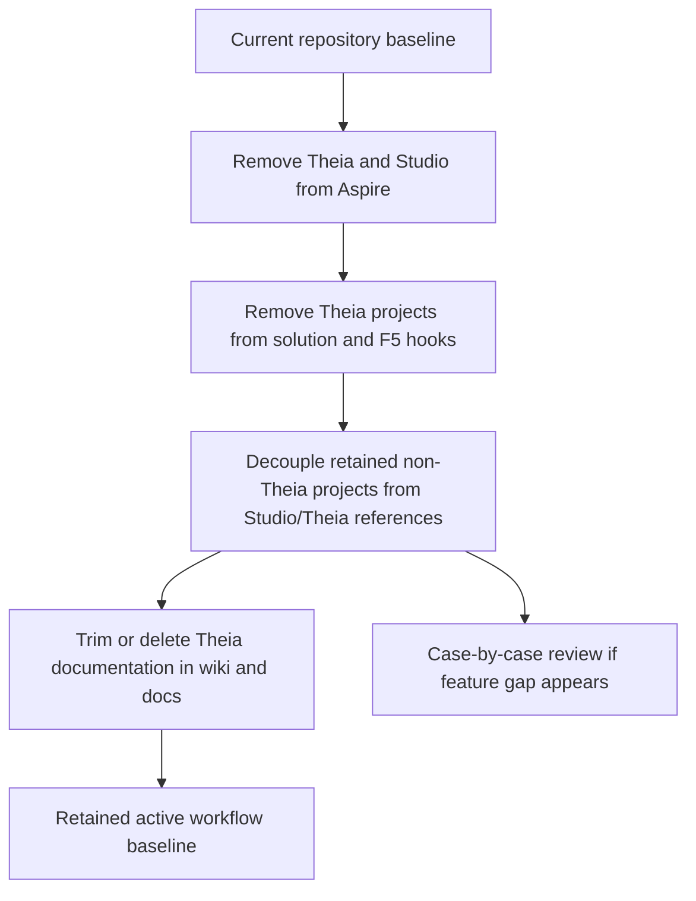

# Implementation Plan + Architecture

**Target output path:** `docs/078-cleanup/plan-solution-cleanup_v0.01.md`

**Based on:** `docs/078-cleanup/spec-solution-cleanup_v0.01.md`

**Version:** `v0.01` (`Draft`)

---

# Implementation Plan

## Planning constraints and delivery posture

- This plan is based on `docs/078-cleanup/spec-solution-cleanup_v0.01.md`.
- All implementation work that creates or updates source code must comply fully with `./.github/instructions/documentation-pass.instructions.md`.
- `./.github/instructions/documentation-pass.instructions.md` is a **hard gate** and mandatory Definition of Done criterion for every code-writing Work Item in this plan.
- For every code-writing Work Item, implementation must:
  - follow `./.github/instructions/documentation-pass.instructions.md` in full for all touched source files
  - add developer-level comments to every touched class, including internal and other non-public types
  - add developer-level comments to every touched method and constructor, including internal and other non-public members
  - add parameter comments for every public method and constructor parameter
  - add comments to every property whose meaning is not obvious from its name
  - add sufficient inline or block comments so a developer can understand purpose, logical flow, and non-obvious decisions
- The cleanup must remove active Theia and Studio runtime/build integration without deleting code that the specification explicitly says must remain for later refactoring.
- The cleanup must remove Theia-related projects and tests from the repository solution `.slnx` file when they are part of the discontinued workflow.
- `StudioServiceHost` and `UKHO.Search.Studio.*` code that is explicitly being retained must stay in source control even when it is removed from Aspire, solution load/build, and active documentation.
- If removing Studio/Theia references creates a feature gap in a retained non-Theia project, implementation must stop and review that case with the user rather than applying a blanket fallback rule.
- Documentation cleanup for this work item includes both `./wiki` and `./docs/**`.
- Mixed documents should be trimmed to remove Theia-specific sections, while documents that are primarily Theia-specific should be deleted when they fall within the confirmed cleanup scope.
- The physical deletion of `src/Studio/Server` is not part of this work item; this plan removes references and integration first so that deletion can happen safely afterward.

## Baseline

- The repository previously included active Theia runtime integration through Aspire, Visual Studio `F5`, and related documentation.
- `src/Studio/Server` has been an active dependency for local developer workflows.
- `StudioServiceHost` and `UKHO.Search.Studio.*` provider projects exist and may still be referenced by active runtime/build paths.
- The repository solution `.slnx` currently includes Theia-related projects and tests.
- Repository documentation in `wiki` and `docs/**` still contains Theia-oriented setup, usage, build, and verification guidance.

## Delta

- Remove Theia runtime integration from Aspire.
- Remove `StudioServiceHost` from Aspire while retaining its code.
- Remove Theia-only build hooks and Visual Studio `F5` assumptions.
- Remove obsolete Theia- and Studio-specific Aspire configuration that only exists for the discontinued workflow.
- Remove Theia-related projects and tests from the repository solution `.slnx` file.
- Remove Theia-related provider projects such as `UKHO.Search.Studio.*` from active solution/runtime flows while retaining their code for later refactor.
- Remove references from retained non-Theia projects when those references only support the discontinued Studio/Theia workflow.
- Purge Theia-related documentation from `wiki` and `docs/**` according to the confirmed trim/delete rules.

## Carry-over / Out of scope

- No replacement UI implementation.
- No deletion of retained code that the specification explicitly says must remain for later refactoring.
- No physical deletion of `src/Studio/Server` in this work item.
- No automatic handling of feature gaps introduced by decoupling retained non-Theia projects from Studio/Theia code; such cases must be reviewed individually with the user.

---

## Slice 1 — Remove active Theia runtime and solution integration from developer workflows

- [x] Work Item 1: Disable Theia and `StudioServiceHost` participation in Aspire, Visual Studio `F5`, and the solution so the default developer workflow no longer depends on the discontinued client - Completed
  - **Completed Summary**: Removed `StudioServiceHost` and Theia shell registration from `src/Hosts/AppHost/AppHost.cs`, removed obsolete AppHost configuration and JavaScript hosting references, deleted the Theia build target from `src/Studio/StudioServiceHost/StudioServiceHost.csproj`, removed Studio/Theia projects from `Search.slnx`, removed the leftover `StudioServiceHost` dependency and obsolete Studio-only echo test from `test/UKHO.Search.Tests`, and updated `test/AppHost.Tests/PlaceholderSmokeTests.cs` to cover the retired workflow removal. Validation: `run_build` succeeded, the updated `AppHost.Tests` smoke tests passed, and `UKHO.Search.Tests` passed after the dependency cleanup.
  - **Purpose**: Deliver the smallest meaningful end-to-end cleanup slice by ensuring the active local run/build path no longer starts, builds, or expects Theia-related resources.
  - **Acceptance Criteria**:
    - Aspire no longer registers or launches Theia runtime resources.
    - `StudioServiceHost` is removed from Aspire integration without deleting its code.
    - Theia-related projects and tests are removed from the repository solution `.slnx` file where they belong to the discontinued workflow.
    - Theia-only prebuild, postbuild, MSBuild, npm, and yarn hooks used by `F5` or standard build/startup flows are removed.
    - Obsolete Theia- and Studio-specific Aspire parameters and configuration are removed when they only support the discontinued workflow.
  - **Definition of Done**:
    - Code and configuration updated for Aspire, solution, and build/startup integration
    - Build succeeds for the retained active solution path
    - Logging and error handling preserved where relevant
    - Documentation updated in line with the work package
    - Code comments added in full compliance with `./.github/instructions/documentation-pass.instructions.md`
    - Can execute end-to-end via: load the solution, start `AppHost`, and confirm the active developer workflow no longer depends on Theia or `StudioServiceHost`
  - [x] Task 1.1: Remove Theia runtime and `StudioServiceHost` from Aspire integration
    - [x] Step 1: Inspect `AppHost` project references, resource registration, and dependency wiring for Theia runtime and `StudioServiceHost` participation.
    - [x] Step 2: Remove Theia runtime resource registration from Aspire.
    - [x] Step 3: Remove `StudioServiceHost` from Aspire integration while leaving its code in the repository.
    - [x] Step 4: Remove obsolete Theia- and Studio-specific Aspire parameters and related configuration entries when they exist only to support the discontinued workflow.
    - [x] Step 5: Keep retained non-Theia services runnable after the Aspire cleanup.
    - [x] Step 6: Apply `./.github/instructions/documentation-pass.instructions.md` in full to all touched source files.
  - [x] Task 1.2: Remove Theia-only `F5` and build/startup hooks
    - [x] Step 1: Inspect project files, targets, and auxiliary build scripts for Theia-only prebuild, postbuild, MSBuild, npm, and yarn hooks.
    - [x] Step 2: Remove hooks that existed only to build, launch, or prepare Theia assets for normal Visual Studio `F5` and solution build workflows.
    - [x] Step 3: Verify retained non-Theia projects no longer assume `src/Studio/Server` content during normal build/startup flows.
    - [x] Step 4: Apply `./.github/instructions/documentation-pass.instructions.md` in full to all touched source files.
  - [x] Task 1.3: Remove Theia-related projects and tests from the solution `.slnx` file
    - [x] Step 1: Identify all Theia-related projects and tests currently included in the repository solution `.slnx` file.
    - [x] Step 2: Remove `StudioServiceHost` from the `.slnx` file while retaining its code in source control.
    - [x] Step 3: Remove all other Theia-related projects and tests from the `.slnx` file where they belong to the discontinued workflow.
    - [x] Step 4: Remove `UKHO.Search.Studio.*` provider projects from the `.slnx` file when they are part of the discontinued workflow, while retaining their code in the repository for later refactor.
    - [x] Step 5: Confirm the solution still loads correctly in Visual Studio after the `.slnx` update.
  - **Files**:
    - `src/Hosts/AppHost/AppHost.csproj`: remove discontinued Theia-related project participation
    - `src/Hosts/AppHost/AppHost.cs`: remove Theia and `StudioServiceHost` resource registration and related wiring
    - `src/Hosts/AppHost/appsettings.json`: remove obsolete Theia- and Studio-specific parameters/configuration when no longer needed
    - any retained project `.csproj` or `.targets` files containing Theia-only build hooks
    - repository solution `.slnx` file: remove discontinued Theia-related projects and tests
  - **Work Item Dependencies**: Current repository baseline only.
  - **Run / Verification Instructions**:
    - load the solution in Visual Studio
    - confirm removed Theia-related projects no longer appear in the active `.slnx`
    - start `src/Hosts/AppHost/AppHost.csproj`
    - confirm the Aspire dashboard no longer shows Theia runtime resources or `StudioServiceHost`
    - confirm the active `F5` workflow no longer triggers Theia-only build hooks
  - **User Instructions**: If any retained non-Theia project loses an important feature path because of Studio/Theia decoupling, stop and review that case before proceeding.

---

## Slice 2 — Decouple retained non-Theia projects from Studio/Theia-only references

- [x] Work Item 2: Remove Studio/Theia-only references from retained non-Theia projects so active runtime and build paths no longer depend on discontinued workflow code - Completed
  - **Completed Summary**: Inspected retained non-Theia project references and runtime wiring for remaining Studio/Theia coupling, confirmed no ambiguous feature-gap cases required review, removed the retired `StudioApi` and `StudioShell` constants from `src/UKHO.Search/Configuration/ServiceNames.cs`, and added `test/UKHO.Search.Tests/Configuration/ServiceNamesTests.cs` to prevent those Studio-only identifiers from re-entering the active shared service catalog. Validation: `run_build` succeeded and `UKHO.Search.Tests` plus `AppHost.Tests` passed.
  - **Purpose**: Ensure the cleanup is structurally complete by removing inward or sideways dependencies that would otherwise keep the discontinued workflow alive in retained projects.
  - **Acceptance Criteria**:
    - Retained non-Theia projects no longer reference `UKHO.Search.Studio.*` or other Studio/Theia code when those references existed only for the discontinued workflow.
    - Retained non-Theia projects still build and run in their intended active workflows after decoupling.
    - If decoupling creates a feature gap, work stops for user review rather than introducing an unapproved placeholder rule.
  - **Definition of Done**:
    - Project references and runtime wiring updated for retained non-Theia projects in scope
    - Tests updated or added where appropriate for the retained active behavior
    - Build succeeds for the retained active solution path
    - Documentation updated in line with the work package
    - Code comments added in full compliance with `./.github/instructions/documentation-pass.instructions.md`
    - Can execute end-to-end via: build retained active projects and verify they no longer depend on discontinued Studio/Theia code paths
  - [x] Task 2.1: Identify retained non-Theia projects that still depend on Studio/Theia code
    - [x] Step 1: Inspect project references, DI wiring, runtime registrations, and documentation-linked workflows for retained non-Theia projects.
    - [x] Step 2: Classify each Studio/Theia reference as either discontinued-workflow-only or still ambiguous.
    - [x] Step 3: Stop and review any ambiguous or potentially user-visible feature gap before applying a change.
  - [x] Task 2.2: Remove discontinued-workflow-only references and wiring
    - [x] Step 1: Remove project references from retained non-Theia projects when those references only support discontinued Studio/Theia features.
    - [x] Step 2: Remove any associated DI registration, configuration binding, or runtime wiring that only exists because of those references.
    - [x] Step 3: Keep retained non-Theia projects functional for their approved active paths after the decoupling.
    - [x] Step 4: Apply `./.github/instructions/documentation-pass.instructions.md` in full to all touched source files.
  - [x] Task 2.3: Validate retained active paths after decoupling
    - [x] Step 1: Build the affected retained non-Theia projects.
    - [x] Step 2: Run targeted tests for the affected retained projects.
    - [x] Step 3: Stop and review with the user if any removed Studio/Theia dependency exposes a feature gap that needs a replacement decision.
  - **Files**:
    - retained non-Theia project `.csproj` files that reference `UKHO.Search.Studio.*` or other Studio/Theia code
    - retained startup/DI/configuration files that wire discontinued Studio/Theia behavior
    - affected targeted test files/projects for retained active flows
  - **Work Item Dependencies**: Work Item 1.
  - **Run / Verification Instructions**:
    - build the affected retained projects
    - run targeted tests for the affected retained projects
    - verify active non-Theia workflows still function without Studio/Theia references
  - **User Instructions**: Review any flagged feature-gap cases individually before approving further decoupling in those areas.

---

## Slice 3 — Purge Theia-oriented documentation from `wiki` and `docs/**`

- [x] Work Item 3: Remove active Theia setup, usage, and verification guidance from repository documentation so contributors are no longer directed toward the discontinued workflow - Completed
  - **Completed Summary**: Trimmed mixed wiki guidance in `wiki/Home.md`, `wiki/Project-Setup.md`, `wiki/Solution-Architecture.md`, `wiki/Ingestion-Rules.md`, `wiki/Ingestion-Service-Provider-Mechanism.md`, `wiki/Provider-Metadata-and-Split-Registration.md`, `wiki/Tools-RulesWorkbench.md`, and `wiki/Documentation-Source-Map.md` so the active contributor flow no longer describes Theia, `StudioServiceHost`, or Studio provider projects as current workflow components. Deleted the primarily Theia-focused pages `wiki/Tools-UKHO-Search-Studio.md`, `wiki/Theia-Knowledgebase.md`, `wiki/PrimeReact-Theia-UI-System.md`, and `docs/theia_terminology_glossary.md`. Removed the fully Theia- or PrimeReact-based work-package folders `docs/064-studio-skeleton`, `docs/065-studio-tree-widget`, `docs/066-studio-minor-ux`, `docs/067-studio-output-enhancements`, `docs/068-home-page`, `docs/069-search-ui`, `docs/070-studio-ingestion`, `docs/073-new-theia-shell`, `docs/074-primereact-research`, `docs/075-primereact-system`, and `docs/076-primereact-theme-uplift`. Preserved the remaining detached Studio documentation only where it was not entirely Theia/PrimeReact-based, and corrected the source map to reflect the removals. Validation: `run_build` succeeded and `dotnet test .\Search.slnx --no-build` passed for the full suite (`529` tests).
  - **Purpose**: Align repository guidance with the new direction by ensuring the documentation no longer tells developers to use or maintain the discontinued Theia client flow.
  - **Acceptance Criteria**:
    - `wiki` and `docs/**` are reviewed for Theia-related setup, usage, build, and verification guidance.
    - Mixed documents are trimmed to remove Theia-specific sections while preserving useful non-Theia content.
    - Documents that are primarily Theia-specific are deleted when they fall within the confirmed cleanup scope.
    - Active documentation no longer describes Theia, `StudioServiceHost`, or related Studio/Theia provider projects as part of the current workflow.
  - **Definition of Done**:
    - Documentation updated or removed according to the confirmed trim/delete rules
    - Links and references corrected after removals
    - Build/test validation still completed for the overall work item as required by repository standards
    - Can execute end-to-end via: review the retained wiki and docs paths and confirm no active Theia workflow guidance remains
  - [x] Task 3.1: Review and classify documentation in `wiki` and `docs/**`
    - [x] Step 1: Identify documentation that is mixed versus primarily Theia-specific.
    - [x] Step 2: Identify references to Aspire, `F5`, `StudioServiceHost`, `src/Studio/Server`, and `UKHO.Search.Studio.*` that are tied to the discontinued workflow.
    - [x] Step 3: Preserve non-Theia guidance where it remains valid after trimming.
  - [x] Task 3.2: Trim mixed documentation and delete primarily Theia-specific documentation
    - [x] Step 1: Remove only the Theia-related sections from mixed documents that still contain valuable non-Theia guidance.
    - [x] Step 2: Delete documents that are primarily Theia-focused when they fall within scope.
    - [x] Step 3: Update cross-links so remaining documentation does not reference removed Theia content.
  - [x] Task 3.3: Verify documentation alignment with the retained workflow
    - [x] Step 1: Re-read updated `wiki` and `docs/**` content to confirm no active Theia workflow remains.
    - [x] Step 2: Confirm the documentation now matches the retained solution, Aspire, and build/startup behavior.
    - [x] Step 3: Note any historical material intentionally left outside this work item’s confirmed scope.
  - **Files**:
    - `wiki/**`: trim or delete Theia-focused guidance
    - `docs/**`: trim mixed documents and delete primarily Theia-specific documents within the confirmed scope
  - **Work Item Dependencies**: Work Items 1 and 2.
  - **Run / Verification Instructions**:
    - review `wiki` and `docs/**`
    - confirm no retained document instructs contributors to use the Theia workflow
    - confirm remaining links resolve after document trimming/deletion
  - **User Instructions**: If you want to keep any Theia material as archival reference rather than deleting it, identify those documents before execution starts.

---

## Slice 4 — Final validation of the retained developer workflow after cleanup

- [x] Work Item 4: Validate the cleaned repository baseline so the retained developer workflow is stable after Theia removal from active integration - Completed
  - **Completed Summary**: Confirmed the retained solution composition with `get_projects_in_solution` and `Search.slnx`, showing the active solution no longer includes Theia-related or `StudioServiceHost` projects. Validation succeeded with a full `run_build` and `dotnet test .\Search.slnx --no-build` run (`529` tests passed). Started `src/Hosts/AppHost/AppHost.csproj` with the default `services` run mode, verified the retained service stack came up without any Theia runtime resources or `StudioServiceHost` participation, and confirmed the active AppHost, solution, and wiki guidance now describe the detached Studio/Theia code only as retained historical/refactor material. No additional case-by-case review items were identified for the next cleanup phase.
  - **Purpose**: Finish the cleanup with a usable, demonstrable repository state where the active solution, build, and local run paths no longer depend on the discontinued Theia workflow.
  - **Acceptance Criteria**:
    - The retained solution loads successfully without the removed Theia-related projects.
    - The retained build/test path succeeds for the active workflow.
    - `AppHost` starts without Theia runtime resources or `StudioServiceHost` participation.
    - The repository is ready for later physical deletion of `src/Studio/Server` because active references and integration have already been removed.
  - **Definition of Done**:
    - Solution, build, and test validation completed
    - Active local run path verified
    - Documentation aligned with the retained workflow
    - Code comments added in full compliance with `./.github/instructions/documentation-pass.instructions.md` for all touched code files
    - Can execute end-to-end via: load the solution, build, run tests, start `AppHost`, and verify the active workflow no longer depends on Theia
  - [x] Task 4.1: Run final solution and build validation
    - [x] Step 1: Load the retained solution in Visual Studio and confirm the expected projects remain.
    - [x] Step 2: Run a full build for the retained active solution path.
    - [x] Step 3: Run the relevant retained test projects.
  - [x] Task 4.2: Run final Aspire validation
    - [x] Step 1: Start `AppHost`.
    - [x] Step 2: Confirm Theia runtime resources and `StudioServiceHost` no longer appear in the active Aspire experience.
    - [x] Step 3: Confirm retained active services still start as expected.
  - [x] Task 4.3: Confirm readiness for later physical deletion of `src/Studio/Server`
    - [x] Step 1: Confirm active runtime, build, solution, and documentation paths no longer depend on `src/Studio/Server`.
    - [x] Step 2: Record any case-by-case review items that must be resolved before additional cleanup proceeds.
    - [x] Step 3: Keep the repository in a stable baseline ready for the next UI direction.
  - **Files**:
    - retained solution `.slnx` file
    - retained active build/startup configuration
    - `wiki/**` and `docs/**` as the aligned documentation baseline
  - **Work Item Dependencies**: Work Items 1, 2, and 3.
  - **Run / Verification Instructions**:
    - load the retained solution in Visual Studio
    - run a full build for the retained active path
    - run the relevant retained tests
    - start `AppHost`
    - confirm no active Theia workflow remains in solution, runtime, or documentation
  - **User Instructions**: Review any case-by-case feature-gap items captured during execution before authorizing follow-on cleanup work.

---

## Overall approach summary

This plan delivers the cleanup in four vertical slices:

1. remove active Theia and `StudioServiceHost` participation from Aspire, `F5`, and the solution
2. decouple retained non-Theia projects from Studio/Theia-only references
3. purge Theia-oriented documentation from `wiki` and `docs/**`
4. validate the retained developer workflow as the new stable baseline

Key implementation considerations are:

- keep retained code that the specification explicitly says must remain for later refactoring
- remove active runtime/build/solution participation for discontinued Theia workflow pieces
- remove obsolete Aspire configuration and Theia-only build hooks where they only supported the discontinued workflow
- stop for user review whenever decoupling introduces a feature gap in a retained non-Theia project
- treat `./.github/instructions/documentation-pass.instructions.md` as mandatory for every code-writing task
- align `wiki` and `docs/**` with the retained workflow using the confirmed trim/delete documentation rules

---

# Architecture

## Overall Technical Approach

The cleanup is a controlled decoupling exercise rather than a feature build. The technical approach is to remove Theia from all active repository entry points while preserving explicitly retained code for later refactoring.

The architecture after cleanup separates three states clearly:

1. **Active retained workflow**
   - remains in the solution, Aspire, build/startup path, and active documentation
2. **Retained-but-detached code**
   - remains in source control for later refactor but is removed from Aspire, active solution participation, and active documentation
3. **Soon-to-be-deleted runtime content**
   - is first decoupled from active solution/build/runtime paths so it can be deleted safely afterward

## Frontend

There is no new frontend being introduced in this plan.

The frontend-focused aspect of the cleanup is the removal of the discontinued Theia client from active repository usage.

### Frontend-related cleanup areas

- `src/Studio/Server`
  - no longer participates in active runtime, build, or documentation flows
  - is prepared for later physical deletion once active references are gone
- documentation in `wiki` and `docs/**`
  - no longer instructs contributors to build, launch, or validate the Theia experience

### Frontend user/developer flow after cleanup

1. the developer opens the retained solution without Theia-related projects participating in the active workflow
2. the developer starts the retained local stack without Theia runtime resources in Aspire
3. the developer follows updated documentation that no longer points to Theia setup, build, or verification steps

## Backend

The backend-focused aspect of the cleanup is the removal of Studio/Theia coupling from active hosts, provider projects, configuration, and solution participation while preserving explicitly retained code for later refactor.

### Backend cleanup areas

- `src/Hosts/AppHost/`
  - remove Theia runtime and `StudioServiceHost` resource registration
  - remove obsolete Theia- and Studio-specific parameters/configuration
- retained project `.csproj` and startup/configuration files
  - remove Theia-only build hooks and discontinued Studio/Theia wiring
- `StudioServiceHost` and `UKHO.Search.Studio.*`
  - retain code in source control where specified
  - remove from active solution/runtime participation
- retained non-Theia projects
  - remove references that only existed for Studio/Theia features
  - stop for user review if a feature gap appears

### Backend cleanup flow

1. `AppHost` and related configuration are cleaned so active orchestration no longer includes Theia or `StudioServiceHost`
2. solution and project files are cleaned so active builds no longer include discontinued Theia workflow projects
3. retained non-Theia projects are decoupled from Studio/Theia references where those references are no longer valid
4. the retained active services are validated after cleanup

The result is a repository baseline where Theia and related Studio workflow code may still exist in source control for later refactoring, but no longer participates in active runtime, solution, or documentation paths.
