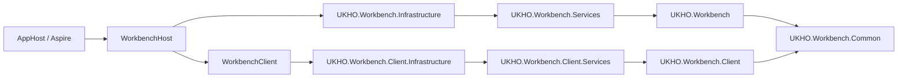

# Implementation Plan + Architecture

**Target output path:** `docs/080-workbench-initial/plan-workbench-initial_v0.01.md`

**Based on:** `docs/080-workbench-initial/spec-workbench-initial_v0.01.md`

**Version:** `v0.01` (`Draft`)

---

# Implementation Plan

## Planning constraints and delivery posture

- This plan is based on `docs/080-workbench-initial/spec-workbench-initial_v0.01.md`.
- All code-writing work in this plan must comply fully with `./.github/instructions/documentation-pass.instructions.md`.
- `./.github/instructions/documentation-pass.instructions.md` is a mandatory repository standard and a hard Definition of Done gate for every code-writing Work Item.
- Every code-writing task in this plan must explicitly deliver the developer-level commenting standard required by `./.github/instructions/documentation-pass.instructions.md`, including:
  - type-level comments for public, internal, and other non-public types
  - method and constructor comments for public, internal, and other non-public members
  - parameter documentation for every public method and constructor parameter
  - comments on properties whose meaning is not obvious from their names
  - sufficient inline or block comments so future developers can understand purpose, logical flow, and non-obvious decisions
- The first runnable slice must stay intentionally minimal: Blazor renders `Hello UKHO Workbench` at `/`, served by `WorkbenchHost`, launched from `AppHost`.
- Aspire must register only `WorkbenchHost` in this work package; there must be no separate `WorkbenchClient` Aspire resource.
- Onion dependency direction must be implemented explicitly, not just implied by folder names.
- The initial dependency chain must follow:
  - server: `WorkbenchHost -> UKHO.Workbench.Infrastructure -> UKHO.Workbench.Services -> UKHO.Workbench -> UKHO.Workbench.Common`
  - client: `WorkbenchClient -> UKHO.Workbench.Client.Infrastructure -> UKHO.Workbench.Client.Services -> UKHO.Workbench.Client -> UKHO.Workbench.Common`
- `UKHO.Workbench.Common` must be referenced directly only by the server and client domain projects; higher layers must consume it through chained project references.
- `UKHO.Workbench.Common` must remain an empty project shell in this work package.
- `WorkbenchHost` must not introduce explicit Workbench-specific API endpoints in this work package.
- The hosted client must be reachable directly at `/` so the Aspire dashboard link opens the Blazor-rendered hello screen immediately.
- The hosted client wiring must be explicit in implementation notes: `WorkbenchHost` serves `WorkbenchClient` through a project reference plus ASP.NET Core static web assets rather than through a separate Aspire resource or hard-coded filesystem paths.
- The initial hosted experience must remain anonymous only.
- Placeholder tests must remain trivial `Assert.True()`-style tests only.
- No additional README, broader repo documentation, or explicit CI/workflow changes are required in this work package beyond any incidental effect of adding the new projects to the main solution.

## Baseline

- The repository currently does not contain the new `src/workbench` project structure defined in the specification.
- There is no runnable Workbench shell baseline yet.
- The intended architecture, naming, and layering rules for the Workbench area have now been defined in `docs/080-workbench-initial/spec-workbench-initial_v0.01.md`.
- The first module model, manifest contracts, and shell feature set are intentionally deferred.

## Delta

- Create the full initial Workbench server and client project structure under `src/workbench`.
- Create mirrored `*.Tests` projects under `test/workbench/server` and `test/workbench/client` for every production project, including host and common projects.
- Wire the project references to match the required Onion dependency chain on both server and client sides.
- Add minimal composition-root placeholder wiring in services and infrastructure projects.
- Host the Blazor WebAssembly client through `WorkbenchHost` at `/`.
- Make the hosted-client mechanism explicit in the implementation: `WorkbenchHost` references `WorkbenchClient`, the build produces static web asset manifests, and the host serves the client by using the Blazor WebAssembly/static-file middleware pipeline.
- Register only `WorkbenchHost` in `AppHost` so the Aspire dashboard link opens the hosted client directly.
- Remove unused default Blazor template pages, navigation, and components so only the minimal hello experience remains.
- Add trivial placeholder tests and `bUnit` package references where required.
- Add all new production and mirrored test projects to the main solution.
- Validate build, trivial tests, and manual AppHost/Aspire startup.

## Carry-over / Out of scope

- No module manifest contracts or module loading/runtime composition.
- No Search-specific functionality or Search-coupled abstractions.
- No workbench commands, menus, docking, explorers, or persisted layout.
- No explicit Workbench API surface beyond minimum host plumbing.
- No authentication or authorization setup.
- No extra documentation beyond this work package spec and this plan.
- No explicit CI/workflow work unless later required by a separate work package.

---

## Slice 1 — Bootstrap the runnable Workbench hello path through AppHost

- [x] Work Item 1: Create the Workbench project skeleton and deliver the first runnable end-to-end hosted hello experience
  - **Purpose**: Establish the smallest meaningful Workbench vertical slice by creating the full project structure and making `AppHost` launch `WorkbenchHost`, which serves a Blazor-rendered `Hello UKHO Workbench` page at `/`.
  - **Acceptance Criteria**:
    - `src/workbench/server` contains `UKHO.Workbench`, `UKHO.Workbench.Services`, `UKHO.Workbench.Infrastructure`, and `WorkbenchHost`.
    - `src/workbench/client` contains `UKHO.Workbench.Client`, `UKHO.Workbench.Client.Services`, `UKHO.Workbench.Client.Infrastructure`, and `WorkbenchClient`.
    - `src/workbench/UKHO.Workbench.Common` exists as an empty shared project shell.
    - Project references implement the required Onion direction on both server and client sides.
    - `WorkbenchHost` serves the Blazor client at `/`.
    - `WorkbenchHost` references `WorkbenchClient` directly, and the hosted client is served through build-generated static web assets rather than a manually copied output folder.
    - `AppHost` registers only `WorkbenchHost`, and the Aspire dashboard link opens the hello screen directly.
    - The client renders only `Hello UKHO Workbench` through Blazor and does not retain unused default template pages/navigation/components.
  - **Definition of Done**:
    - Code implemented for projects, references, host wiring, and minimal Blazor hello path
    - `./.github/instructions/documentation-pass.instructions.md` followed in full for every touched source file
    - Developer-level comments added to every touched class, method, constructor, relevant property, and public parameters as required
    - Logging and error handling remain appropriate to the minimal host baseline
    - Solution builds successfully
    - End-to-end path can be executed via `AppHost` and the Aspire dashboard link
  - [x] Task 1.1: Create the server-side Workbench project skeleton with explicit Onion references
    - [x] Step 1: Create `UKHO.Workbench.Common` under `src/workbench` as an empty project shell with no concrete shared types.
    - [x] Step 2: Create `src/workbench/server/UKHO.Workbench` for server domain concerns and reference `UKHO.Workbench.Common` directly from this domain project only.
    - [x] Step 3: Create `src/workbench/server/UKHO.Workbench.Services` and reference `UKHO.Workbench` only.
    - [x] Step 4: Create `src/workbench/server/UKHO.Workbench.Infrastructure` and reference `UKHO.Workbench.Services` only.
    - [x] Step 5: Create `src/workbench/server/WorkbenchHost` and reference `UKHO.Workbench.Infrastructure` only.
    - [x] Step 6: Add minimal DI/composition-root placeholder wiring in `UKHO.Workbench.Services` and `UKHO.Workbench.Infrastructure` without over-specifying naming beyond implementation need.
    - [x] Step 7: Apply `./.github/instructions/documentation-pass.instructions.md` in full to all created server-side code files.
  - [x] Task 1.2: Create the client-side Workbench project skeleton with explicit Onion references
    - [x] Step 1: Create `src/workbench/client/UKHO.Workbench.Client` for client domain concerns and reference `UKHO.Workbench.Common` directly from this domain project only.
    - [x] Step 2: Create `src/workbench/client/UKHO.Workbench.Client.Services` and reference `UKHO.Workbench.Client` only.
    - [x] Step 3: Create `src/workbench/client/UKHO.Workbench.Client.Infrastructure` and reference `UKHO.Workbench.Client.Services` only.
    - [x] Step 4: Create `src/workbench/client/WorkbenchClient` and reference `UKHO.Workbench.Client.Infrastructure` only.
    - [x] Step 5: Add minimal DI/composition-root placeholder wiring in `UKHO.Workbench.Client.Services` and `UKHO.Workbench.Client.Infrastructure`.
    - [x] Step 6: Apply `./.github/instructions/documentation-pass.instructions.md` in full to all created client-side code files.
  - [x] Task 1.3: Implement the minimal hosted Blazor hello experience
    - [x] Step 1: Configure `WorkbenchClient` as a hosted Blazor WebAssembly client served through `WorkbenchHost`.
    - [x] Step 2: Ensure `WorkbenchHost` references `WorkbenchClient` so the client static web assets are discovered through the ASP.NET Core/MSBuild static web assets manifest pipeline rather than through hard-coded content-root path assumptions.
    - [x] Step 3: Ensure the host startup pipeline uses the hosted Blazor WebAssembly/static-file middleware required to serve both `index.html` and the generated `/_framework/*` assets.
    - [x] Step 4: Ensure the only required hosted route is `/` and that it renders `Hello UKHO Workbench` through Blazor.
    - [x] Step 5: Remove unused default Blazor template pages, navigation, and components so the client remains intentionally minimal.
    - [x] Step 6: Keep the hosted experience anonymous only, with no authentication flow or placeholders.
    - [x] Step 7: Avoid introducing explicit Workbench-specific API endpoints beyond minimum host plumbing.
    - [x] Step 8: Apply `./.github/instructions/documentation-pass.instructions.md` in full to all touched host and client files.
  - [x] Task 1.4: Integrate the runnable slice with AppHost
    - [x] Step 1: Register `WorkbenchHost` with the existing Aspire `AppHost`.
    - [x] Step 2: Ensure Aspire does not register a separate `WorkbenchClient` resource.
    - [x] Step 3: Configure the effective default `WorkbenchHost` dashboard link so clicking it opens the hosted client at `/`.
    - [x] Step 4: Keep `AppHost` as the only required run and startup path for this work package.
    - [x] Step 5: Apply `./.github/instructions/documentation-pass.instructions.md` in full to all touched host/bootstrap files.
  - **Files**:
    - `src/workbench/UKHO.Workbench.Common/*`: empty common project shell
    - `src/workbench/server/UKHO.Workbench/*`: server domain baseline
    - `src/workbench/server/UKHO.Workbench.Services/*`: server services baseline and DI placeholder entry point
    - `src/workbench/server/UKHO.Workbench.Infrastructure/*`: server infrastructure baseline and DI placeholder entry point
    - `src/workbench/server/WorkbenchHost/*`: minimal host serving the client
    - `src/workbench/client/UKHO.Workbench.Client/*`: client domain baseline
    - `src/workbench/client/UKHO.Workbench.Client.Services/*`: client services baseline and DI placeholder entry point
    - `src/workbench/client/UKHO.Workbench.Client.Infrastructure/*`: client infrastructure baseline and DI placeholder entry point
    - `src/workbench/client/WorkbenchClient/*`: minimal Blazor client rendering the hello page
    - `src/Hosts/AppHost/*`: Aspire registration for `WorkbenchHost`
  - **Work Item Dependencies**: Current repository baseline only.
  - **Run / Verification Instructions**:
    - build the solution
    - start `AppHost`
    - open the Aspire dashboard
    - click the default `WorkbenchHost` link
    - confirm `/` renders `Hello UKHO Workbench`
  - **User Instructions**: None for this slice beyond using the normal `AppHost` startup path.

---

## Slice 2 — Complete repository integration and validation for the initial Workbench baseline

- [x] Work Item 2: Add mirrored placeholder tests, add all new projects to the solution, and validate the baseline end to end - Completed
  - **Purpose**: Complete the initial Workbench baseline so it is repository-integrated, buildable, trivially testable, and demonstrably runnable through the supported developer workflow.
  - **Acceptance Criteria**:
    - Every production project has a mirrored `*.Tests` project under `test/workbench/server` or `test/workbench/client`.
    - Mirrored test projects include server, client, infrastructure, services, host, and common projects.
    - Blazor UI test projects include a suitable `bUnit` package reference.
    - Placeholder tests are only trivial `Assert.True()`-style tests.
    - All production and mirrored test projects are added to the main solution.
    - The solution builds successfully.
    - Trivial placeholder tests pass.
    - Manual `AppHost` startup confirms the Aspire dashboard link opens the hello screen.
  - **Definition of Done**:
    - Test projects created and solution-integrated
    - `./.github/instructions/documentation-pass.instructions.md` followed in full for every touched source file
    - Developer-level comments added to all touched code and test files per repository standard
    - Build succeeds
    - Trivial placeholder tests pass
    - Manual run verification through `AppHost` succeeds
  - Summary: Added nine mirrored Workbench test projects with documented trivial placeholder tests, added the new test projects to `Search.slnx`, completed build and test validation, and re-verified the Aspire/AppHost startup path for the hosted Workbench shell.
  - [x] Task 2.1: Create mirrored placeholder test projects for every production project - Completed
    - [x] Step 1: Create one mirrored test project for each new server production project under `test/workbench/server`.
    - [x] Step 2: Create one mirrored test project for each new client production project under `test/workbench/client`.
    - [x] Step 3: Include mirrored projects for `WorkbenchHost`, `WorkbenchClient`, `UKHO.Workbench.Infrastructure`, `UKHO.Workbench.Client.Infrastructure`, and `UKHO.Workbench.Common`.
    - [x] Step 4: Add only trivial `Assert.True()`-style placeholder tests to each mirrored test project.
    - [x] Step 5: Add a suitable `bUnit` package reference to the Blazor UI test project(s) even though the tests remain trivial in this work package.
    - [x] Step 6: Apply `./.github/instructions/documentation-pass.instructions.md` in full to all touched test files.
    - Summary: Created mirrored test projects for every Workbench production project under `test/workbench/server` and `test/workbench/client`; each project contains a documented single placeholder xUnit test, and `WorkbenchClient.Tests` includes `Bunit`.
  - [x] Task 2.2: Add all Workbench production and test projects to the main solution - Completed
    - [x] Step 1: Add every new production project to the main repository solution.
    - [x] Step 2: Add every mirrored `*.Tests` project to the main repository solution.
    - [x] Step 3: Verify the resulting solution structure reflects the intended Workbench folder and layering conventions.
    - Summary: Confirmed the Workbench production projects remain present in `Search.slnx` and added the new mirrored Workbench test projects under the `test/workbench/client` and `test/workbench/server` solution folders.
  - [x] Task 2.3: Validate the initial Workbench baseline - Completed
    - [x] Step 1: Run a full solution build.
    - [x] Step 2: Run the trivial placeholder tests for the new Workbench test projects.
    - [x] Step 3: Start `AppHost` and confirm the supported run path still launches correctly.
    - [x] Step 4: Open the Aspire dashboard and verify the `WorkbenchHost` link lands directly on `/` and renders `Hello UKHO Workbench`.
    - [x] Step 5: Confirm there is no separate `WorkbenchClient` Aspire resource and no explicit Workbench API surface beyond minimum host plumbing.
    - Summary: Built `Search.slnx`, ran the new mirrored Workbench test projects directly from disk, started `AppHost`, reached the authenticated Aspire dashboard shell, and reconfirmed from the host registration that only `WorkbenchHost` is exposed as an Aspire resource while the client remains hosted through it.
  - **Files**:
    - `test/workbench/server/**/*.csproj`: mirrored server test projects
    - `test/workbench/client/**/*.csproj`: mirrored client test projects
    - `test/workbench/**/*.cs`: trivial placeholder tests only
    - main solution file: add all new Workbench production and test projects
  - **Work Item Dependencies**: Work Item 1.
  - **Run / Verification Instructions**:
    - build the solution
    - run the new Workbench tests
    - start `AppHost`
    - open the Aspire dashboard
    - click the `WorkbenchHost` link and verify the hello page at `/`
  - **User Instructions**: None beyond normal local build/test/start workflow.

---

## Overall approach summary

This plan keeps the first Workbench delivery intentionally small and vertical:

1. create the full server/client/common project skeleton with explicit Onion project references
2. deliver a real runnable path where `AppHost` launches `WorkbenchHost` and `WorkbenchHost` serves a Blazor-rendered `Hello UKHO Workbench` page at `/`
3. complete the baseline by adding mirrored placeholder tests, solution inclusion, and manual/run validation

Key implementation considerations are:

- keep Workbench fully ignorant of UKHO Search-specific behavior
- keep `UKHO.Workbench.Common` empty and referenced directly only by the domain projects
- keep hosting minimal by registering only `WorkbenchHost` with Aspire
- make the hosted WebAssembly relationship explicit: `WorkbenchHost` discovers `WorkbenchClient` through the project reference and serves its static assets through the standard hosted Blazor pipeline rather than by manual file copying
- keep the client minimal by removing default template clutter and rendering only the hello message
- keep tests trivial and non-material in this work package
- treat `./.github/instructions/documentation-pass.instructions.md` as a hard gate for all code-writing work

---

# Architecture

## Overall Technical Approach

The initial Workbench baseline uses a hosted Blazor WebAssembly approach, orchestrated through Aspire and structured with explicit Onion Architecture on both the server and client sides.

The first implementation is intentionally a bootstrap slice rather than a feature-rich shell. Its goal is to prove that the repository can host a reusable Workbench foundation with the correct project layout, reference direction, and startup experience.

The main runtime path is:

1. `AppHost` starts `WorkbenchHost`
2. the Aspire dashboard exposes the `WorkbenchHost` link
3. clicking the link opens `/`
4. `WorkbenchHost` serves the hosted Blazor client
5. Blazor renders `Hello UKHO Workbench`

### Hosted client asset resolution

The hosted client relationship must be described explicitly so the implementation does not appear to rely on unexplained framework magic.

At build time:

1. `WorkbenchHost` references `WorkbenchClient` as a project reference
2. `WorkbenchClient` builds as a Blazor WebAssembly app
3. MSBuild generates static web asset manifests for the client, including `index.html` and generated `/_framework/*` assets
4. those manifests are composed into the host so the client assets are exposed to the server host without hard-coded source paths or a separately copied client deployment folder

At runtime:

1. `WorkbenchHost` uses `UseBlazorFrameworkFiles()` to expose the hosted Blazor WebAssembly framework payload
2. `WorkbenchHost` uses the static-file middleware pipeline to serve the client static web assets resolved from the build manifests
3. `MapFallbackToFile("index.html")` routes `/` and other non-file paths to the hosted client entry point

This is the intended mechanism that makes the hosted client reachable from the `WorkbenchHost` Aspire link while still keeping Aspire aware of only the server host resource.

## Frontend

The frontend consists of the new Workbench client-side area under `src/workbench/client`.

### Frontend structure

- `src/workbench/client/WorkbenchClient`
  - the hosted Blazor WebAssembly application
  - responsible only for the minimal initial UI in this work package
  - must expose the hello experience at `/`
- `src/workbench/client/UKHO.Workbench.Client`
  - client domain layer
  - holds client-side Workbench abstractions and models
  - directly references `UKHO.Workbench.Common`
- `src/workbench/client/UKHO.Workbench.Client.Services`
  - client services layer
  - contains application/service orchestration for the client side
  - depends inward on `UKHO.Workbench.Client`
- `src/workbench/client/UKHO.Workbench.Client.Infrastructure`
  - client infrastructure layer
  - contains client-side integrations and composition-root placeholders
  - depends inward on `UKHO.Workbench.Client.Services`

### Frontend user flow

The only required user flow in this work package is:

1. user launches `AppHost`
2. user clicks the `WorkbenchHost` link in the Aspire dashboard
3. browser opens `/`
4. the Blazor client renders `Hello UKHO Workbench`

No additional routes, pages, navigation structures, or shell behaviors are required in this phase.

## Backend

The backend consists of the new Workbench server-side area under `src/workbench/server` plus the existing Aspire host registration in `AppHost`.

### Backend structure

- `src/workbench/server/WorkbenchHost`
  - minimal ASP.NET Core host for the Workbench runtime
  - serves the Blazor WebAssembly client
  - contains only the minimum startup and hosting plumbing needed for this phase
  - references `WorkbenchClient` so the hosted client assets flow in through the ASP.NET Core static web assets system
  - must not expose explicit Workbench-specific API endpoints in this work package
- `src/workbench/server/UKHO.Workbench.Infrastructure`
  - server infrastructure layer
  - contains infrastructure wiring and placeholder DI entry points
  - depends inward on `UKHO.Workbench.Services`
- `src/workbench/server/UKHO.Workbench.Services`
  - server services layer
  - contains application/domain service orchestration for the server side
  - depends inward on `UKHO.Workbench`
- `src/workbench/server/UKHO.Workbench`
  - server domain layer
  - contains Workbench domain abstractions and models
  - directly references `UKHO.Workbench.Common`
- `src/workbench/UKHO.Workbench.Common`
  - shared common layer
  - intentionally empty in this phase
  - reserved for future common definitions such as manifest contracts

### Backend data flow

The initial backend flow is intentionally simple:

1. `AppHost` registers and launches `WorkbenchHost`
2. `WorkbenchHost` resolves its inward dependencies through the Onion chain
3. `WorkbenchHost` serves the hosted Blazor client at `/`
4. no additional API, persistence, or integration flow is required in this work package

The architecture is deliberately minimal so later work packages can add capabilities incrementally without reworking the foundational structure.