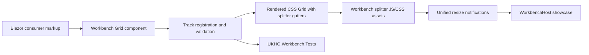

# Implementation Plan

**Target output path:** `docs/081-workbench-layout/plan-workbench-layout_v0.01.md`

**Based on:** `docs/081-workbench-layout/spec-workbench-layout_v0.01.md`

**Mandatory repository standard:** Every code-writing task in this plan must follow `./.github/instructions/documentation-pass.instructions.md` in full. Compliance with that instruction file is a hard Definition of Done gate for each Work Item, alongside the repository coding, testing, and documentation instructions.

## Project Structure and Delivery Strategy

- Keep all implementation for this work inside `src/workbench/server/UKHO.Workbench/` and all automated tests inside `test/workbench/server/UKHO.Workbench.Tests/`.
- Use `src/workbench/server/WorkbenchHost/` only for runnable showcase and verification wiring.
- Keep the splitter API aligned with the existing WPF-style authoring surface in `src/workbench/server/UKHO.Workbench/Layout/`.
- Prefer dedicated splitter definitions such as `SplitterColumnDefinition` and `SplitterRowDefinition` within the existing `ColumnDefinition` / `RowDefinition` naming family.
- Treat `./.github/instructions/documentation-pass.instructions.md` as mandatory for all code changes:
  - every class, including internal and non-public classes, must be commented
  - every method and constructor, including internal and non-public members, must be commented
  - every public method and constructor parameter must be documented
  - every non-obvious property must be documented
  - sufficient inline or block comments must explain purpose, logical flow, and any algorithms used
- Preserve the spec's documentation-only constraints exactly, especially:
  - all production code remains in `UKHO.Workbench.csproj`
  - all tests remain in `UKHO.Workbench.Tests.csproj`
  - `src/workbench/server/UKHO.Workbench/Layout/README.md` must be updated as part of the work
  - completed implementation must not remain under `./scratch`

## Splitter Foundation and First End-to-End Column Slice
- [ ] Work Item 1: Deliver the first runnable column-splitter slice through the Workbench layout surface
  - **Purpose**: Establish the minimum end-to-end capability proving that the existing `Grid` authoring model can render and run a draggable column splitter with automatic asset loading, built-in styling, and unified notifications.
  - **Acceptance Criteria**:
    - A consumer can declare a column splitter using the Workbench layout API with dedicated splitter definitions.
    - A splitter-enabled grid runs end to end in `WorkbenchHost` with automatic asset loading and no manual host-page includes.
    - Default styling is present: transparent at rest, blue on hover, correct resize cursor, `4px` default splitter thickness when width is omitted.
    - Continuous resize notifications flow through a unified direction-annotated notification surface.
    - `./.github/instructions/documentation-pass.instructions.md` is explicitly applied to all written code.
  - **Definition of Done**:
    - Code implemented in `UKHO.Workbench`, with runnable host integration in `WorkbenchHost`
    - Code comments and XML/developer documentation added per `./.github/instructions/documentation-pass.instructions.md`
    - Tests passing in `UKHO.Workbench.Tests`
    - Logging/error handling added for validation and initialization failures
    - `src/workbench/server/UKHO.Workbench/Layout/README.md` updated
    - Can execute end to end via: `dotnet run --project src/workbench/server/WorkbenchHost/WorkbenchHost.csproj`
  - [ ] Task 1: Introduce splitter-capable authoring primitives in the layout model
    - [ ] Step 1: Add dedicated splitter definition components in `src/workbench/server/UKHO.Workbench/Layout/` using the existing WPF-style authoring conventions.
    - [ ] Step 2: Extend the grid registration flow so splitter definitions participate in track ordering, indexing, and CSS template generation alongside normal rows and columns.
    - [ ] Step 3: Add validation rules so splitters are only valid between two resizable tracks and fail fast when configured against unsupported `Auto` track pairs.
    - [ ] Step 4: Apply `./.github/instructions/documentation-pass.instructions.md` to every new or changed class, method, constructor, parameter, and non-obvious property.
  - [ ] Task 2: Render a column splitter end to end with automatic assets and defaults
    - [ ] Step 1: Add the DOM rendering and metadata needed for a column splitter gutter, ensuring splitter tracks remain non-content gutters.
    - [ ] Step 2: Add Workbench-owned JS/CSS assets under `src/workbench/server/UKHO.Workbench/` for drag behavior and styling with automatic loading.
    - [ ] Step 3: Implement default thickness fallback to `4px` when width is omitted and default hover styling to blue.
    - [ ] Step 4: Keep the hover highlight overridable by consumers while preserving blue as the out-of-box default.
    - [ ] Step 5: Ensure continuous drag updates use a unified notification payload with explicit column direction.
  - [ ] Task 3: Make the slice runnable and documented
    - [ ] Step 1: Add or update a `WorkbenchHost` page to demonstrate a minimal splitter-enabled column layout.
    - [ ] Step 2: Document usage, defaults, and limitations in `src/workbench/server/UKHO.Workbench/Layout/README.md`.
    - [ ] Step 3: Add automated tests in `test/workbench/server/UKHO.Workbench.Tests/` for rendering, defaults, and fail-fast behavior.
    - [ ] Step 4: Verify the end-to-end host path manually in the browser.
  - **Files**:
    - `src/workbench/server/UKHO.Workbench/Layout/Grid.razor`: Register and render splitter-aware track metadata.
    - `src/workbench/server/UKHO.Workbench/Layout/GridWrapper.cs`: Generate splitter-aware CSS templates and defaults.
    - `src/workbench/server/UKHO.Workbench/Layout/SplitterColumnDefinition.razor`: New dedicated column splitter authoring primitive.
    - `src/workbench/server/UKHO.Workbench/Layout/GridResizeDirection.cs`: Direction metadata for unified notifications.
    - `src/workbench/server/UKHO.Workbench/Layout/GridResizeNotification.cs`: Unified resize payload contract.
    - `src/workbench/server/UKHO.Workbench/wwwroot/*`: Workbench-owned splitter JS/CSS assets and default styling.
    - `src/workbench/server/WorkbenchHost/Components/Pages/Home.razor`: Runnable showcase integration, or replace with a dedicated showcase page if clearer.
    - `src/workbench/server/UKHO.Workbench/Layout/README.md`: Splitter authoring and usage guidance.
    - `test/workbench/server/UKHO.Workbench.Tests/Layout/*`: Rendering, validation, and default-behavior tests.
  - **Work Item Dependencies**: None. This is the first runnable vertical slice.
  - **Run / Verification Instructions**:
    - `dotnet build src/workbench/server/UKHO.Workbench/UKHO.Workbench.csproj`
    - `dotnet test test/workbench/server/UKHO.Workbench.Tests/UKHO.Workbench.Tests.csproj`
    - `dotnet run --project src/workbench/server/WorkbenchHost/WorkbenchHost.csproj`
    - Navigate to the Workbench showcase page and verify a draggable column splitter with default styling and live resize updates.
  - **User Instructions**: None expected beyond running the host locally.

## Row Splitters and Two-Dimensional Layout Slice
- [ ] Work Item 2: Extend the vertical slice to row splitters and combined row/column layouts
  - **Purpose**: Prove that the same Workbench-native pattern supports row splitters, mixed directions in one grid, and the shared unified notification surface.
  - **Acceptance Criteria**:
    - Consumers can declare row splitters with the same dedicated-definition model.
    - A single grid can combine both row and column splitters.
    - Unified notifications include row/column direction for both kinds of splitter activity.
    - Default thickness, cursor rules, and non-content gutter behavior remain consistent for rows and columns.
  - **Definition of Done**:
    - Code implemented and commented per `./.github/instructions/documentation-pass.instructions.md`
    - Tests passing in `UKHO.Workbench.Tests`
    - Showcase updated so both row and column splitter scenarios are demonstrable
    - Documentation updated with row-specific authoring examples
    - Can execute end to end via: `dotnet run --project src/workbench/server/WorkbenchHost/WorkbenchHost.csproj`
  - [ ] Task 1: Add row splitter registration and rendering
    - [ ] Step 1: Add a dedicated `SplitterRowDefinition` authoring primitive.
    - [ ] Step 2: Extend rendering and CSS generation for row splitter gutters, including default height fallback to `4px` when omitted.
    - [ ] Step 3: Preserve 1-based developer-facing indexing across mixed row/column splitter layouts.
    - [ ] Step 4: Apply the full documentation-pass instruction set to all changed code.
  - [ ] Task 2: Support unified row/column notifications and runtime behavior
    - [ ] Step 1: Ensure the same notification surface carries row and column resize activity with explicit direction markers.
    - [ ] Step 2: Verify continuous resize notifications for row drag behavior, with optional completion notifications where implemented.
    - [ ] Step 3: Keep drag-start and drag-end notifications optional, not required.
  - [ ] Task 3: Demonstrate combined two-dimensional layouts
    - [ ] Step 1: Update the showcase with a layout that mixes row and column splitters in one grid.
    - [ ] Step 2: Document the two-dimensional authoring model in `Layout/README.md`.
    - [ ] Step 3: Add test coverage for row-only and mixed row/column splitter scenarios.
  - **Files**:
    - `src/workbench/server/UKHO.Workbench/Layout/SplitterRowDefinition.razor`: New dedicated row splitter primitive.
    - `src/workbench/server/UKHO.Workbench/Layout/Grid.razor`: Mixed-direction rendering and notification hookup.
    - `src/workbench/server/UKHO.Workbench/Layout/GridWrapper.cs`: Row splitter track generation.
    - `src/workbench/server/WorkbenchHost/Components/Pages/Home.razor`: Mixed row/column showcase updates.
    - `src/workbench/server/UKHO.Workbench/Layout/README.md`: Row and mixed-direction examples.
    - `test/workbench/server/UKHO.Workbench.Tests/Layout/*`: Row and combined-direction tests.
  - **Work Item Dependencies**: Depends on Work Item 1.
  - **Run / Verification Instructions**:
    - `dotnet build src/workbench/server/UKHO.Workbench/UKHO.Workbench.csproj`
    - `dotnet test test/workbench/server/UKHO.Workbench.Tests/UKHO.Workbench.Tests.csproj`
    - `dotnet run --project src/workbench/server/WorkbenchHost/WorkbenchHost.csproj`
    - Verify row-only and mixed row/column splitter demonstrations behave interactively.
  - **User Instructions**: None expected beyond running the host locally.

## Validation, Constraints, and Advanced Composition Slice
- [ ] Work Item 3: Deliver authoring safeguards, complex layout support, and documentation-complete behaviour
  - **Purpose**: Complete the feature set by locking down invalid configurations, supporting complex layouts, and documenting all agreed rules so the feature is implementation-ready for future WorkbenchHost adoption.
  - **Acceptance Criteria**:
    - Invalid configurations fail fast, including `Auto` resize pairs and edge splitter definitions.
    - Mixed supported pairs such as `fixed + star`, multiple splitters, nested grids, and gap coexistence are supported.
    - Notifications/diagnostics include affected track information with 1-based numbering.
    - Documentation clearly records any implementation-defined areas, including payload scope and optional lifecycle notification model.
  - **Definition of Done**:
    - Code and comments updated per `./.github/instructions/documentation-pass.instructions.md`
    - Complex-layout and validation tests passing in `UKHO.Workbench.Tests`
    - Showcase demonstrates at least one nested or multi-splitter layout
    - `Layout/README.md` updated with supported patterns and fail-fast constraints
    - Can execute end to end via: `dotnet run --project src/workbench/server/WorkbenchHost/WorkbenchHost.csproj`
  - [ ] Task 1: Implement fail-fast validation and diagnostics
    - [ ] Step 1: Reject splitter definitions at outer grid edges.
    - [ ] Step 2: Reject resize participation for unsupported `Auto` track pairs.
    - [ ] Step 3: Ensure diagnostics and notifications identify affected tracks using 1-based numbering.
    - [ ] Step 4: Document any implementation-defined conventions, including notification payload scope.
  - [ ] Task 2: Complete complex layout support
    - [ ] Step 1: Support multiple splitters in the same grid.
    - [ ] Step 2: Support mixed `fixed + star` adjacent resize pairs.
    - [ ] Step 3: Ensure splitters coexist with `RowGap` and `ColumnGap`, where splitter size is additional to configured gaps.
    - [ ] Step 4: Support nested splitter-enabled grids without regressing the base layout model.
  - [ ] Task 3: Finalize documentation and verification
    - [ ] Step 1: Expand `Layout/README.md` with supported patterns, constraints, defaults, and customization guidance.
    - [ ] Step 2: Add final automated tests covering validation, nested grids, gap behavior, and diagnostics.
    - [ ] Step 3: Perform a final host verification pass over all implemented showcase scenarios.
  - **Files**:
    - `src/workbench/server/UKHO.Workbench/Layout/*`: Validation, diagnostics, and advanced composition logic.
    - `src/workbench/server/UKHO.Workbench/Layout/README.md`: Final usage and constraint documentation.
    - `src/workbench/server/WorkbenchHost/Components/Pages/Home.razor`: Advanced/nested showcase scenarios.
    - `test/workbench/server/UKHO.Workbench.Tests/Layout/*`: Complex-layout and validation coverage.
  - **Work Item Dependencies**: Depends on Work Items 1 and 2.
  - **Run / Verification Instructions**:
    - `dotnet build src/workbench/server/UKHO.Workbench/UKHO.Workbench.csproj`
    - `dotnet test test/workbench/server/UKHO.Workbench.Tests/UKHO.Workbench.Tests.csproj`
    - `dotnet run --project src/workbench/server/WorkbenchHost/WorkbenchHost.csproj`
    - Verify nested, multi-splitter, mixed-size, and invalid-authoring scenarios.
  - **User Instructions**: None expected beyond running the host locally.

## Architecture

## Overall Technical Approach
- Extend the existing WPF-style Blazor layout surface in `src/workbench/server/UKHO.Workbench/Layout/` rather than introducing a new top-level control family.
- Keep the public authoring model centered on `Grid`, `ColumnDefinition`, `RowDefinition`, and new dedicated splitter definitions.
- Use a Workbench-owned client-side splitter layer for CSS Grid drag behavior, shipped as automatic static assets from `UKHO.Workbench`.
- Keep all production implementation in `UKHO.Workbench` and all automated tests in `UKHO.Workbench.Tests`, as required by the spec.
- Treat `./.github/instructions/documentation-pass.instructions.md` as a hard gate for all code-writing work.

## Frontend
- Primary frontend surface is the Blazor component model under `src/workbench/server/UKHO.Workbench/Layout/`.
- `Grid.razor`, `ColumnDefinition.razor`, `RowDefinition.razor`, and `GridElement.razor` remain the core authoring surface.
- New splitter-specific authoring components should live beside the existing layout components to preserve discoverability.
- `WorkbenchHost` should provide a runnable showcase page demonstrating:
  - minimal column splitter layout
  - row splitter layout
  - combined row/column layout
  - advanced nested or multi-splitter layout
- Styling remains close to built-in defaults, with blue hover highlighting as the default and consumer override supported.

## Backend
- No separate backend/API/service slice is required for this work package.
- Runtime behaviour is client-assisted through Blazor + JS interop/static assets, while validation, rendering, authoring rules, and notification contracts remain in the Workbench component layer.
- The effective data flow is:
  - declarative Blazor markup
  - in-process grid/track validation and CSS template generation
  - client-side drag handling
  - callback/event notification back into the Blazor component model
  - host showcase consumption and automated test verification

## Summary
This plan keeps the work feature-centric and runnable at each stage: first a minimal column splitter slice, then row and mixed-direction support, then validation and advanced composition. The main implementation risks are preserving the existing WPF-style API feel, keeping all automated tests inside `UKHO.Workbench.Tests`, and enforcing the mandatory repository documentation-pass standard on every code-writing task.