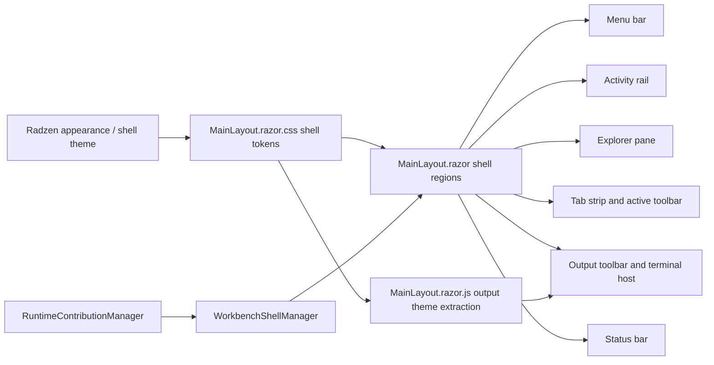

# Implementation Plan

- Version: `v0.01`
- Work Package: `089-initial-theme`
- Based on: `docs/089-initial-theme/spec-domain-initial-theme_v0.01.md`
- Target output path: `docs/089-initial-theme/plan-shell-initial-theme_v0.01.md`

## Mandatory repository standards

- All code-writing work in this plan MUST comply with `./.github/instructions/documentation-pass.instructions.md` in full.
- `./.github/instructions/documentation-pass.instructions.md` is a hard Definition of Done gate for every code-writing task in this plan.
- Every touched class, including internal and other non-public classes, must receive developer-level documentation comments.
- Every touched method and constructor, including methods and constructors on internal and other non-public types, must receive developer-level documentation comments.
- Every public method and constructor parameter must be documented with its purpose.
- Every property whose meaning is not obvious from its name must be documented.
- Sufficient inline or block comments must be added so a developer can understand purpose, logical flow, and any non-obvious algorithms.
- All C# changes must also follow `./.github/copilot-instructions.md` and `.github/instructions/coding-standards.instructions.md`, including block-scoped namespaces, Allman braces, one public type per file, and underscore-prefixed private fields.
- The Workbench shell must stay close to the stock Radzen Material theme; do not solve this work with module-specific CSS workarounds.
- Sizing and chrome behavior must be enforced by the Workbench shell itself rather than by individual module UIs.
- For this work package, validation should use targeted builds and targeted tests only; do not run the full test suite.

## Baseline

- `MainLayout.razor` already renders the menu bar, activity rail, explorer pane, centre tab strip, active-tool toolbar, output panel, and status bar.
- `MainLayout.razor.css` still applies visible borders and border separators to several shell surfaces, including the menu bar, explorer, active-tool toolbar, output panel, and explorer toolbar.
- The activity rail currently uses a `64`-pixel grid column rather than the specified `50px` width.
- The menu bar and status bar rows currently render at `48` and `30` pixels rather than the specified `36px` toolbar baseline.
- Toolbar actions in the centre, explorer, output, and status areas still render visible text labels alongside icons.
- The tab overflow affordance currently renders through a `RadzenDropDown` with an `All tabs` presentation rather than a compact ellipsis-style affordance.
- Existing targeted host coverage already exists in `test/workbench/server/WorkbenchHost.Tests/MainLayoutRenderingTests.cs` and `test/workbench/server/WorkbenchHost.Tests/WorkbenchOutputTerminalProjectionTests.cs`.

## Delta

- Introduce centralized shell theme tokens for the specified light and dark RGB region backgrounds.
- Enforce fixed shell dimensions for the activity rail and the `36px` tab and toolbar rows.
- Remove visible borders and convert shell chrome to a background-colour-separated layout.
- Make upper and lower tab surfaces flat and borderless while preserving clear active, hover, selected, and focus states.
- Convert toolbar actions to icon-only presentation with tooltip-based labels and accessible naming.
- Simplify the output toolbar so it exposes only combo boxes and buttons, with no standalone text labels.
- Replace the collapsed tab overflow chrome with a compact ellipsis-style affordance.
- Extend targeted rendering and projection tests to lock the new theme and shell-chrome contract in place.

## Carry-over

- No carry-over items are expected before implementation starts.
- If implementation reveals a Radzen limitation around the tab-overflow trigger, keep the shell contract and visual behavior defined here, and capture any required follow-up as a new work package rather than weakening the current specification.

## Shell theme baseline and sizing

- [x] Work Item 1: Establish centralized shell theme tokens and fixed shell dimensions - Completed
  - **Summary**: Added centralized shell theme tokens and fixed sizing markers in `MainLayout.razor` and `MainLayout.razor.css`, refreshed output-terminal theming through `MainLayout.razor.js`, and extended targeted coverage in `MainLayoutRenderingTests.cs` and `WorkbenchOutputTerminalProjectionTests.cs`.
  - **Purpose**: Deliver the first runnable vertical slice by making the Workbench shell consume one explicit set of host-owned theme values and fixed dimensions for the activity rail and toolbar rows, while preserving the existing shell behavior end to end.
  - **Acceptance Criteria**:
    - The activity rail renders at `50px` width.
    - The centre tab strip renders at `36px` height.
    - The active toolbar, explorer toolbar, output toolbar, menu bar chrome, and status bar chrome align to a `36px` shell row baseline where specified by the layout.
    - Dark and light theme region backgrounds use the RGB values defined in `docs/089-initial-theme/spec-domain-initial-theme_v0.01.md`.
    - Theme switching still updates the shell and output surfaces without breaking the running host.
  - **Definition of Done**:
    - Centralized shell theme tokens or equivalent styling definitions are implemented.
    - The shell layout uses the specified fixed dimensions for the activity rail and toolbar-related rows.
    - Output-terminal theme mapping still works with the new shell colours.
    - Targeted rendering and projection tests pass.
    - Developer-level comments and XML documentation are updated in full compliance with `./.github/instructions/documentation-pass.instructions.md`.
    - Documentation updated in the current work package where implementation decisions or verification notes need recording.
    - Can execute end to end via: `dotnet run --project src/workbench/server/WorkbenchHost/WorkbenchHost.csproj` or by launching `WorkbenchHost` from Visual Studio and toggling the active theme.
  - [x] Task 1: Introduce centralized shell theme values for the required light and dark region backgrounds. - Completed
    - **Summary**: Defined host-owned shell tokens for menu, activity, explorer, centre view, centre toolbar, output toolbar, status, and tab surfaces, and mapped them to Radzen light or dark theme context by using the `#radzen-theme-link` stylesheet state.
    - [x] Step 1: Update `src/workbench/server/WorkbenchHost/Components/Layout/MainLayout.razor.css` to define host-owned shell theme tokens or equivalent CSS variables for the activity pane, explorer pane, centre pane view, centre toolbar, menu bar, output toolbar, status bar, and active/inactive tab backgrounds. - Completed with centralized `--workbench-shell-*` CSS tokens.
    - [x] Step 2: Map those tokens to the existing Radzen light and dark theme context without introducing module-specific overrides. - Completed by switching token values through `html:has(#radzen-theme-link[href*="-dark"])`.
    - [x] Step 3: Ensure the confirmed light-theme activity-pane value of `(224, 225, 228)` is used exactly. - Completed with the exact `rgb(224, 225, 228)` activity token in the light palette.
    - [x] Step 4: Apply the mandatory documentation pass requirements from `./.github/instructions/documentation-pass.instructions.md` to all touched files. - Completed for the updated layout, stylesheet, script, test, and plan files.
  - [x] Task 2: Enforce the fixed shell dimensions required by the specification. - Completed
    - **Summary**: Moved the menu bar, status bar, tab strip, and toolbar rows to the `36px` baseline, reduced the activity rail column to `50px`, and exposed stable shell-owned sizing markers in the layout markup.
    - [x] Step 1: Update `src/workbench/server/WorkbenchHost/Components/Layout/MainLayout.razor` so the activity rail grid column uses `50px` and the centre tab strip and toolbar rows align to the `36px` baseline. - Completed by updating the outer grid row definitions, the working-area activity column, and the rendered sizing metadata.
    - [x] Step 2: Update `src/workbench/server/WorkbenchHost/Components/Layout/MainLayout.razor.css` so the explorer toolbar, active-tool toolbar, output toolbar, and status chrome preserve `36px` height even when empty. - Completed with fixed height tokens and shell-owned overflow handling for toolbar rows.
    - [x] Step 3: Keep `box-sizing: border-box` and existing shell-owned splitter behavior intact. - Completed without changing the shell sizing model or the current splitter interaction path.
    - [x] Step 4: Apply the mandatory documentation pass requirements from `./.github/instructions/documentation-pass.instructions.md` to all touched files. - Completed for the updated layout and stylesheet files.
  - [x] Task 3: Keep output-terminal theme projection aligned with the new shell tokens. - Completed
    - **Summary**: Updated the browser-side terminal theme helper to read the new shell background token and to react to Radzen theme-link changes so appearance toggles continue to refresh the output terminal palette.
    - [x] Step 1: Update `src/workbench/server/WorkbenchHost/Components/Layout/MainLayout.razor.js` only where needed so browser-derived output terminal colours continue to reflect the shell theme after the new token names or values are introduced. - Completed by preferring the shell view background token during theme extraction.
    - [x] Step 2: Update `src/workbench/server/WorkbenchHost/Components/Layout/MainLayout.razor.cs` only where needed so output-terminal theme refreshes still flow through the existing shell-owned JS interop path. - Completed without code-behind changes because the existing JS-invokable refresh path remained correct.
    - [x] Step 3: Preserve current output-panel behaviour and do not introduce functional changes to retained-history projection. - Completed with theme refresh limited to browser-derived presentation updates only.
    - [x] Step 4: Apply the mandatory documentation pass requirements from `./.github/instructions/documentation-pass.instructions.md` to all touched files. - Completed for the updated browser helper script and related tests.
  - [x] Task 4: Add targeted regression coverage for theme tokens and fixed shell sizing. - Completed
    - **Summary**: Added focused tests for shell theme hooks, exact token and sizing declarations, and the browser-side output theme refresh contract, then validated the work with the targeted Workbench host build and test commands.
    - [x] Step 1: Update `test/workbench/server/WorkbenchHost.Tests/MainLayoutRenderingTests.cs` to assert the activity-rail width contract, the `36px` tab and toolbar sizing markers, and the expected region styling hooks. - Completed with new rendering and stylesheet regression assertions.
    - [x] Step 2: Update `test/workbench/server/WorkbenchHost.Tests/WorkbenchOutputTerminalProjectionTests.cs` if output-terminal theme token mapping changes require direct verification. - Completed with a focused source-level assertion for the Radzen theme-link observer and shell token read path.
    - [x] Step 3: Apply the mandatory documentation pass requirements from `./.github/instructions/documentation-pass.instructions.md` to all touched test files. - Completed for the new regression tests and file-reading helpers.
  - **Files**:
    - `src/workbench/server/WorkbenchHost/Components/Layout/MainLayout.razor`: apply shell-owned sizing and markup hooks for fixed dimensions.
    - `src/workbench/server/WorkbenchHost/Components/Layout/MainLayout.razor.css`: define theme tokens and fixed shell dimensions.
    - `src/workbench/server/WorkbenchHost/Components/Layout/MainLayout.razor.cs`: preserve shell state and output theme refresh flow if token plumbing changes.
    - `src/workbench/server/WorkbenchHost/Components/Layout/MainLayout.razor.js`: keep output terminal theme extraction aligned with shell tokens.
    - `test/workbench/server/WorkbenchHost.Tests/MainLayoutRenderingTests.cs`: assert theme and sizing contracts.
    - `test/workbench/server/WorkbenchHost.Tests/WorkbenchOutputTerminalProjectionTests.cs`: assert output theme mapping if changed.
  - **Work Item Dependencies**: None.
  - **Run / Verification Instructions**:
    - `dotnet build src/workbench/server/WorkbenchHost/WorkbenchHost.csproj`
    - `dotnet test test/workbench/server/WorkbenchHost.Tests/WorkbenchHost.Tests.csproj --filter MainLayoutRenderingTests`
    - `dotnet test test/workbench/server/WorkbenchHost.Tests/WorkbenchHost.Tests.csproj --filter WorkbenchOutputTerminalProjectionTests`
    - Run `WorkbenchHost`, toggle between light and dark themes, and confirm the shell backgrounds and fixed dimensions match the specification.
  - **User Instructions**:
    - Start `WorkbenchHost`.
    - Use the appearance toggle in the menu bar to switch themes.
    - Confirm the activity rail, tab strip, and toolbar rows stay at the expected dimensions.

## Borderless chrome and flat tabs

- [x] Work Item 2: Apply borderless shell chrome and flat tab styling across the Workbench - Completed
  - **Summary**: Removed targeted shell borders from the Workbench host chrome, introduced shell-owned borderless and flat-tab markup hooks, strengthened keyboard-focus visibility with outline-based focus states, and added targeted regression coverage for flat active and inactive tab treatment plus the active-only close affordance.
  - **Purpose**: Deliver a visually demonstrable shell slice by removing visible borders and converting the Workbench tab surfaces to the specified flat, background-led appearance while keeping tabs, focus states, and panel separation usable.
  - **Acceptance Criteria**:
    - Visible borders are removed from the targeted shell regions.
    - Panel separation is achieved through background colour and spacing rather than border lines.
    - Centre tabs render as flat, borderless tabs.
    - Any separately styled lower output tabs use the same flat, borderless treatment.
    - Hover, selected, active, and keyboard focus states remain clearly visible.
  - **Definition of Done**:
    - Shell borders and separators covered by the specification are removed.
    - Flat tab styling is applied to active and inactive upper tab surfaces, and to lower tab surfaces if separately styled.
    - The Workbench remains runnable end to end with tab activation, tab closing, and output-panel behaviour intact.
    - Targeted rendering tests pass.
    - Developer-level comments and XML documentation are updated in full compliance with `./.github/instructions/documentation-pass.instructions.md`.
    - Documentation updated in the current work package where implementation decisions or verification notes need recording.
    - Can execute end to end via: `dotnet run --project src/workbench/server/WorkbenchHost/WorkbenchHost.csproj` or by launching `WorkbenchHost` from Visual Studio and interacting with the shell tabs.
  - [x] Task 1: Remove visible borders from the shell regions covered by the specification. - Completed
    - **Summary**: Removed the targeted shell-region borders and raised chrome from the menu bar, explorer, tool surface, active toolbar, output toolbar, output find surface, and status bar while keeping region separation driven by the centralized shell backgrounds.
    - [x] Step 1: Update `src/workbench/server/WorkbenchHost/Components/Layout/MainLayout.razor.css` to remove region borders, divider borders, and raised chrome from the menu bar, explorer pane, centre surface, active toolbar, output toolbar, and status bar. - Completed by changing the affected host-owned shell surfaces to `border: 0` and retaining background-led differentiation.
    - [x] Step 2: Preserve panel differentiation using theme background values, spacing, and existing grid structure rather than reintroducing border substitutes. - Completed by keeping the existing shell layout, padding, and theme-token backgrounds as the only region separators.
    - [x] Step 3: Keep accessibility-relevant focus indication visible without relying on the removed borders. - Completed by introducing shell-owned outline-based `:focus-visible` states for menu, activity, explorer, and tab actions.
    - [x] Step 4: Apply the mandatory documentation pass requirements from `./.github/instructions/documentation-pass.instructions.md` to all touched files. - Completed for the updated layout, stylesheet, test, and plan files.
  - [x] Task 2: Convert tab surfaces to the flat Workbench styling baseline. - Completed
    - **Summary**: Converted the centre tab strip to a flat borderless surface, moved tab state emphasis to background and text treatment, and added shell-owned hooks for active and inactive tab states plus the flat close affordance.
    - [x] Step 1: Update the tab-strip and tab-entry styling in `src/workbench/server/WorkbenchHost/Components/Layout/MainLayout.razor.css` so active and inactive tabs use only background, icon, and text treatment for state. - Completed with borderless tab-strip, tab-entry, and tab-close styling backed by active and inactive shell background tokens.
    - [x] Step 2: Update `src/workbench/server/WorkbenchHost/Components/Layout/MainLayout.razor` only where needed so active closeable tabs preserve the flat close affordance without adding bordered button chrome. - Completed by adding tab-state and flat-close markup hooks while keeping the close button rendered for the active closable tab only.
    - [x] Step 3: If any lower output tab strip or equivalent shared tab styling exists during implementation, apply the same flat styling rules there; otherwise, keep the shared tab styles ready for future lower-tab reuse without inventing new output tabs. - Completed without adding new lower tabs because no separately styled output-tab surface is currently rendered.
    - [x] Step 4: Apply the mandatory documentation pass requirements from `./.github/instructions/documentation-pass.instructions.md` to all touched files. - Completed for the updated layout, stylesheet, and test files.
  - [x] Task 3: Keep the shell interaction model stable after the chrome simplification. - Completed
    - **Summary**: Preserved shell-owned interaction clarity through CSS-only state updates, leaving the tab, explorer, and output behaviours unchanged while keeping the visual state cues readable.
    - [x] Step 1: Update `src/workbench/server/WorkbenchHost/Components/Layout/MainLayout.razor.css` and `MainLayout.razor.cs` only where needed so tab activation, close actions, explorer selection, and output toggle states remain visually clear. - Completed through CSS-only active, hover, and focus styling updates; `MainLayout.razor.cs` did not require changes because the existing interaction flow remained correct.
    - [x] Step 2: Avoid functional workarounds in module UIs; any state styling changes must remain shell-owned. - Completed by keeping all chrome and tab-state changes inside the host layout markup and stylesheet only.
    - [x] Step 3: Apply the mandatory documentation pass requirements from `./.github/instructions/documentation-pass.instructions.md` to all touched files. - Completed for the touched shell and test files.
  - [x] Task 4: Add targeted regression coverage for borderless chrome and flat tabs. - Completed
    - **Summary**: Added focused stylesheet and rendering assertions for borderless chrome hooks, flat-tab state markers, and the active-only close affordance, then validated the slice with the targeted Workbench host build and rendering tests.
    - [x] Step 1: Update `test/workbench/server/WorkbenchHost.Tests/MainLayoutRenderingTests.cs` to assert the absence of targeted border-driven chrome markers, the presence of flat-tab state hooks, and the active/inactive tab treatment contract. - Completed with new isolated stylesheet assertions and rendered markup checks for the shell-owned borderless and flat-tab hooks.
    - [x] Step 2: Add targeted assertions for closeable active-tab markup so the flat close affordance remains visible only where intended. - Completed by asserting the single rendered flat close affordance when both active and inactive tabs are present.
    - [x] Step 3: Apply the mandatory documentation pass requirements from `./.github/instructions/documentation-pass.instructions.md` to all touched test files. - Completed for the updated rendering-test file.
  - **Files**:
    - `src/workbench/server/WorkbenchHost/Components/Layout/MainLayout.razor`: preserve shell tab markup while removing any border-dependent structure.
    - `src/workbench/server/WorkbenchHost/Components/Layout/MainLayout.razor.css`: implement borderless shell chrome and flat tabs.
    - `src/workbench/server/WorkbenchHost/Components/Layout/MainLayout.razor.cs`: retain shell state clarity if interaction styling hooks change.
    - `test/workbench/server/WorkbenchHost.Tests/MainLayoutRenderingTests.cs`: assert borderless and flat-tab shell behaviour.
  - **Work Item Dependencies**: Depends on Work Item 1.
  - **Run / Verification Instructions**:
    - `dotnet build src/workbench/server/WorkbenchHost/WorkbenchHost.csproj`
    - `dotnet test test/workbench/server/WorkbenchHost.Tests/WorkbenchHost.Tests.csproj --filter MainLayoutRenderingTests`
    - Run `WorkbenchHost`, open multiple tabs, switch between them, close an active closable tab, and confirm the shell remains borderless while tab states stay clear.
  - **User Instructions**:
    - Start `WorkbenchHost`.
    - Open the overview tool and any available module tools.
    - Verify the upper tab strip, and any separately styled lower tabs if present, use the same flat borderless treatment.

## Toolbar simplification and overflow affordance

- [x] Work Item 3: Convert toolbar controls to icon-only chrome and replace tab overflow with the ellipsis affordance - Completed
  - **Summary**: Converted shell toolbar actions to icon-only chrome with centralized accessible labels and fallback icons, preserved text-only top-level menus with no menu icons, reduced the left brand area to the Workbench icon only and aligned it with the activity-rail icon column, simplified the output toolbar to its selector-plus-button control set, replaced the tab overflow trigger with a compact `RadzenSplitButton` ellipsis affordance, kept the status-bar output expander as a labelled `Output` special case, widened the overall split-button footprint and its drop-down section, widened the overflow popup further and enforced single-line rendering with stronger split-button menu overrides plus non-breaking overflow labels, normalized the ellipsis chrome to the shell text colour, tightened the collapsed overflow chrome to the requested arrow-plus-ellipsis footprint, and extended targeted rendering coverage for the new toolbar and overflow contract.
  - **Purpose**: Deliver the final runnable slice by simplifying all shell toolbars to icon-only actions with tooltip-based labels, reducing the output toolbar to buttons and combo boxes only, and replacing the collapsed overflow dropdown chrome with the specified compact ellipsis affordance.
  - **Acceptance Criteria**:
    - Toolbar buttons render as icon-only controls with tooltip-based labels.
    - Output-toolbar text labels are removed, leaving only combo boxes and buttons.
    - The output level selector remains usable without its visible standalone label.
    - The status-bar output toggle and other shell toolbar actions retain accessible names.
    - The collapsed tab overflow affordance appears as a compact ellipsis button rather than an `All tabs` combo-box presentation.
    - The overflow interaction still allows users to activate any open tab.
  - **Definition of Done**:
    - Shell toolbar actions use icon-only chrome with tooltips and preserved accessibility metadata.
    - The output toolbar exposes only combo boxes and buttons, with standalone text labels removed.
    - The tab overflow affordance uses a compact ellipsis presentation in the collapsed state.
    - Targeted rendering tests pass, and any affected output projection tests still pass.
    - Developer-level comments and XML documentation are updated in full compliance with `./.github/instructions/documentation-pass.instructions.md`.
    - Documentation updated in the current work package where implementation decisions or verification notes need recording.
    - Can execute end to end via: `dotnet run --project src/workbench/server/WorkbenchHost/WorkbenchHost.csproj` or by launching `WorkbenchHost` from Visual Studio and using the explorer, tab strip, output toolbar, and status bar.
  - [x] Task 1: Convert shell toolbar actions to icon-only presentation with tooltip-based labels. - Completed
    - **Summary**: Removed visible labels from the shell-owned menu, explorer, active-tool, and output-toolbar actions, while keeping the status-bar output expander as a labelled `Output` special case with centralized accessible metadata.
    - [x] Step 1: Update `src/workbench/server/WorkbenchHost/Components/Layout/MainLayout.razor` so menu, explorer-toolbar, active-tool-toolbar, output-toolbar, and status-bar actions no longer render visible text next to icons where the specification requires icon-only chrome. - Completed by switching the affected shell actions to icon-only button markup with stable icon-only data hooks.
    - [x] Step 2: Update `src/workbench/server/WorkbenchHost/Components/Layout/MainLayout.razor.cs` to supply any shell-owned tooltip content or accessible labels required by the icon-only presentation. - Completed by adding helper methods for icon-only labels, fallback contribution icons, and state-aware output toggle and auto-scroll labels.
    - [x] Step 3: Preserve accessible names through `aria-label`, tooltip content, or equivalent shell-owned metadata rather than visible text spans. - Completed by applying explicit `aria-label` and `title` metadata to the icon-only shell buttons and overflow affordance.
    - [x] Step 4: Apply the mandatory documentation pass requirements from `./.github/instructions/documentation-pass.instructions.md` to all touched files. - Completed for the updated layout, stylesheet, code-behind, and test files.
  - [x] Task 2: Simplify the output toolbar to the allowed control set. - Completed
    - **Summary**: Removed the visible output level label and visibility summary, retained the selector as the only non-button control, and kept the panel-local find strip unchanged beneath the now icon-only toolbar.
    - [x] Step 1: Remove the visible `Level` label and visibility-summary text from the output toolbar in `src/workbench/server/WorkbenchHost/Components/Layout/MainLayout.razor`, replacing them with tooltip-based or accessible-only labelling where needed. - Completed by removing both text surfaces and moving the explanatory text into the dropdown tooltip and aria metadata.
    - [x] Step 2: Keep the output level filter as a combo box and retain buttons for copy, find, clear, auto-scroll, and scroll-to-end actions. - Completed with the existing Radzen drop-down plus the retained button set rendered through icon-only chrome.
    - [x] Step 3: Ensure the find strip remains panel-local and functional even though the toolbar itself becomes icon-only. - Completed without changing the panel-local find strip interaction path.
    - [x] Step 4: Apply the mandatory documentation pass requirements from `./.github/instructions/documentation-pass.instructions.md` to all touched files. - Completed for the updated output-toolbar markup, helper methods, styles, and tests.
  - [x] Task 3: Replace the collapsed tab-overflow chrome with a compact ellipsis affordance. - Completed
    - **Summary**: Kept the existing overflow-selection interaction path, but restyled the collapsed trigger into a compact ellipsis `RadzenSplitButton` and preserved right-side anchoring and open-panel layering behaviour.
    - [x] Step 1: Update the overflow markup and styling in `src/workbench/server/WorkbenchHost/Components/Layout/MainLayout.razor` and `MainLayout.razor.css` so the collapsed control presents as a small ellipsis button rather than the current `All tabs` combo-box look. - Completed by replacing the collapsed `All tabs` dropdown with a compact `RadzenSplitButton` ellipsis trigger and by removing excess shell chrome through split-button-specific CSS.
    - [x] Step 2: Keep the existing overflow-selection interaction path unless a small shell-owned wrapper is required to achieve the visual contract cleanly. - Completed by retaining the current Radzen selection flow and item template logic.
    - [x] Step 3: Update `src/workbench/server/WorkbenchHost/Components/Layout/MainLayout.razor.cs` or `MainLayout.razor.js` only if the overflow trigger needs shell-owned state or measurement support. - Completed through `MainLayout.razor.cs` helper additions only; no JavaScript changes were required.
    - [x] Step 4: Preserve layering behaviour so the overflow menu remains usable when the output panel is open. - Completed by keeping the existing render order and reinforcing the overflow anchor styling without changing the layout layering contract.
    - [x] Step 5: Apply the mandatory documentation pass requirements from `./.github/instructions/documentation-pass.instructions.md` to all touched files. - Completed for the updated overflow markup, code-behind, stylesheet, and rendering tests.
  - [x] Task 4: Add targeted regression coverage for icon-only toolbars and overflow behaviour. - Completed
    - **Summary**: Added focused rendering assertions for icon-only labels, output-toolbar simplification, and the ellipsis overflow trigger, while retaining the existing overflow layering and output-theme regression coverage.
    - [x] Step 1: Update `test/workbench/server/WorkbenchHost.Tests/MainLayoutRenderingTests.cs` to assert icon-only toolbar markup, tooltip or accessible-label hooks, removal of the output-toolbar text labels, and the compact ellipsis overflow affordance. - Completed with new and updated assertions for icon-only buttons, accessible labels, tooltip metadata, and the collapsed overflow trigger.
    - [x] Step 2: Retain or extend assertions that the working area renders after the output panel so overflow layering remains valid. - Completed by preserving the existing layering regression while adding ellipsis-specific overflow assertions.
    - [x] Step 3: Update `test/workbench/server/WorkbenchHost.Tests/WorkbenchOutputTerminalProjectionTests.cs` only if output-toolbar or output-theme changes alter test setup helpers. - Completed without file changes because the output-terminal projection contract remained intact.
    - [x] Step 4: Apply the mandatory documentation pass requirements from `./.github/instructions/documentation-pass.instructions.md` to all touched test files. - Completed for the updated rendering-test file.
  - **Files**:
    - `src/workbench/server/WorkbenchHost/Components/Layout/MainLayout.razor`: remove visible toolbar labels and reshape the overflow trigger.
    - `src/workbench/server/WorkbenchHost/Components/Layout/MainLayout.razor.css`: style icon-only toolbar chrome and the ellipsis overflow affordance.
    - `src/workbench/server/WorkbenchHost/Components/Layout/MainLayout.razor.cs`: provide tooltips, accessibility metadata, and any shell-owned overflow state changes.
    - `src/workbench/server/WorkbenchHost/Components/Layout/MainLayout.razor.js`: adjust shell-owned overflow or output interactions only if required.
    - `test/workbench/server/WorkbenchHost.Tests/MainLayoutRenderingTests.cs`: assert icon-only toolbar and overflow behaviour.
    - `test/workbench/server/WorkbenchHost.Tests/WorkbenchOutputTerminalProjectionTests.cs`: keep output-related regression coverage aligned if helper contracts change.
  - **Work Item Dependencies**: Depends on Work Item 2.
  - **Run / Verification Instructions**:
    - `dotnet build src/workbench/server/WorkbenchHost/WorkbenchHost.csproj`
    - `dotnet test test/workbench/server/WorkbenchHost.Tests/WorkbenchHost.Tests.csproj --filter MainLayoutRenderingTests`
    - `dotnet test test/workbench/server/WorkbenchHost.Tests/WorkbenchHost.Tests.csproj --filter WorkbenchOutputTerminalProjectionTests`
    - Run `WorkbenchHost`, open several tabs, use toolbar buttons via hover tooltips, open the overflow affordance, and confirm output toolbar controls remain usable.
  - **User Instructions**:
    - Start `WorkbenchHost`.
    - Hover toolbar icons to confirm the tooltip labels.
    - Open enough tabs to force overflow and confirm the compact ellipsis trigger remains usable.

## Overall approach summary

This plan delivers the initial Workbench theme in three runnable vertical slices:

1. centralize shell theme values and fixed dimensions
2. apply the borderless and flat-tab chrome baseline
3. simplify toolbars and replace the overflow trigger with the compact ellipsis affordance

Key implementation considerations:

- keep the work shell-owned inside `WorkbenchHost` rather than pushing layout responsibilities into modules
- stay close to stock Radzen Material so later theme work can extend rather than replace the current approach
- preserve accessibility and focus visibility while removing visible border chrome and text-heavy toolbars
- keep output-terminal theming aligned with browser-derived shell tokens
- retain targeted host rendering and output projection coverage so visual shell contracts stay locked down
- treat `./.github/instructions/documentation-pass.instructions.md` as mandatory completion criteria for every code-writing slice in this plan

# Architecture

## Overall Technical Approach

The implementation remains within the existing Blazor Server Workbench host and its shared Workbench model and services. The theme work is primarily a shell-owned presentation change implemented through `MainLayout` markup, shell CSS tokens, and minimal supporting code-behind or JS interop updates where the host already derives runtime styling information.

The preferred approach is:

- keep shell composition in `WorkbenchHost`
- keep shared shell concepts and contribution contracts in `UKHO.Workbench`
- keep contribution and runtime shell composition services in `UKHO.Workbench.Services`
- express the theme baseline through centralized shell tokens and host-owned CSS rather than module-specific overrides
- preserve existing Radzen components and adapt their presentation to the required borderless desktop-style shell

## Frontend

The frontend implementation is the Blazor Server shell hosted in `src/workbench/server/WorkbenchHost`.

Primary frontend components and files:

- `src/workbench/server/WorkbenchHost/Components/Layout/MainLayout.razor`
  - owns the menu bar, activity rail, explorer pane, centre tab strip, active-tool toolbar, output panel, and status bar markup
  - is the main entry point for applying icon-only toolbar markup, flat-tab markup, and overflow-affordance changes
- `src/workbench/server/WorkbenchHost/Components/Layout/MainLayout.razor.css`
  - is the main home for shell theme tokens, fixed dimensions, borderless chrome, flat-tab styling, and compact overflow styling
- `src/workbench/server/WorkbenchHost/Components/Layout/MainLayout.razor.cs`
  - supplies shell state, tab state, command execution, tooltip integration, and output-panel interaction plumbing needed by the presentation changes
- `src/workbench/server/WorkbenchHost/Components/Layout/MainLayout.razor.js`
  - reads browser-applied theme values for the output terminal and should only change where necessary to keep shell-theme extraction aligned with the new token model

Frontend user flow impact:

- the user opens `WorkbenchHost`
- the shell applies the active light or dark theme tokens
- the user navigates through the activity rail and explorer pane
- the user opens tools as tabs in the centre pane
- the tab strip, in-tab toolbar, output toolbar, and status bar all render with the new borderless styling baseline
- the user can still toggle appearance, access toolbar actions by tooltip-labelled icons, and activate overflowed tabs through the compact ellipsis affordance

## Backend

This work package does not introduce a new backend API. The relevant backend-style responsibilities are the existing Workbench host services that supply shell state and contribution composition.

Primary backend-side components and roles:

- `src/workbench/server/UKHO.Workbench/WorkbenchShell/*`
  - contains shared shell models such as tabs, shell regions, and contributions that define what the host renders
- `src/workbench/server/UKHO.Workbench.Services/Shell/WorkbenchShellManager.cs`
  - provides the composed shell state consumed by `MainLayout`
  - should remain functionally unchanged except where markup or tests require different state exposure for presentation-only work
- `src/workbench/server/UKHO.Workbench.Services/Contributions/RuntimeContributionManager.cs`
  - continues to compose menu, explorer-toolbar, and active-tool toolbar contributions used by the shell
- `src/workbench/server/UKHO.Workbench/Output/*` and `src/workbench/server/UKHO.Workbench.Services/Output/*`
  - continue to provide output panel state and retained output history
  - must remain compatible with the new output-toolbar presentation and output-terminal theme extraction

Backend data flow for this work remains simple:

- shared Workbench services compose state and contributions
- `MainLayout` consumes that state and applies the visual theme contract
- JS interop reads browser-applied shell colours for the output terminal where required
- user actions still flow back through the existing shell command and tab-activation paths
